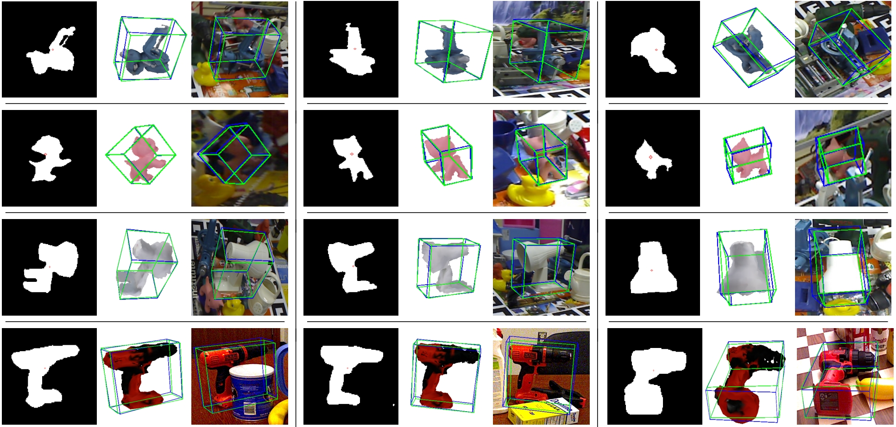
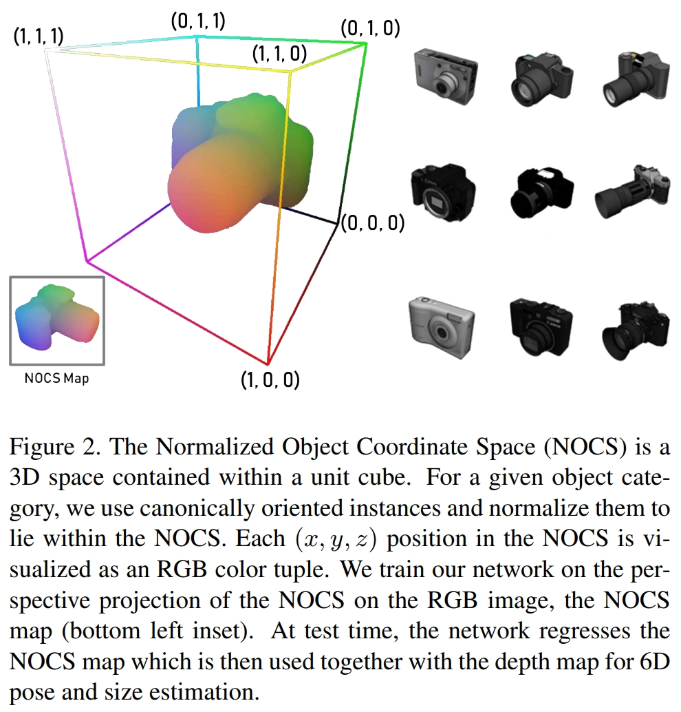
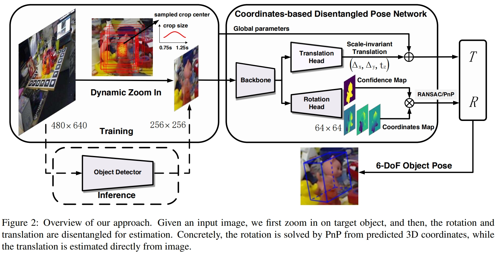
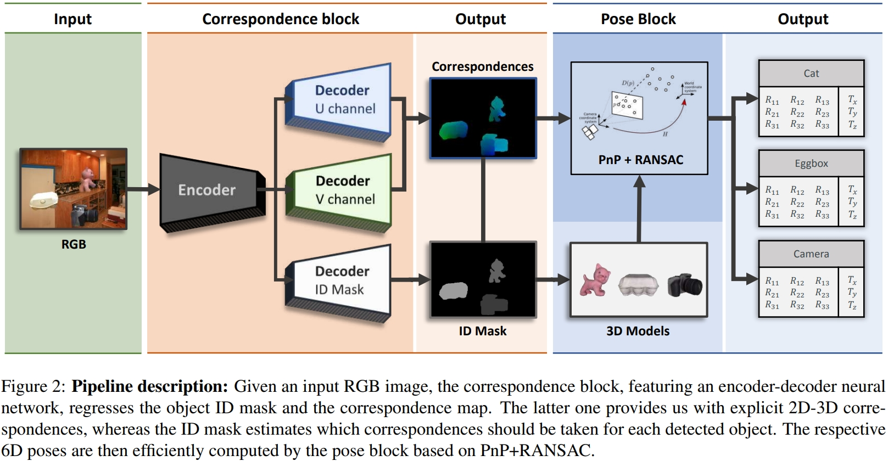
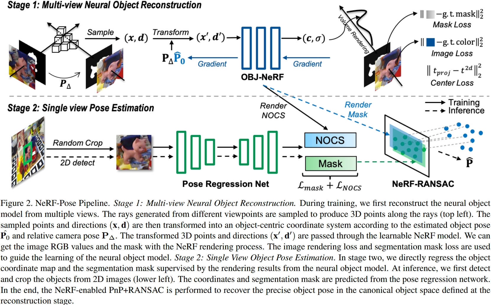
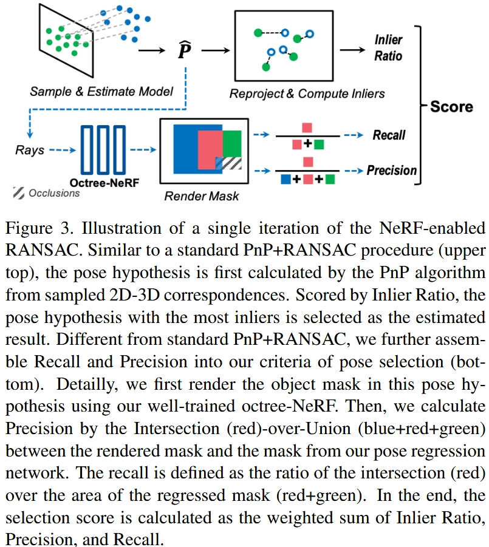
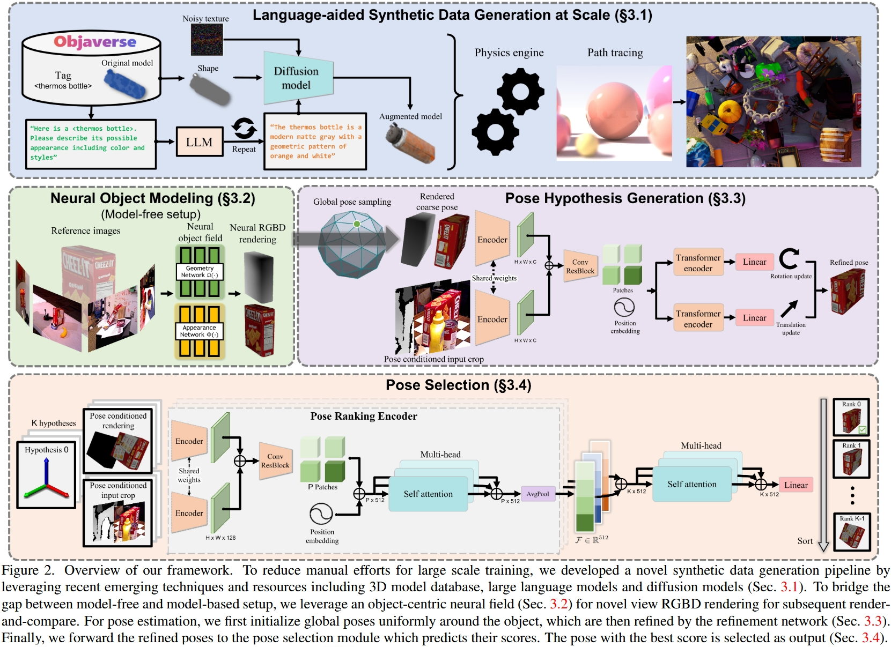
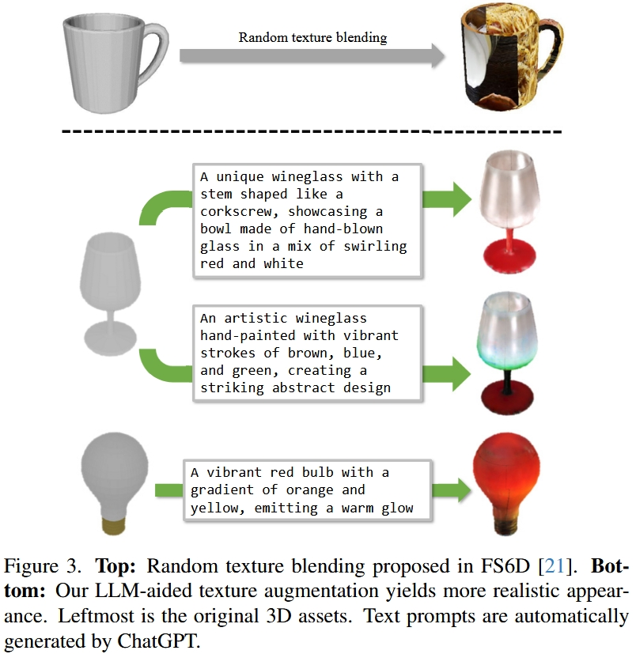
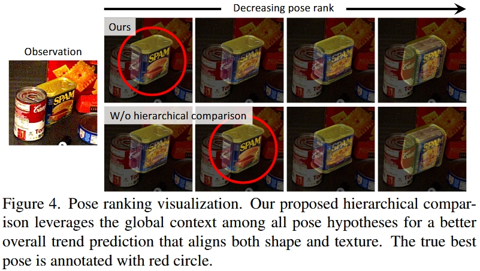

# AI时代的姿态估计

## RANSAC算法

RANSAC算法的基本步骤

普通步骤|视觉SLAM中的步骤
-|-
确定所需的最小样本数量，这取决于模型类型（例如，对于线性模型至少需要2个点，对于平面至少需要3个点）|八点法构造本质矩阵或基础矩阵以求解模型参数，所以需要取8对匹配的关键点
随机抽样|随机从已有的匹配特征点对中选取八队
模型拟合，取得参数|获得针对该八个点对的R和T
设置一致性阈值，进行一致性检查|遍历其他所有匹配点对，将和模型参数一致（通过刚刚的R和T可以得到第二帧的对应特征点位置）的作为内点，否则作为外点处理
迭代|不断迭代，得到一个又一个的内点集和外点集
模型确定|内点集最多的8个点对得到的R和T作为最终模型

## (CVPR 2019) NOCS: Normalized Object Coordinate Space for Category-Level 6D Object Pose and Size Estimation

过去的6D姿态估计方法主要有两个缺陷;首先需要有该对象的CAD模型并且已知对象的尺寸，这对于大部分未见过的对象无法使用。另外一种虽然可以不需要已有的CAD模型，但是依赖于视点，不会对目标对象的精确方向进行编码。所以这两类方法都无法对新环境中的对象进行精确的姿态估计。

论文中定义了一种共享空间（归一化对象坐标空间）：NOCS（一个包含在单位立方体中的三维空间，将对角线设置为1，保证对象收缩在单位立方体中）如图，所有对象都包含在一个公共的规范化空间中，一个类别中的所有实例享有一个共同的参考框架。

类级别的目标6D姿态与尺寸估计：首先6D姿态是指对物体3D位置与3D方向的估计。（3个自由度定位置，三个自由度定旋转方向）,其中方向的表示方法主要有三种，欧拉角，旋转矩阵，四元数。类级别的6D姿态估计是指对一个未见过的目标对象进行估计，但是这个对象属于某一类别（如相机），而在之前的训练中训练样本含有相机，那么便可以对该目标对象进行估计。

NOCS map:通过训练一个CNN预测一个彩色编码的NOCS目标的的二维透视投影（上图左下角），NOCS map能提供在规范空间的物体的外形和尺寸。

网络结构如下：网络以单张包含多个对象的RGB图像和对应的depth图作为输入，使用CNN来预测对象的类标签、掩码和NOCS map。然后利用NOCS map和深度图利用位姿拟合的方法来估计物体的完整6D姿态和尺寸。

## (ICCV 2019, 有3D模型的位姿估计) CDPN: Coordinates-Based Disentangled Pose Network for Real-Time RGB-Based 6-DoF Object Pose Estimation

作者认为旋转和平移的显着差异应区别对待。 这项工作提出了一种新颖的6自由度姿势估计方法：基于坐标的解缠姿势网络（CDPN，Coordinates-based Disentangled Pose Network），该方法可以解开姿势**分别预测旋转和平移**，实现高度准确和鲁棒的姿势估计。这种方法灵活和高效，可以处理没有纹理和被遮挡的目标。

其步骤如图所示，给定输入图像，先放大目标，然后解开旋转和平移以进行估计。 具体而言，旋转是通过PnP从预测的3D坐标中解决的，而平移则直接从图像中估算出来。

## (ICCV 2019, 有3D模型的位姿估计) DPOD: 6D Pose Object Detector and Refiner

本文提出了一种仅从RGB图像进行3D目标检测和6D姿态估计的深度学习方法。此方法称为（DPOD，Dense Pose Object Detector）密集姿势目标检测器，用于估计输入图像和可用3D模型之间的密集多类2D-3D对应图。给定对应关系，可通过PnP和RANSAC计算6DoF姿态。基于深度学习的定制细化方案对初始姿态估计值进行细化。

把物体的材质换成Correspondence Mapping

## (CVPR 2023, 无3D模型的位姿估计) NeRF-Pose: A First-Reconstruct-Then-Regress Approach for  Weakly-supervised 6D Object Pose Estimation

NeRF用于物体的3D姿态估计，以前的3D姿态估计需要给出物体的3D模型，而本文只需要物体的多视角照片和Mask

### Stage 1: Multi-view Neural Object Reconstruction

用物体的多视角照片和目标分割Mask作为训练数据训练一个NeRF

### Stage 2: Single View Object Pose Estimation

1. 传统目标识别抠出目标区域
2. Coordinates regression(基本上就是传统DPoD/CDPN)输出NOCS和目标分割Mask
3. 传统RANSAC算法随机采样进行Pose Regression，对每个采样视角：
   1. 渲染：在该视角处NeRF渲染NOCS和目标分割Mask
   2. 比对：NeRF渲染结果 vs 上一步Coordinates regression输出的NOCS和目标分割Mask
      * NeRF渲染的NOCS vs Coordinates regression输出的NOCS：Inlier Ratio
      * NeRF渲染的目标分割Mask vs Coordinates regression输出的目标分割Mask：Recall和Precision

## (CVPR 2024, 大模型增强数据训练出通用位姿估计) FoundationPose: Unified 6D Pose Estimation and Tracking of Novel Objects

其实最根本性的创新在大模型数据增强那里，其他的：
* Neural Object Modeling是NeRF-Pose里的已有方法
* Pose Hypothesis Generation是用Transformer替换了CDPN里的CNN输出平移和旋转，本文会输出多组位姿假设供Pose Selection选择
* Pose Selection：用Transformer给Pose Hypothesis Generation输出的多组位姿假设打分，取最高分

### 3.1. Language-aided Data Generation at Scale 用大模型增强训练数据

已有一些有标注的数据（3D模型和对应标签），用大语言模型进行数据强化：

1. LLM转文字描述（”describe its possible appearance”生成大量不同外观的文字描述）
2. 文字输入Diffusion生成大量不同外观的模型
3. 物理引擎模拟模型轨迹

从而得到大量训练物体轨迹数据用于训练

### (针对无3D模型输入的情况) Neural Object Modeling

NeRF-Pose里的已有方法，就是做了点微小的创新，把传统NeRF分成了Geometry和Appearance两个NeRF

### Pose Hypothesis Generation

随机采样多个视角然后用类似CDPN的方法进行Pose Refinement，会输出多组位姿假设（局部最优解）

### Pose Selection

给定一系列姿态假设，我们使用分层姿态排序网络来计算它们的得分。
得分最高的姿态被选为最终估计值。

分层姿态排序网络：如果直接输入一个姿态输出一个分，this would ignore the other pose hypotheses, forcing the network to output an absolute score assignment which can be difficult to learn.
所以还有一层用来rank among all the K pose hypotheses.

