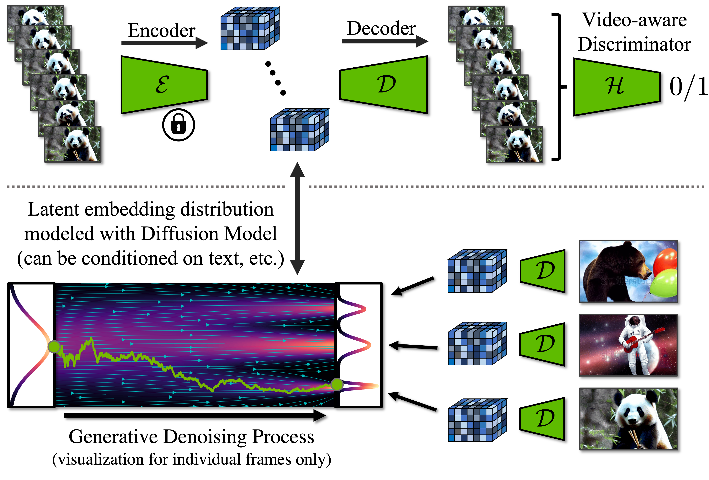

# 扩散模型

[起点](https://proceedings.neurips.cc/paper/2020/hash/4c5bcfec8584af0d967f1ab10179ca4b-Abstract.html)

## Latent Diffusion Models

## Video Latent Diffusion Models

(CVPR 2023) Align your Latents: High-Resolution Video Synthesis with Latent Diffusion Models, [Project Page](https://research.nvidia.com/labs/toronto-ai/VideoLDM/)

<video poster="" id="toast" autoplay="" controls="" muted="" loop="" playsinline="" width="20%"><source src="./i/video_ldm_animation.mp4" type="video/mp4"></video>

