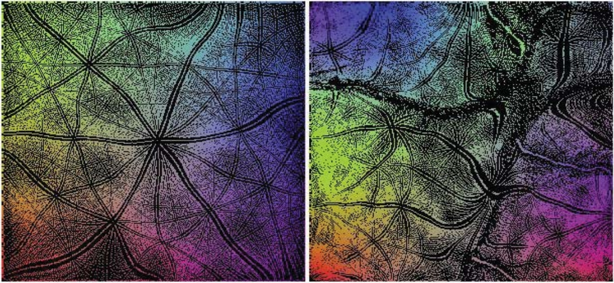

# 自组织的数据可视化和降维方法：SOM、SSM、FLAS

## 自组织映射 Self-Organizing Maps

Self-Organizing Maps(SOM) 自组织映射，又称为自组织映射神经网络，或自组织竞争神经网络。
是神经网络的一种，用于将**相互关系复杂且非线性**的高维数据，映射到**具有简单几何结构及相互关系**的低维空间中展示。
低维映射能够**反映高维特征之间的拓扑结构**。

SOM是一种**无监督**的人工神经网络。不同于一般神经网络基于损失函数的反向传递来训练，它运用**竞争学习 (competitive learning)** 策略,依靠神经元之间互相竞争逐步优化网络。且使用**近邻关系函数 (neighborhood function)** 来维持输入空间的拓扑结构。

主要用于实现高维数据可视化，其降维功能还可以聚类，分类，特征抽取等任务但精度不高。

### SOM的特点

* 和PCA区别：PCA主要针对线性相关性进行降维，SOM没有线性相关性的要求，因此更适合非线性数据的降维
* 和K-means的区别：K-means虽然不要求数据线性分布，但是其聚类边界还是直线，而SOM的聚类边界是任意形状

说白了就是SOM有神经网络拟合任意函数的特性所以更加自由灵活

比如要有分布在球面附近的一些三维数据，在三维中他们分得很开：

要将这些数据降至二维。

用PCA效果：可以看到只有离得较远的红蓝可以分得很开，另外三种颜色的混一起了

在三维视角看，PCA就是在空间中放了个平面然后投影，那当然搞不好这种非线性分布的数据。
如果只有红蓝两个的颜色这个PCA还算效果不错。

### SOM结构

原始$n$维数据$\bm x=\{x_1,x_2,\dots,x_n\}$对应输入层$n$个节点，输出层$X\times Y$个节点，每个输出层节点$(i,j)$都有$n$个权值$\bm W_{i,j}=\{w_{i,j,k}|k\in[1,n]\}$和输入层节点相连，共$X\times Y\times n$个权值：

>竞争层也可以有更高的维度。不过出于可视化的目的，高维竞争层用的比较少

其中，二维平面通常有2种平面结构：Rectangular和Hexagonal

竞争层SOM神经元的数量决定了最终模型的粒度与规模；这对最终模型的准确性与泛化能力影响很大。
经验公式：竞争层$X=Y=\sqrt{5\sqrt{N}}$，$N$为训练样本个数

### SOM推理

对于输入向量$\bm x$：
1. 计算$\bm x$在每个节点$(i,j)$上的值$h_{i,j}=\|\bm W_{i,j}-\bm x\|$（和权值之间的欧氏距离）
2. 输出$y=\mathop{\text{argmax}}_{i,j}h_{i,j}$为$h_{i,j}$值最小的点的坐标（欧氏距离最小的点，又称优胜节点(winner node)或BMU(best matching unit)）

所以每个高维输入$\bm x$都对应了一个二维坐标$(i,j)$，于是实现了数据的降维。

### SOM和可视化

从另一个角度看SOM的推理过程：
* 权值$\bm W_{i,j}$可以看作是像素$(i,j)$的“颜色”
* $h_{i,j}=\|\bm W_{i,j}-\bm x\|$就可看作是输入的$\bm x$在和所有像素的“颜色”计算相似性
* 最后的输出$y=\mathop{\text{argmax}}_{i,j}h_{i,j}$就是相似性最大（“颜色”最相近）的像素位置。

而可视化的过程，就是把训练得到的这个权值$\bm W_{i,j}$作为颜色摆在一张$X\times Y$的图像上。

比如，输入是三维数据的情况下，权值$\bm W_{i,j}$也就是三维，正则化后就是RGB，可以直接摆在图上：

（图片来自[Emergent Patterns in Self-Organizing Maps](https://ieeexplore.ieee.org/document/7377977)，图中的黑色区域表示训练数据集里没有数据对应到这个像素点）

### SOM训练

SOM训练过程本质上就是在不断更新上面这张图片上各点的颜色，所以别把它当成神经网络，抛弃权值的概念而按照更新颜色的思想来讲解会更好理解。

超参数：邻域半径$\sigma$

开始前随机初始化$X\times Y\times n$个像素的颜色，然后iterate执行下面的步骤：

1. 随机取一个输入样本$\bm x$
2. forward: 计算$\bm x$的SOM输出$(i,j)$（与输入样本最相近的颜色所在的像素位置）
3. backward(更新颜色): 让$(i,j)$附近的像素颜色和$\bm x$的差距减小，距离$(i,j)$越远更新力度越小，如下图

### SOM的涌现性

[Emergent Patterns in Self-Organizing Maps](https://ieeexplore.ieee.org/document/7377977)

## 更进一步：Self-Sorting Map

论文：**Self-Sorting Map: An Efficient Algorithm for Presenting Multimedia Data in Structured Layouts**,IEEE Transactions on Multimedia, 2014

>Given a set of **data items** and a **dissimilarity measure** between each pair of them, the SSM places each item into a unique cell of a structured layout, where the most related items are placed together and the unrelated ones are spread apart.

显然，SOM并不能保证每个训练样本都有一个独立的编号，也不能保证最终的图上的像素值与训练样本完全相等。
而Self-Sorting Map(SSM)正如其名，是按照给定的dissimilarity measur对输入进行的排序，可以保证每个训练样本都有自己的ID，且出来的图上像素值与训练样本完全相等。

>Instead of solving the continuous optimization problem that other dimension reduction approaches do, the SSM transforms it into a **discrete labeling problem**.

并且因为是“排序”，不是SOM那种“训练”和“拟合”，所以构建SSM也不需要像SOM那种iteration求解优化问题，而是一个离散的贴标问题。

典型地，SSM可以做到下面这种效果，即在Self-Organizing的同时还能保证表达数据的精准无误：

其中的图(a)是在地图上标注，图标会重叠，不好看；图(b)是按首字母规则排序，没法按天气聚类，也不好看；图(c)是Self-Sorting Map二维情况，既有按地理位置聚类又有按地域聚类，很棒。