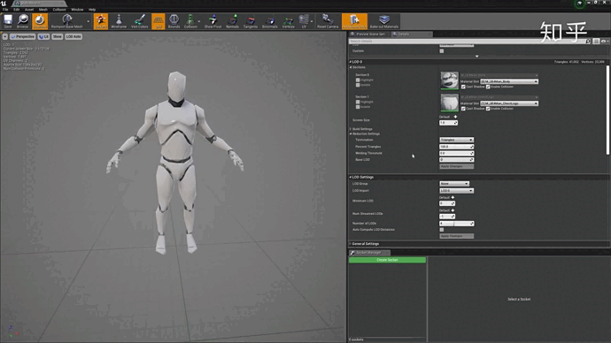
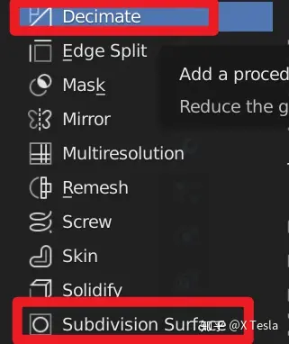
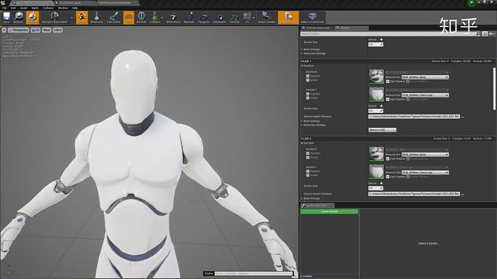
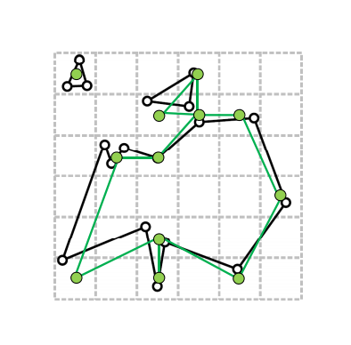
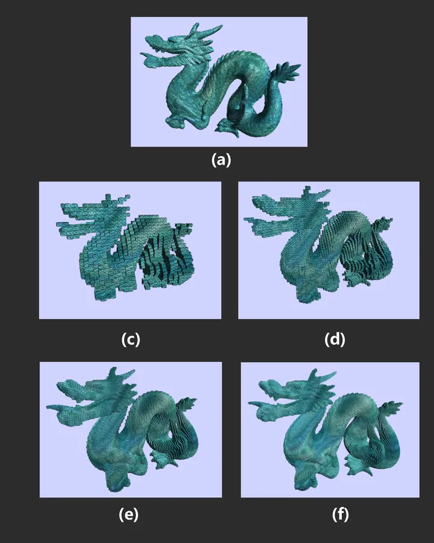
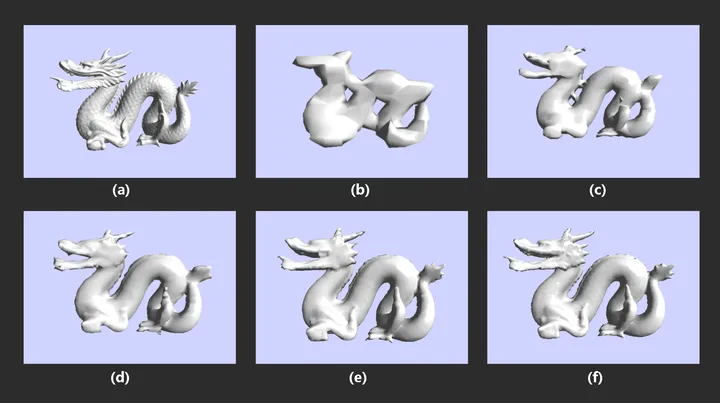
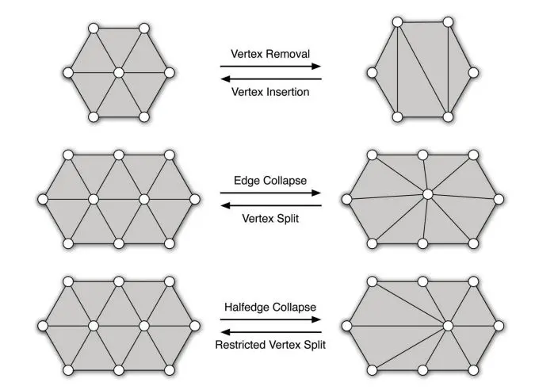
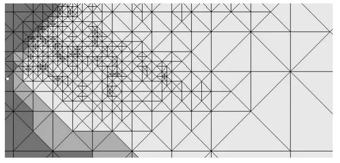

# 【摘录】LoD(Level Of Details)

[原文](https://zhuanlan.zhihu.com/p/134024820)

LoD：（Level of Details），简称为多细节层次。LOD技术根据模型的节点在显示环境中所处的位置(Screen Size)和重要度，来决定物体渲染的资源分配，降低非重要物体的面数和细节数，从而获得高效率的渲染计算。

我们在吃鸡跳伞的时候，地面上的树和房子是逐渐从模糊变清晰的，由简面变精面的，根据距离的不同所需要渲染的模型的精度当然也不同，要不然整个场景如果都按最优化进行渲染，不是画面卡成PPT，就是手机背面能煎鸡蛋。

## 相关软件中的LoD相关术语

在Blender当中我们可以使用以下两个Modifier对模型进行面数的增减：

* Decimate给模型减面，使模型更加简单
* Subdivision Surface进行加面，使模型更加精致

效果如下：

## 网格简化方法

[原文](https://zhuanlan.zhihu.com/p/444798331)

* **静态简化**预先计算好一系列不同简化率的模型，在实际程序中按照模型距离视点(view point)的距离选择不同版本的模型来进行渲染；
* **动态简化**是前者的延伸，一般使用局部几何变换实现，来生成连续分布的不同分辨率的近似模型。

### 顶点聚类(Vertex Clustering)

该方法于1993年被Rossignac提出，主要的思路比较简单，其实就是顶点合并，是用一个包围盒(一般可以用AABB，Axis Aligned Bounding Box)包住整个模型，然后把包围盒分成很多的小立方体区域，最后落在同一个区域的顶点将会被合并。当顶点合并后，原来的顶点就被删除了，新生成的顶点需要和原来的网格连成一体形成一个新的网格，具体的方法是寻找合并前顶点p和与p相连接的顶点集合{p0,p1,..}和新生成的顶点q。如果原来的顶点集合{p0,p1,..}内有边与p相连，那么就将原来新的顶点pi和新的顶点q连接在一起，否则就不连接。

顶点聚类原理大致分为以下几步：

1. 生成聚类(Cluster Generation)
2. 计算表现因子(Computing a representative)
3. 生成网格(Mesh Generation)
4. 改变拓扑结构(Topology Changes)

顶点聚类的思路很清晰，速度也很快，但是容易造成三角形退化成线段/顶点，网格的拓扑也不能很好地保持。

### 区域合并

该方法合并很多个面为一个“超级面“(super-face)，合并到同一超级面上的顶点离这个超级面的距离都不能大于某一个给定阈值。也就是说，把近似在一个平面上的顶点都用一个面来表示。但是有个大问题，就是超级面需要重新进行三角化(Triangulation)，这就带来了很多问题和bug。

### 重新布点法(Re-tiling)

重新布点的意思是，在原模型表面上重新分布顶点以改变顶点在空间中的分布密度，然后再对这些顶点进行三角化。是一种基于体素(voxel)的网格简化方法，也就是先对原模型进行体素化(voxelization)，然后对体素模型进行**不同分辨率的降采样**(也就是不同带宽的低通滤波)，然后再用**Marching Cubes移动立方体算法重构出三角形网格**。

### 几何元素删除法

如图，可以通过顶点移除、边坍缩等方式。

边坍缩(edge collapse)是实现增量式简化(Increment decimation)的一种思路，使用三角边坍缩的方法来进行网格简化，将两个顶点合并成一个顶点。对于要坍缩的边uv，删除这条边两侧的面A和面B，用v来替换u，连接v和u的其他邻居点，并删除u。其中v称为u的坍缩目标。

对于一个实体模型（具有封闭的边界，根据边界可以将空间分为模型内部和模型外部两部分），一次坍缩，可以移除两个三角面，三条边和一个顶点。通过反复的迭代，最终就会使模型简化到预期的面数。但是如何选择要移除的点，才能尽可能小的影响模型的外观呢？这里就需要计算点到点的坍缩代价。

计算点到点的坍缩代价可以考虑以下几个因素。第一个是边的长度，在模型简化过程中，小的细节应该优先被移除，所以边长短的应该优先被移除。第二部分是点周围的曲率变化，理论上曲率变化越小的顶点，所处的区域越平坦，应该优先被移除。需要注意的是，将u坍缩到v和将v坍缩到u的代价可能不一样。我们需要对每个点计算坍缩到其相邻点的代价，然后选取坍缩代价最小的相邻点作为其坍缩目标。然后不断地重复此步骤进行边坍缩，直到简化到合理范围。

## 动态简化

### 层次表示法

用静态化简的方法预先生成一系列的LOD模型，然后再实时地选择对应的模型，实时地按“对外观的贡献程度”删除三角形，直至精度达到给定要求时停止，并且渲染出来。

### 渐进网格法(Progressive Mesh)

是Hugues Hoppe大神在1996年提出的网格动态化简方法。这个方法以边坍缩(edge collapse，之前提到的几何元素删除方法之一)与点分裂(Vertex Splitting)为基本操作，记录了模型在连续的简化过程中的拓补变动信息，于是就可以做到基于视点的(view-dependent)、无损的、可复原的连续简化，这样子在摄像机靠近模型的过程中，就不会出现切换LOD模型产生的视觉突变的状况，而是非常顺滑的。

### 二次误差度量(Quadric Error Metrics)

QEM 算法是一种连续、局部方法，可以有效的减少复杂网格的顶点数同时保留原网格的拓扑特征，可以自定义减少后的顶点数。本质是在局部贪心地寻找点对进行收缩。基于一种基本的局部操作：边收缩。在流形三角网格表面上收缩一条边，会使得顶点数减一，三角面数减少一或二。

优点：

* 高效率：15s内可以将70000个面的模型简化到100个面
* 高质量：可以保留模型的主要特征
* 通用性：可以处理连接部分和未连接部分

QEM涉及到两个问题：

* 误差度量：如何定义点对的最优性（如何定义最优点对）？
* 收缩：如何计算收缩后点vbar的坐标？

QEM将其建模为一个二次问题进行求解。

具体见相关论文：Garland M, Heckbert P S. Surface simplification using quadric error metrics[C]//Proceedings of the 24th annual conference on Computer graphics and interactive techniques. 1997: 209-216.

### 超大地图实现背后的LoD

ROAMing Terrain，地形网格的局部简化率和视点位置相关，也就是越远的地方简化率越高。

