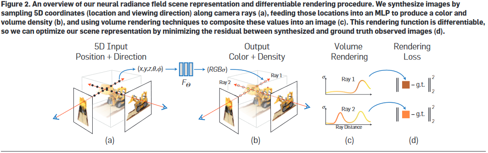

# Nerf运行流程解析

上接：[体渲染](./体渲染.md)

前置知识：[光线行进算法](./光线行进算法.md)、[相机的内外参数](./相机参数.md)

从论文中给出的系统结构图可知，Nerf中的DNN输入是相机位置$(x,y,z)$和射线朝向$(\theta,\phi)$，其组成5元组表示一条光路；DNN输出是这条光路的各离散采样区间$\delta_n$内的粒子颜色$c_n$和其粒子密度$\sigma_n$（即光学厚度），之后，按照上述离散化体渲染公式进行积分操作，即得到这条光路射出的光线颜色，就像这样：


于是，渲染过程如下：
1. 指定相机的外参（位置、方向等）和内参（焦距、视野、分辨率等）根据外参内参计算出需要采样的各光路的$(x,y,z,\theta,\phi)$
2. 将每个光路的$(x,y,z,\theta,\phi)$输入DNN，计算得到光路上每个采样点的各离散采样区间$\delta_n$内的颜色$c_n$和粒子密度$\sigma_n$
3. 按照离散化体渲染公式进行积分操作，即得到每条采样光路的颜色
4. 根据这些采样光路的颜色和相机内参，计算出相机拍到的图像
5. 上面这个离散化体渲染公式很显然是可微的，所以将计算得到的图像和Ground truth作差进行反向传播训练。




## 根据相机外参计算需要采样的光路

函数[get_rays](https://github.com/yenchenlin/nerf-pytorch/blob/63a5a630c9abd62b0f21c08703d0ac2ea7d4b9dd/run_nerf_helpers.py#L153)和[get_rays_np](https://github.com/yenchenlin/nerf-pytorch/blob/63a5a630c9abd62b0f21c08703d0ac2ea7d4b9dd/run_nerf_helpers.py#L165)
  * `H, W `是分辨率
  * [内参矩阵](./相机参数.md)输入 `K = np.array([[focal, 0, 0.5W], [0, focal, 0.5H], [0, 0, 1]])`是焦距之类的
  * [外参矩阵](./相机参数.md)输入 `c2w`表示“Camera-to-world transformation matrix”，一个3x4矩阵
  * 输出`rays_o, rays_d`大小都是`(H, W, 3)`分别表示图像上各像素点对应需要采样的光线的原点和方向

## 函数[`render`](https://github.com/yenchenlin/nerf-pytorch/blob/63a5a630c9abd62b0f21c08703d0ac2ea7d4b9dd/run_nerf.py#L69)

```python
def render(H, W, K, chunk=1024*32, rays=None, c2w=None, ndc=True,
                  near=0., far=1.,
                  use_viewdirs=False, c2w_staticcam=None,
                  **kwargs):
    """Render rays
    Args:
      H: int. Height of image in pixels.
      W: int. Width of image in pixels.
      focal: float. Focal length of pinhole camera.
      chunk: int. Maximum number of rays to process simultaneously. Used to
        control maximum memory usage. Does not affect final results.
      rays: array of shape [2, batch_size, 3]. Ray origin and direction for
        each example in batch.
      c2w: array of shape [3, 4]. Camera-to-world transformation matrix.
      ndc: bool. If True, represent ray origin, direction in NDC coordinates.
      near: float or array of shape [batch_size]. Nearest distance for a ray.
      far: float or array of shape [batch_size]. Farthest distance for a ray.
      use_viewdirs: bool. If True, use viewing direction of a point in space in model.
      c2w_staticcam: array of shape [3, 4]. If not None, use this transformation matrix for 
       camera while using other c2w argument for viewing directions.
    Returns:
      rgb_map: [batch_size, 3]. Predicted RGB values for rays.
      disp_map: [batch_size]. Disparity map. Inverse of depth.
      acc_map: [batch_size]. Accumulated opacity (alpha) along a ray.
      extras: dict with everything returned by render_rays().
    """
```

```python
    if c2w is not None:
        # special case to render full image
        rays_o, rays_d = get_rays(H, W, K, c2w)
    else:
        # use provided ray batch
        rays_o, rays_d = rays
        
    if use_viewdirs:
        # provide ray directions as input
        viewdirs = rays_d
        if c2w_staticcam is not None:
            # special case to visualize effect of viewdirs
            rays_o, rays_d = get_rays(H, W, K, c2w_staticcam)
        viewdirs = viewdirs / torch.norm(viewdirs, dim=-1, keepdim=True)
        viewdirs = torch.reshape(viewdirs, [-1,3]).float()

    sh = rays_d.shape # [..., 3]
    if ndc:
        # for forward facing scenes
        rays_o, rays_d = ndc_rays(H, W, K[0][0], 1., rays_o, rays_d)
```
如果输入了`rays`就直接用，否则就用`c2w`或者`c2w_staticcam`算出`rays_o`和`rays_d`。

```python
    # Create ray batch
    rays_o = torch.reshape(rays_o, [-1,3]).float()
    rays_d = torch.reshape(rays_d, [-1,3]).float()
```
reshape成Batch。因为计算过程以光线为单位，不需要管光线对应图片上的哪个像素。

```python
    near, far = near * torch.ones_like(rays_d[...,:1]), far * torch.ones_like(rays_d[...,:1])
    rays = torch.cat([rays_o, rays_d, near, far], -1)
    if use_viewdirs:
        rays = torch.cat([rays, viewdirs], -1)
```
这是把`rays`和光线的最近最远距离合并，作为模型的输入。

```python
    # Render and reshape
    all_ret = batchify_rays(rays, chunk, **kwargs)
    for k in all_ret:
        k_sh = list(sh[:-1]) + list(all_ret[k].shape[1:])
        all_ret[k] = torch.reshape(all_ret[k], k_sh)

    k_extract = ['rgb_map', 'disp_map', 'acc_map']
    ret_list = [all_ret[k] for k in k_extract]
    ret_dict = {k : all_ret[k] for k in all_ret if k not in k_extract}
    return ret_list + [ret_dict]
```
这是执行推断过程，输出结果。结果为每个像素的颜色和[视差](./视差.md)。

## 函数[`batchify_rays`](https://github.com/yenchenlin/nerf-pytorch/blob/63a5a630c9abd62b0f21c08703d0ac2ea7d4b9dd/run_nerf.py#L54)

就是根据输入的batch size将输入的`rays`分批调用`render_rays`。

## 函数[`render_rays`](https://github.com/yenchenlin/nerf-pytorch/blob/63a5a630c9abd62b0f21c08703d0ac2ea7d4b9dd/run_nerf.py#L308)

```python
def render_rays(ray_batch,
                network_fn,
                network_query_fn,
                N_samples,
                retraw=False,
                lindisp=False,
                perturb=0.,
                N_importance=0,
                network_fine=None,
                white_bkgd=False,
                raw_noise_std=0.,
                verbose=False,
                pytest=False):
    """Volumetric rendering.
    Args:
      ray_batch: array of shape [batch_size, ...]. All information necessary
        for sampling along a ray, including: ray origin, ray direction, min
        dist, max dist, and unit-magnitude viewing direction.
      network_fn: function. Model for predicting RGB and density at each point
        in space.
      network_query_fn: function used for passing queries to network_fn.
      N_samples: int. Number of different times to sample along each ray.
      retraw: bool. If True, include model's raw, unprocessed predictions.
      lindisp: bool. If True, sample linearly in inverse depth rather than in depth.
      perturb: float, 0 or 1. If non-zero, each ray is sampled at stratified
        random points in time.
      N_importance: int. Number of additional times to sample along each ray.
        These samples are only passed to network_fine.
      network_fine: "fine" network with same spec as network_fn.
      white_bkgd: bool. If True, assume a white background.
      raw_noise_std: ...
      verbose: bool. If True, print more debugging info.
    Returns:
      rgb_map: [num_rays, 3]. Estimated RGB color of a ray. Comes from fine model.
      disp_map: [num_rays]. Disparity map. 1 / depth.
      acc_map: [num_rays]. Accumulated opacity along each ray. Comes from fine model.
      raw: [num_rays, num_samples, 4]. Raw predictions from model.
      rgb0: See rgb_map. Output for coarse model.
      disp0: See disp_map. Output for coarse model.
      acc0: See acc_map. Output for coarse model.
      z_std: [num_rays]. Standard deviation of distances along ray for each
        sample.
    """
```

```python
    N_rays = ray_batch.shape[0]
    rays_o, rays_d = ray_batch[:,0:3], ray_batch[:,3:6] # [N_rays, 3] each
    viewdirs = ray_batch[:,-3:] if ray_batch.shape[-1] > 8 else None
    bounds = torch.reshape(ray_batch[...,6:8], [-1,1,2])
    near, far = bounds[...,0], bounds[...,1] # [-1,1]

    t_vals = torch.linspace(0., 1., steps=N_samples)
    if not lindisp:
        z_vals = near * (1.-t_vals) + far * (t_vals)
    else:
        z_vals = 1./(1./near * (1.-t_vals) + 1./far * (t_vals))

    z_vals = z_vals.expand([N_rays, N_samples])

    if perturb > 0.:
        # get intervals between samples
        mids = .5 * (z_vals[...,1:] + z_vals[...,:-1])
        upper = torch.cat([mids, z_vals[...,-1:]], -1)
        lower = torch.cat([z_vals[...,:1], mids], -1)
        # stratified samples in those intervals
        t_rand = torch.rand(z_vals.shape)

        # Pytest, overwrite u with numpy's fixed random numbers
        if pytest:
            np.random.seed(0)
            t_rand = np.random.rand(*list(z_vals.shape))
            t_rand = torch.Tensor(t_rand)

        z_vals = lower + (upper - lower) * t_rand

    pts = rays_o[...,None,:] + rays_d[...,None,:] * z_vals[...,:,None] # [N_rays, N_samples, 3]
```
这是在输入的光路上生成`N_samples`个采样点。

```python
#     raw = run_network(pts)
    raw = network_query_fn(pts, viewdirs, network_fn)
    rgb_map, disp_map, acc_map, weights, depth_map = raw2outputs(raw, z_vals, rays_d, raw_noise_std, white_bkgd, pytest=pytest)
```
这是调用DNN推断输出计算结果。`network_query_fn`是外面输入的模型推断函数，输入是每条光线上的每个采样点位置，输出是每条光线的每个采样点的各离散采样区间$\delta_n$内的颜色$c_n$和粒子密度$\sigma_n$；`raw2outputs`是将模型输出进行积分得到每条光线的颜色并计算其[视差](./视差.md)。

```python
    if N_importance > 0:

        rgb_map_0, disp_map_0, acc_map_0 = rgb_map, disp_map, acc_map

        z_vals_mid = .5 * (z_vals[...,1:] + z_vals[...,:-1])
        z_samples = sample_pdf(z_vals_mid, weights[...,1:-1], N_importance, det=(perturb==0.), pytest=pytest)
        z_samples = z_samples.detach()

        z_vals, _ = torch.sort(torch.cat([z_vals, z_samples], -1), -1)
        pts = rays_o[...,None,:] + rays_d[...,None,:] * z_vals[...,:,None] # [N_rays, N_samples + N_importance, 3]

        run_fn = network_fn if network_fine is None else network_fine
#         raw = run_network(pts, fn=run_fn)
        raw = network_query_fn(pts, viewdirs, run_fn)

        rgb_map, disp_map, acc_map, weights, depth_map = raw2outputs(raw, z_vals, rays_d, raw_noise_std, white_bkgd, pytest=pytest)
```
这多算几次？

```python
    ret = {'rgb_map' : rgb_map, 'disp_map' : disp_map, 'acc_map' : acc_map}
    if retraw:
        ret['raw'] = raw
    if N_importance > 0:
        ret['rgb0'] = rgb_map_0
        ret['disp0'] = disp_map_0
        ret['acc0'] = acc_map_0
        ret['z_std'] = torch.std(z_samples, dim=-1, unbiased=False)  # [N_rays]

    for k in ret:
        if (torch.isnan(ret[k]).any() or torch.isinf(ret[k]).any()) and DEBUG:
            print(f"! [Numerical Error] {k} contains nan or inf.")

    return ret
```

## 函数[`raw2outputs`](https://github.com/yenchenlin/nerf-pytorch/blob/63a5a630c9abd62b0f21c08703d0ac2ea7d4b9dd/run_nerf.py#L262)

```python
def raw2outputs(raw, z_vals, rays_d, raw_noise_std=0, white_bkgd=False, pytest=False):
    """Transforms model's predictions to semantically meaningful values.
    Args:
        raw: [num_rays, num_samples along ray, 4]. Prediction from model.
        z_vals: [num_rays, num_samples along ray]. Integration time.
        rays_d: [num_rays, 3]. Direction of each ray.
    Returns:
        rgb_map: [num_rays, 3]. Estimated RGB color of a ray.
        disp_map: [num_rays]. Disparity map. Inverse of depth map.
        acc_map: [num_rays]. Sum of weights along each ray.
        weights: [num_rays, num_samples]. Weights assigned to each sampled color.
        depth_map: [num_rays]. Estimated distance to object.
    """
    raw2alpha = lambda raw, dists, act_fn=F.relu: 1.-torch.exp(-act_fn(raw)*dists)

    dists = z_vals[...,1:] - z_vals[...,:-1]
    dists = torch.cat([dists, torch.Tensor([1e10]).expand(dists[...,:1].shape)], -1)  # [N_rays, N_samples]

    dists = dists * torch.norm(rays_d[...,None,:], dim=-1)

    rgb = torch.sigmoid(raw[...,:3])  # [N_rays, N_samples, 3]
    noise = 0.
    if raw_noise_std > 0.:
        noise = torch.randn(raw[...,3].shape) * raw_noise_std

        # Overwrite randomly sampled data if pytest
        if pytest:
            np.random.seed(0)
            noise = np.random.rand(*list(raw[...,3].shape)) * raw_noise_std
            noise = torch.Tensor(noise)

    alpha = raw2alpha(raw[...,3] + noise, dists)  # [N_rays, N_samples]
    # weights = alpha * tf.math.cumprod(1.-alpha + 1e-10, -1, exclusive=True)
    weights = alpha * torch.cumprod(torch.cat([torch.ones((alpha.shape[0], 1)), 1.-alpha + 1e-10], -1), -1)[:, :-1]
    rgb_map = torch.sum(weights[...,None] * rgb, -2)  # [N_rays, 3]

    depth_map = torch.sum(weights * z_vals, -1)
    disp_map = 1./torch.max(1e-10 * torch.ones_like(depth_map), depth_map / torch.sum(weights, -1))
    acc_map = torch.sum(weights, -1)

    if white_bkgd:
        rgb_map = rgb_map + (1.-acc_map[...,None])

    return rgb_map, disp_map, acc_map, weights, depth_map
```

输入的`raw`是每条光线上每个采样点的颜色和概率密度，即DNN的输出、`z_vals`是每条光线的积分步长、`rays_d`是每条光线的方向。

输出`rgb_map`是每条光线的颜色、`disp_map`是每条光线的[视差](./视差.md)、`depth_map`是每条光线的[深度](./视差.md)。
