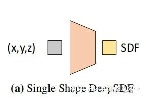

# Neural SDF 学习

## 【摘录】DeepSDF

[原文](https://zhuanlan.zhihu.com/p/418237767)

开了个新的专栏，介绍深度学习在三维视觉中的各种工作.

今天介绍的文章是cvpr2019一篇关于3d重建的论文

论文地址：
[DeepSDF: Learning Continuous Signed Distance Functions for Shape Representation](https://arxiv.org/abs/1901.05103)

代码地址：
[https://github.com/facebookresearch/DeepSDF](https://github.com/facebookresearch/DeepSDF)

### 任务前提

那么3d重建的任务我们可以定义为这样，对于空间中任意一个点，我们要通过模型判断这个点是属于一个物体内还是物体外，一个完美的效果就是这个物体的所有点都被判断成物体内，那么这个物体就能够完美的重建。

通常我们会使用SDF函数来代表一个点是物体内还是物体外

$$SDF(\bm x)=s:\bm x\in\mathbb R^3, s\in\mathbb R$$

SDF对于一个输入的点，给出这个点距离物体表面的距离，通常我们把物体外的点到物体表面的距离看作正数，而物体内的点到物体表面的距离看作负数.

所以我们的目标就是拟合这么一个SDF函数。一个非常简单的想法就是通过神经网络去拟合，因为神经网路是可以拟合非常复杂的函数

$$f_\theta\approx SDF(\bm x), \forall\bm x\in\Omega$$

那么训练的话拿真实的SDF值$s$去进行一个监督即可

$$\mathcal L(f_\theta(\bm x))=|clamp(f_\theta(\bm x),\delta)-clamp(s,\delta)|$$

其中，$clamp(x,\delta)=min(\delta,max(-\delta,x))$，即当$x>\delta$时输出$\delta$、$x<-\delta$时输出$-\delta$。这个$clamp$相当于是要让训练出来的$f_\theta(\bm x)$并不完全等于$s$，而是在距离表面远的地方恒等于$\delta$，距离表面近的地方才等于$s$。按论文所说，大的$\delta$可以在渲染时让Sphere tracing更快接近表面，小的$\delta$可以使模型的训练过程更加集中于表面附近。

### Latent Vector

但是问题来了，我们明显可以猜到一个SDF函数应该是对应一个物体的，但是如果每个物体都要训练一个SDF函数也就是训练一个神经网络的话,这就显得太麻烦了。本文作者希望这个SDF函数拥有神经网络的泛化性。

所以论文提出了我们编码物体的形状得到一个Latent Vector（下图中的Code）,这个Latent Vector代表的是物体的形状信息，那么我们再将Latent Vector和点的坐标(x,y,z)传入函数中得到该点的SDF值。

简单来说，就是要训一个大的DNN（Coded Shape DeepSDF），其根据Latent Vector输入的不同可以模拟不同的小DNN（Single Shape DeepSDF）的行为。

（非得用一个大DNN模仿多个小DNN，有种图灵停机问题里用图灵机模拟图灵机的感觉了，艹）

之所以这么做是因为我们需要建立一个泛化性的SDF函数，但是泛化再怎么强也不可能直接根据点的坐标就能判断出点的SDF值，因为不同形状的物体都可能拥有这个点。所以我们先告诉函数这个物体的形状大概是怎么样，再让函数判断这个点的SDF值。

 **那么如何得到Latent Vector呢** 

第一想法应该就是AutoEncoder了，它可以先从输入多视角图像中抽取出一个抽象的特征再用于Decoder的输入，非常适合这里Latent Vector的提取

 **但是论文并没有这么做，论文的做法是只取后面的decorder，那么Latent Vector怎么得到呢？当前形状最好的Latent Vector应该是使得这个SDF值的判断最为正确的Vector** 

$$
\begin{aligned}
    p_\theta(z_i|X_i)&=p(\bm z_i)\prod_{(\bm x_j,\bm s_j)\in X_i}p_\theta(\bm s_j|z_i;\bm x_j)\\
    p_\theta(\bm s_j|z_i;\bm x_j)&=e^{-\mathcal{L}(f_\theta(\bm z,\bm x_j),s_j)}
\end{aligned}
$$

所以文章的训练方法就是，先随机定义该形状的Latent Vector，通过训练反向传播得到更好的Vector。
在训练刚开始的时候，每一个训练形状都会被分配一个随机初始化的Latent Vector，然后Latent Vector会通过标准反向传播和Decoder权重一起优化。

###  推理

那么文章在推理时使用的方法是下面这种理论。

$$\hat{\bm z}=\mathop{argmin}\limits_{\bm z}\sum_{(\bm x_j,\bm s_j)\in X}\mathcal{L}(f_\theta(\bm z,\bm x_j),s_j)+\frac{1}{\sigma^2}\|\bm z\|^2_2$$

可以发现一个非常奇特的东西，他在推理阶段仍然是会用到ground truth，也会用到损失。
这是什么意思呢？

答曰：训练完成后，训练集中的每个形状都有了对应的训练好的Latent Vector；
那么对于一个新来的形状（一堆没见过的图片和位置数据），则将Decoder权重固定，估计最优的Latent Vector。
这样，每来一个新形状，都能通过这种类似训练的过程得到这个形状的Latent Vector。

（本菜鸡又学到了新的骚操作，🐂🍺）

>我们要知道3d重建是对于一个空间里非常多的点进行一个判断的。那么在推理的时候 **我们可以只取一小部分点，利用这些点去进行训练，得到Latent Vector，之后在对全部的点利用刚刚得到的Latent Vector进行重建。** 

>**因为我们之前其实是训练过Decoder的，Decoder中包含大量的先验知识，道理跟我们训练一个预训练模型比直接训练一个随机初始化模型要快得多是一样的。所以在这样的Decoder下，反向传播训练出一个较好的Latent Vector是比较快的。** 

**博客内容参考：** 

[Clyce：谈谈DeepSDF中AutoDecoder](https://zhuanlan.zhihu.com/p/102904841)

[谷溢：DeepSDF笔记](https://zhuanlan.zhihu.com/p/185001163)

### 优

那么这种方法比AutoEncoder好在哪里呢？

>AutoEncoder更容易过拟合数据，因为他的训练是很依赖数据的，而**这种直接用Decoder的方式似乎有更强鲁棒性。** 

### 劣

但如果AutoEncoder比不上AutoDecoder那么也就没必要用AutoEncoder了，那么AutoEncoder的优势在哪？

>那就是对于新数据，AutoEncoder比AutoDecoder有着强太多的泛化性，AuntoEncoder能够根据输入的新数据的特性，编码出符合新数据的特征。但是AutoDecoder不行，因为对于形状的Latent Vector是通过反向传播训练的。
>
>那么也就是说**在面对新数据时，AutoDecoder无法直接得到Latent Vector只能用上面那种类似训练的方法得到，所以对新数据需要耗费更长的时间找到Latent Vector** 

## (CVPR 2021)Neural Geometric Level of Detail: Real-Time Rendering With Implicit 3D Shapes

英伟达首次实现实时Neural SDF渲染，没有颜色只有形状；里面的DNN的输入是位置，输出是SDF中的距离。
