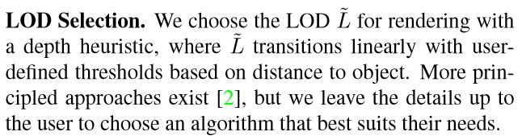

# Neural SDF 学习

## 【摘录】DeepSDF

[原文](https://zhuanlan.zhihu.com/p/418237767)

开了个新的专栏，介绍深度学习在三维视觉中的各种工作.

今天介绍的文章是cvpr2019一篇关于3d重建的论文

论文地址：
[DeepSDF: Learning Continuous Signed Distance Functions for Shape Representation](https://arxiv.org/abs/1901.05103)

代码地址：
[https://github.com/facebookresearch/DeepSDF](https://github.com/facebookresearch/DeepSDF)

### 任务前提

那么3d重建的任务我们可以定义为这样，对于空间中任意一个点，我们要通过模型判断这个点是属于一个物体内还是物体外，一个完美的效果就是这个物体的所有点都被判断成物体内，那么这个物体就能够完美的重建。

通常我们会使用SDF函数来代表一个点是物体内还是物体外

$$SDF(\bm x)=s:\bm x\in\mathbb R^3, s\in\mathbb R$$

SDF对于一个输入的点，给出这个点距离物体表面的距离，通常我们把物体外的点到物体表面的距离看作正数，而物体内的点到物体表面的距离看作负数.

所以我们的目标就是拟合这么一个SDF函数。一个非常简单的想法就是通过神经网络去拟合，因为神经网路是可以拟合非常复杂的函数

$$f_\theta\approx SDF(\bm x), \forall\bm x\in\Omega$$

那么训练的话拿真实的SDF值$s$去进行一个监督即可

$$\mathcal L(f_\theta(\bm x))=|clamp(f_\theta(\bm x),\delta)-clamp(s,\delta)|$$

其中，$clamp(x,\delta)=min(\delta,max(-\delta,x))$，即当$x>\delta$时输出$\delta$、$x<-\delta$时输出$-\delta$。这个$clamp$相当于是要让训练出来的$f_\theta(\bm x)$并不完全等于$s$，而是在距离表面远的地方恒等于$\delta$，距离表面近的地方才等于$s$。按论文所说，大的$\delta$可以在渲染时让Sphere tracing更快接近表面，小的$\delta$可以使模型的训练过程更加集中于表面附近。

### Latent Vector

但是问题来了，我们明显可以猜到一个SDF函数应该是对应一个物体的，但是如果每个物体都要训练一个SDF函数也就是训练一个神经网络的话,这就显得太麻烦了。本文作者希望这个SDF函数拥有神经网络的泛化性。

所以论文提出了我们编码物体的形状得到一个Latent Vector（下图中的Code）,这个Latent Vector代表的是物体的形状信息，那么我们再将Latent Vector和点的坐标(x,y,z)传入函数中得到该点的SDF值。

简单来说，就是要训一个大的DNN（Coded Shape DeepSDF），其根据Latent Vector输入的不同可以模拟不同的小DNN（Single Shape DeepSDF）的行为。

（非得用一个大DNN模仿多个小DNN，有种图灵停机问题里用图灵机模拟图灵机的感觉了，艹）

之所以这么做是因为我们需要建立一个泛化性的SDF函数，但是泛化再怎么强也不可能直接根据点的坐标就能判断出点的SDF值，因为不同形状的物体都可能拥有这个点。所以我们先告诉函数这个物体的形状大概是怎么样，再让函数判断这个点的SDF值。

 **那么如何得到Latent Vector呢** 

第一想法应该就是AutoEncoder了，它可以先从输入多视角图像中抽取出一个抽象的特征再用于Decoder的输入，非常适合这里Latent Vector的提取

 **但是论文并没有这么做，论文的做法是只取后面的decorder，那么Latent Vector怎么得到呢？当前形状最好的Latent Vector应该是使得这个SDF值的判断最为正确的Vector** 

$$
\begin{aligned}
    p_\theta(z_i|X_i)&=p(\bm z_i)\prod_{(\bm x_j,\bm s_j)\in X_i}p_\theta(\bm s_j|z_i;\bm x_j)\\
    p_\theta(\bm s_j|z_i;\bm x_j)&=e^{-\mathcal{L}(f_\theta(\bm z,\bm x_j),s_j)}
\end{aligned}
$$

所以文章的训练方法就是，先随机定义该形状的Latent Vector，通过训练反向传播得到更好的Vector。
在训练刚开始的时候，每一个训练形状都会被分配一个随机初始化的Latent Vector，然后Latent Vector会通过标准反向传播和Decoder权重一起优化。

###  推理

那么文章在推理时使用的方法是下面这种理论。

$$\hat{\bm z}=\mathop{argmin}\limits_{\bm z}\sum_{(\bm x_j,\bm s_j)\in X}\mathcal{L}(f_\theta(\bm z,\bm x_j),s_j)+\frac{1}{\sigma^2}\|\bm z\|^2_2$$

可以发现一个非常奇特的东西，他在推理阶段仍然是会用到ground truth，也会用到损失。
这是什么意思呢？

答曰：训练完成后，训练集中的每个形状都有了对应的训练好的Latent Vector；
那么对于一个新来的形状（一堆没见过的图片和位置数据），则将Decoder权重固定，估计最优的Latent Vector。
这样，每来一个新形状，都能通过这种类似训练的过程得到这个形状的Latent Vector。

（本菜鸡又学到了新的骚操作，🐂🍺）

>我们要知道3d重建是对于一个空间里非常多的点进行一个判断的。那么在推理的时候 **我们可以只取一小部分点，利用这些点去进行训练，得到Latent Vector，之后在对全部的点利用刚刚得到的Latent Vector进行重建。** 

>**因为我们之前其实是训练过Decoder的，Decoder中包含大量的先验知识，道理跟我们训练一个预训练模型比直接训练一个随机初始化模型要快得多是一样的。所以在这样的Decoder下，反向传播训练出一个较好的Latent Vector是比较快的。** 

**博客内容参考：** 

[Clyce：谈谈DeepSDF中AutoDecoder](https://zhuanlan.zhihu.com/p/102904841)

[谷溢：DeepSDF笔记](https://zhuanlan.zhihu.com/p/185001163)

### 优

那么这种方法比AutoEncoder好在哪里呢？

>AutoEncoder更容易过拟合数据，因为他的训练是很依赖数据的，而**这种直接用Decoder的方式似乎有更强鲁棒性。** 

### 劣

但如果AutoEncoder比不上AutoDecoder那么也就没必要用AutoEncoder了，那么AutoEncoder的优势在哪？

>那就是对于新数据，AutoEncoder比AutoDecoder有着强太多的泛化性，AuntoEncoder能够根据输入的新数据的特性，编码出符合新数据的特征。但是AutoDecoder不行，因为对于形状的Latent Vector是通过反向传播训练的。
>
>那么也就是说**在面对新数据时，AutoDecoder无法直接得到Latent Vector只能用上面那种类似训练的方法得到，所以对新数据需要耗费更长的时间找到Latent Vector** 

## (CVPR 2021) Neural Geometric Level of Detail: Real-Time Rendering With Implicit 3D Shapes

英伟达首次实现实时Neural SDF渲染，没有颜色只有形状；里面的DNN的输入是位置，输出是SDF中的距离。

### 模型结构：Sparse Voxel Octree (SVO)

假设要表示的形体V可以置于一个充分大的被包含在内的正方体中，通过对正方体不断细分可以精确形体。对于每一次划分，一个parent voxel可以分成八个大小相同的child voxel。对于每个child voxel而言，有三种状态：
* Empty voxel：不包含任何形体
* Full voxel：完全被形体包含
* Gray voxel：部分包含形体

由于SDF只关注表面信息，所以每一层只有Gray voxel需要被进一步细分，直到达到最大树深。在这一过程中，不需要存储empyty voxel和full voxel的信息，这一稀疏结构节省了空间开销。对于SVO中的每个体素$V$，它的八个顶点$j\in[1,8]$上都存储了一个经过MLP学习到的特征向量$\bm z_V^{(j)}\in\mathcal Z$，并与存在的同一层级邻居voxel共享顶点信息。
树的深度决定了模型的精度，树的不同层对应了LoD的不同需求。

### 推断过程

SDF模型记为$f_{\theta_{1:L_{max}}},\theta_{1:L_{max}}=\{\theta_{1},\dots,\theta_{L_{max}}\}$，即对于不同的层级，$f_{\theta}$结构固定，每个层级$L\in[1,L_{max}]$有各自的模型参数$\theta_L$。

对于给定的LoD层级$L\in\mathbb N$上的坐标$\bm x\in\mathbb R^3$：
1. 取包含该坐标的所有低LoD层级的体素$V_{1:L_{max}}=\{V_1,\dots,V_L\}$
2. 对于每个层级$l\in[1,L]$，将体素$V_l$的8个角上的特征$\bm z_{V_l}^{(j)},j\in[1,8]$插值到$\bm x$处，作为该层级的特征值$\psi(\bm x;l,\mathcal Z)$
3. 对各层级的特征值求和后输入到对应层级的SDF中求SDF值$\hat d_L$：

$$
\begin{aligned}
    \hat d_L&=f_{\theta_L}([\bm x,\bm z(\bm x;L,\mathcal{Z})])\\
    \bm z(\bm x;L,\mathcal{Z})&=\sum_{l=1}^L\psi(\bm x;l,\mathcal Z)
\end{aligned}
$$

可以看到，最终的$\hat d_L=f_{\theta_L}([\bm x,\bm z(\bm x;L,\mathcal{Z})])$和DeepSDF是一个道理，都是用一个大模型根据Latent Vector输入的不同模拟不同的$\bm x\rightarrow d_L$映射，只不过本文的Latent Vector获取的方式略有不同。DeepSDF输入的Latent Vector直接就是模型形状的Code，这里的$\bm z(\bm x;L,\mathcal{Z})$可以看成是不同层级的形状Code的综合信息。

#### 优势

DeepSDF的Latent Vector直接描述了模型的形状，为了从一个短Code里面生成复杂的模型，MLP就需要比较复杂。
而本文的Code在体素的每个顶点上都有一个，相当于模型的每个小区域都有自己的Code，这样每个模型的Code就变多了，模型就可以简单一点。此外，最终输入到模型里的Code是$\psi(\bm x;l,\mathcal Z)$在每个层级的Code的综合，其中既包含模型整体的形状信息（大体素的Code）又包含模型局部的形状信息（小体素的Code），大体素的里的形状可能很复杂，但是小体素里的形状肯定简单，所以用小MLP就能很好地拟合。

>Since our shape vectors $\bm z_V^{(j)}$ now only represent small surface segments instead of entire shapes, we can move the computational complexity out of the neural network $f_{\theta}$ and into the feature vector query $\psi:\mathbb R^3\rightarrow\mathbb R^m$, which amounts to a SVO traversal and a trilinear interpolation of the voxel features. This key design decision allows us to use very small MLPs, enabling significant speed-ups without sacrificing reconstruction quality.

从文章开头的图也可以看出来，同样的模型，在拟合大体素（低LoD层级）的时候出来的形状很糊，但是在拟合小体素（高LoD层级）的时候就越来越清晰了。这就是因为小体素里的形状简单，同样规模的模型更容易拟合小体素里的简单形状。

并且这样的操作还给了模型如同分层编码般的的灵活性：只要把高LoD层级的数据删了然后不要高LoD的模型参数就能得到一个质量差点但是数据量更小的模型。

### 连续LoD

论文中特别强调了可以实现连续LoD，但是这个连续LoD是算相邻的两个整数LoD的加权平均来的：

文中说这个连续为了方便用户自己选的：

有意义吗😂？选在两个整数LoD之间计算量比其中那个大的LoD还多个加权平均的步骤，都没达到LoD减少计算量的效果

### 渲染过程：Adaptive Ray Steps

在生成的一系列光线$i\in\mathcal{R}$上，会经过同一位置不同LoD层级$l$的多个体素，这些体素中只有一部分体素存在内容，空体素在渲染时需要跳过。本文采用的方法是将SDF里找表面的Sphere Tracing方法和判定体素相交的ray-AABB intersection方法结合起来。

具体来说，上面的算法就是遍历每个LoD层级$l$，在$Decide(\mathcal{R},\bm N^{(l)},l)$中用Sphere Tracing确定是否当前层级某个体素相交，在$Subdivide(\bm N^{(l)}, \bm D, \bm S)$中用ray-AABB intersection确定可能与下一层级哪些体素相交，最后用$Compactify(\bm N^{(l)}, \bm D, \bm S)$去掉那些始终没找到相交体素的光线。

于是这样，光线在经过已知为空的体素时可以通过ray-AABB intersection直接跳过，只有在非空体素内行进是才需要DNN推断得到SDF数据进行Sphere Tracing。

##  (CVPR 2020) Implicit Functions in Feature Space for 3D Shape Reconstruction and Completion

**本文主要针对点云数据补全，有点偏门**，但用的方法很相关。

而且虽然说的是点云但是放的图片全都没颜色，最后的公式也是在预测点在模型内还是模型外，所以给放进Neural SDF里来了。
这里面说的点云应该是没颜色值只用于表示表面的那种点云。

做的三个实验很有代表性：

* 点云补全
* 体素超分辨率
* 单视图人体重建（给出一个视角下的点云数据）

提出了Implicit Feature Networks，其实就是：

* 提取深度特征的多尺度三维张量代替单个向量来编码三维形状，这个特征对齐了嵌入在形状中的原始的欧拉空间；
* 对连续查询点提取的深度特征分类，代替直接对xyz点坐标分类。

就是一种更直接的把坐标转换成向量的方法，因为输入不再是坐标而是含义不那么直观的特征向量，所以叫做Implicit Feature Networks。

具体一点，本文方法主要分两方面：形状编码（shape encoding）、形状解码（shape decoding）

### 形状编码：连续多尺度的体素

虽然都是多尺度体素思想，但是和上面的那种直接训练特征向量的方法不一样，本文的输入是点云，目标是要用模型拟合点云

输入的离散体素网格的坐标集合记为$\mathcal X=\mathbb R^{N\times N\times N}$，其中$N\in\mathbb N$表示输入的分辨率。

对于输入的点云：

1. 先把点云离散化：点云每个点放进体素网格$\mathcal X$里，让网格的每个点都有个颜色数据
   * 这里$\mathcal X$的网格密度最好大于点云的密度，或者点云本身就是按照网格存的可以直接对齐到网格$\mathcal X$里更好）
2. 三维卷积：在网格$\mathcal X$上做三维卷积，用网格的每个点上的三维颜色算出高维向量数据，这样网格的每个点就都有个$F_1$维特征向量了
3. 三维池化：在网格$\mathcal X$上做三维池化，这样输出的特征网格长宽高就是原来的一半，将此特征网格（Feature Grid）记为$\bm F_1$
4. 三维卷积：在网格$\bm F_1$上做三维卷积，特征通道数变$F_2$维
5. 三维池化：在网格$\bm F_1$上做三维池化，同步骤3，输出特征网格记为$\bm F_2$
6. 重复上述步骤直到输出$\bm F_n$，输出特征矩阵通道数变$F_n$维

最终聚合得到的所有特征网格得到多尺度深度特征网格（Multi-Scale Deep Feature Grid）$\bm F_1,\dots,\bm F_n$，其中$F_k\in\mathcal F_k^{K\times K\times K}$、$K=\frac{N}{2^k-1}$表示经过$k$轮上述操作后的特征网格分辨率。

作者这样做有他的道理：
* 大尺度特征$\bm F_k$保存了模型的整体信息
* 小尺度特征$\bm F_1$保存了模型的高频信号

以$\bm X$表示点云数据，将上述形状编码过程记为：

$$g(\bm X)=\bm F_1,\dots,\bm F_n$$

### 形状解码：依然是取坐标点所在体素顶点处的特征进行插值

对于位置$\bm p\in\mathbb R^3$，用插值计算其多尺度深度特征$\bm F_1(\bm p),\dots,\bm F_n(\bm p)$，其中特征$\bm F_k(\bm p)\in\mathcal F_k$，送入MLP$f(\cdot)$中预测点$\bm p$在形状的内部还是外部：

$$f(\bm F_1(\bm p),\dots,\bm F_n(\bm p)):\mathcal F_1\times\dots\mathcal F_n\rightarrow[0,1]$$