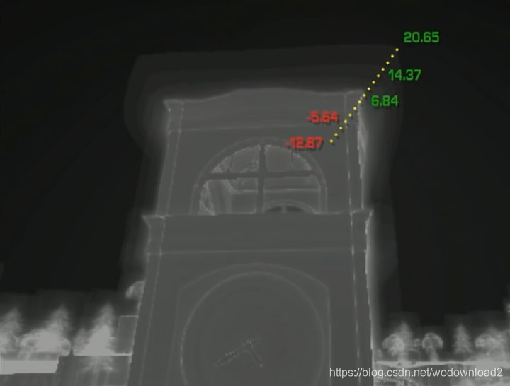
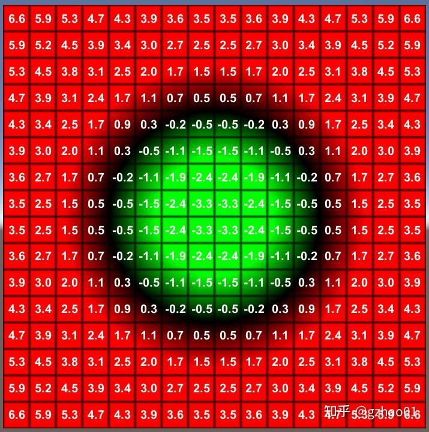
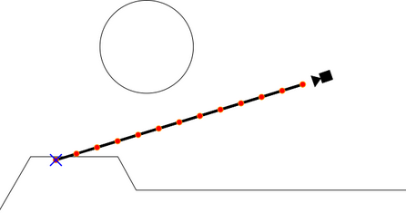
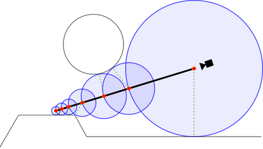

# SDF(Signed Distance Field)简介

Signed Distance Field，中文名为有向距离场，SDF有2D和3D的区别，它的定义非常简单：**每个像素（体素）记录自己与距离自己最近物体之间的距离**，如果在物体内，则距离为负，正好在物体边界上则为0。

一般来说，无论2D或者3D资产都有隐式（implicit）和显式（explicit）两种存储方式，比如3D模型就可以用mesh直接存储模型数据，也可以用SDF、点云(point cloud)、神经网络(nerual rendering)来表示，2D资产（这里指贴图）也是如此。比如贴图一般直接使用RGB、HSV等参数来进行表示，但这样子再放大图片后会出现锯齿，所以想要获取高清的图像就需要较大的存储空间，这时候就需要矢量表示，在2D贴图中SDF就是为了这种需求产生的。

SDF(Signed Distance Field)在3D和2D中都有对应的应用。在3D中光线追踪对于性能的消耗过大，所以SDF常常被用来作为物体的隐式表达，配合ray marching达到接近光线追踪的效果，也有比如deepSDF这种对于模型的隐式表达方面的应用。在2D中，SDF常常被用来表示字体，原神的面部渲染中阴影部分贴图也是基于SDF生成的。

SDF的本质就是存储每个点到图形的最近距离，即将模型划出一个表面，在模型表面外侧的点数值大于0，在模型表面内侧的点数值小于0，如下所示：

## SDF应用：计算距离场

SDF和传统的Ray tracing很类似，都需要射线射向场景中的每个像素。在Ray traceing中，我们可以使用一些表达式来确定光线和需要渲染的物体的交点。通过这种方式我们就可以找到所有与射线相交的物体。然而Ray tracing对性能的要求很高，特别是有大量的物体和复杂光照的情况下，因此不能广泛的使用在实时游戏中。另外Ray tracing不能用在体积雾，云，水等这种体积材质上。

Ray tracing不会直接来分析相交而是采用另外一种方法来处理物体相交的问题。而SDF则不一样，它会匹配沿着射线方向上的点直到找到与物体相交的点为止。这种方式相对简单对性能的消耗也较小。可以更好的在实时游戏中使用。从下面两图中我们可以看到Ray marching的精度要比Ray tracing低(如果在高精度下看，交互点是有偏离的)。不过对于游戏来说这个精度已经足够，相对于Ray tracing来说更好的平衡了性能和渲染精度。

如上图这种固定步长的Ray matching对于体积表面和半透明物体表面是非常好的。不过对于不透明的物体表面，我们可以使用另外一种简化的方式计算，这种方式就是SDF。SDF其实就是返回当前点与任意物体表面的最短距离。如果返回的距离是负数，说明这个点在物体里面。距离场可以很好控制沿着射线进行距离比较的次数。

如上所示，每次前进的距离等于当前像素（体素）处存储的值，直到当前像素（体素）处的值为0或负值。这样可以比Ray marching更少的采样次数得到更高精度的距离场。

## SDF应用：使用SDF计算法线和Lamber光照

TBD