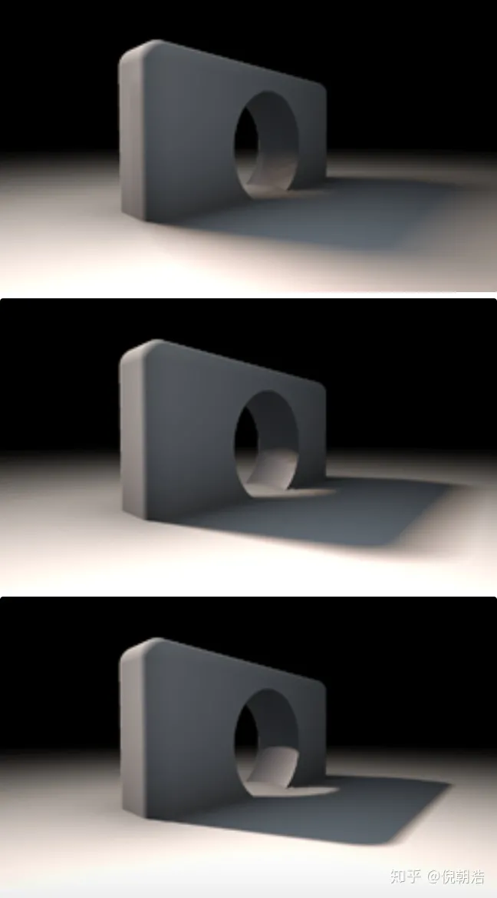

# 【摘录】SDF(Signed Distance Field)简介


Signed Distance Field，中文名为有向距离场，SDF有2D和3D的区别，它的定义非常简单：**每个像素（体素）记录自己与距离自己最近物体之间的距离**，如果在物体内，则距离为负，正好在物体边界上则为0。

一般来说，无论2D或者3D资产都有隐式（implicit）和显式（explicit）两种存储方式，比如3D模型就可以用mesh直接存储模型数据，也可以用SDF、点云(point cloud)、神经网络(nerual rendering)来表示，2D资产（这里指贴图）也是如此。比如贴图一般直接使用RGB、HSV等参数来进行表示，但这样子再放大图片后会出现锯齿，所以想要获取高清的图像就需要较大的存储空间，这时候就需要矢量表示，在2D贴图中SDF就是为了这种需求产生的。

SDF(Signed Distance Field)在3D和2D中都有对应的应用。在3D中光线追踪对于性能的消耗过大，所以SDF常常被用来作为物体的隐式表达，配合ray marching达到接近光线追踪的效果，也有比如deepSDF这种对于模型的隐式表达方面的应用。在2D中，SDF常常被用来表示字体，原神的面部渲染中阴影部分贴图也是基于SDF生成的。

SDF的本质就是存储每个点到图形的最近距离，即将模型划出一个表面，在模型表面外侧的点数值大于0，在模型表面内侧的点数值小于0，如下所示：


## SDF应用：球体追踪 Sphere Tracing 计算表面距离

SDF和传统的Ray tracing很类似，都需要射线射向场景中的每个像素。在Ray traceing中，我们可以使用一些表达式来确定光线和需要渲染的物体的交点。通过这种方式我们就可以找到所有与射线相交的物体。然而Ray tracing对性能的要求很高，特别是有大量的物体和复杂光照的情况下，因此不能广泛的使用在实时游戏中。另外Ray tracing不能用在体积雾，云，水等这种体积材质上。

Ray tracing不会直接来分析相交而是采用另外一种方法来处理物体相交的问题。而SDF则不一样，它会匹配沿着射线方向上的点直到找到与物体相交的点为止。这种方式相对简单对性能的消耗也较小。可以更好的在实时游戏中使用。从下面两图中我们可以看到Ray marching的精度要比Ray tracing低(如果在高精度下看，交互点是有偏离的)。不过对于游戏来说这个精度已经足够，相对于Ray tracing来说更好的平衡了性能和渲染精度。


如上图这种固定步长的Ray matching对于体积表面和半透明物体表面是非常好的。不过对于不透明的物体表面，我们可以使用另外一种简化的方式计算，这种方式就是SDF。SDF其实就是返回当前点与任意物体表面的最短距离。如果返回的距离是负数，说明这个点在物体里面。距离场可以很好控制沿着射线进行距离比较的次数。

Sphere tracing是结合SDF(signed distance field)来做ray marching的技术。我们都知道，做ray marching的时候需要在给定的方向上做search，常用的方法包括linear search(每次使用增加固定的步长)以及binary search(对距离进行二分)等。(其实这个search的过程与求解最优化问题中的search是一样的)。由于方向是固定的，每次迭代使用的步长是做ray marching时需要考虑的，而SDF就完美提供了这种信息！

为了找到view ray和场景中的相交，我们从相机位置开始，每次沿着view ray一点一点的前进。在每个停留步上，我们都检测该点的SDF值是否为负来判断这个点是不是在曲面内部了。如果是，那么光线与场景相交了，我们得到了我们想要的深度值。如果不是，我们则继续一点一点往前进。这样使用常数做为前进的距离经常会有一个问题，如果步长过小，则需要非常多步才能得到结果；如果步长过大，则得到交点的精确度太低。


相对于固定步长的情况，我们使用结合SDF的sphere tracing就能做得更好。不是每次都步进一小步，而是步进我们知道的不会穿过任何曲面的最大距离(如上图)，而SDF则刚好为我们记录了这个距离。只需要令每次前进的距离等于当前像素（体素）处存储的值，直到当前像素（体素）处的值为0或负值，就可以比Ray marching更少的采样次数得到更高精度的距离场。

## SDF应用：使用SDF计算法线和Lambert光照

TBD

## SDF应用：Distance Field Soft Shadows

[原文](https://zhuanlan.zhihu.com/p/50128840)

让我们来看如何基于SDF和ray marching实现软阴影。假设我们已经有了场景的SDF，假定使用函数`float map(vec3 p)` 查询SDF中每个像素的值，那么`map`函数中则包括了所有的几何信息。通常来说，当要计算某点`p`的阴影信息时，我们可以通过**朝着光线方向进行ray marching，直到找到一个相交**。通常情况的代码为：

```c
float shadow( in vec3 ro, in vec3 rd, float mint, float maxt )
{
    for( float t=mint; t < maxt; )
    {
        float h = map(ro + rd*t);
        if( h<0.001)
            return 0.0;
        t += h;
    }
    return 1.0;
}
```

上面代码当然work，但是只会生成准确的硬阴影，缺乏真实感(如图右边)。


接下来，只需要简单增加些代码就能使结果好很多！这个trick的核心就是想象一下**shadow ray在没有与物体相交前，但是很接近的情况下，那么我们会考虑该点在半影区(penumbra)**。我们可以有两种基本假设：一是**距离相交点越近，通常阴影越深颜色越暗**。二是**距离着色点越近(也就是距离光源也远)，阴影颜色也越深**。令人难以置信的是，在ray marching的整个过程中，这两个距离值我们都是可以得到的！于是，我们可以在marching过程中的每一步计算一个半影(penumbra)因子，并最终选取最黑的值做为结果。代码如下：

```c
float softshadow( in vec3 ro, in vec3 rd, float mint, float maxt, float k )
{
    float res = 1.0;
    for( float t=mint; t < maxt; )
    {
        float h = map(ro + rd*t);
        if( h<0.001 )
            return 0.0;
        res = min( res, k*h/t );
        t += h;
    }
    return res;
}
```

使用上述代码就可以得到图中左边的软影效果。

简单的修改了代码就得到了巨大的提升：不但得到了软阴影的效果，它们的表现还十分真实。而增加的开销也几乎可以无视。当然，参数k会影响影子的软硬程度。看下图可以感受下不同k(从上到下为：2，8，32)的结果：



必须佩服的说！这算法很优雅，简单又有效果！
