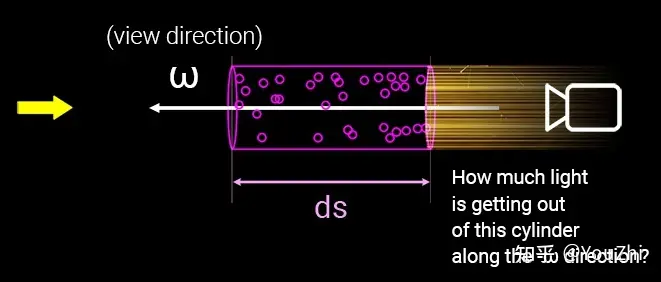

# 【摘抄】Nerf基础知识：体渲染

话不多说，先看论文里的流程图：

这里DNN的功能很好理解，输入一个方向输出颜色和密度。颜色好理解，这密度是干嘛的？答曰：此处颜色和密度是后面这个体积渲染的输入。DNN输出的数据经过体积渲染才能得到图片，而这个体积渲染过程可威风，所以出图之后可以反向传播，所以可以被训练。

那这个体积渲染又是什么？文中之间给了个公式：

并且说离散化的计算过程实际上是：

很显然，这公式需要背景知识才能看懂。

## 体渲染 (Volume Rendering)

渲染可以说是图形学中的核心。所谓计算机图形学，就是让计算机模拟出一个真实的世界。而渲染，则是把这个虚拟出来的世界投影成图像，正如自然界中的各种光线经过碰撞后，投影到我们视网膜上的样子。这是现代电影和游戏中不可或缺的技术。

体渲染属于整个渲染技术的分支，体渲染把气体等物质抽象成一团飘忽不定的粒子群。光线在穿过这类物体时，其实就是光子在跟粒子发生碰撞的过程。

体渲染建模的示意图如下。光沿直线方向穿过一群粒子 (粉色部分)，如果能计算出每根光线从最开始发射，到最终打到成像平面上的辐射强度，我们就可以渲染出投影图像。而体渲染要做的，就是对这个过程进行建模。为了简化计算，我们假设光子只跟它附近的粒子发生作用，这个范围就是图中圆柱体包含的范围。

体渲染把光子与粒子发生作用的过程，进一步细化为四种类型：

* 吸收 (absorption)：光子被粒子吸收，会导致入射光的辐射强度**减弱**；
* 放射 (emission)：粒子本身可能发光，比如气体加热到一定程度就会离子化，变成发光的「火焰」。这会进一步**增大**辐射强度；
* 外散射 (out-scattering)：光子在撞击到粒子后，可能会发生弹射，导致方向发生偏移，会**减弱**入射光强度；
* 内散射 (in-scattering)：其他方向的光子在撞到粒子后，可能和当前方向上的光子重合，从而**增强**当前光路上的辐射强度。

于是出射光与入射光之间的变化量，可以表示为这四个过程的叠加：

$$L_0-L_i=dL(x,w)=\text{emission}+\text{inscattering}-\text{outscattering}-\text{absorption}$$

为什么？可以看看[体积云渲染实战](./光线行进算法.md)里面对于云遮挡其后物体的半透明特性和云被阳光照射时的发光特性，半透明就是吸收和外散射、云被阳光照射就有放射和内散射。

## 吸收 (absorbing)

先剖析吸收的过程。在从$L_i$到$L_0$的光路上，设有某个区域$s$，在$s$处有一个底面积是$E$，高是$\Delta s$的圆柱体。设圆柱体中粒子的密度是$\rho$。

假设粒子都是半径为$r$的球体，那么每个粒子的最大横截面积是$A=\pi r^2$（即，每个粒子对光线的最大遮挡面积）。当圆柱体的高$s$足够小，小到跟粒子直径一样大的时候($\Delta s\rightarrow0$)，可以认为粒子在圆柱体高这个方向上不会互相重叠（即，粒子都平铺在圆柱体的底面上）。

此时，圆柱体体积为$E\Delta s$，粒子总数为$\rho E\Delta s$。这些粒子遮挡的面积为$\rho EA\Delta s$，占整个底面积的比例为$\rho EA\Delta s/E=\rho A\Delta s$。也就是说，**当一束光通过这个圆柱体的时候，有$\rho A\Delta s$的概率会被遮挡**。换句话说，如果我们在圆柱体的一端发射无数光线 (假设都朝相同的方向)，在另一端接收，会发现有些光线安然通过，有些则被粒子遮挡 (吸收)。这些接受到的光线总强度$I_o$，相比入射光线总强度$I_i$而言，会有$\rho A\Delta s$比例的衰减：

$$I_o-I_i=-I_i\rho A\Delta s$$

另外，在光线行进方向上，$s$还可以看作是光线在一个长圆柱体中的行进距离，在这样的圆柱体中，光线的强度显然会随着行进距离而变化，因此可以表示为$s$的函数$I(s)$；此外，$s$还可以看作是圆柱体内部的一个位置，圆柱体每个区域的密度可以不同，于是不同位置处的粒子密度也可以表示为$s$的函数$\rho(s)$。于是上述公式又可以表示为：

$$\Delta I=I_o-I_i=-I(s)\rho(s)A\Delta s$$

于是就能写成一个微分方程：

$$\frac{dI}{ds}=-I(s)\rho(s)A=-I(s)\tau_a(s)$$

解之：

$$I(s)=I_0e^{-\int_0^s\tau_a(t)dt}$$

其中$I_0$表示常微分方程中的常数项，物理意义上表示光线的起始点处的**光总强度**。

上式有丰富的物理意义。如果介质 (粒子群) 是均匀的，即$\tau_a(t)$处处相等，那么入射光在经过介质 (粒子群) 后，辐射强度会呈指数衰减。这被称为比尔-朗伯吸收定律 (Beer-Lambert law)。

此外，还可以定义 **“透射比”(transmittance)**：

$$T(s)=\frac{I(s)}{I_0}=e^{-\int_{0}^s\tau_a(t)dt}$$

它表示从光路起点到某一点之间的粒子云的透明度，数值越大，说明粒子群越透明，光线衰减的幅度就越小。

而透明度本身是关于$\tau_a(t)$的方程，$\tau_a(t)$越大，$T(s)$就越小。而$\tau_a(t)=\rho(s)A$，它是由粒子密度和投影面积决定的。这在直觉上也很好理解，如果粒子密度大，粒子本身也比较大，那么遮住光线的概率也会相应提升，自然透明度也就下降了。$\tau_a(t)$也被称为光学厚度 (optical depth)。

## 放射 (emission)

除了吸收之外，粒子本身也可能发光。

假设粒子单位横截面积发射一束光的辐射强度为$I_e$。按照前文描述，在圆柱体高度足够小的情况下，粒子总的发射面积是$\rho AE\Delta s$，则总的发光强度为$I_e\rho AE\Delta s$。如果我们在圆柱体一端去接收粒子们放射的光线，会发现有时候能接收到，有时候刚好接收点所在的光路上没有粒子，就接收不到。能接收到光线的概率为$\rho EA\Delta s/E=\rho A\Delta s$，那么接收到的光线的平均强度为$I_e\rho A\Delta s$。同样可得放射光强的常微分方程：

$$\frac{dI}{ds}=I_e(s)\rho(s)A=I_e(s)\tau_a(s)$$

类似吸收，粒子放射的光强同样和$\tau_a(s)$有关，这在直觉上也是合理的，如果粒子能发光，那粒子密度和粒子颗粒越大，放射的辐射均值也就越大。

## 外散射 (out-scattering)

粒子除了吸收光子，也可能会弹射光子，这个过程称为外散射，即光子被弹射出原本的光路，导致光线强度减弱。

同吸收一样，外散射对光线的削弱程度，也跟光学厚度相关，不过过程相对吸收来说又复杂一些，因此我们用$\tau_s$来表示外散射对光线的削弱比例，以区别于$\tau_a$：

$$\frac{dI}{ds}=-I(s)\tau_s(s)$$

## 内散射 (in-scattering)

光子可以被弹射走，自然就有其他光路的光子被弹射到当前光路，这一过程就是内散射。

内散射的过程比外散射又更加复杂，因为弹射到当前光路的光子可能来自多条不同的光路，因此需要综合考虑其他光路的辐射强度以及各种弹射角度。

我们可以认为来自外部的光线强度为$I_s$，在穿过当前光路时，被散射减弱的能量占比为$\tau_s$，这些能量显然不会凭空消失，而是回留在当前光路内。于是内散射的光线强度就是：

$$\frac{dI}{ds}=I_s(s)\tau_s(s)$$

## 体渲染方程

把以上四个过程都综合到一个公式中:

$$\frac{dI}{ds}=-I(s)\tau_a(s)-I(s)\tau_s(s)+I_e(s)\tau_a(s)+I_s(s)\tau_s(s)$$

其中，吸收和外散射都会削弱光线的辐射强度，并且由于它们都和入射光有关，因此它们共同构成了体渲染中的**衰减项 (attenuation item)**；而粒子发光和内散射都来自独立的光源，因此被称为**源项 (source item)**。

令$\tau_t=\tau_a+\tau_s$，简化之：

$$\frac{dI}{ds}=-\tau_t(s)I(s)+\tau_a(s)I_e(s)+\tau_s(s)I_s(s)$$

求解之，得光路上任意点$s$的光强公式：

$$I(s)=I_0e^{-\int_0^s\tau_t(t)dt}+\int_0^s e^{-\int_0^t \tau_t(u)du}[\tau_a(t)I_e(t)+\tau_s(t)I_s(t)]dt$$

即体渲染方程，其中$I_0$为入射光强度。

这个公式中，$I_0e^{-\int_0^s\tau_t(t)dt}$即为入射光在光路内强度衰减后在光路终点处的光强；$\int_0^s e^{-\int_0^t \tau_t(u)du}[\tau_a(t)I_e(t)+\tau_s(t)I_s(t)]dt$即为粒子自己发光和来自外部的光源通过内散射带来的光强。

## 向Nerf靠拢：Nerf中的体渲染公式

在上述体渲染公式和Nerf论文中所给的体渲染公式之间还有一道坎。

为了简化上述公式，进一步假设$\sigma(u)=\tau_t(u)$，$\sigma(t)C(t)=\tau_a(t)I_e(t)+\tau_s(t)I_s(t)$，上述公式化为：

$$I(s)=I_0e^{-\int_0^s\sigma(t)dt}+\int_0^s e^{-\int_0^t \sigma(u)du}\sigma(t)C(t)dt$$

进一步令$T(s)=e^{-\int_0^s\sigma(t)dt}$：

$$I(s)=I_0T(s)+\int_0^s T(t)\sigma(t)C(t)dt$$

即Nerf论文中的公式多加个背景光项。

**仔细看上面的公式，前面说过$\tau_t(u)$是光学厚度，因此$\sigma(u)$也就同样表征了在光路上的距离$u$处的粒子密度×粒子投影面积；而$\tau_a(t)I_e(t)$和$\tau_s(t)I_s(t)$分别是放射和内散射的$\frac{dI}{dt}$，都是表征光线在光路上的距离$u$处被增强了多少；于是$C(t)=\frac{\tau_a(t)I_e(t)+\tau_s(t)I_s(t)}{\tau_t(t)}$就可以理解为单位粒子投影面积对光线在光路上的距离$u$处增强的贡献度，也就是每单位粒子投影面积发出了多少光。**

**$\sigma(t)C(t)$与透射比$T(s)$相乘，相当于将吸收与外散射给光线对光线的减弱也考虑进来。
背景光$I_0T(s)$就是起点光强×透射比，很好理解。Nerf里忽略了这项，即假定所有光线均由粒子发出。**

此外，在Nerf里$C$表示颜色，这个操作稍微想想就能明白：颜色可以表示为向量，比如RGB三位向量里的值就是三种原色的光强度，上面的公式可以表示一种颜色的光线强度，而不同光线互不干扰，每种原色列一个单独的公式表示，最后三种原色的$I(s)$组一个向量就能表示颜色了。

## 向Nerf靠拢：Nerf中的离散化体渲染计算公式

上述积分在计算机中是无法计算的，需要离散化。

我们将整个光路$[0,s]$划分为$N$个相等间距的区间$[t_n, t_{n+1}]$，那么只要能算出每个区间内的辐射强度$I(t_n\rightarrow t_{n+1})$，最后把 $N$个区间的辐射加起来，就可以得到最终的光线强度了。$N$越大，则越接近理论数值。

在尽可能小的区间$[t_n, t_{n+1}]$内，可以将$\sigma(t)$和$C(t)$看作常量$\sigma_n$和$C_n$。于是：

$$I(t_n\rightarrow t_{n+1})=\sigma_n C_n \int_{t_n}^{t_{n+1}}T(t)dt$$

而$T(t)=e^{-\int_0^t\sigma(u)du}$需要从起点开始计算，但可以拆分为两段：（有点奇怪，一个差分项与前后的数值有联系，这项来自于微分方程求解，需要进一步思考其含义）

$$\begin{aligned} T(t)=&e^{-\int_0^t \sigma(u)du} \\ =&e^{-\int_0^{t_n}\sigma(u)du}e^{-\int_{t_n}^t\sigma(u)du} \\ =&T(0\rightarrow t_n)T(t_n \rightarrow t)\end{aligned} $$

于是：

$$
\begin{aligned}
I(t_n\rightarrow t_{n+1})=&\sigma_n C_n\int_{t_n}^{t_{n+1}}T(0 \rightarrow t_n)T(t_n \rightarrow t) dt \\ 
=&\sigma_n C_n T(0 \rightarrow t_n) \int_{t_n}^{t_{n+1}}T(t_n \rightarrow t) dt \\ 
=&\sigma_n C_n T(0 \rightarrow t_n) \int_{t_n}^{t_{n+1}}e^{-\int_{t_n}^t \sigma_n du}dt \\
=&\sigma_n C_n T(0 \rightarrow t_n)\int_{t_n}^{t_{n+1}} e^{-\sigma_n(t-t_n)}dt \\ 
=&\sigma_n C_n T(0 \rightarrow t_n)e^{\sigma_nt_n}\int_{t_n}^{t_{n+1}} e^{-\sigma_nt}dt \\ 
=&\sigma_n C_n T(0 \rightarrow t_n)e^{\sigma_nt_n} \left(\frac{1}{-\sigma_n}e^{-\sigma_nt_{n+1}}-\frac{1}{-\sigma_n}e^{-\sigma_nt_{n}}\right) \\ 
=& C_n T(0 \rightarrow t_n)e^{\sigma_nt_n} \left(e^{-\sigma_nt_{n}}-e^{-\sigma_nt_{n+1}}\right) \\ 
=& C_n T(0 \rightarrow t_n) \left(1-e^{-\sigma_n(t_{n+1}-t_n)}\right)
\end{aligned}
$$

于是可以离散求和逼近积分：

$$
\begin{aligned}
I(s)=&I_0T(s)+\int_0^s T(t)\sigma(t)C(t)dt \\
\approx & I_0T(s)+\sum_{n=1}^N I(t_n \rightarrow t_{n+1}) \\
=&I_0T(s)+\sum_{n=1}^N C_n T(0 \rightarrow t_n) \left(1-e^{-\sigma_n(t_{n+1}-t_n)}\right)
\end{aligned}
$$

进一步令$\delta_n=t_{n+1}-t_n$表示采样步长，则$T(0\rightarrow t_n)$也可以离散化：

$$T(0\rightarrow t_n)=e^{-\int_0^{t_n}\sigma(u)du} \approx e^{-\sum_{k=1}^{n-1}\sigma_k \delta_k}$$

再令$T_n=e^{-\sum_{k=1}^{n-1}\sigma_k \delta_k}$代表离散化的$T(0\rightarrow t_n)$，则最终离散化的体渲染公式为：

$$I(s)=I_0T(s)+\sum_{n=1}^N C_n T_n \left(1-e^{-\sigma_n\delta_n}\right)$$

对照Nerf中的离散化体渲染公式：

还是多了个背景光项$I_0T(s)$，这说明Nerf中的体渲染不考虑透射和外散射，所有的光线都是物体表面发出的。即Nerf的使用场景中不存在透明物体，直觉上讲还是很合理的，因为体渲染原本用于渲染云雾，Nerf虽然用了体渲染但是却用来渲染物体表面，这个场景下光线就是来自物体表面。

## Nerf中的体渲染

从论文中给出的系统结构图可知，Nerf中的DNN输入是相机位置$(x,y,z)$和射线朝向$(\theta,\phi)$，其组成5元组表示一条光路；DNN输出是这条光路的各离散采样区间$\delta_n$内的粒子颜色$c_n$和其粒子密度$\sigma_n$（即光学厚度），之后，按照上述离散化体渲染公式进行积分操作，即得到这条光路射出的光线颜色，就像这样：

于是，渲染过程如下：
1. 指定相机的外参（位置、方向等）和内参（焦距、视野、分辨率等）根据外参内参计算出需要采样的各光路的$(x,y,z,\theta,\phi)$
2. 将每个光路的$(x,y,z,\theta,\phi)$输入DNN，计算得到光路上各离散采样区间$\delta_n$内的颜色$c_n$和粒子密度$\sigma_n$
3. 按照离散化体渲染公式进行积分操作，即得到每条采样光路的颜色
4. 根据这些采样光路的颜色和相机内参，计算出相机拍到的图像
5. 上面这个离散化体渲染公式很显然是可微的，所以将计算得到的图像和Ground truth作差进行反向传播训练。

下接[Nerf运行流程解析](./Nerf原理解析.md)