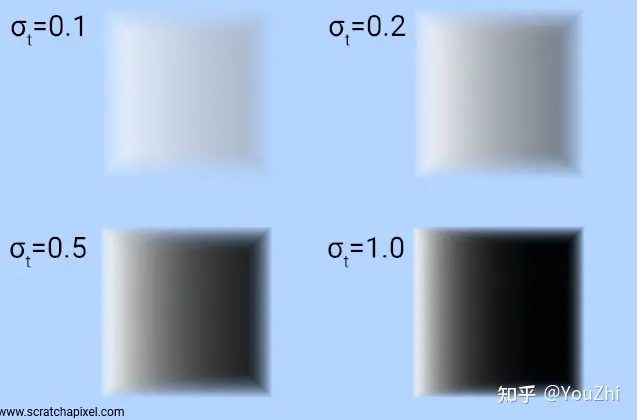

# 【摘抄】Nerf基础知识：体渲染

话不多说，先看论文里的流程图：

这里DNN的功能很好理解，输入一个方向输出颜色和密度。颜色好理解，这密度是干嘛的？答曰：此处颜色和密度是后面这个体积渲染的输入。DNN输出的数据经过体积渲染才能得到图片，而这个体积渲染过程可威风，所以出图之后可以反向传播，所以可以被训练。

那这个体积渲染又是什么？文中之间给了个公式：

很显然，这公式需要背景知识才能看懂。

## 体渲染 (Volume Rendering)

渲染可以说是图形学中的核心。所谓计算机图形学，就是让计算机模拟出一个真实的世界。而渲染，则是把这个虚拟出来的世界投影成图像，正如自然界中的各种光线经过碰撞后，投影到我们视网膜上的样子。这是现代电影和游戏中不可或缺的技术。

体渲染属于整个渲染技术的分支，体渲染把气体等物质抽象成一团飘忽不定的粒子群。光线在穿过这类物体时，其实就是光子在跟粒子发生碰撞的过程。

体渲染建模的示意图如下。光沿直线方向穿过一群粒子 (粉色部分)，如果能计算出每根光线从最开始发射，到最终打到成像平面上的辐射强度，我们就可以渲染出投影图像。而体渲染要做的，就是对这个过程进行建模。为了简化计算，我们假设光子只跟它附近的粒子发生作用，这个范围就是图中圆柱体包含的范围。

体渲染把光子与粒子发生作用的过程，进一步细化为四种类型：

* 吸收 (absorption)：光子被粒子吸收，会导致入射光的辐射强度**减弱**；
* 放射 (emission)：粒子本身可能发光，比如气体加热到一定程度就会离子化，变成发光的「火焰」。这会进一步**增大**辐射强度；
* 外散射 (out-scattering)：光子在撞击到粒子后，可能会发生弹射，导致方向发生偏移，会**减弱**入射光强度；
* 内散射 (in-scattering)：其他方向的光子在撞到粒子后，可能和当前方向上的光子重合，从而**增强**当前光路上的辐射强度。

于是出射光与入射光之间的变化量，可以表示为这四个过程的叠加：

$$L_0-L_i=dL(x,w)=\text{emission}+\text{inscattering}-\text{outscattering}-\text{absorption}$$

## 吸收 (absorbing)

先剖析吸收的过程。在从$L_i$到$L_0$的光路上，设有某个区域$s$，在$s$处有一个底面积是$E$，高是$\Delta s$的圆柱体。设圆柱体中粒子的密度是$\rho$。

假设粒子都是半径为$r$的球体，那么每个粒子的最大横截面积是$A=\pi r^2$（即，每个粒子对光线的最大遮挡面积）。当圆柱体的高$s$足够小，小到跟粒子直径一样大的时候($\Delta s\rightarrow0$)，可以认为粒子在圆柱体高这个方向上不会互相重叠（即，粒子都平铺在圆柱体的底面上）。

此时，圆柱体体积为$E\Delta s$，粒子总数为$\rho E\Delta s$。这些粒子遮挡的面积为$\rho EA\Delta s$，占整个底面积的比例为$\rho EA\Delta s/E=\rho A\Delta s$。也就是说，**当一束光通过这个圆柱体的时候，有$\rho A\Delta s$的概率会被遮挡**。换句话说，如果我们在圆柱体的一端发射无数光线 (假设都朝相同的方向)，在另一端接收，会发现有些光线安然通过，有些则被粒子遮挡 (吸收)。这些接受到的光线总强度$I_o$，相比入射光线总强度$I_i$而言，会有$\rho A\Delta s$比例的衰减：

$$I_o-I_i=-I_i\rho A\Delta s$$

另外，在光线行进方向上，$s$还可以看作是光线在一个长圆柱体中的行进距离，在这样的圆柱体中，光线的强度显然会随着行进距离而变化，因此可以表示为$s$的函数$I(s)$；此外，$s$还可以看作是圆柱体内部的一个位置，圆柱体每个区域的密度可以不同，于是不同位置处的粒子密度也可以表示为$s$的函数$\rho(s)$。于是上述公式又可以表示为：

$$\Delta I=I_o-I_i=-I(s)\rho(s)A\Delta s$$

于是就能写成一个微分方程：

$$\frac{dI}{ds}=-I(s)\rho(s)A=-I(s)\tau_a(s)$$

解之：

$$I(s)=I_0e^{-\int_0^s\tau_a(t)dt}$$

其中$I_0$表示常微分方程中的常数项，物理意义上表示光线的起始点处的**光总强度**。

上式有丰富的物理意义。如果介质 (粒子群) 是均匀的，即$\tau_a(t)$处处相等，那么入射光在经过介质 (粒子群) 后，辐射强度会呈指数衰减。这被称为比尔-朗伯吸收定律 (Beer-Lambert law)。

由此可以定义 **“透射比”(transmittance)**：

$$T(s)=\frac{I(s)}{I_0}=e^{-\int_{i}^s\tau_a(t)dt}$$

它表示粒子群某一点的透明度，数值越大，说明粒子群越透明，光线衰减的幅度就越小。

而透明度本身是关于$\tau_a(t)$的方程，$\tau_a(t)$越大，$T(s)$就越小。而$\tau_a(t)=\rho(s)A$，它是由粒子密度和投影面积决定的。这在直觉上也很好理解，如果粒子密度大，粒子本身也比较大，那么遮住光线的概率也会相应提升，自然透明度也就下降了。$\tau_a(t)$也被称为光学厚度 (optical depth)。

## 放射 (emission)

除了吸收之外，粒子本身也可能发光。

假设粒子单位横截面积发射一束光的辐射强度为$I_e$。按照前文描述，在圆柱体高度足够小的情况下，粒子总的发射面积是$\rho AE\Delta s$，则总的发光强度为$I_e\rho AE\Delta s$。如果我们在圆柱体一端去接收粒子们放射的光线，会发现有时候能接收到，有时候刚好接收点所在的光路上没有粒子，就接收不到。能接收到光线的概率为$\rho EA\Delta s/E=\rho A\Delta s$，那么接收到的光线的平均强度为$I_e\rho A\Delta s$。同样可得放射光强的常微分方程：

$$\frac{dI}{ds}=-I_e(s)\rho(s)A=-I_e(s)\tau_a(s)$$

类似吸收，粒子放射的光强同样和$\tau_a(s)$有关，这在直觉上也是合理的，如果粒子能发光，那粒子密度和粒子颗粒越大，放射的辐射均值也就越大。