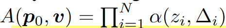
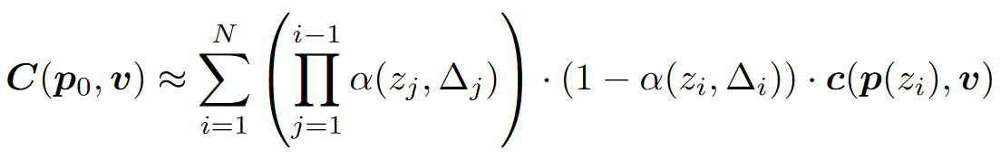

# 体积视频论文学习

* 表面渲染：渲染物品表面
* 体渲染：渲染粒子云
* 体素渲染：Minecraft

## (NIPS'20) Neural sparse voxel fields

不同于Nerf的另一种方向：本文是体素渲染+DNN；Nerf是体积渲染+DNN

* 场景划分为体素，每个体素8个顶点分配8个Embedding，体素内的任意点的Embedding由8个顶点Embedding插值得到，渲染任意点时合并8个Embedding作为MLP(Multi-layer Perceptron Network)输入，输出该点的颜色和占据概率
* 何谓之“稀疏”：训练时不包含场景信息的稀疏体素将被修剪

### 原理

对于体素集合$V=\{V_1,\dots,V_K\}$中的每个体素$V_i$，都定义一个函数$F_\theta^i$，其以体素中的点$\bm p\in V_i$为输入，输出颜色$\bm c$和概率密度$\sigma$：

$$
\begin{aligned}
    F_\theta^i&:(\bm g_i(\bm p), \bm v)\rightarrow(\bm c,\sigma)&\forall\bm p\in V_i\\
    g_i(\bm p)&=\zeta(\chi(\tilde{g_i}(\bm p_1^*),\dots,\tilde{g_i}(\bm p_8^*)))\\
    \mathcal V&=\{V_1,\dots,V_K\}
\end{aligned}
$$

其中，$g_i(\bm p)$表示其对输入的坐标进行了一些处理，具体是：
1. 将体素的顶点上存储的嵌入向量进行插值得到体素内坐标点$\bm p$处的嵌入向量：$\chi$表示插值函数，$\bm p_1^*,\dots,\bm p_8^*$表示体素$V_i$的8个顶点，$\tilde{g_i}(\bm p_i^*)$表示这8个顶点对应的嵌入向量（注意这里公式不严谨，不同的点$\bm p$插值出来的嵌入向量应该是不一样的，公式中没有体现）；
2. 位置编码：$\zeta$是位置编码，即对插值得到的坐标点$\bm p$处的嵌入向量进行位置编码；
3. DNN推断：位置编码后的$\bm p$点特征向量和光线方向一起输入到$F_\theta^i$中推断，输出输出颜色$\bm c$和概率密度$\sigma$。

#### Nerf是NSVF的特殊情况

坐标不转化成嵌入直接位置编码后输入的话：

$$\chi(\tilde{g_i}(\bm p_1^*),\dots,\tilde{g_i}(\bm p_8^*))=\bm p$$

$F_\theta^i$就变成：

$$F_\theta^i:(\zeta(\bm p), \bm v)\rightarrow(\bm c,\sigma)$$

就是Nerf里的DNN推断。

所以Nerf就是没有坐标嵌入的特殊情况。
反过来讲，NSVF就是把Nerf里的输入点改成输入基于体素计算出的嵌入向量，这些嵌入向量在训练中可以预先存入一些信息，从而使得输入到DNN里的信息更多。
此外，稀疏体素给NSVF带来的性能提升也可以在Nerf上实现，只要想办法把三维区域用体素包起来就能实现一样的稀疏体素ray marching了。

#### 体素存储颜色信息的渲染方案是NSVF的特殊情况

显然，如果$\tilde{g_i}(\bm p_i^*)$输出就是颜色：

$$\tilde{g_i}(\bm p_i^*):\tilde{g_i}(\bm p)\rightarrow(\bm c,\sigma)$$

并令$F_\theta^i$、$\zeta$、$\chi$都把输入做输出，那相当于就是每个体素存储一些颜色信息的方案（从不同方向看去颜色相同的点以体素为单位分别存储）。

Lombardi S, Simon T, Saragih J, et al. Neural volumes: Learning dynamic renderable volumes from images[J]. arXiv preprint arXiv:1906.07751, 2019.

### 估计透明度

本文定义的透明度为：

其中$(\bm p_0, \bm v)$是在用起点和方向表示一条光线，$A(\bm p_0, \bm v)$是这条光线上所有的采样点$\bm p$积累的透明度。结合上文写的体渲染公式：

可以看出这个透明度实际上就是：

$$A(\bm p_0, \bm v)=e^{-\sum_{k=1}^{N}\sigma_k \delta_k}$$

其实就是[Nerf体渲染公式](./体渲染.md)里背景光项$I_0T_{N+1}$中的$T_{N+1}$。回忆学习[体渲染](./体渲染.md)时对背景光项的理解，$T_{N+1}$来自于透射比，其值越小表示背景光中透过的光强越低。

### 渲染流程

1. 计算各条光线起点和方向
2. 体素交叉判断：AABB test找出每条光线与体素交叉的位置
3. 体素内采样：在与体素交叉的位置内部进行采样，得到待计算的各$\bm p$点
4. DNN推断：将采样出的各$\bm p$点按上述公式转为嵌入向量后输入DNN，得到$(\bm c,\sigma)$
5. 提前退出：借鉴“表面”的思想，当光线上积累的透明度$A(\bm p_0, \bm v)$跌至阈值$\epsilon$以下时，视为物体内部，立即停止计算
6. 体渲染：之后的操作同Nerf里的体渲染

背景光项里的透射比->用作透明度估计->判定物体表面->用于计算优化，这真是个天才的想法。
顺着光线的方向采样，当背景光无法透过的时候不就说明物体此时已经不透明了吗！
这简直是算法优化对物理过程的完美利用。
Nerf中的体渲染公式是没有体现背景光项的，作者一定对体渲染的公式有一个非常深刻的理解，并且知道Nerf里那个体渲染公式的推导过程，才能知道公式里实际上是忽略了这一项的。
作者把这一项找回来了不说，还顺着其的物理含义找到了一种能极大优化计算速度的方法。
很久没有体验这种茅塞顿开的感觉了。
佩服！

### 优势

因为体素是稀疏的，而且渲染时已知只有体素内有东西，所以只需要在光线与体素交叉的地方采样；并且还通过透明度$A(\bm p_0, \bm v)$估计和积累把采样控制在物体表面，所以：

1. 不需要像Nerf那样对光线上的所有点采样计算，极大节约计算成本；
2. 在体素内可以采样密度很高，有效提升计算精度。

总而言之，**在重点区域提升采样密度**，极大提高效率。
不过仔细想想这些东西其实也可以无缝迁移到Nerf上，毕竟前面也说了Nerf是个特殊情况。

### 损失函数

$$\mathcal L=\sum_{\bm p_0,\bm v}\|\bm C(\bm p_0,\bm v)-\bm C^*(\bm p_0,\bm v)\|^2+\lambda\Omega(A(\bm p_0,\bm v))$$

假定物体是不透明的，强迫$A(\bm p_0,\bm v)$降到0

### 训练流程

如何裁剪TBD

## (CVPR 2021 )Neural Geometric Level of Detail: Real-Time Rendering With Implicit 3D Shapes

英伟达首次实现实时Nerf渲染

## (ACM TC) Instant neural graphics primitives with a multiresolution hash encoding

NVIDIA 最新技术 5 秒训练 NERF

## (SIGGRAPH '22) Variable Bitrate Neural Fields

可变码率Nerf
