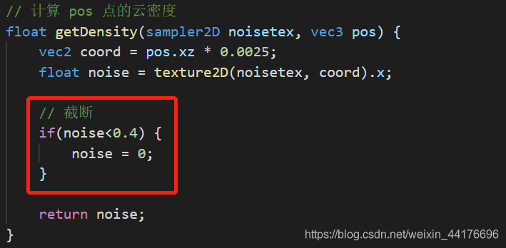
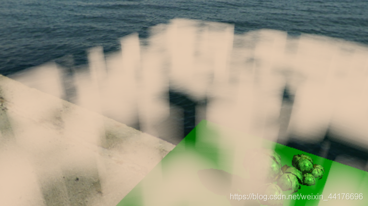
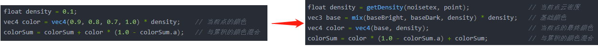

# 【转载】体积云渲染实战：ray marching，体积云与体积云光照

[原文在此](https://blog.csdn.net/weixin_44176696/article/details/113090350)

## 写在前面


今天来搞了赛艇的特效 ---- 体积云。第一次看见体积云还是在 Minecraft 的光影包里面，好像也是 SE 大大写的。。。当时因为硬件条件（买不起显卡）而没能享受到，今天重新在 OpenGL 中再自己做一次！先上效果图：

    


注：本篇博客的代码几乎都在 GLSL 中完成，与前面的博客的 c++ 代码无关，可以放心食用！


上一篇博客回顾：[OpenGL学习（十一）：延迟渲染管线](https://blog.csdn.net/weixin_44176696/article/details/112987749) 本来想写
    OpenGL学习（十二）的，可是一想体积云都是在 shader 里面写的，和 OpenGL 这套 API 没啥关系了，就改了标题。

<hr>

## ray marching 算法


与一般的实体绘制不同，体积云是一种无中生有的特效。因为体积云不是 cpu 传递三角面片信息给 GPU 而绘制的，相反，体积云是在 shader 中由算法生成的。


注意：体积云不是实体，也没有顶点信息，我们在片元着色器中进行渲染。此外，我们渲染体积云，其实是 **对云后面的像素颜色做计算** ！


渲染体积云的思路十分简单：在片元着色器中，我们负责对场景的每一个像素进行上色。如果一个像素被云遮挡，那么我们应该把它涂上云的颜色。如图描述了体积云的渲染流程：


于是问题变为求解视线方向和云朵有无相交。如果有，那么我们绘制上对应的颜色：


如果云朵是一个三角形，或者是其他规则的几何图形，比如球形，那么我们通过数学几何的方法，就能很好进行求交，可是偏偏云朵是不规则的，无法确定形状的 “体”，我们无法通过几何方法进行求交。ray marching
    算法帮助我们解决了不规则体的求交问题。

<hr>

ray marching 算法又名光线行进，在 [之前的博客](https://blog.csdn.net/weixin_44176696/article/details/111587679)
    中我简单讲过这种算法，并且用它来生成了一个 **体积光** 的特效作为大作业。今天来详细讲解。


ray marching 算法从摄像机开始，向世界空间投射光线，并且逐步行进，记录沿途的信息。比如我们沿途不断判断当前点是否在云层中，如果沿途至少有一点在云层中，我们认为视线和云层相交。下图描述了 ray marching
    算法的步进过程：


以上的思路是针对具有明确边界的【固体】进行的，但是云朵通常是用一种没有具体边界的【密度函数】来描述的。密度函数的输入是三维的坐标，输出是当前坐标的云朵的密度。于是每次采样我们累积云朵的密度，就可以知道当前光线穿越了多厚的云。二维下的算法图示如下：


 两条光线穿越厚度不同的云层，于是累积了不同的云密度。我们根据积累的密度，将云层的颜色和背景的颜色进行混合（时刻记得在任何 “体积”
    特效中，我们都是针对背景的像素进行着色！），这里需要用到透明混合的技巧。

<hr>

在 RGBA 色彩空间中，RGB 通道存储了颜色，而 A 通道则是透明度。已知背景的颜色为 bgColor，透明覆盖物的颜色为 cvColor，最终的颜色为 c，那么可以用如下的公式进行透明物体的颜色混合：

```
c = bgColor * (1.0 - cvColor.a) + cv.Color
```

此处 `1.0 - color.a` 为透明物体的 “不透明度”，比如透明度是 0.4，不透明度就是 0.6 。我们将不透明度乘以背景色，然后叠加透明物体的颜色即可！

<hr>

至此，我们知晓了 ray marching 的整个流程，下面我们来实现一个简单的 ray marching 以绘制带体积的物体，我们在指定范围内生成一个立方体。因为最基础的 ray marching 需要两个变量：

1. 当前片元的世界坐标：worldPos
2. 摄像机在世界空间下的位置：cameraPos

这里 cameraPos 不是眼坐标，不要搞混了。然后我们编写一个函数，执行 ray marching 算法：

```cpp
#define bottom 13   // 云层底部
#define top 20      // 云层顶部
#define width 5     // 云层 xz 坐标范围 [-width, width]

// 获取体积云颜色
vec4 getCloud(vec3 worldPos, vec3 cameraPos) {
    vec3 direction = normalize(worldPos - cameraPos);   // 视线射线方向
    vec3 step = direction * 0.25;   // 步长
    vec4 colorSum = vec4(0);        // 积累的颜色
    vec3 point = cameraPos;         // 从相机出发开始测试

    // ray marching
    for(int i=0; i<100; i++) {
        point += step;
        if(bottom>point.y || point.y>top || -width>point.x || point.x>width || -width>point.z || point.z>width) {
            continue;
        }
        
        float density = 0.1;
        vec4 color = vec4(0.9, 0.8, 0.7, 1.0) * density;    // 当前点的颜色
        colorSum = colorSum + color * (1.0 - colorSum.a);   // 与累积的颜色混合
    }

    return colorSum;
}
```

首先朝视线方向 direction 投射光线，然后沿途记录光线是否在指定的盒子中，如果在，那么我们积累颜色，并且进行颜色混合。注意这里我们的 ray marching
    是 **从摄像机出发** ，在代公式的时候我们要注意：

1. 当前点的颜色 color，是背景色 bgColor
2. 累积的颜色 colorSum，是覆盖物的颜色 cvColor

于是有：

```cpp
colorSum = colorSum + color * (1.0 - colorSum.a);   // 与累积的颜色混合
```

这样的混合公式。不要搞错了。。。


最后我们在片元着色器的 main 中添加如下的调用， **其中 fColor 是片元着色器输出的颜色** 。同样，云的颜色是公式中的 cvColor，而背景色是公式中的 bgColor，于是有：

```cpp
vec4 cloud = getCloud(worldPos, cameraPos); // 云颜色
fColor.rgb = fColor.rgb*(1.0 - cloud.a) + cloud.rgb;    // 混色
```

我们可以看到，一个立方体被绘制了出来：


注意到每次采样，我们都认为当前点的密度为 0.1，然后均匀地叠加颜色，所以我们渲染出来的 “体” 是一个规则的立方体。如果我们随即地改变每次采样的密度，就可以得到形状不规则的云了！

<hr>

这里还要引入两个小优化。因为我们的云层是在有效范围 `[bottom, top]`
    内才会生成，而测试却从相机原点开始投射光线。假设摄像机在云层下方，那么从相机开始到云层底部这一段路绝对不会有云，我们可以直接 pass。我们将采样原点移动至云层底部即可：


 

 根据相似三角形法则，我们可以这么挪：


 于是在计算完起始点 point 之后，我们马上执行如下代码：

```cpp
// 如果相机在云层下，将测试起始点移动到云层底部 bottom
if(point.y<bottom) {
    point += direction * (abs(bottom - cameraPos.y) / abs(direction.y));
}
// 如果相机在云层上，将测试起始点移动到云层顶部 top
if(top<point.y) {
    point += direction * (abs(cameraPos.y - top) / abs(direction.y));
}
```

此外，还有一个问题，就是目前的云层会不正确地遮挡本应该遮挡云层的物体，比如树明明在云层之下，却被云层遮挡了。尤其是我们增大云层的范围 width 的时候：


出现这个问题的原因是我们没有判断当前片元和云层之间的关系。解决方案也很简单，通过距离来判断：


知道原理就可以进行操作了。在平移采样点之后，我们加入：

```cpp
// 如果目标像素遮挡了云层则放弃测试
float len1 = length(point - cameraPos);     // 云层到眼距离
float len2 = length(worldPos - cameraPos);  // 目标像素到眼距离
if(len2<len1) {
    return vec4(0);
}
```

可以看到现在云层与物体的遮蔽关系能够被正确地描绘：


 最终的 ray marching 代码如下：

```cpp
#define bottom 13   // 云层底部
#define top 20      // 云层顶部
#define width 40    // 云层 xz 坐标范围 [-width, width]

// 获取体积云颜色
vec4 getCloud(vec3 worldPos, vec3 cameraPos) {
    vec3 direction = normalize(worldPos - cameraPos);   // 视线射线方向
    vec3 step = direction * 0.25;   // 步长
    vec4 colorSum = vec4(0);        // 积累的颜色
    vec3 point = cameraPos;         // 从相机出发开始测试

    // 如果相机在云层下，将测试起始点移动到云层底部 bottom
    if(point.y<bottom) {
        point += direction * (abs(bottom - cameraPos.y) / abs(direction.y));
    }
    // 如果相机在云层上，将测试起始点移动到云层顶部 top
    if(top<point.y) {
        point += direction * (abs(cameraPos.y - top) / abs(direction.y));
    }

    // 如果目标像素遮挡了云层则放弃测试
    float len1 = length(point - cameraPos);     // 云层到眼距离
    float len2 = length(worldPos - cameraPos);  // 目标像素到眼距离
    if(len2<len1) {
        return vec4(0);
    }

    // ray marching
    for(int i=0; i<100; i++) {
        point += step;
        if(bottom>point.y || point.y>top || -width>point.x || point.x>width || -width>point.z || point.z>width) {
            break;
        }
        
        float density = 0.1;
        vec4 color = vec4(0.9, 0.8, 0.7, 1.0) * density;    // 当前点的颜色
        colorSum = colorSum + color * (1.0 - colorSum.a);   // 与累积的颜色混合
    }

    return colorSum;
}
```

这里还额外添加了一个福利：因为我们手动将采样点移动到贴近云层底层或者顶层的地方，于是我们一旦发现采样超出云层范围，就直接 break 掉，能够节省更多的计算量：


## 通过噪声图生成云朵


在上文，我们讨论到只要在每次采样的时候，将每一点的密度随机化（即我们从云朵的密度函数中取值）就可以生成随机的云朵形状。那么现在的问题就是云朵密度函数的获取了！


随机数在编程语言里面非常常见，不管是 python 的 random 还是 c++ 的 uniform_distribution，可是 GLSL 中我们没这好待遇，于是我们需要从 cpu
    中生成，我们以噪声图（纹理）的形式将一张图上面摆满随机数，并且传递给 GPU，这样我们在 shaders 中就可以使用随机数了。。。


云朵是在一定范围内比较连续的图形，一般的离散噪声还不足以生成云朵。理论上我们要生成一张  **连续**  的噪声图，比如柏林噪声或者别的，但是这里我 <s>没有学过信号与系统</s>
    ，我也不会写生成噪声图的代码（再度摆烂），于是我直接使用了现成的图片：


    
>注：
>
> 这图是从 minecraft 中生成的，在 final 着色器中直接输出光影 mod 生成噪声图然后截图保存的
> 
> <s>又是 mc</s>

这张图片在边缘也是连续的，这意味着在 c++ 读取纹理时，设置了纹理环绕方式为 REPEAT 之后，超出纹理的采样可以被连续地映射回纹理。这是好的！


我们通过简单的 c++ 代码就可以加载噪声图，前提是安装了 SOIL2 库：

```cpp
// 加载噪声图
glGenTextures(1, &noisetex);
glBindTexture(GL_TEXTURE_2D, noisetex);
glTexParameteri(GL_TEXTURE_2D, GL_TEXTURE_MIN_FILTER, GL_LINEAR);
glTexParameteri(GL_TEXTURE_2D, GL_TEXTURE_MAG_FILTER, GL_LINEAR);
glTexParameteri(GL_TEXTURE_2D, GL_TEXTURE_WRAP_S, GL_REPEAT);
glTexParameteri(GL_TEXTURE_2D, GL_TEXTURE_WRAP_T, GL_REPEAT);
int textureWidth, textureHeight;
unsigned char* image = SOIL_load_image("textures/noisetex2.png", &textureWidth, &textureHeight, 0, SOIL_LOAD_RGB);
glTexImage2D(GL_TEXTURE_2D, 0, GL_RGB, textureWidth, textureHeight, 0, GL_RGB, GL_UNSIGNED_BYTE, image);   // 生成纹理
delete[] image;
```

然后将噪声图传递到着色器：

```cpp
// 传阴噪声纹理
glActiveTexture(GL_TEXTURE6);
glBindTexture(GL_TEXTURE_2D, noisetex);
glUniform1i(glGetUniformLocation(composite0, "noisetex"), 6);
```

>注：
>
> 这里传递到任意的纹理单元都可，只是我这里按照顺序排下来是 6 号

接下来在着色器中添加：

```cpp
uniform sampler2D noisetex;
```

即可访问噪声纹理！

<hr>

在使用了噪声图之后，我们就可以根据采样点的世界坐标，手动采样噪声图，同时返回该点的云密度。我们编写一个函数 getDensity 来获取某一点的云密度：

```cpp
// 计算 pos 点的云密度
float getDensity(sampler2D noisetex, vec3 pos) {
    vec2 coord = pos.xz * 0.0025;
    float noise = texture2D(noisetex, coord).x;
    return noise;
}
```

随后我们将 getCloud 中的密度计算，由：

```cpp
float density = 0.1;
```

改为：

```cpp
float density = getDensity(noisetex, point) * 0.1;
```

其中 0.1 是为了防止积累的颜色过亮导致看不出差别。最后别忘了在 getCloud 的形参中，加入一个 sampler2D 以传递噪声图给函数。再次运行程序，我们看到：


 唔。。。与其说是云，不如说是雾！  **云朵的明显特征是云朵之间有间隔，而不是像上图那样相当连续且饱满。**  下面我们改变密度的生成方式，来逼近云朵。


<hr>

注意到我们使用的柏林噪声是连续的，但是如果我们以一定的阈值去截取，即认为一旦噪声图数据小于某个值，就认为它是0.这意味着有如下的云密度函数，我们通过按照阈值截取，可以生成不连续的密度函数：


我们在计算云密度之前，对云的密度进行截断：




 再次加载程序，可以看到云层像一块奶酪一样，被挖了各种洞洞，其中空缺的地方对应噪声图中数值小于 0.4 的部分：




 云朵水平方向的形状是有了，可是竖直方向上，像被直直地切了一刀，并不是云朵的椭圆型。我们希望将云朵调整成椭圆型：


    我们根据高度，对密度进行调整即可。位于云层中部的密度最大，而位于 bottom 和 top 附近的采样应当获取更小的密度。我们将密度计算函数 getDensity 改为：

```cpp
#define bottom 13   // 云层底部
#define top 20      // 云层顶部
#define width 40    // 云层 xz 坐标范围 [-width, width]

// 计算 pos 点的云密度
float getDensity(sampler2D noisetex, vec3 pos) {
    // 高度衰减
    float mid = (bottom + top) / 2.0;
    float h = top - bottom;
    float weight = 1.0 - 2.0 * abs(mid - pos.y) / h;
    weight = pow(weight, 0.5);

    // 采样噪声图
    vec2 coord = pos.xz * 0.0025;
    float noise = texture2D(noisetex, coord).x;
    noise *= weight;

    // 截断
    if(noise<0.4) {
        noise = 0;
    }

    return noise;
}
```

这里先把高度决定的权重映射到 `[0, 1]` 范围，然后开根号，最终进行权重的计算。不要在意那个开根号（二分之一幂）因为这是调参数调的，我认为比较好看。


重新加载程序，我们得到了一个人模狗样的结果！现在云朵终于圆润了：


 显然云朵的细节不够丰富，这是因为我们直接采样噪声图，频率太低，对应云朵非常平缓的边缘。我们尝试利用多个采样的噪声来进行多次采样并且合并出最终的结果。

<hr>

关于多次采样噪声。。。我没学过信号与系统，无法解释这个现象，但是就是有效（逃


开始抄代码（摆烂）我们对噪声进行多次采样，就可以获得一些有丰富细节的高频噪声。我们将 getDensity 中对噪声图的采样增加几次：


>注：
>
> 上述采样参数来自 Minecraft 的光影包 Chocapic13_V5_Extreme
>
> c13 大大早期作品
>
> OTL

<s>你可能会说怎么又偷 mc 的？答案是塞拉斯大招转好了</s> 然后重新加载程序，现在的云拥有更多的细节了：


 距离炒鸡逼真（并不）的体积云只差一步，下面我们将进行光照的绘制！


## 云朵光照效果的绘制


体积云的光照分为两个部分：

1. 基础颜色
2. 光照明暗颜色

其中基础颜色由累积的密度决定，而光照敏感颜色则取决于云与光源的相对位置。基础颜色所决定的是云的散射光，即云层越厚的地方，要越昏暗，而云层薄的地方则稍亮。在开始之前，我们预设一组颜色变量如下：

```cpp
#define baseBright  vec3(1.26,1.25,1.29)    // 基础颜色 -- 亮部
#define baseDark    vec3(0.31,0.31,0.32)    // 基础颜色 -- 暗部
#define lightBright vec3(1.29, 1.17, 1.05)  // 光照颜色 -- 亮部
#define lightDark   vec3(0.7,0.75,0.8)      // 光照颜色 -- 暗部
```

他们分别是基础颜色和光照颜色的亮暗部分，待会我们会根据密度对亮暗颜色进行混合。马上开始编程！

<hr>

先从基础颜色开始绘制。基础颜色根据云的密度决定当前云的颜色，那么我们根据当前采样点的密度，对基础颜色进行线性混合即可。此外每一次采样积累的颜色的 **亮度** ，还要取决于该点的密度，于是将 ray
    marching 中的累积颜色的代码改为：

```cpp
float density = getDensity(noisetex, point);                // 当前点云密度
vec3 base = mix(baseBright, baseDark, density) * density;   // 基础颜色
vec4 color = vec4(base, density);                           // 当前点的最终颜色
colorSum = color * (1.0 - colorSum.a) + colorSum;           // 与累积的颜色混合
```

即：
 



重新加载程序，可以看到基础颜色的绘制。在云层比较厚的地方呈现暗色，而云层薄的地方则亮一些：


 好！接下来我们进行光照云颜色的绘制。

<hr>

想要知道一点的亮度，我们就得知道这一点到光源之间隔了多厚的云层。我们从该点出发，朝着光源方向投射射线，再积累一次密度，就能最准确的知道当前点距离光源还隔了多少云。如图：


 但是这个方法的复杂度是 n 方，因为每一次采样我们都要重新执行一次 ray marching。总所周知在计算机中 n 方的算法是爬着走的，于是我们引入优化。


我们没有必要精确地计算每一点到光源到底间隔了多少云，因为现实中在强阳光的照射下，云的渲染总是一半黑一半白，换句话说，云的光照具有 **二值性** ，经典非黑即白：


那么我们通过一次采样就够了。我们朝着光源的方向，仅做一次采样，然后计算两点的密度差，以此粗略地估计云的颜色。原理如下：


 于是我们将刚才的颜色积累的代码改为：

```cpp
// 采样
float density = getDensity(noisetex, point);                // 当前点云密度
vec3 L = normalize(lightPos - point);                       // 光源方向
float lightDensity = getDensity(noisetex, point + L);       // 向光源方向采样一次 获取密度
float delta = clamp(density - lightDensity, 0.0, 1.0);      // 两次采样密度差

// 控制透明度
density *= 0.5;

// 颜色计算
vec3 base = mix(baseBright, baseDark, density) * density;   // 基础颜色
vec3 light = mix(lightDark, lightBright, delta);            // 光照对颜色影响

// 混合
vec4 color = vec4(base*light, density);                     // 当前点的最终颜色
colorSum = color * (1.0 - colorSum.a) + colorSum;           // 与累积的颜色混合
```

即：
 
 别忘了在 getCloud 函数的形参列表中加入一个 lightPos 表示光源在世界空间下的坐标。此外，这里偷偷加了一个小
    trick，就是在计算光照颜色之前，控制一下透明度以达到更好的效果（否则透过云层难以看到背景）


重新加载程序，我们看到云对于光照有了响应，那只巨大的鸭子模型表示了光源的位置：


注：这种判断方法其实是有误差的，但是实际效果还不错，而且可以模拟云层背光时候，边缘透光的真实效果，故采用之。此外，向着光源进行采样，我们偏移的步长越大，云朵能够透光的 “边缘”
    也就越大，这个参数要根据你生成云朵的空间范围大小自己调整。


## 优化与改进


在这一步，我们的体积云已经勉强能看了（虽然写的真的非常 shit


 虽然还有很多优化与改进的空间，比如性能的优化，品质的优化等等，毕竟 ray march 非常依赖 GPU
    的计算能力。但是由于篇幅有限，以下内容 **不一定会完全实现** 这些改进，而是探讨问题所在与大致的解决方案。因为不同的方案可以适用于不同的运用场合。。。

>注：
>
> 翻译过来就是：摆烂了，后面的我不会了，不写了，就嗯编
>
> 编辑下，又肝了一天。下文的优化基本都实现了

<hr>

### 云层移动


我们希望云层飘动。于是我们在 c++ 中传递 uniform 给着色器，每一帧累加一个变量，以此间接地作为 “时间”，然后我们根据当前时间，在采样噪声图的时候添加一个偏移，因为噪声图是连续的，我们可以模拟云层飘动的效果。


在 c++ 端我们这么做：

```cpp
int frameCounter = 0;

...

// 传递帧计数器
frameCounter++;
if (frameCounter == INT_MAX)
{
    frameCounter = 0;
}
glUniform1i(glGetUniformLocation(composite0, "frameCounter"), frameCounter);
```

然后在采样噪声的时候我们以 frameCounter 作为偏移量进行采样即可，此处我们只对 x 做偏移，所以云会朝着 x 方向移动：


 最终效果如下：


 通过改变常数（就是那个
    0.0001）可以调整云的移动速度。此外这里我偷懒了，这里使用的是每一帧都++ 的计数器，那么在不同的设备上会有不同的速率，最优的方法应该是计算每一帧的时间，然后提供一个固定 trick 的计数器。。。

<hr>

### 云层内正确的遮挡关系


还记得上文我们用距离来计算云层与物体的遮挡关系吗？在大多数情况下都是行得通的，但是如果你把云层调整到和物体一个水平，那么就会有
    bug，我们可以穿透物体看到其后面的云，这种 **遮挡一半的关系我们没有正确地处理** 。如图：


 于是会有如下的鬼畜的效果：


解决方案也很简单，我们在 ray march
    的时候，每一步都判断光线是否和物体相交。判断的方式是通过深度纹理。将世界坐标转换到屏幕坐标，然后根据当前屏幕坐标采样深度纹理，如果采样深度 **小于** 测试深度，说明命中实体，此时应该停止 ray
    march。


所以需要如下的 uniform 变量：

```cpp
// 透视投影近截面 / 远截面
uniform float near;
uniform float far;

// 视图，投影矩阵
uniform mat4 view;
uniform mat4 projection;

// 屏幕深度纹理
uniform sampler2D gdepth;
```

此外，需要额外的一个负责函数帮助我们判断，因为透视投影的深度是非线性的：

```cpp
// 屏幕深度转线性深度
float linearizeDepth(float depth) {
    return (2.0 * near) / (far + near - depth * (far - near));
}
```

最后在 ray march 的 for 循环中加入如下的判断条件：

```cpp
// 转屏幕坐标
vec4 screenPos = projection * view * vec4(point, 1.0);
screenPos /= screenPos.w;
screenPos.xyz = screenPos.xyz * 0.5 + 0.5;

// 深度采样
float sampleDepth = texture2D(gdepth, screenPos.xy).r;    // 采样深度
float testDepth = screenPos.z;  // 测试深度

// 深度线性化
sampleDepth = linearizeDepth(sampleDepth);
testDepth = linearizeDepth(testDepth);

// hit 则停止
if(sampleDepth<testDepth) {
    break;
}
```

现在正常了：


    可以看到物体和云层的部分遮挡关系。当物体插入云层的时候，只会显示前方的云。

<hr>

### 可变步长的采样


在上文中每次采样我们选择固定 0.25 作为步长，迭代 100 次，那么最大范围就是 25
    的距离。想要增大云层的范围我们就必须增大【步长与迭代次数的乘积】，我们也可以增大步长，从而减小迭代次数，但代价是云的品质会降低。下图展示了 4 中步长与迭代次数的组合带来的效果变化：


因为远处的云朵对细节的要求没有那么高，我们可以在近处使用低步长，在远处的采样使用高步长，以弥补采样次数过少的我、不足。下面提供一种简单的可变步长的写法：

```cpp
// ray marching
for(int i=0; i<50; i++) {
    point += step * (1.0 + i*0.05);

	....
}
```

通过线性增大每一次采样的步长，我们可以使用更少的采样次数，就可以达到凑合的效果。下面是使用了 50 次迭代的结果，与 100 次迭代相比，品质差距不是很大，但是性能却提升了：


注：这里可变步长仅是一个经验公式，需要根据场景的大小尺寸自行定义。此外，仅通过步长变化减少迭代次数并不是最优的优化方式。如果你的显卡足够强劲那么可以无视这个优化。

<hr>

### 分层步进的采样


注意到一个问题，当视线非常 **平行** 于云层的时候，远处的云会有缺失：


 原理也很简单，因为我们的 ray marching 是固定步长，这意味着会有一个固定的生成距离，以摄像机为圆心，半径为 R
    的球内的云层才会被生成。而当我们平视云层的时候，ray marching 不足以走完整个云层，于是必定会发生缺失：


 解决方案也很简单，我们在 y 轴方向上，对采样的步长做一个投影。换句话说，就是使得 **不管视线方向如何变化，每一次采样我们都在 y
        方向上行走固定的距离** ，如图：


 我们将每次步进的代码改为：

```cpp
point += step / abs(direction.y);
```

即可，这样每次步进都会在 y 方向上前进 1 单位的距离，即使我们把云的生成范围 **增大十倍** ，最远处也不会发生云的缺失，因为所有光线都能走完云层，但是代价是因为巨大的步长造成的采样品质的下降。


这种方法适合于摄像机不会超出云层的场景。如果一定要渲染在云中穿行的效果，那么还是老老实实一步一步执行 ray marching 吧。。。

<hr>

### 3D噪声


<s>我没有学过信号与系统，我只会抄代码，我爬</s> ，关于 3D 噪声的生成，我直接照抄了 [szszss大佬的博客](http://blog.hakugyokurou.net/?p=1630)，而据他（她？）所言该方法又来自于 [iq 大佬在 shadertoy 发表的某篇博客](https://www.shadertoy.com/view/4sfGzS)，总之我是看不懂了，抄就完事了（经典摆烂


将噪声生成的代码 copy 上：

```cpp
float noise(vec3 x)
{
    vec3 p = floor(x);
    vec3 f = fract(x);
    f = smoothstep(0.0, 1.0, f);
     
    vec2 uv = (p.xy+vec2(37.0, 17.0)*p.z) + f.xy;
    float v1 = texture2D( noisetex, (uv)/256.0, -100.0 ).x;
    float v2 = texture2D( noisetex, (uv + vec2(37.0, 17.0))/256.0, -100.0 ).x;
    return mix(v1, v2, f.z);
}
 
float getCloudNoise(vec3 worldPos) {
    vec3 coord = worldPos;
    coord *= 0.2;
    float n  = noise(coord) * 0.5;   coord *= 3.0;
          n += noise(coord) * 0.25;  coord *= 3.01;
          n += noise(coord) * 0.125; coord *= 3.02;
          n += noise(coord) * 0.0625;
    return max(n - 0.5, 0.0) * (1.0 / (1.0 - 0.5));
}
```

然后重新启动程序，可以看到 3D 噪声的效果还是非常惊艳的，能够更进一步逼近现实中的云：


能用 3D 噪声还是用上。。。毕竟比较真实。我尝试着 copy SE 大大体积云光影里面的 3D 噪声，可惜无奈他代码写的太乱，再加上参数不对口，我嗯是没调出来好的效果。。。这里就不放了


此外，我在 GitHub 上面找到了另一种 3D 噪声的实现，因为没有效果图，我就没 copy，这里放上 [链接](https://github.com/martinrgb/gles30_programmingguide_ndk/wiki/3d%E5%99%AA%E9%9F%B3%E7%BA%B9%E7%90%86%EF%BC%9A3d-noise-texture)
    来，有兴趣可以康康

<hr>

### 摩尔纹的解决


摩尔纹是因为浮点精度不足造成的。如果你是使用累积颜色的方式输出最后的颜色值，而不是混合颜色的话，就会出现摩尔纹。摩尔纹将最终的图形以圆圈的形式分隔开来，因为浮点精度不足，相似方向的 vec3
    会被认为是同一个方向，于是就会出现圆形的分隔带。


虽然在渲染体积云的时候没有出现，但是我上学期做大作业的时候确实遇到过这种现象，如图：

    


解决方案也很简单，使用 **随机步长进行采样** 即可。随机数从噪声图中获取即可。值得注意的是，随机步长会带来噪点，可以通过后处理阶段对体积云进行一次高斯模糊进行解决。

<hr>

### 低分辨率采样与LOD


因为云通常是非常模糊的东西，我们没有必要对每个像素都进行 ray march，相反，我们可以只对屏幕上的某些像素进行 ray march，比如左下角 1/4
    的像素，得到一张低分辨率的体积云图像，然后在最终合成的时候，再将低分辨率的图像采样到屏幕上。


相比于使用 1920×1080 的完全分辨率进行采样，下 1/4 的采样能够节省很多的计算量。1920×1080 总共需要调用 2073600次 ray marching，而下 1/4 采样的分辨率是 480×270，需要
    129600 次 ray march，整整少了一个数量级！我们可以把宝贵的计算能力节省下来。


Minecraft 早期的体积云光影就是这么做的，如果你贴近观察，就会发现其实体积云是非常模糊的：


 此外，也可以叠加多个不同分辨率下计算的体积云图像，作为最终的输出，也能够达到很好的效果。这个思想叫做 LOD，Level Of Detail，[在 shadertoy 上有一篇 iq 大佬的代码](https://www.shadertoy.com/view/XslGRr) 就是通过这个思想，取了 4
    个不同的分辨率，最后进行叠加，你敢信这是他 2013 年写的代码？你说是照片我都信：


 注意到云仍然模糊并且品质非常高，而且使用 LOD 带来的性能提升是明显的。我的电脑能跑到 60 fps 了

<hr>

### 云阴影


在原神中就有实现，因为我 <s>是狗罕见</s> 电脑带不动，我没下游戏，于是偷了一张截图：


有三种实现方法，首先是根据世界坐标的 xz 轴，直接去云的噪声图中采样，并且判断当前位置是否有云，有则涂黑。我估计原神就使用了这种方法，优点是简单且快速。


其次可以从光源方向直接做一次光线求交，注意是求交不是 ray march，这样可以实时地让云阴影响应光源位置的变化。


第三种方法就是最逼真的，我们从光源方向进行 ray march 以获取实际云层的厚度，同时可以根据厚度涂黑地面。优点是逼真，缺点是计算开销。当然也可以通过降分辨率进行优化，这里就不详细讨论了。。。


<s>什么？你想看代码？我懒得写了，再度摆烂</s>

<hr>

## 着色器代码
    
>注：
>
> 这里我只给出最基本的 ray march + 光照的代码，在、方便移植
>
>  **不包含**  上文【改进与优化】部分的代码

着色器输出：

```cpp
out vec4 fColor;
```

uniform 变量声明：

```cpp
uniform sampler2D noisetex;     // 噪声纹理

uniform vec3 lightPos;  // 光源位置
uniform vec3 cameraPos; // 相机位置
```

函数定义：

```cpp
#define bottom 13   // 云层底部
#define top 20      // 云层顶部
#define width 40    // 云层 xz 坐标范围 [-width, width]

#define baseBright  vec3(1.26,1.25,1.29)    // 基础颜色 -- 亮部
#define baseDark    vec3(0.31,0.31,0.32)    // 基础颜色 -- 暗部
#define lightBright vec3(1.29, 1.17, 1.05)  // 光照颜色 -- 亮部
#define lightDark   vec3(0.7,0.75,0.8)      // 光照颜色 -- 暗部

// 计算 pos 点的云密度
float getDensity(sampler2D noisetex, vec3 pos) {
    // 高度衰减
    float mid = (bottom + top) / 2.0;
    float h = top - bottom;
    float weight = 1.0 - 2.0 * abs(mid - pos.y) / h;
    weight = pow(weight, 0.5);

    // 采样噪声图
    vec2 coord = pos.xz * 0.0025;
    float noise = texture2D(noisetex, coord).x;
	noise += texture2D(noisetex, coord*3.5).x / 3.5;
	noise += texture2D(noisetex, coord*12.25).x / 12.25;
	noise += texture2D(noisetex, coord*42.87).x / 42.87;	
	noise /= 1.4472;
    noise *= weight;

    // 截断
    if(noise<0.4) {
        noise = 0;
    }

    return noise;
}

// 获取体积云颜色
vec4 getCloud(sampler2D noisetex, vec3 worldPos, vec3 cameraPos, vec3 lightPos) {
    vec3 direction = normalize(worldPos - cameraPos);   // 视线射线方向
    vec3 step = direction * 0.25;   // 步长
    vec4 colorSum = vec4(0);        // 积累的颜色
    vec3 point = cameraPos;         // 从相机出发开始测试

    // 如果相机在云层下，将测试起始点移动到云层底部 bottom
    if(point.y<bottom) {
        point += direction * (abs(bottom - cameraPos.y) / abs(direction.y));
    }
    // 如果相机在云层上，将测试起始点移动到云层顶部 top
    if(top<point.y) {
        point += direction * (abs(cameraPos.y - top) / abs(direction.y));
    }

    // 如果目标像素遮挡了云层则放弃测试
    float len1 = length(point - cameraPos);     // 云层到眼距离
    float len2 = length(worldPos - cameraPos);  // 目标像素到眼距离
    if(len2<len1) {
        return vec4(0);
    }

    // ray marching
    for(int i=0; i<100; i++) {
        point += step;
        if(bottom>point.y || point.y>top || -width>point.x || point.x>width || -width>point.z || point.z>width) {
            break;
        }

        // 采样
        float density = getDensity(noisetex, point);                // 当前点云密度
        vec3 L = normalize(lightPos - point);                       // 光源方向
        float lightDensity = getDensity(noisetex, point + L);       // 向光源方向采样一次 获取密度
        float delta = clamp(density - lightDensity, 0.0, 1.0);      // 两次采样密度差

        // 控制透明度
        density *= 0.5;

        // 颜色计算
        vec3 base = mix(baseBright, baseDark, density) * density;   // 基础颜色
        vec3 light = mix(lightDark, lightBright, delta);            // 光照对颜色影响

        // 混合
        vec4 color = vec4(base*light, density);                     // 当前点的最终颜色
        colorSum = color * (1.0 - colorSum.a) + colorSum;           // 与累积的颜色混合
    }

    return colorSum;
}
```

main 函数：

```cpp
vec3 worldPos = ...;	// 想办法弄到当前片元的世界坐标，可以是深度重建或者读坐标纹理

...

vec4 cloud = getCloud(noisetex, worldPos, cameraPos, lightPos); // 云颜色
fColor.rgb = fColor.rgb*(1.0 - cloud.a) + cloud.rgb;    // 混色
```

## 总结


经过不懈的努力，我们终于得到了一个还凑合的体积云渲染，也了解了体积渲染的一些工作流程和常识。下次有时间我把它移植到 mc 里面，下次再说吧，咕！

    

