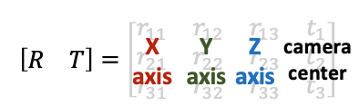

# 【摘抄】相机的内外参数

相机的位置和朝向由相机的外参（extrinsic matrix）决定，投影属性由相机的内参（intrinsic matrix）决定。

注意：接下来的介绍假设矩阵是列矩阵(column-major matrix)，变换矩阵左乘坐标向量实现坐标变换（这也是OpenCV/OpenGL/NeRF里使用的形式）。

## 相机外参

相机外参是一个4x4的矩阵$M$，其作用是将世界坐标系的点$P_{world}=[x,y,z,1]$变换到相机坐标系$P_{camera}=MP_{world}$下。我们也把相机外参叫做world-to-camera (w2c)矩阵（注意用的是4维的齐次坐标，如果不了解齐次坐标系请自行查阅相关资料）。

相机外参的逆矩阵被称为camera-to-world (`c2w`)矩阵，其作用是把相机坐标系的点变换到世界坐标系。因为NeRF主要使用`c2w`，这里详细介绍一下`c2w`的含义。`c2w`矩阵是一个4x4的矩阵，左上角3x3是旋转矩阵$R$，右上角的3x1向量是平移向量$T$。

$$
\left[
\begin{array}{l}
R&T\\
0&1
\end{array}
\right]
=
\left[
\begin{array}{l}
r_{11}&r_{12}&r_{13}&t_1\\
r_{21}&r_{22}&r_{23}&t_2\\
r_{31}&r_{32}&r_{33}&t_3\\
0&0&0&1
\end{array}
\right]
$$

有时写的时候可以忽略最后一行$[0,0,0,1]$。

$$
\left[
\begin{array}{l}
R&T\\
\end{array}
\right]
=
\left[
\begin{array}{l}
r_{11}&r_{12}&r_{13}&t_1\\
r_{21}&r_{22}&r_{23}&t_2\\
r_{31}&r_{32}&r_{33}&t_3\\
\end{array}
\right]
$$

刚刚接触的时候，对这个c2w矩阵的值可能会比较陌生。其实c2w矩阵的值直接描述了相机坐标系的朝向和原点：



具体的，**旋转矩阵的第一列到第三列分别表示了相机坐标系的X, Y, Z轴在世界坐标系下对应的方向；平移向量表示的是相机原点在世界坐标系的对应位置**。

如果这段描述还是有点抽象，可以尝试进行下列计算帮助自己理解。刚刚讲到c2w是将相机坐标系的向量变换到世界坐标系下，那我们如果将c2w作用到(即左乘)相机坐标系下的X轴[1,0,0,0]，Y轴[0,1,0,0], Z轴[0,0,1,0]，以及原点[0,0,0,1]（注意方向向量的齐次坐标第四维等于0，点坐标第四维等于1），我们会得到它们在世界坐标系的坐标表示：

$$
\begin{aligned}
\left[\begin{array}{l}R&T\end{array}\right]
\left[
\begin{array}{l}
1\\
0\\
0\\
0\\
\end{array}
\right]
=
\left[
\begin{array}{l}
r_{11}\\
r_{21}\\
r_{31}\\
\end{array}
\right]
\end{aligned}
$$

$$
\begin{aligned}
\left[\begin{array}{l}R&T\end{array}\right]
\left[
\begin{array}{l}
0\\
1\\
0\\
0\\
\end{array}
\right]
=
\left[
\begin{array}{l}
r_{12}\\
r_{22}\\
r_{32}\\
\end{array}
\right]
\end{aligned}
$$

$$
\begin{aligned}
\left[\begin{array}{l}R&T\end{array}\right]
\left[
\begin{array}{l}
0\\
0\\
1\\
0\\
\end{array}
\right]
=
\left[
\begin{array}{l}
r_{13}\\
r_{23}\\
r_{33}\\
\end{array}
\right]
\end{aligned}
$$

$$
\begin{aligned}
\left[\begin{array}{l}R&T\end{array}\right]
\left[
\begin{array}{l}
0\\
0\\
0\\
1\\
\end{array}
\right]
=
\left[
\begin{array}{l}
t_{1}\\
t_{2}\\
t_{3}\\
\end{array}
\right]
\end{aligned}
$$

从上面可以看到可以看到，将c2w作用到相机坐标系下的X轴、Y轴、 Z轴、以及原点我们会依次得到c2w的四列向量。

## 相机内参

刚刚介绍了相机的外参，现在简单介绍一下相机的内参。


相机的内参矩阵将相机坐标系下的3D坐标映射到2D的图像平面，这里以针孔相机(Pinhole camera)为例介绍相机的内参矩阵$K$：

$$
K=
\left[
\begin{array}{l}
f_x&0&c_x\\
0&f_y&c_y\\
0&0&1
\end{array}
\right]
$$

内参矩阵$K$包含4个值，其中$f_x$和$f_y$是相机的水平和垂直焦距（对于理想的针孔相机，$f_x=f_y$）。焦距的物理含义是相机中心到成像平面的距离，长度以像素为单位。$c_x$和$c_y$是图像原点相对于相机光心的水平和垂直偏移量。$c_x$，$c_y$有时候可以用图像宽和高的$1/2$近似:

```python
#  NeRF run_nerf.py有这么一段构造K的代码
    if K is None:
        K = np.array([
            [focal, 0, 0.5*W],
            [0, focal, 0.5*H],
            [0, 0, 1]
        ])
```
