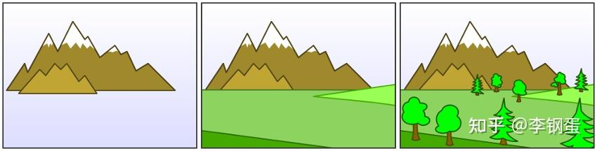

# 【转载】Spatial Hash Function 空间哈希函数

最近在渲染加速的这个领域研究，遇到了一些检测碰撞的方法，包括暴力解法，八叉树，AABB树等。暴力解法基本就是一个for循环来做，效率很低；而八叉树这类算法的问题在于代码量很长，不易于维护。今天主要来聊一下基于空间哈希的碰撞检测。而空间哈希可以是2D的哈希或者是3D的哈希。

拿2D来说，在 2D 游戏中，您都必须知道绘制的顺序。您通常从场景的后面绘制到前面，较早的对象被后面的对象覆盖。 这是用于表示画布（数字或其他）深度的标准画家算法。



做到这一点的最直接方法是将所有对象放入一个大数组中，并按它们的深度排序。 所以在上面的场景中，你的数组看起来像：`[Mountain, Ground, Tree1, Tree2, Tree3, ... ]`。而这样做的问题在于，没有简单的方法可以在任何给定时刻找出屏幕上的对象。 为此，您需要遍历整个数组并检查每个对象。 如果您有一个大型游戏世界，其中许多对象存在于屏幕之外并且不应该被渲染或更新，这通常会成为一个问题，造成渲染的速度很慢。而空间哈希表是一种存储对象以避免此问题的方法。 使用哈希的巧妙之处在于，无论游戏世界有多大，它总是需要花费固定的时间来确定屏幕上的对象$\mathcal O(1)$。

现在大多数游戏引擎实际上不会让您尝试它们如何在内部构造对象，但是如果您在控制绘图调用的环境中进行编程（OpenGL 引擎），这可能是值得实现的东西。

下面来进入正题。空间哈希只是一个哈希表，其中每个键都是 2D 坐标，值是该区域中的游戏对象列表。当然这个键值可以去定义的，在Optimized Spatial Hashing for Collision Detection of Deformable Objects (2003)这篇文章中，就是用了整体的XOR操作来获取键值。


想象一下，你的世界被分割成一个网格，每个对象至少属于一个单元格。 如果你在 JavaScript 中实现了这个，你会如何在位置 (420,600) 查找一些东西：

```js
var X,Y = 420,600;
//Snap X and Y to the grid 
X = Math.round(X / CELL_SIZE) * CELL_SIZE;
Y = Math.round(Y / CELL_SIZE) * CELL_SIZE;
//Now check what elements are in that position
spatialHash[X+","+Y] //this is a list of objects in that cell
```

如果是直接暴力求解的话，你需要访问空间中每个物体，即使它离的那个位置很远，这很浪费计算有没有。但是在哈希表中，你可以把对应物体用如下方式插入到对应的表中，而在碰撞检测中只去看对应的物体。

```js
var X = 420;
var Y = 600;
for(var i=0;i<gameObjects.length;i++){
 var dx = Math.abs(gameObjects[i].x - X);
 var dy = Math.abs(gameObjects[i].y - Y);
 if(dx < CELL_SIZE && dy < CELL_SIZE){
 //Object is in the area!
 }
}
```

那么如何编写哈希碰撞检测呢？基本上是以下的步骤：

 **设置哈希表** 

在这里唯一要提到的一件事是在选择单元格大小方面有一些讲究。 一般来说，让你的单元格比你的平均物体大两倍似乎效果很好。 如果您的单元格太大，那么每次查找都会引入太多对象。 如果它们太小，那么您将不得不检查更多单元格以覆盖您想要的区域。

```js
var spatialHash = {};
var CELL_SIZE = 60;
```

 **在哈希中添加和删除对象** 。将对象添加到哈希表中只需将其捕捉到单元格，如果不存在则创建单元格数组，然后将其添加到该数组中。

```js
spatialHash.add = function(obj){
 var X = Math.round(obj.x / CELL_SIZE) * CELL_SIZE;
 var Y = Math.round(obj.y / CELL_SIZE) * CELL_SIZE;
 var key = X + "," + Y;
 if(spatialHash[key] == undefined) spatialHash[key] = []
 
 spatialHash[key].push(obj)
}
```


一种特殊情况是，一个单一物体横跨了多个单元格，解决方案就是将它添加到它接触到的所有单元格中。 这保证了如果对象的任何部分在视图中，那么它将被渲染。 （当然，您还需要确保不会多次渲染这些对象。）

 **收集任何给定区域的对象** 。给定屏幕上的一个区域，您希望能够在其中获取所有对象。您需要做的就是根据您的相机在游戏世界中的位置开始遍历所有单元格，并将所有子列表收集到一个数组中进行渲染。 以下是相关的 JavaScript：

```js
var padding = 100; //Padding to grab extra cells around the edges so the player doesn't see objects "pop" into existence.
var startX = -camX - padding;
var startY = -camY - padding;
var endX = -camX + canvas.width + padding;
var endY = -camY + canvas.height + padding;
var onScreen = []
for(var X = startX; X < endX; X += CELL_SIZE){
 for(var Y = startY; Y < endY; Y += CELL_SIZE){
 var sublist = spatialHash.getList(X,Y)
  if(sublist != undefined) {
  onScreen = onScreen.concat(sublist)
  }
 }
}
```

 **在渲染对象之前按深度对对象进行排序** 。

放弃包含全部物体的列表也意味着放弃了方便的深度排序。 我们根据它们的位置从网格中抓取对象，但是我们得到的数组没有以任何方式排序。作为渲染前的最后一步，我们必须根据某个键对数组进行排序。 我给每个对象一个深度值，所以我可以这样做：

```js
onScreen.sort(function(a,b){ return a.depth > b.depth })
for(var i=0;i<onScreen.length;i++){
 var obj = onScreen[i];
 obj.update();
 obj.draw();
}
```

这是此方法的缺点之一，您必须对每一帧屏幕上的内容进行排序。 您始终可以通过确保对所有子列表进行排序来加快速度，这样您就可以在连接时合并它们以保持顺序。


参考资料：
* [Redesign Your Display List With Spatial Hashes](https://gamedevelopment.tutsplus.com/tutorials/redesign-your-display-list-with-spatial-hashes--cms-27586)
* [https://matthias-research.github.io/pages/publications/tetraederCollision.pdf](https://matthias-research.github.io/pages/publications/tetraederCollision.pdf)
