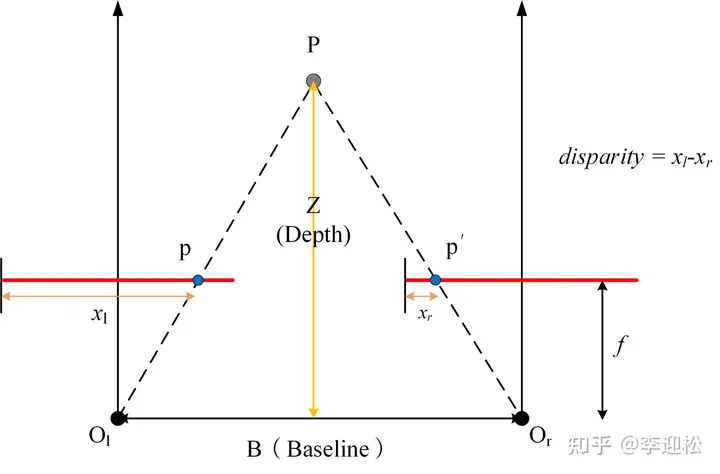

# 【摘抄】视差图、深度图、点云

[原文](https://zhuanlan.zhihu.com/p/522285892)

## 视差（disparity）

视差 $d$ 等于同名点对在左视图的列坐标减去在右视图上的列坐标，是**像素单位**。$d=x_l-x_r$

立体视觉里，视差概念在极线校正后的像对里使用。

## 深度（depth）

深度 $D$ 等于像素在该视图相机坐标系下 $Z$ 坐标，是**空间单位**。

深度并不特在校正后的图像对里使用，而是任意图像都可获取深度图。

## ？？？

但是这是双目视觉里的视差，和Nerf里的深度`depth_map`和视差`disp_map`有点不一样，Nerf里的深度和视差到底是什么意思？还需学习。但从代码里看Nerf里`depth_map`和`disp_map`生成出来实际上没有用上。还需要进一步学习。