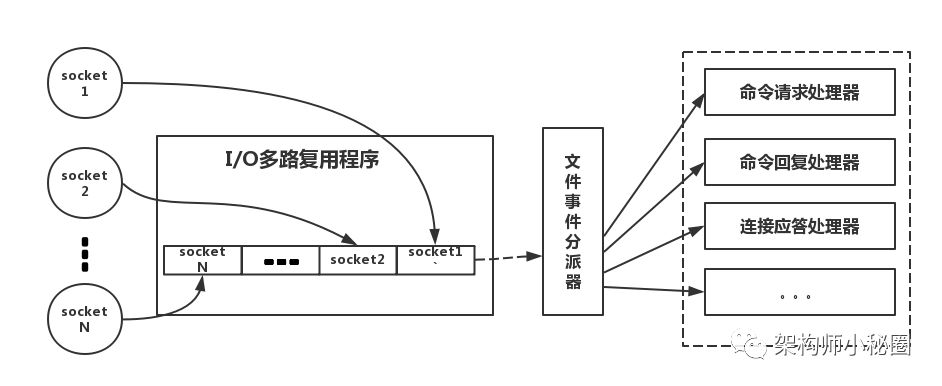

# Redis

[推荐Blog](https://www.cnblogs.com/bigben0123/p/9115597.html)

## 单线程的redis为什么这么快

主要是以下三点

* 纯内存操作
* 单线程操作，避免了频繁的上下文切换
* 采用了非阻塞I/O多路复用机制

## I/O多路复用机制是什么



* 一个多路复用程序监听端口
* 多个请求连接到达时，通过跟踪多个socket的状态控制多个IO操作

不用多线程并发模型接受连接的原因：

* 线程间的协调耗时长

## Redis value的数据类型

Redis是key-value数据库，key是string，value类型有多种

### String

* Redis 最基本的数据类型，一个 key 对应一个 value
* SET, GET 等命令

### Hash

* Redis hash 是一个键值(key=>value)对集合。
* Redis hash 是一个 string 类型的 field 和 value 的映射表，hash 特别适合用于存储对象。
* HMSET, HGET 等命令
* 存储、读取、修改用户属性

### List

* Redis List是简单的字符串列表，按照插入顺序排序。
* 你可以添加一个元素到列表的头部（左边）或者尾部（右边）。
* LPUSH, RPUSH 等命令
* 最新消息排行等功能(比如朋友圈的时间线)；消息队列

### Set

* Redis的Set是string类型的无序集合，不允许重复的成员。
* 重复的插入将被忽略。
* 集合是通过哈希表实现的，所以添加，删除，查找的复杂度都是O(1)。
* SADD, SMEMBERS 等命令，有交并补等功能
* 共同好友；利用唯一性，统计访问网站的所有独立ip；好友推荐时求交集

### zset(sorted set)

* Redis zset 和 set 一样也是string类型元素的集合，不允许重复的成员。
* 每个元素在插入时都必须关联一个double类型的分数。redis正是通过分数来为集合中的成员进行从小到大的排序。
* ZSADD 等命令
* 排行榜；带权重的消息队列

## Redis清内存

### 定期删除

每100ms**随机**地检查一些key看是否过期，过期则删除

（如果每次检查都查全部的key会卡卡卡）

### 惰性删除

请求获取key的时候检查是否过期

### 内存淘汰策略

在redis.conf中有一行配置

```conf
maxmemory-policy volatile-lru
```

* noeviction：当内存不足以容纳新写入数据时，新写入操作会**报错**。**用的不多**
* allkeys-lru：当内存不足以容纳新写入数据时，在键空间中，**移除最近最少使用**的key。**用的比较多**
* allkeys-random：当内存不足以容纳新写入数据时，在键空间中，**随机移除**某个key。**用的不多**
* volatile-lru：当内存不足以容纳新写入数据时，**在设置了过期时间的键空间**中，**移除最近最少使用**的key。这种情况一般是把redis既当缓存，又做持久化存储的时候才用。
* volatile-random：当内存不足以容纳新写入数据时，**在设置了过期时间的键空间**中，随机移除某个key。
* volatile-ttl：当内存不足以容纳新写入数据时，**在设置了过期时间的键空间**中，**有更早过期时间**的key优先移除。

## redis和数据库双写一致性问题

* 双写一致性只能保证**最终一致性**，不能保证**强一致性**
* 如果对数据有强一致性要求，不能放缓存
* 采取正确更新策略，先更新数据库，再更新缓存

## 缓存穿透问题

黑客故意请求缓存中不存在的数据，导致所有的请求都怼到数据库上，从而数据库连接异常。

解决方法：

1. 互斥锁：缓存失效的时候，先去获得锁，得到锁了，再去请求数据库。没有则休眠一段时间重试，保证一次只有一个请求到达数据库
2. 异步更新策略：无论key是否取到值，都直接返回，不去访问数据库。更新缓存的程序放在别的进程里面。需要**缓存预热**(项目启动前，先加载缓存)
3. 提供一个能迅速判断请求是否有效的拦截机制

## 缓存雪崩问题

因为过期时间相同，大量的缓存在同一时间过期，这个时候又来了一波请求，结果请求都怼到数据库上，从而导致数据库连接异常。

解决方法：

1. 还是上面的互斥锁：这种方法有用但是会导致性能大幅下降
2. 给缓存时间加随机值，避免大量同时失效
3. 双缓存：两个缓存，缓存A有失效时间，缓存B没有失效时间。
   * 从缓存A读数据，有则直接返回，没有就下一步
   * 从缓存B读数据，并且启动更新操作同时更新AB

## 并发SET问题

同时有多个子系统去set一个key

解决方法：参考操作系统里面学的进程同步

* 没有顺序的操作：设一个锁，抢到锁的才能SET
* 有顺序的操作：设几个锁，按步骤来的操作依次抢锁.比如要使一个值按照1👉2👉3的顺序变化。这种时候我们在数据写入数据库的时候，需要保存一个时间戳。假设时间戳如下：
  * 系统A key 1 {valueA  3:00}
  * 系统B key 1 {valueB  3:05}
  * 系统C key 1 {valueC  3:10}

那么，假设这会系统B先抢到锁，将key1设置为{valueB 3:05}。接下来系统A抢到锁，发现自己的valueA的时间戳早于缓存中的时间戳，那就不做set操作了。以此类推。
