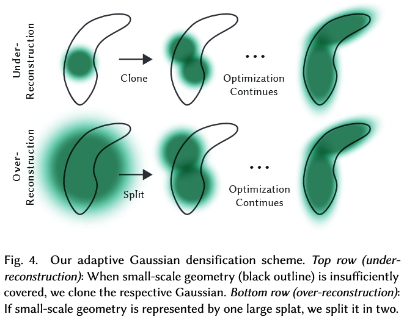

# 3D Gaussian Splatting

前置知识：[多元正态分布](../数学/多元高斯分布.md)

## Splatting

抛雪球算法的英文名称为Splatting方法，也称为足迹法（Footprint），它与光线投射法不同，是反复对体素的投影叠加效果进行运算。它用一个称为足迹的函数计算每一体素投影的影响范围，用高斯函数定义点或者小区域像素的强度分布，从而计算出其对图像的总体贡献，并加以合成，形成最后的图像。由于这个方法模仿了雪球被抛到墙壁上所留下的一个扩散状痕迹的现象，因而取名为“抛雪球法”。

## 光栅化 Rasterization

## $\alpha$-Blending

## 如何表示Gaussian点

### 1D → 3D？

论文原文对3D高斯（3D Gaussians）的定义不太直观，笔者计划从高（中）数（学）角度开始梳理。1D高斯即正态分布：

$$N_{\mu ,\sigma}\left( x \right) =\frac{1}{\sqrt{2\pi}\sigma}e^{-\frac{\left( x-\mu \right) ^2}{2\sigma ^2}}$$

其图像为一个单钟形对称曲线，均值$\mu$控制对称轴进而控制图形位置，标准差$\sigma$控制密度集中程度。对一段$x$区间进行积分可以得到分布中的数据落在这一区间的概率，其中绝大多数落在$\left[ \mu -3\sigma ,\mu +3\sigma \right]$（概率：0.9974）。

从其形式可知，高斯分布只有两个参数$\mu,\sigma$，所以一组$\mu,\sigma$可以确定一个1D高斯分布函数，进而对应一条1D线段$\left[ \mu -3\sigma ,\mu +3\sigma \right]$，其位置决定于$\mu$、长度决定于$\sigma$，通过改变$\mu,\sigma$可以表达1D数轴上不同位置和长度的线段。

同样的思想，二维高斯分布的图形是一个椭圆，三维高斯分布的图形是一个**椭球**，这个椭球分别以xyz轴对称。概率论中学的三元正态分布函数通常写成：

$$N_{\mu _x,\sigma _x,\mu _y,\sigma _y,\mu _z,\sigma _z}\left( x,y,z \right) =\frac{1}{\sqrt{2\pi} ^3\sigma _x\sigma _y\sigma _z}\exp \left( -\frac{\left( x-\mu _x \right) ^2}{2{\sigma _x}^2}-\frac{\left( y-\mu _y \right) ^2}{2{\sigma _y}^2}-\frac{\left( z-\mu _z \right) ^2}{2{\sigma _z}^2} \right)$$

这个形式其实是这三个变量为**互不相关的独立变量**且**椭球的坐标系和世界坐标系平行**的情况。
但在本文中的3D Gaussian点可以旋转，所以它的对称轴（后文称为 **模型坐标系** ）不一定和世界坐标系重叠，
复习[多元正态分布](../数学/多元高斯分布.md)中的知识可以回忆起来，对称轴不和世界坐标系重叠的多元正态分布意味着各随机变量相互之间并不是独立变量。

### 3D Gaussian点思想来源

首先复习[多元正态分布](../数学/多元高斯分布.md)联合概率密度函数：

$$p(x_1, \cdots, x_n) = \frac{1}{(2 \pi)^{\frac{n}{2}} \left| \Sigma \right|^{\frac{1}{2}}} \cdot e^{-\frac{1}{2} \cdot [(\vec{X} - \vec{\mu})^\top \Sigma^{-1}(\vec{X} - \vec{\mu})]}$$

三维的情况，用$\bm x=[x,y,z]^T$表示三维空间中的坐标：

$$p(\bm x) = \frac{1}{\sqrt{2\pi}^3\det(\Sigma)} \cdot e^{-\frac{1}{2}(\bm x - \bm\mu)^T \Sigma^{-1}(\bm x - \bm\mu)}$$

此时协方差矩阵$\Sigma$为：

$$\Sigma=
\left[ \begin{matrix} 
	\sigma _{x}^{2}&		\mathrm{Cov}\left( x,y \right)&		\mathrm{Cov}\left( x,z \right)\\
 	\mathrm{Cov}\left( y,x \right)&		\sigma _{y}^{2}&		\mathrm{Cov}\left( y,z \right)\\
 	\mathrm{Cov}\left( z,x \right)&		\mathrm{Cov}\left( z,y \right)&		\sigma _{z}^{2}\\
\end{matrix} \right]$$

### “3D Gaussians” 3D Gaussian点

就像给3个顶点能表达任意一个3D三角形，研究者自然希望构筑的基础元素能覆盖足够多样的几何，而多元正态分布能涵盖空间中任意形状任意位姿（包括平移旋转）的椭球：

$$G_s\left(\bm x \right) = \frac{1}{\sqrt{2\pi}^3\det(\Sigma)} \cdot e^{-\frac{1}{2}(\bm x - \bm\mu)^T \Sigma^{-1}(\bm x - \bm\mu)}$$

其中$\bm\mu$是椭球中心（控制世界空间位置平移），协方差矩阵$\Sigma$控制椭球在3轴向的伸缩和旋转（模型坐标系），协方差矩阵的特征向量就是椭球对称轴。

论文中则是这样定义：

$$G\left(\bm x \right) =e^{-\frac{1}{2}\left(\bm x \right) ^T\Sigma ^{-1}\left(\bm x \right)}$$

和标准形式对比可以看到去掉了指数部分前面的尺度系数（不影响椭球几何）；默认模型坐标中心在坐标系原点，方便旋转放缩，放入世界坐标系时再加上平移。

### 如何表示Gaussian点的颜色

用[球谐函数](./球谐函数.md)来表示每个高斯的颜色 ，以正确捕捉场景的视角相关外观。

## 如何训练Gaussian点云

### 如何训练Gaussian点参数

按照论文中的定义，Gaussian点的参数只有$\Sigma$，其决定了椭球的形状和对称轴方向，不决定椭球的位置。
椭球的位置有另外的训练方法。

训练过程就是用渲染图和原图比较计算视野中高斯点的矩阵$\Sigma$的梯度，然后梯度下降调$\Sigma$。

其梯度计算原理比较复杂，需学习
[3D Gaussian Splatting中的数学推导](./3D高斯数学推导.md)
，
相关方法主要来自于论文
Matthias Zwicker, Hanspeter Pfister, Jeroen Van Baar, and Markus Gross. 2001a. **EWA volume splatting**. *In Proceedings Visualization*, 2001. VIS’01. IEEE, 29–538.

### 如何训练Gaussian点位置

位置梯度

### 如何增加Gaussian点

需要增加Gaussian点的区域分两种：

* “欠重构区”(under-reconstruction)：缺少Gaussian点的区域
* “过重构区”(over-reconstruction)：每个Gaussian点覆盖很大范围的区域

寻找这些区域：

* “欠重构区”(under-reconstruction)：位置梯度很大但值很小的Gaussian点
* “过重构区”(over-reconstruction)：位置梯度很大且值很大的Gaussian点

增加Gaussian点：

* “欠重构区”(under-reconstruction)：复制这个Gaussian点，再沿位置梯度进行移动
* “过重构区”(over-reconstruction)：减小这个Gaussian点的值，再复制这个Gaussian点，再沿位置梯度进行移动

### 如何减少Gaussian点

减少Gaussian点主要是为了：

* 删除不重要的Gaussian点以减小计算量
* 应对相机面前的错误点(floaters close to the input cameras)

减少Gaussian点的方法：

* 删除不重要的Gaussian点以减小计算量：在训练过程中会有一些Gaussian点的透明度不断下降到小于给定阈值，这些Gaussian点在训练过程中删除
* 应对相机面前的错误点：
  1. 每隔一段时间就将所有Gaussian点的透明度设为0
  2. 禁用点的增减和移动功能，仅对Gaussian点的参数进行一段时间训练
     * 有些Gaussian点会在训练过程中变大，盖住其他点或者盖住相机，删除这些点
  3. 训练完成后会有一些Gaussian点透明度仍然接近0，删除这些点

#### 相机面前的错误点(floaters close to the input cameras)是什么

理论上讲，在每个输入视角面前摆上输入图片，就可以让NeRF训练误差降到0。
这也是NeRF的一种过拟合，正因为如此，NeRF在训练过程中会有概率在输入视角附近训练出一些错误点。
尤其是在相机参数的有误差的时候，输入图像上的某些点时无解的，这是如果用DNN较大的NeRF进行过度的训练，NeRF不管怎么样都没法在场景中找到某些点的最优解，就会将点放在相机面前。

## 可微的Gaussian点云快速光栅化方法
