# 3DGS转Mesh方法汇总 - 3DGS+SDF/UDF联合优化

3DGS+SDF/UDF联合优化 -> 对SDF/UDF [Marching Cubes](MarchingCube.md) -> Mesh

## NeuSG：让 GS 提供细节，让 SDF 提供连续表面和法线

Gaussian 点云细节丰富，但不连续且有噪声；SDF 连续完整，但容易过平滑。让两种表示互相纠错，比单独使用任何一种都好。

NeuSG是3DGS和一种Implicit Surfaces方法NeuS的结合。

和[PGSR](3D高斯深度渲染.md)一样，NeuSG也设置了一个loss强制拉低最短轴长并以最短轴长作为法线方向。
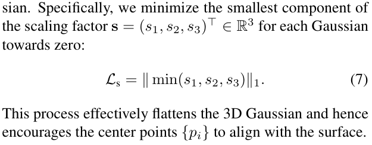
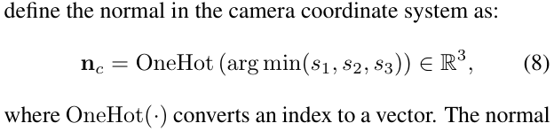
并且使用SDF的梯度方向约束3DGS渲染的法线方向。
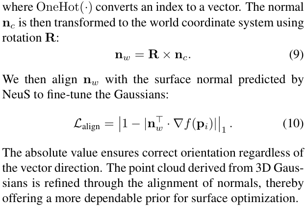
另外，还用3DGS中点位置约束SDF，使其在这些位置处值为0，其实就是把3DGS约束在NeuS的表面上。
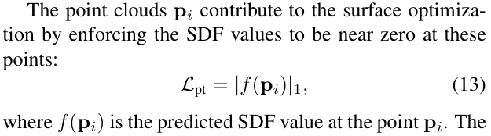
当然NeuS自己的loss也都保留。
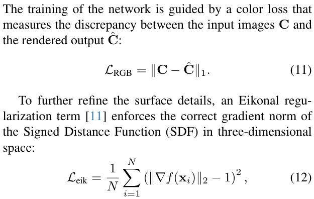
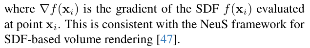

NeuS和3DGS的RGB loss是分开算了加在一起的。
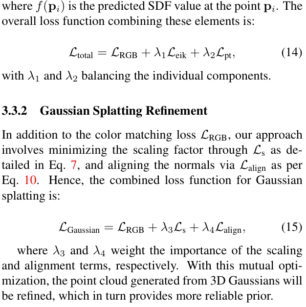

可以看出，作为3DGS+SDF联合优化的早期工作，NeuSG的本质就是在NeuS和3DGS分别优化的基础上加上了用NeuS梯度方向约束3DGS法线方向和把3DGS约束在NeuS的表面上这两个loss。

虽然简单但是已经能体现处联合优化Mesh质量的思想。

## (NeurIPS 2024) GSDF：让 3DGS 提供细节，让 SDF 提供连续表面和法线

相比于 NeuSG 只加两个loss，GSDF 更近一步让 3DGS 和 SDF 紧密结合，让 3DGS 和 SDF 互相参与对方的训练流程。

**Depth-guided Sampling**：
GSDF 观察到，SDF 的采样是渲染过程的性能瓶颈，而 3DGS 恰好可以提供“何处有实体”的信息。
所以，GSDF 直接将 SDF 渲染的采样过程限制在 3DGS 附近，降低采样范围从而节约 SDF 渲染计算量。

**Geometry-aware Density Control**：
SDF 还能在 3DGS Densify 过程中减少飞点。
因为 SDF 能提供表明信息，所以可以直接看 3DGS 中心的 SDF 值就知道它距离表面的距离，越远越有可能是飞点，则不应该在 3DGS Densify 过程中被 split，甚至应该被删除。

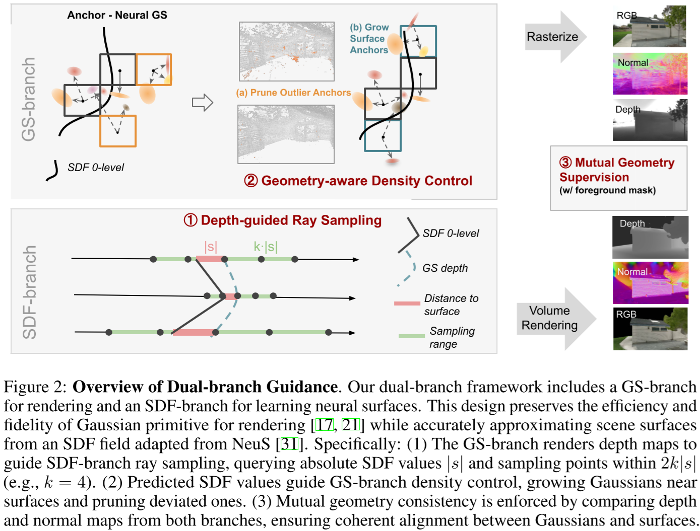

**Mutual Geometry Supervision**：
两个loss，一个要求3DGS和SDF渲染出的法线一致，一个要求其深度一致。

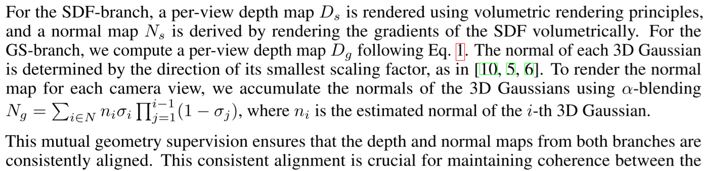

注意 GSDF 虽然也是取短轴方向作为法线方向，但是并没有加loss把 3DGS 压扁。

GSDF 提出的 Mutual Geometry Supervision 是后来 GS+SDF 几乎都沿用的框架。

## (SIGGRAPH Asia 2024, ACM TOG) 3DGSR 把 SDF 真正嵌入到 Gaussian 里面

GSDF 里面 GS 和 SDF 还是两套比较独立的表示，它们之间联系太松了。有没有办法把 SDF 真正嵌入到 Gaussian 里面？

### Differentiable SDF-to-opacity transformation

一句话：用3DGS 中心点处的 SDF 值作为 3DGS 的透明度值。

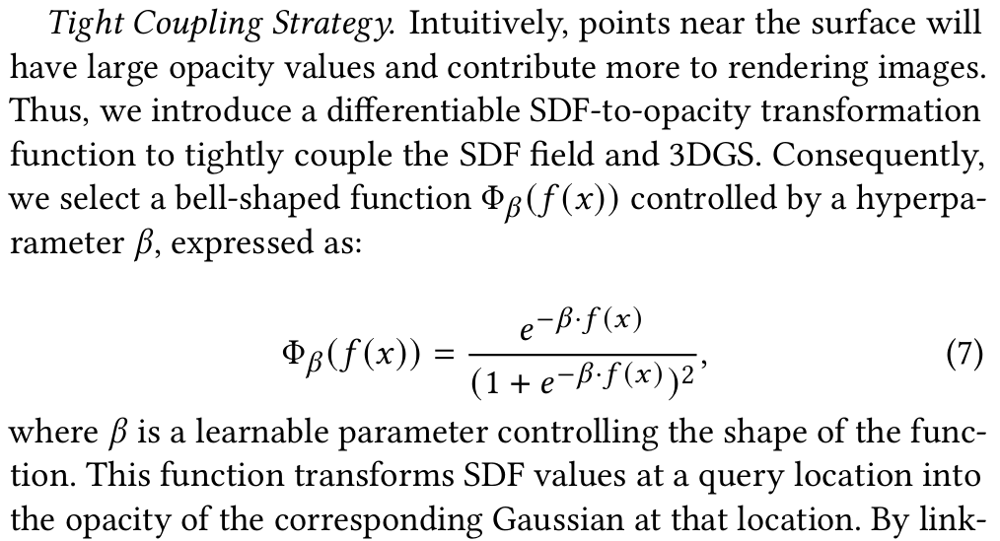

### uses surface derived from SDF to constrain the distribution of Gaussians

一样的取3DGS短轴方向作为法线方向，一样的要求3DGS和SDF渲染出的法线一致。

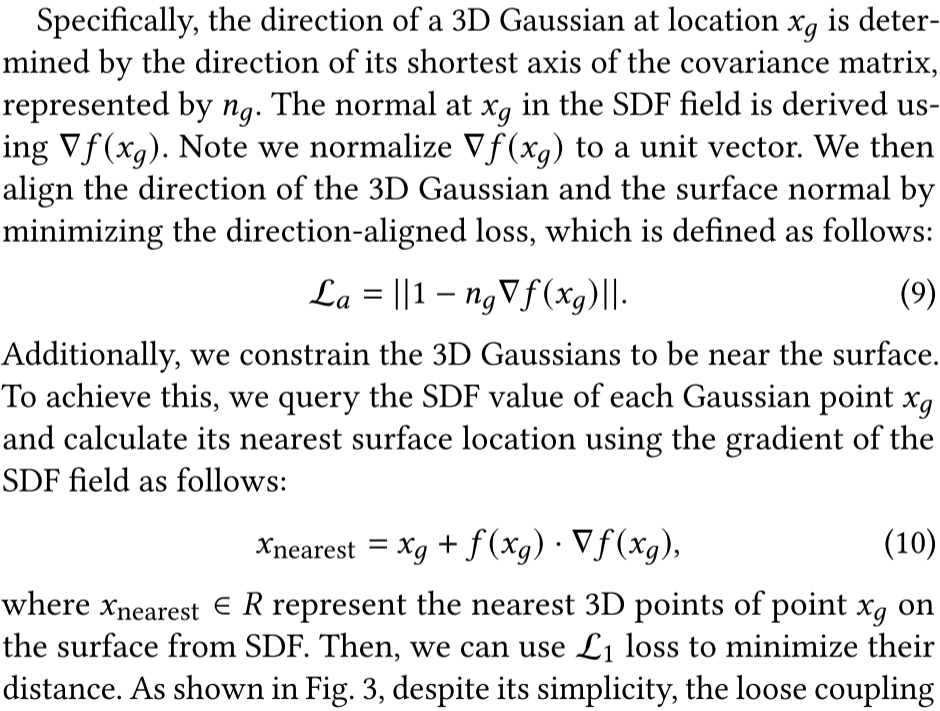

### Regularization with Volumetric Rendering

Differentiable SDF-to-opacity transformation 是把一个点上的SDF值转换成 3DGS 的透明度，这也就意味着 SDF 只有这个点上的值得到了训练。
而 3DGS 又是稀疏的，所以造成 sparse supervisory signals。
为了解决这个问题，还得把原来 SDF 原装的整个 Volumetric Rendering 过程搬过来做训练。

这里作者就直接用 SDF 经过 Volumetric Rendering 出来的深度和法向量和 3DGS 的深度和法向量算 loss。

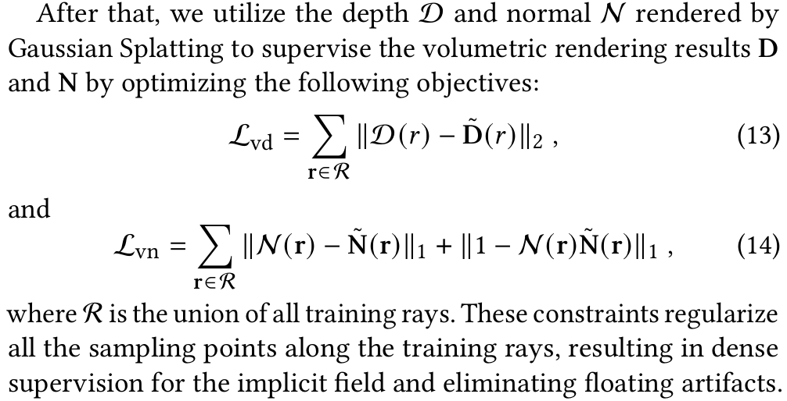

作者特地分析了不用 SDF 渲染颜色而只要深度的原因：
* 运算速度更快
* 收敛速度更快

## (CVPR 2025 Highlight) GaussianUDF

## (CVPR 2024) SuGaR: 先得到 mesh，再把 Gaussian 粘到三角面上
