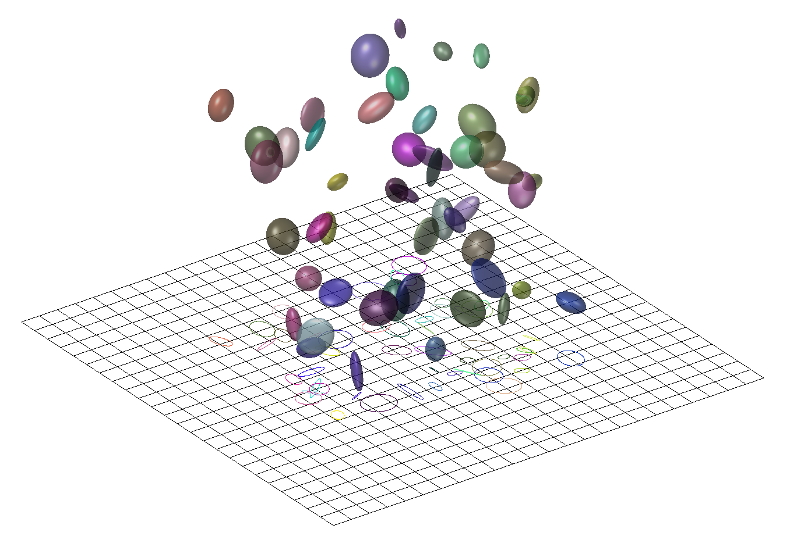

# 详解3D Gaussian Splatting CUDA Kernel：反向传播（一）`BACKWARD::render`

3D高斯前向传播和反向传播的CUDA代码调用栈很类似，都是`RasterizeGaussiansBackwardCUDA`(`RasterizeGaussiansCUDA`)->`backward`(`forward`)->`render/preprocess`，其中的各种初始化过程也都大差不差，看懂了上一篇[前向传播的代码解析](./3D高斯代码解析.md)的调用栈这反向传播的调用栈也自然就懂，不做赘述，我们直接从`render`和`preprocess`开始看：

回忆[上一篇](./3D高斯代码解析.md)中的前向传播过程（`CudaRasterizer::Rasterizer::forward`函数）。
预处理函数`FORWARD::preprocess`计算每一个高斯球投影出来的圆半径及覆盖的范围，其输入高斯球参数和相机位姿，计算每个高斯球的3D协方差`geomState.cov3D`、在该相机视角下的2D协方差逆矩阵`geomState.conic_opacity[0:3]`(`geomState.conic_opacity`共四项最后一项是透明度参数)、高斯球中心在成像平面上的位置`geomState.means2D`、距成像平面的深度`geomState.depths`、并用球谐系数算出高斯球在该相机视角下的颜色`geomState.rgb`等。
之后就是对高斯球按tile和深度排序等操作，然后进入`FORWARD::render`函数，以预处理计算好的`geomState.conic_opacity`、`geomState.means2D`、`geomState.rgb`等为输入，按照深度顺序对高斯球进行alpha blending得到最终的渲染图。

`BACKWARD::preprocess`和`BACKWARD::render`分别对应这两个过程的反向传播。
它们在`CudaRasterizer::Rasterizer::backward`里的调用过程也是反着的，先调用`BACKWARD::render`计算高斯球在成像平面上的2D协方差矩阵和颜色等项的梯度，再调用`preprocess`计算各高斯球参数的梯度。



## 对渲染过程的反向传播`BACKWARD::render`

`BACKWARD::render`对`grid`个tile各启动`block`(16x16x1)个线程，即每个像素一个线程运行`renderCUDA`：
```cpp
void BACKWARD::render(
	const dim3 grid, const dim3 block,
	const uint2* ranges,
	const uint32_t* point_list,
	int W, int H,
	const float* bg_color,
	const float2* means2D, // 高斯球投影在像平面上的2D均值位置
	const float4* conic_opacity, // 高斯球投影在像平面上的2D协方差矩阵（叠加透明度）
	const float* colors, // 高斯球在该相机视角下的颜色
	const float* final_Ts,
	const uint32_t* n_contrib,
	const float* dL_dpixels, // 从Pytorch中传过来的渲染图上每个像素的梯度
	float3* dL_dmean2D, // 高斯球投影在像平面上的2D均值位置的梯度（待求解）
	float4* dL_dconic2D, // 高斯球投影在像平面上的2D协方差矩阵（不叠加透明度）的梯度（待求解）
	float* dL_dopacity, // 高斯球透明度的梯度（待求解）
	float* dL_dcolors) // 高斯球颜色的梯度（待求解）
{
	renderCUDA<NUM_CHANNELS> << <grid, block >> >(
		ranges,
		point_list,
		W, H,
		bg_color,
		means2D,
		conic_opacity,
		colors,
		final_Ts,
		n_contrib,
		dL_dpixels,
		dL_dmean2D,
		dL_dconic2D,
		dL_dopacity,
		dL_dcolors
		);
}
```

## 进一步深入`renderCUDA`

每个像素一个`renderCUDA`线程：
```cpp
// Backward version of the rendering procedure.
template <uint32_t C>
__global__ void __launch_bounds__(BLOCK_X * BLOCK_Y)
renderCUDA(
	const uint2* __restrict__ ranges,
	const uint32_t* __restrict__ point_list,
	int W, int H,
	const float* __restrict__ bg_color,
	const float2* __restrict__ points_xy_image,
	const float4* __restrict__ conic_opacity,
	const float* __restrict__ colors,
	const float* __restrict__ final_Ts,
	const uint32_t* __restrict__ n_contrib,
	const float* __restrict__ dL_dpixels,
	float3* __restrict__ dL_dmean2D,
	float4* __restrict__ dL_dconic2D,
	float* __restrict__ dL_dopacity,
	float* __restrict__ dL_dcolors)
{
```

## 获取当前tile对应的像素range

首先是和[前向传播的`renderCUDA`](./3D高斯代码解析.md)中一毛一样的各种变量初始化：

```cpp
	// We rasterize again. Compute necessary block info.
	auto block = cg::this_thread_block();
	const uint32_t horizontal_blocks = (W + BLOCK_X - 1) / BLOCK_X;
	const uint2 pix_min = { block.group_index().x * BLOCK_X, block.group_index().y * BLOCK_Y };
	const uint2 pix_max = { min(pix_min.x + BLOCK_X, W), min(pix_min.y + BLOCK_Y , H) };
	const uint2 pix = { pix_min.x + block.thread_index().x, pix_min.y + block.thread_index().y };
	const uint32_t pix_id = W * pix.y + pix.x;
	const float2 pixf = { (float)pix.x, (float)pix.y };

	const bool inside = pix.x < W&& pix.y < H;
```

## 获取当前tile对应的像素range

然后是和[前向传播的`renderCUDA`](./3D高斯代码解析.md)中一毛一样获取当前tile对应的像素range：

```cpp
	const uint2 range = ranges[block.group_index().y * horizontal_blocks + block.group_index().x];

	const int rounds = ((range.y - range.x + BLOCK_SIZE - 1) / BLOCK_SIZE);

	bool done = !inside;
	int toDo = range.y - range.x;
```

## 渲染前的初始化

和[前向传播的`renderCUDA`](./3D高斯代码解析.md)中一毛一样初始化block内部用的`__shared__`数组和thread里用的一下变量：
```cpp
	__shared__ int collected_id[BLOCK_SIZE];
	__shared__ float2 collected_xy[BLOCK_SIZE];
	__shared__ float4 collected_conic_opacity[BLOCK_SIZE];
```

比[前向传播的`renderCUDA`](./3D高斯代码解析.md)中多一个`collected_colors`存储前向传播渲出的颜色：
```cpp
	__shared__ float collected_colors[C * BLOCK_SIZE];
```

取出[前向传播的`renderCUDA`](./3D高斯代码解析.md)中的一些计数结果
```cpp
	// In the forward, we stored the final value for T, the
	// product of all (1 - alpha) factors. 
	const float T_final = inside ? final_Ts[pix_id] : 0; // 该像素在alpha blending时积累的透明度
	float T = T_final;

	// We start from the back. The ID of the last contributing
	// Gaussian is known from each pixel from the forward.
	uint32_t contributor = toDo; // 参与该像素alpha blending的高斯球数量
	const int last_contributor = inside ? n_contrib[pix_id] : 0; // 参与该像素alpha blending的最后一个高斯球
```

初始化不透明度积累值（详见下文对不透明度的梯度计算）：
```cpp
	float accum_rec[C] = { 0 };
```

Loss值$L$对当前像素颜色$C$的梯度$\frac{\partial L}{\partial{C}}$：
```cpp
	float dL_dpixel[C];
	if (inside)
		for (int i = 0; i < C; i++) // 三个通道上各有梯度
			dL_dpixel[i] = dL_dpixels[i * H * W + pix_id];
```

用于计算透明度梯度的辅助变量：
```cpp
	float last_alpha = 0;
	float last_color[C] = { 0 };
```

位置梯度中的最后一项：

```cpp
	// Gradient of pixel coordinate w.r.t. normalized 
	// screen-space viewport corrdinates (-1 to 1)
	const float ddelx_dx = 0.5 * W;
	const float ddely_dy = 0.5 * H;
```

其对应的公式是（具体用处详见下文中对高斯球中心点位置的梯度解析）：

$$
\begin{aligned}
\frac{\partial \Delta x}{\partial x_i}&=\frac{\partial (x_i-x_{pixel})}{\partial x_i}&=1\\
\frac{\partial \Delta y}{\partial y_i}&=\frac{\partial (y_i-y_{pixel})}{\partial y_i}&=1\\
\end{aligned}
$$

## for循环处理该像素的每个高斯球

这个for循环分两个部分，首先和[前向传播的`renderCUDA`](./3D高斯代码解析.md)中一毛一样用`BLOCK_SIZE`个thread并行读取一批`BLOCK_SIZE`个高斯球进`collected_*`数组里，然后每个thread各自处理读进来的`BLOCK_SIZE`个高斯球：
```cpp
	// Traverse all Gaussians
	for (int i = 0; i < rounds; i++, toDo -= BLOCK_SIZE)
	{
		// Load auxiliary data into shared memory, start in the BACK
		// and load them in revers order.
		block.sync();
		const int progress = i * BLOCK_SIZE + block.thread_rank();
		if (range.x + progress < range.y)
		{
			const int coll_id = point_list[range.y - progress - 1]; // !!!!!!!!注意!此处遍历高斯球的方向是由远及近!和前向传播相反!!!!!!!!
			collected_id[block.thread_rank()] = coll_id;
			collected_xy[block.thread_rank()] = points_xy_image[coll_id];
			collected_conic_opacity[block.thread_rank()] = conic_opacity[coll_id];
			for (int i = 0; i < C; i++)
				collected_colors[i * BLOCK_SIZE + block.thread_rank()] = colors[coll_id * C + i];
		}
		block.sync(); //同步，确保读取全部完成

		// Iterate over Gaussians
		for (int j = 0; !done && j < min(BLOCK_SIZE, toDo); j++) //block(tile)里的每个thread(像素)都要对这个tile中的所有高斯球进行反向传播
		{
			// Keep track of current Gaussian ID. Skip, if this one
			// is behind the last contributor for this pixel.
			contributor--;
			if (contributor >= last_contributor) // 由于遍历高斯球的方向是由远及近和前向传播相反，所以直到扫过最后一个高斯球才开始正式操作
				continue;

			// Compute blending values, as before.
			const float2 xy = collected_xy[j];
			const float2 d = { xy.x - pixf.x, xy.y - pixf.y };
			const float4 con_o = collected_conic_opacity[j];
			const float power = -0.5f * (con_o.x * d.x * d.x + con_o.z * d.y * d.y) - con_o.y * d.x * d.y;
			if (power > 0.0f)
				continue;

			const float G = exp(power);
			const float alpha = min(0.99f, con_o.w * G);
			if (alpha < 1.0f / 255.0f)
				continue;

			T = T / (1.f - alpha);
// **************** 以上过程均和前向传播中一毛一样，从以下开始反向传播的核心代码 ****************
```

## 对高斯球颜色$C_i$的梯度

当前像素Loss值$L$对按深度排序的第$i$个高斯球的颜色$C_i$的梯度表示为：

$${\frac{\partial L}{\partial{C}_{i}}}={\frac{\partial L}{\partial{C}}}\cdot{\frac{\partial{C}}{\partial{C}_{i}}}$$

复习[前向传播的`renderCUDA`](./3D高斯代码解析.md)的alpha-blending计算当前像素颜色$C$的公式为：

$$C=T_{N+1}\cdot C_{bg}+\sum_{i=1}^{N}T_{i}\cdot\alpha_{i}\cdot C_{i}$$

其中$T_{N+1}$是alpha-blending运行到最后剩余的透明度，用于把背景颜色$C_{bg}$blending进来；$\alpha_{i}$和$T_{i}$分别对应第$i$个高斯球在当前像素的透明度和按顺序blending到第$i$个高斯球时剩余的透明度。

对$C_{i}$求导就是：

$${\frac{\partial C}{\partial C_{i}}}=T_{i}\cdot\alpha_{i}$$

因此，带入上面的梯度就是：

$$\frac{\partial L}{\partial C_i} = \frac{\partial L}{\partial C} \cdot T_i \cdot \alpha_i$$

在代码中，这对应于：

```cpp
			const float dchannel_dcolor = alpha * T;
```

以及下一节的代码的for循环中对每个色彩通道进行操作的`const float dL_dchannel = dL_dpixel[ch];`和`atomicAdd(&(dL_dcolors[global_id * C + ch]), dchannel_dcolor * dL_dchannel);`

## 对高斯球不透明度$\alpha_i$的梯度

当前像素Loss值$L$对第$i$个高斯球的不透明度$\alpha_i$的梯度表示为：

$$\frac{\partial L}{\partial\alpha_i}=\frac{\partial L}{\partial{C}}\cdot\frac{\partial{C}}{\partial\alpha_i}$$

颜色$C$对第$i$个高斯球的不透明度$\alpha_i$的偏导：

$$
\begin{aligned}
\frac{\partial C}{\partial \alpha_i}&=\frac{\partial}{\partial \alpha_i}\left(T_{N+1}\cdot C_{bg}+\sum_{j=1}^{N}T_{j}\cdot\alpha_{j}\cdot C_{j}\right)\\
&=\frac{\partial T_{N+1}}{\partial \alpha_i}\cdot C_{bg}+\sum_{j=1}^{N}\frac{\partial (T_{j}\cdot\alpha_{j})}{\partial \alpha_i}\cdot C_{j}
\end{aligned}
$$

此处重点分析第二项：

$$
\sum_{j=1}^{N}\frac{\partial (T_{j}\cdot\alpha_{j})}{\partial \alpha_i}\cdot C_{j}
$$

根据[前向传播的`renderCUDA`](./3D高斯代码解析.md)中体现出的alpha-blending的计算过程可以列出$T_j$的公式：

$$
T_j = \prod_{k=1}^{j-1} (1 - \alpha_k)
$$

于是，当$j<i$时，$T_j$、$\alpha_j$、$C_j$均与$\alpha_i$无关，梯度为0；

当$j=i$时，$T_j$中无$\alpha_i$，但$\alpha_j=\alpha_i$，于是：

$$
\frac{\partial (T_{j}\cdot\alpha_{j})}{\partial \alpha_i}\cdot C_{j}=\frac{\partial (T_{i}\cdot\alpha_{i})}{\partial \alpha_i}\cdot C_{i}=T_i\cdot C_{i}
$$

当$j>i$时，$T_j$中有$1-\alpha_i$，于是：

$$
\begin{aligned}
\frac{\partial (T_{j}\cdot\alpha_{j})}{\partial \alpha_i}\cdot C_{j}&=\alpha_j\cdot C_j\cdot\frac{\partial T_{j}}{\partial \alpha_i}\\
&=\alpha_j\cdot C_j\cdot\frac{\partial \prod_{k=1}^{j-1} (1 - \alpha_k)}{\partial \alpha_i}\\
&=\alpha_j\cdot C_j\cdot T_{i}\cdot\frac{\partial \prod_{k=i}^{j-1} (1 - \alpha_k)}{\partial \alpha_i}\\
&=\alpha_j\cdot C_j\cdot T_{i}\cdot\frac{\partial (1 - \alpha_i) \prod_{k=i+1}^{j-1} (1 - \alpha_k)}{\partial \alpha_i}\\
&=-\alpha_j\cdot C_j\cdot T_{i}\cdot\prod_{k=i+1}^{j-1} (1 - \alpha_k)
\end{aligned}
$$

注意这里的连乘运算规则：

$j=i+1$时$\prod_{k=i+1}^{j-1} (1 - \alpha_k)=\prod_{k=i+1}^{i} (1 - \alpha_k)=1$

$j=i+2$时$\prod_{k=i+1}^{j-1} (1 - \alpha_k)=\prod_{k=i+1}^{i+1} (1 - \alpha_k)=1-\alpha_{i+1}$

从而等式右边第二项可以化为：

$$
\sum_{j=1}^{N}\frac{\partial (T_{j}\cdot\alpha_{j})}{\partial \alpha_i}\cdot C_{j}=T_i\cdot C_{i}-T_{i}\cdot\sum_{j=i+1}^{N}\alpha_j\cdot C_j\cdot \prod_{k=i+1}^{j-1} (1 - \alpha_k)
$$

令$C^{\text{accum}}_i=\sum_{j=i+1}^{N}\alpha_j\cdot C_j\cdot \prod_{k=i+1}^{j-1} (1 - \alpha_k)$，则可简化：

$$
\sum_{j=1}^{N}\frac{\partial (T_{j}\cdot\alpha_{j})}{\partial \alpha_i}\cdot C_{j} = T_i \cdot (C_i - C^{\text{accum}}_i)
$$

仔细观察$C^{\text{accum}}_i$：

$$
\begin{aligned}
C^{\text{accum}}_{i+1}&=\sum_{j=i+2}^{N}\alpha_j\cdot C_j\cdot \prod_{k=i+2}^{j-1} (1 - \alpha_k)\\
C^{\text{accum}}_i&=\sum_{j=i+1}^{N}\alpha_j\cdot C_j\cdot \prod_{k=i+1}^{j-1} (1 - \alpha_k)\\
&=\alpha_{i+1}\cdot C_{i+1}\cdot \prod_{k=i+1}^{i} (1 - \alpha_k)+\sum_{j=i+2}^{N}\alpha_j\cdot C_j\cdot \prod_{k=i+1}^{j-1} (1 - \alpha_k)\\
&=\alpha_{i+1}\cdot C_{i+1}+(1 - \alpha_{i+1})\sum_{j=i+2}^{N}\alpha_j\cdot C_j\cdot \prod_{k=i+2}^{j-1} (1 - \alpha_k)\\
&=\alpha_{i+1}\cdot C_{i+1}+(1 - \alpha_{i+1})C^{\text{accum}}_{i+1}\\
\end{aligned}
$$

可以看出它其实就是在高斯球$i$之后的alpha-blending积累的颜色。所以在代码中对应了一段以渲染中相反的顺序（由远及近）对高斯球颜色进行alpha-blending的过程`accum_rec[ch] = last_alpha * last_color[ch] + (1.f - last_alpha) * accum_rec[ch]`。

于是最后，对不透明度的梯度公式中的第二项表示为：

$$
\frac{\partial L}{\partial \alpha_i}=\frac{\partial L}{\partial{C}}\cdot\frac{\partial{C}}{\partial\alpha_i}=\square+\frac{\partial L}{\partial C} \cdot T_i \cdot (C_i - C^{\text{accum}}_i)
$$

在代码中，这对应于 `dL_dalpha += (c - accum_rec[ch]) * dL_dchannel`和`dL_dalpha *= T`。

```cpp
			// Propagate gradients to per-Gaussian colors and keep
			// gradients w.r.t. alpha (blending factor for a Gaussian/pixel
			// pair).
			float dL_dalpha = 0.0f;
			const int global_id = collected_id[j];
			for (int ch = 0; ch < C; ch++) // 对RGB三个通道操作
			{
				const float c = collected_colors[ch * BLOCK_SIZE + j];
				// Update last color (to be used in the next iteration)
				accum_rec[ch] = last_alpha * last_color[ch] + (1.f - last_alpha) * accum_rec[ch];
				last_color[ch] = c;

				const float dL_dchannel = dL_dpixel[ch];
				dL_dalpha += (c - accum_rec[ch]) * dL_dchannel;
				// Update the gradients w.r.t. color of the Gaussian. 
				// Atomic, since this pixel is just one of potentially
				// many that were affected by this Gaussian.
				atomicAdd(&(dL_dcolors[global_id * C + ch]), dchannel_dcolor * dL_dchannel); // 对颜色的梯度，详见上一节
			}
			dL_dalpha *= T;
			// Update last alpha (to be used in the next iteration)
			last_alpha = alpha;
```

再分析对不透明度的梯度公式中的第一项：

$$
\frac{\partial T_{N+1}}{\partial \alpha_i}\cdot C_{bg}
$$

这是像素颜色中背景颜色的部分，其中的$T_{N+1}$依赖于所有高斯球的 $\alpha_i$：

$$
T_{N+1} = \prod_{k=1}^{N} (1 - \alpha_k)
$$

将$T_{N+1}$对 $\alpha_i$ 求导为：

$$
\begin{aligned}
\frac{\partial T_{N+1}}{\partial \alpha_i}&=\frac{\partial}{\partial \alpha_i}\prod_{k=1}^{N} (1 - \alpha_k)\\
&=\frac{\partial (1 - \alpha_i)}{\partial \alpha_i}\left(\prod_{k=1}^{i-1} (1 - \alpha_k)\right)\cdot\left(\prod_{k=1}^{i+1} (1 - \alpha_k)\right)\\
&=-\left(\prod_{k=1}^{i-1} (1 - \alpha_k)\right)\cdot\left(\prod_{k=1}^{i+1} (1 - \alpha_k)\right)\\
&=-\frac{\prod_{k=1}^{N} (1 - \alpha_k)}{1 - \alpha_i}\\
&=-\frac{T_{N+1}}{1 - \alpha_i}
\end{aligned}
$$

因此，背景颜色对 $\alpha_i$ 的偏导数为：

$$
\frac{\partial T_0}{\partial \alpha_i} \cdot C_{\text{bg}} = -\frac{T_{N+1}}{1 - \alpha_i} \cdot C_{\text{bg}}
$$

于是最后，对不透明度的梯度公式中的第一项表示为：

$$
\frac{\partial L}{\partial \alpha_i}=\frac{\partial L}{\partial{C}}\cdot\frac{\partial{C}}{\partial\alpha_i}=-\frac{\partial L}{\partial{C}}\cdot\frac{T_{N+1}}{1 - \alpha_i} \cdot C_{\text{bg}} + \square
$$

在代码中，这对应于`bg_dot_dpixel += bg_color[i] * dL_dpixel[i];`和`dL_dalpha += (-T_final / (1.f - alpha)) * bg_dot_dpixel;`：

```cpp
			// Account for fact that alpha also influences how much of
			// the background color is added if nothing left to blend
			float bg_dot_dpixel = 0;
			for (int i = 0; i < C; i++) // 对RGB三个通道操作
				bg_dot_dpixel += bg_color[i] * dL_dpixel[i];
			dL_dalpha += (-T_final / (1.f - alpha)) * bg_dot_dpixel;
```

## 透明度对高斯函数值的梯度

高斯球投影$i$在当前像素上的值记为$G_i$。而根据[前向传播的`renderCUDA`](./3D高斯代码解析.md)中体现出的透明度计算公式 $\alpha_i = \text{opacity}_i \cdot G_i$ 可计算其偏导数为：

$$
\frac{\partial \alpha_i}{\partial G_i} = \text{opacity}_i
$$

因此，当前像素Loss值$L$对高斯函数值的梯度为：

$$
\frac{\partial L}{\partial G_i} = \frac{\partial L}{\partial \alpha_i} \cdot \frac{\partial \alpha_i}{\partial G_i} = \frac{\partial L}{\partial \alpha_i} \cdot \text{opacity}_i
$$

在代码中，这对应于：

```cpp
			// Helpful reusable temporary variables
			const float dL_dG = con_o.w * dL_dalpha;
```

其中`con_o.w`是高斯点$i$的透明度参数$\text{opacity}_i$。

## 对高斯椭圆中心位置的梯度

高斯函数值（高斯球投影$i$在当前像素上的值$G_i$）定义为（详情参见[前向传播](./3D高斯代码解析.md)）：

$$\begin{aligned}
G_i=G(\bm x_i)&=e^{-\frac{1}{2}\bm x^T\Sigma^{-1}\bm x}\\
-\frac{1}{2}\bm x^T\Sigma^{-1}\bm x&=-\frac{1}{2}\left[\begin{matrix}\Delta x&\Delta y\end{matrix}\right]\left[\begin{matrix}A&B\\B&C\end{matrix}\right]\left[\begin{matrix}\Delta x\\\Delta y\end{matrix}\right]\\
&=-\frac{1}{2}A\Delta x^2 - B\Delta x \Delta y -\frac{1}{2}C\Delta y^2
\end{aligned}$$


其中，$(\Delta x, \Delta y)^T=(x_i, y_i)^T-(x_{\text{pixel}}, y_{\text{pixel}})^T$为高斯球在成像平面上投影的高斯椭圆中心$(x_i, y_i)^T$到当前像素位置$(x_{\text{pixel}}, y_{\text{pixel}})^T$的向量；$A, B, C$ 是锥体(conic)参数，对应2D协方差逆矩阵$\Sigma^{-1}$。

对 $G_i$ 关于 $\Delta x$ 和 $\Delta y$ 求导：

$$
\begin{aligned}
\frac{\partial G_i}{\partial \Delta x}&=e^{-\frac{1}{2}A\Delta x^2 - B\Delta x \Delta y -\frac{1}{2}C\Delta y^2}(-A\Delta x - B\Delta y) = -G_i \left( A\Delta x + B\Delta y \right)\\
\frac{\partial G_i}{\partial \Delta y}&=e^{-\frac{1}{2}A\Delta x^2 - B\Delta x \Delta y -\frac{1}{2}C\Delta y^2}\left( -B\Delta x - C\Delta y \right)=-G_i \left( B\Delta x + C\Delta y \right)\\
\end{aligned}
$$

在代码中，这对应于：

```cpp
			const float gdx = G * d.x;
			const float gdy = G * d.y;
			const float dG_ddelx = -gdx * con_o.x - gdy * con_o.y;
			const float dG_ddely = -gdy * con_o.z - gdx * con_o.y;
```

其中`con_o.x`、`con_o.y`、`con_o.z`分别对应$A$、$B$、$C$。

进而可求当前像素Loss值$L$对高斯椭圆中心位置的梯度：

$$
\begin{aligned}
\frac{\partial L}{\partial x_i}&=\frac{\partial L}{\partial G_i} \cdot \frac{\partial G_i}{\partial \Delta x} \cdot \frac{\partial \Delta x}{\partial x_i}&=\frac{\partial L}{\partial G_i} \cdot \frac{\partial G_i}{\partial \Delta x} \cdot 1\\
\frac{\partial L}{\partial y_i}&=\frac{\partial L}{\partial G_i} \cdot \frac{\partial G_i}{\partial \Delta y} \cdot \frac{\partial \Delta y}{\partial y_i}&=\frac{\partial L}{\partial G_i} \cdot \frac{\partial G_i}{\partial \Delta y} \cdot 1
\end{aligned}
$$

在代码中，这对应于：

```cpp
			// Update gradients w.r.t. 2D mean position of the Gaussian
			atomicAdd(&dL_dmean2D[global_id].x, dL_dG * dG_ddelx * ddelx_dx);
			atomicAdd(&dL_dmean2D[global_id].y, dL_dG * dG_ddely * ddely_dy);
```

其中的`ddelx_dx`在循环外定义，见前文。

#### 深入思考

对高斯椭圆中心位置的梯度值决定了在训练过程中高斯球在空间中的移动方向。
从直觉上讲，如果让我去调整高斯球的位置，我应该让高斯球向着附近的和它颜色最接近的区域移动。
但从公式可以看出，这个**梯度值只和当前像素的值有关**，而**没有任何附近像素的信息**，说明这个反向传播并不是在让高斯球向着附近的和它颜色最接近的区域移动。
那高斯球在空间中是在向哪里移动？

展开看一看完整的位置梯度链：

$$
\begin{aligned}
\frac{\partial L}{\partial x_i}&=\frac{\partial L}{\partial G_i} \cdot \frac{\partial G_i}{\partial \Delta x} \cdot \frac{\partial \Delta x}{\partial x_i}\\
&=\frac{\partial L}{\partial \alpha_i} \cdot \frac{\partial \alpha_i}{\partial G_i} \cdot \frac{\partial G_i}{\partial \Delta x} \cdot \frac{\partial \Delta x}{\partial x_i}\\
&=\frac{\partial L}{\partial{C}}\cdot\frac{\partial{C}}{\partial\alpha_i} \cdot \frac{\partial \alpha_i}{\partial G_i} \cdot \frac{\partial G_i}{\partial \Delta x} \cdot \frac{\partial \Delta x}{\partial x_i}\\
\end{aligned}
$$

其实展开到$\frac{\partial{C}}{\partial\alpha_i}$就懂了，这个梯度链中蕴含的参数调整流程是：$\frac{\partial L}{\partial{C}}$表明为了减小Loss值$L$，需要对该像素的颜色$C$进行调整；而$\frac{\partial{C}}{\partial\alpha_i}$表明为了对该像素的颜色进行调整，需要对第$i$个高斯球需要对其在该像素上的透明度$\alpha_i$进行调整；$\frac{\partial \alpha_i}{\partial G_i}$表明为了对第$i$个高斯球在该像素上的透明度$\alpha_i$进行调整，需要对该高斯球在当前像素上的高斯函数值$G_i$进行调整；最后两项$\frac{\partial G_i}{\partial \Delta x} \cdot \frac{\partial \Delta x}{\partial x_i}$就是为了调$G_i$而调的$x_i$。

所以，这个梯度链所体现的移动高斯球的逻辑是：**如果当前像素的ground-truth颜色和高斯球的颜色差别大，就让高斯球远离该像素；反之则让高斯球接近该像素**。

## 对高斯球投影在成像平面上的高斯函数参数的梯度

对 $A$, $B$, $C$ 求导：

$$
\begin{aligned}
\frac{\partial L}{\partial A} &= \frac{\partial L}{\partial G_i} \cdot \frac{\partial G_i}{\partial A} &= \frac{\partial L}{\partial G_i} \cdot (-\frac{1}{2} G_i\Delta x^2)\\
\frac{\partial L}{\partial B} &= \frac{\partial L}{\partial G_i} \cdot \frac{\partial G_i}{\partial B} &= \frac{\partial L}{\partial G_i} \cdot (-G_i\Delta x \Delta y)\\
\frac{\partial L}{\partial C} &= \frac{\partial L}{\partial G_i} \cdot \frac{\partial G_i}{\partial C} &= \frac{\partial L}{\partial G_i} \cdot (-\frac{1}{2} G_i\Delta y^2)
\end{aligned}
$$

在代码中，这对应于：

```cpp
			// Update gradients w.r.t. 2D covariance (2x2 matrix, symmetric)
			atomicAdd(&dL_dconic2D[global_id].x, -0.5f * gdx * d.x * dL_dG);
			atomicAdd(&dL_dconic2D[global_id].y, -0.5f * gdx * d.y * dL_dG);
			atomicAdd(&dL_dconic2D[global_id].w, -0.5f * gdy * d.y * dL_dG);
```

`dL_dconic2D`是对称矩阵应该只需要3个值，却设置成float4，为何？计算$B$的偏导数代码里为什么还有个`-0.5f`？
因为这里是对锥体参数矩阵$\Sigma'^{-1}$(协方差的逆)求偏导，$\Sigma'^{-1}$为对称矩阵是四个值，写成矩阵是四项：

$$\Sigma'^{-1}=\left[\begin{matrix}A&B\\B&C\end{matrix}\right]$$

所以左上角和右下角的$B$本质上是两条求导路径，进一步观察前文中的$G_i$求导公式：

$$-\frac{1}{2}\left[\begin{matrix}\Delta x&\Delta y\end{matrix}\right]\left[\begin{matrix}A&B\\B&C\end{matrix}\right]\left[\begin{matrix}\Delta x\\\Delta y\end{matrix}\right]=-\frac{1}{2}A\Delta x^2 - B\Delta x \Delta y -\frac{1}{2}C\Delta y^2$$

可以发现由于相关计算过程都是对称的，这两条路径求出的值都是$-\frac{1}{2}B\Delta x \Delta y$，求和才得到公式中的$-B\Delta x \Delta y$项，所以偏导数中$-G_i\Delta x \Delta y$也是两条路径上的偏导数$-\frac{1}{2}G_i\Delta x \Delta y$之和，因此$\frac{\partial L}{\partial \Sigma'^{-1}}$本质上应该写成：

$$\begin{aligned}
\frac{\partial L}{\partial \Sigma'^{-1}}&=\left[\begin{matrix}
\frac{\partial L}{\partial A}&
\frac{\partial L}{\partial B}\\
\frac{\partial L}{\partial B}&
\frac{\partial L}{\partial C}\\
\end{matrix}\right]\\
&=\frac{\partial L}{\partial G_i}\left[\begin{matrix}
-\frac{1}{2} G_i\Delta x^2&
-\frac{1}{2} G_i\Delta x \Delta y\\
-\frac{1}{2} G_i\Delta x \Delta y&
-\frac{1}{2} G_i\Delta y^2\\
\end{matrix}\right]
\end{aligned}$$

后面[`BACKWARD::preprocess`](./3D高斯反向传播代码解析2.md)里要用矩阵形式计算，所以作者这里保存的是写在矩阵里的形式（虽然最后还是会求和）。
于是又考虑了`dL_dconic2D`是对称矩阵所以只存了一个$-\frac{1}{2}G_i\Delta x \Delta y$。

## 对高斯球透明度参数的梯度

由于 $\alpha_i = \text{opacity}_i \cdot G_i$，所以：

$$
\frac{\partial L}{\partial \text{opacity}_i} = \frac{\partial L}{\partial \alpha_i} \cdot G_i
$$

在代码中，这对应于：

```cpp
			// Update gradients w.r.t. opacity of the Gaussian
			atomicAdd(&(dL_dopacity[global_id]), G * dL_dalpha);
		}
	}
}
```

## 下一步`BACKWARD::preprocess`

见[下一节](./3D高斯反向传播代码解析2.md)