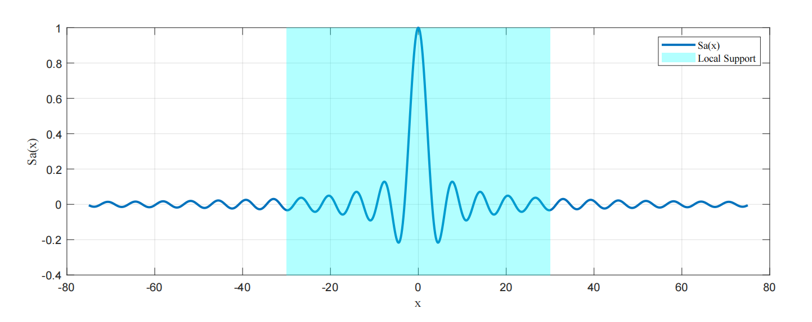
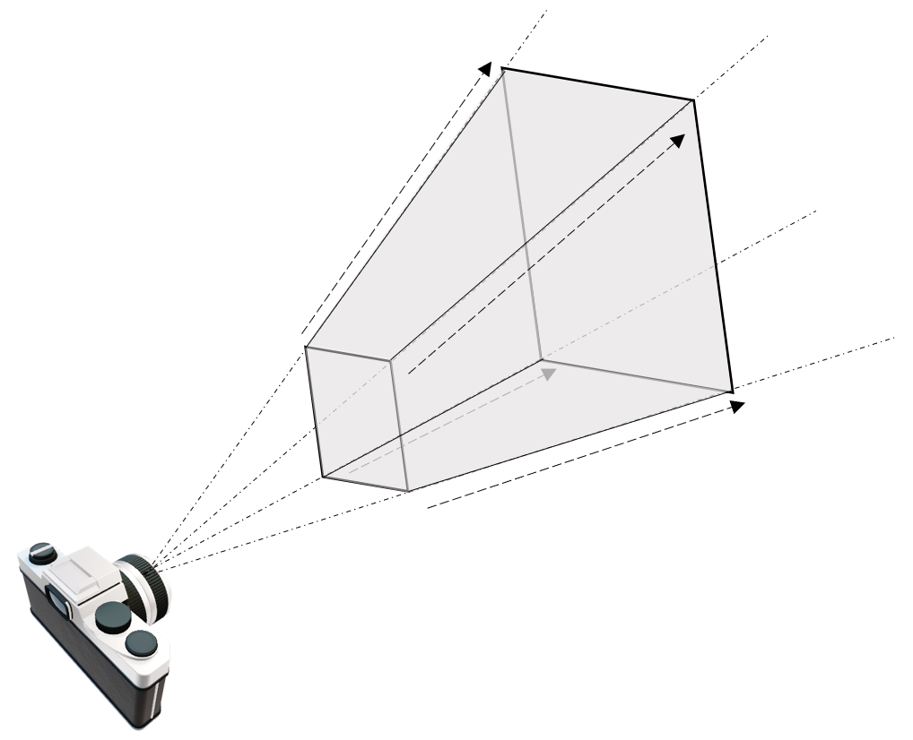
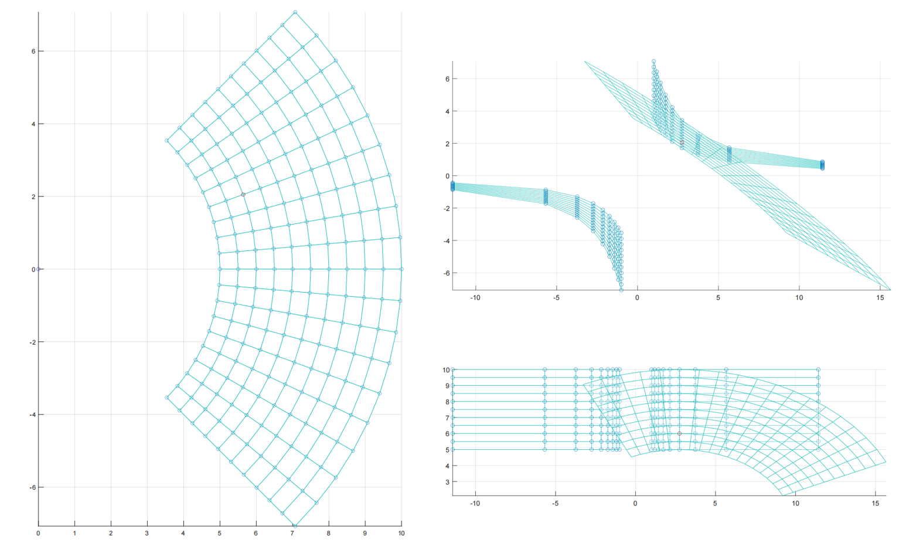

# 【转载】3D Gaussian Splatting中的数学推导

 此文记录个人学习过程，如有错误欢迎私信交流，十分感谢！（第一次在知乎发blog，紧张。）

 3D Gaussian Splatting，简记为3DGS，是一种很有希望的场景表达方式。我在YouTube冲浪相关视频时，看到了这样一段评论：

> “man i remember we learned the theory in the 90s... movement detection due to motion blur and calculate / recreate vectors and depths in a blackn white photo... but the computerpower was so limited we were not really able to proceed......... working on paper, lol, later volumetric clouds came in and now we have this.....this is truely awesome..... something i had dreamed of for decades, recreated my own 3d scenes for months, now its only a video and photos you put in an ai. i am totally flashed.”

我们很容易理解这个人的心境，毕竟硬件的发展带来了一个不可思议的时代。3DGS是一个非常厉害的技术，为了先有一个笼统的认知，我们可以简单将其概括为如下几步：

* 录一段视频或者拍一组不同角度的照片，用一些技术（例如SfM）估计点云。或者直接随机初始化一组点云。
* 点云中的每一个点，代表着一个三维的高斯分布，所以除了点的位置（均值）以外，还有协方差，以及不透明度，以及颜色（球谐系数）。直观可以理解为一个”椭球体“。
* 将这些椭球体沿着特定的角度投影到对应位姿所在的投影平面上，这一步也叫“splatting“，一个椭球体投影到平面上会得到一个椭圆（代码实现时其实是以长轴为直径的圆），然后通过计算待求解像素和椭圆中心的距离，我们可以得到不透明度（离的越近，说明越不透明）。每个椭球体又各自代表自己的颜色，这是距离无关的。于是就可以进行alpha compositing，来合成颜色。然后快速的对所有像素做这样的计算，这被称作”快速可微光栅化“。
* 于是可以得到整个图片，再和ground truth比较，得到损失，然后梯度反传，随机梯度下降，进行优化。


这是对3DGS工作流程最直观和通俗的解释，然而这会产生大量的疑问：”为什么非要是高斯分布？怎么在投影得到的椭圆（分布）上度量距离关于不透明度的分布？“等等，所以这篇blog会整理并推导一下3DGS里相关的数学概念，并不会涉及代码的解析。要了解事情的原委，最好的途径是切入那篇2001年TVCG上的论文[EWA Splatting](https://ieeexplore.ieee.org/document/1021576)，这里的EWA是Elliptical Weighted Average，其中Elliptical（椭圆）就有点“钦定”高斯的意思了。

首先，我们回忆一下体渲染的这个事情。假设读者跟我一样是从NeRF才接触体渲染的，那么回顾一下NeRF中，沿着一个像素，发出一条射线，然后这条射线“射向体数据”（在NeRF里就是沿着光线进行采样，然后查询采样点的属性）的过程。这个过程可以归结为一种 `backward mapping` 。

所以很自然的，会有一种 `forward mapping` 的办法。形式上，就是将整个“体数据”投影到此时位姿所对应的图像平面。这种办法的前提就不能是用NeRF那种隐式表达了，需要一些显式的表达才能支持这样直接的投影。例如以三个顶点长成的三角面基元（primitive），然后将这些许多的三角面直接投影到成像平面上，判断哪些像素是什么颜色，当有多个三角形投影时，根据他们的“深度”来判断前后顺序，然后进行熟悉的alpha compositing。当然也会有其他基元，例如小的平面表示等等。

无论是 `backward mapping` 还是 `forward mapping` ，这个过程都涉及到将连续的表示变成离散的。在 `backward mapping` 里，是对场进行采样；在 `forward mapping` 里，是需要直接生成出基元，这也是一种连续化为离散。为了理解在这个过程中，高斯分布为什么重要，我们需要牵扯到信号与系统中的概念。与混过数字信号处理考试不同的是，我们要清楚此时引入信号与系统里的工具的目的是什么。回想刚才三角面基元的情景，在实际情境中，我们其实都接触不到“连续”的表达，比如三角面，我们只会记录它的三个顶点。当投影完成后，我们只能做一些有限的操作来阻止“锯齿”，例如对结果进行一个模糊操作，这些操作一般都是局部的。我们这样做的目的，本质是“希望用离散的表达来重建原来的信号，进一步在重建好的信号上进行“resampling”。如果我们对处理后的结果，视觉上看起来没什么混叠或者锯齿上的问题，那就说明我们“resampling”是成功的。

### Derivation of Sampling

我们回顾一些数字信号处理上的知识，可以在稍后帮助我们理解一些概念。考虑采样率$f_s=1/T$，那么考虑一个连续信号$x_a(t)$的离散采样$\hat{x}_a(t)$：
$$\hat{x}_a\left( t \right) =\sum_{n=-\infty}^{\infty}{x_a\left( t \right) \delta \left( t-nT \right)}\\$$
我们知道，时域采样等价于频谱延拓，我们直接给出$\hat{x}_a(t)$的频谱$\hat{X}_a(j\varOmega)$：
$$\hat{X}_a(j\varOmega )=\frac{1}{T}\sum_{n=-\infty}^{\infty}{X_a\left( j\varOmega -jn\frac{2\pi}{T} \right)}\\$$
具体推导这里从略，这并不是我们关注的重点。感兴趣可以查看任何一本数字信号处理的教材。

考虑奈奎斯特采样定理，我们需要将$\hat{x}_a(t)$过一个低通滤波器（同时补偿频谱的幅度），目的是只让基带频谱通过。一个理想的低通滤波器对应着一个Sa函数（Sinc函数）。记$\varOmega_s=2\pi/T=2\pi f_s$。
$$G\left( j\varOmega \right) =\left\{ \begin{array}{c} T_s, |\varOmega |\leqslant \varOmega _s/2\\ 0, |\varOmega |>\varOmega _s/2\\ \end{array} \right. \\ g\left( t \right) =\mathrm{Sa}\left( \frac{\varOmega _s}{2}t \right) =\frac{\sin \left( \frac{\varOmega _s}{2}t \right)}{\frac{\varOmega _s}{2}t}\\$$
我们直接计算时域上卷积积分的结果，依然是不讲武德的交换积分和求和顺序：
$$y\left( t \right) =\hat{x}_a\left( t \right) \ast g\left( t \right) \\ =\int_{-\infty}^{+\infty}{\left[ \sum_{n=-\infty}^{\infty}{x_a\left( \tau \right) \delta \left( \tau -nT \right)} \right] g\left( t-\tau \right) \mathrm{d}\tau} \\ =\sum_{n=-\infty}^{\infty}{\int_{-\infty}^{+\infty}{x_a\left( \tau \right) g\left( t-\tau \right) \delta \left( \tau -nT \right)}\mathrm{d}\tau} \\ =\sum_{n=-\infty}^{\infty}{x_a\left( nT \right) g\left( t-nT \right)} \\ =\sum_{n=-\infty}^{\infty}{x_a\left( nT \right) \frac{\sin \left( \frac{\pi}{T}t-n\pi \right)}{\left( \frac{\pi}{T}t-n\pi \right)}}\\$$
在这篇blog的情境下，我们需要给最后的式子里的$\frac{\sin \left( \frac{\pi}{T}t-n\pi \right)}{\left( \frac{\pi}{T}t-n\pi \right)}$赋予一个新的意义：“重建核”（reconstruction kernel）。我们很熟悉Sa函数的性态，它沿着左右方向都会逐渐递减到0。这个性质可以说是“局部支撑”（local support）。从这个角度上看，$y(t)$是由重建核和离散数据重新“张”成的连续函数。



在复习了采样定理和插值后，我们继续回到EWA splatting的框架里。为了方便（如果有）读者和原文对照，这里沿用原文的符号标记。EWA里将要处理的整个图形模型看作对一个连续函数进行不规则的采样的结果，这是一个很自然的假设，例如3DGS里的点云，传统的三角面片表示，NeRF的渲染过程，确实是采样的结果。我们可以像前面推导理想情况下的插值函数一样，用一个重建核来重建这个连续函数$f_c(\mathbf{u})$：
$$f_c\left( \mathbf{u} \right) =\sum_{k\in \mathbb{I} \mathbb{N}}{w_kr_k\left( \mathbf{u} \right)}\\$$
这里$\mathbf{u}$是一个采样的位置，$w_k$是采样出的权值（它有可能是体密度，有可能是其他的表示），然后$r_k(\cdot)$就是重建核，$\mathbb{I} \mathbb{N}$是integral number（整数）的意思。之后在EWA splatting的设计里，第一步是将从源空间（一般就是三维空间）里的$f_c(\cdot)$投影到屏幕空间，然后得到一个连续的函数$g_c(\mathbf{x})$，这一步被表述为：
$$g_c\left( \mathbf{x} \right) =\left\{ \mathcal{P} \left( f_c \right) \right\} \left( \mathbf{x} \right)\\$$
这里$\mathcal{P}$代表一个投影算子，我们后面进行详细的讨论。然后$\mathbf{x}$是屏幕上的二维坐标。将这个算子与求和符号交换位置，即先计算重建核投影后的函数，记作：
$$g_c\left( \mathbf{x} \right) =\sum_{k\in \mathbb{I} \mathbb{N}}{w_kp_k\left( \mathbf{u} \right)}\\$$
这里$p_k(\cdot)=\mathcal{P}(r_k(\cdot))$，然后，像数字信号处理里教的那样，要将这个屏幕空间里的连续信号变得带限，给它先来个预滤波器$h(\mathbf{x})$：
$$g_{c}^{\prime}\left( \mathbf{x} \right) =g_c\left( \mathbf{x} \right) \otimes h\left( \mathbf{x} \right)\\$$
（这里的上角标处的撇跟求导没有任何关系，可能是2001年的时候科技论文里的符号都采取的有些奔放吧。）如果展开卷积式子，将加权时的求和符号与卷积的积分符号交换位置，可以发现：
$$g_{c}^{\prime}\left( \mathbf{x} \right) =\int_{\mathbb{I} \mathbb{R} ^2}{\left\{ \mathcal{P} \left( \sum_{k\in \mathbb{I} \mathbb{N}}{w_kr_k} \right) \right\} \left( \boldsymbol{\eta } \right) h\left( \mathbf{x}-\boldsymbol{\eta } \right) \mathrm{d}\boldsymbol{\eta }} \\ =\sum_{k\in \mathbb{I} \mathbb{N}}{w_k\int_{\mathbb{I} \mathbb{R} ^2}{p_k\left( \boldsymbol{\eta } \right) h\left( \mathbf{x}-\boldsymbol{\eta } \right) \mathrm{d}\boldsymbol{\eta }}} \\ =\sum_{k\in \mathbb{I} \mathbb{N}}{w_k\rho _k\left( \mathbf{x} \right)}\\$$
这里$\rho _k\left( \mathbf{x} \right) =\left( p_k\otimes h \right) \left( \mathbf{x} \right)$，说明我们可以像刚才投影时候一样，先计算此时$p_k(\cdot)$预滤波后的结果，再带入计算。所以框架构造到这里，可能之所以选择“高斯分布”就已经呼之欲出了，因为高斯分布有个很好的性质，两个高斯分布的卷积仍然是高斯分布。上面几行看起来什么都没说的公式，其实就想说明一点： **对采样后整个场景的操作，都可以归结为对重建核进行操作。** 

### Derivation of Splatting

接下来我们需要将上面构造的这三步操作，结合到体渲染的具体情景中。接下来我们会看到一段很类似于NeRF里所用到的推导，但与NeRF不同的是，这里涉及的变换会略微复杂。如果我们回忆NeRF中单纯的渲染过程，不考虑NeRF中的NDC transformation，那整个NeRF的框架里就只有这一个旋转变换和平移变换。一个矩阵就够了。后面我们会发现，在这里我们需要两个矩阵。

然而如上面所说，splatting的过程是反过来的，我们希望将物体投影到平面上。第一步我们仍然将源空间（世界坐标系）下的坐标转换到相机空间里，这是一步仿射变换。然后，与其计算相机空间里的每个基元关于平面的投影，然后计算哪些部分属于哪些像素，不如直接应用一个投影变换，将从相机原点发射的光线，映射为平行光。这样，被变换后的坐标，就可以很方便的进行体渲染了。变换后得到的空间我们称为“光线空间”。这个投影变换并不显然，因为如果直接这么应用一个投影变换，会带来一些问题，我们放在后面讨论。我们将从源空间映射到相机空间的仿射变换记作$\varphi(\cdot)$，将相机空间映到光线空间的投影变换记作$\phi(\cdot)$。

接下来，我们从体渲染的公式出发，推导出通常意义下的splatting算法。在EWA splatting这篇里，所用的体渲染公式和NeRF里的相比，说法上更加严谨，是传统意义上的体渲染公式的写法——“low albedo approximation”，即低反照近似，大概是指得这个式子本身不考虑颜色随角度变化，于是不怎么拟合那种non-Lambertian的东西。但数学形式上是完全一样的。下面这一部分的内容其实有两个目的， **一个是给出splatting框架下做体渲染的方法，另一个是将刚才“连续-离散”的框架在这个例子里“实例化”。** 

这里，EWA splatting的作者为了后面的一个方便（将3D积分掉一维变成2D）以及“光线空间”的引入，修改了一下符号意义。对于 **光线空间** 里的坐标$\mathbf{x}=(x_0,x_1,x_2)^T$，由于$x_2$在的那个维度，会经常被积分掉，所以他们这样标记了一下：$(\mathbf{x},x_2)^T$，只能说……行吧。

所以此时体渲染的方程为：
$$I\left( \mathbf{x} \right) =\int_0^L{c\left( \mathbf{x},\xi \right) f_{c}^{\prime}\left( \mathbf{x},\xi \right) e^{-\int_0^{\xi}{f_{c}^{\prime}\left( \mathbf{x},\mu \right) \mathrm{d}\mu}}\mathrm{d}\xi}\\$$
​
$I_{\lambda}(\cdot)$指的是光强。然后$f_{c}^{\prime}\left( \mathbf{x},\xi \right)$是“消光系数”，用于建模光的“自我遮挡”。然后也有熟悉的负指数作为衰减因子，$c\left( \mathbf{x},\xi \right)$是“发射系数”。我们不用特别纠结这些名字，如果想要简洁的物理含义，可以直接看NeRF的推导。

> 其实我们如果熟悉NeRF的推导，结合前面的那些框架，其实我们很容易猜出来下面就是把$I(\mathbf{x})$写成alpha compositing的形式。

由于我们将源空间到相机空间记作$\varphi(\cdot)$，相机空间到光线空间记作$\phi(\cdot)$。那么对于之前定义的$f_c(\mathbf{u})$，对于一个光线空间里的坐标$\mathbf{x}$，我们可以依次进行逆变换，然后计算此时光线空间里坐标为$\mathbf{x}$的位置，其对应的属性是多少。我们这里假设$f_c(\mathbf{u})$就是源空间里的消光系数，所以自然有：
$$f_{c}^{\prime}\left( \mathbf{x} \right) =f_c\left( \varphi ^{-1}\left( \phi ^{-1}\left( \mathbf{x} \right) \right) \right) =\sum_{k\in \mathbb{I} \mathbb{N}}{w_kr_{k}^{\prime}\left( \mathbf{x} \right)}\\$$
很直接的，变换的作用可以直接吸收进重建核中。如果我们选择高斯分布作为重建核，至少，如果对高斯分布进行简单的旋转，平移，缩放，那么它就还是高斯分布。可是变换$\phi^{-1}(\cdot)$可不保证这样的性质。我们先按下不表，先将$f_{c}^{\prime}\left( \mathbf{x} \right)$带入体渲染方程（交换积分和求和符号顺序）：
$$I\left( \mathbf{x} \right) =\int_0^L{c\left( \mathbf{x},\xi \right) \sum_{k\in \mathbb{I} \mathbb{N}}{w_kr_{k}^{\prime}\left( \mathbf{x},\xi \right)}e^{-\int_0^{\xi}{\sum_{j\in \mathbb{I} \mathbb{N}}{w_jr_{j}^{\prime}\left( \mathbf{x},\mu \right)}\mathrm{d}\mu}}\mathrm{d}\xi} \\ =\sum_{k\in \mathbb{I} \mathbb{N}}{w_k\left( \int_0^L{c\left( \mathbf{x},\xi \right) r_{k}^{\prime}\left( \mathbf{x},\xi \right) e^{-\sum_{j\in \mathbb{I} \mathbb{N}}{w_j\int_0^{\xi}{r_{j}^{\prime}\left( \mathbf{x},\mu \right)}\mathrm{d}\mu}}\mathrm{d}\xi} \right)} \\ =\sum_{k\in \mathbb{I} \mathbb{N}}{w_k\left( \int_0^L{c\left( \mathbf{x},\xi \right) r_{k}^{\prime}\left( \mathbf{x},\xi \right) \prod_j{e^{-w_j\int_0^{\xi}{r_{j}^{\prime}\left( \mathbf{x},\mu \right)}\mathrm{d}\mu}}\mathrm{d}\xi} \right)}\\$$
此时$I(\mathbf{x})$的形式也是一个加权和，同时它也确实将三维的输入映射到了二维平面。此时的$I(\mathbf{x})$和上文中的$g_c(\mathbf{x})$具有一致的意义。所以现在用$g_c(\mathbf{x})$这个符号替代$I(\mathbf{x})$。精准的计算这个式子是困难的，于是就有了splatting的一些基本假设，核心在于重建核（变换后的）是 **局部支撑** 的（联想Sa/Sinc函数）。那样的话我们可以认为在积分从0到L的过程中，只有那些$r_{k}^{\prime}\left( \mathbf{x},\xi \right)$显著不为0的那些部分才是我们感兴趣的。一般一条光路上的采样点，这些支撑集都是不重叠的。于是我们自然的假设，对于每个$k$所对应的$r_{k}^{\prime}\left( \mathbf{x},\xi \right)$，在其支撑域内，$c\left( \mathbf{x},\xi \right)$近似为一个常数。这样我们可以将$c\left( \mathbf{x},\xi \right)$从积分里拿出来。同时再对指数函数进行泰勒展开，$e^{-x}\approx1-x$，所以此时可以推出：
$$g_c\left( \mathbf{x} \right) =\sum_{k\in \mathbb{I} \mathbb{N}}{w_kc\left( \mathbf{x} \right) \left( \int_0^L{r_{k}^{\prime}\left( \mathbf{x},\xi \right) \prod_j{\left( 1-w_j\int_0^{\xi}{r_{j}^{\prime}\left( \mathbf{x},\mu \right)}\mathrm{d}\mu \right)}\mathrm{d}\xi} \right)}\\$$
接下来，为了对齐连乘符号内外的积分，会引入一个“ignore self-occlusion”的假设。这个假设说的是不那么细致的考虑每个基元内部的不透明度（opacity）的变化，直接将穿透整个基元后所消耗的那么多为最小单位。所以公式上就是将连乘符号内部的那个积分的积分上限调整成$L$，那样的话，整个连乘符号将跟外面的那个积分无关，于是就可以拿出来了：
$$g_c\left( \mathbf{x} \right) =\sum_{k\in \mathbb{I} \mathbb{N}}{w_kc\left( \mathbf{x} \right) \left( \int_0^L{r_{k}^{\prime}\left( \mathbf{x},\xi \right) \prod_j{\left( 1-w_j\int_0^L{r_{j}^{\prime}\left( \mathbf{x},\mu \right)}\mathrm{d}\mu \right)}\mathrm{d}\xi} \right)} \\ =\sum_{k\in \mathbb{I} \mathbb{N}}{w_kc\left( \mathbf{x} \right) \left( \int_0^L{r_{k}^{\prime}\left( \mathbf{x},\xi \right) \mathrm{d}\xi} \right) \prod_j{\left( 1-w_j\int_0^L{r_{j}^{\prime}\left( \mathbf{x},\mu \right)}\mathrm{d}\mu \right)}}\\$$
在此基础上，再记：
$$q_k\left( \mathbf{x} \right) =\int_{\mathbb{I} \mathbb{R}}{r_{k}^{\prime}\left( \mathbf{x},\xi \right) \mathrm{d}\xi}\\$$
此时，这里的$q_k\left( \mathbf{x} \right)$是一个很有用的式子，它被称为足迹函数，它描述了对重建核沿某一个维度积分的结果。$q_k\left( \mathbf{x} \right)$实际上代表了三维的重建核映到二维这一过程。于是最终的$g_c(\mathbf{x})$为：
$$g_c\left( \mathbf{x} \right) =\sum_{k\in \mathbb{I} \mathbb{N}}{w_kc\left( \mathbf{x} \right) q_k\left( \mathbf{x} \right) \prod_{j=0}^{k-1}{\left( 1-w_jq_j\left( \mathbf{x} \right) \right)}}\\$$
此时的$g_c(\mathbf{x})$是真正意义上的一个二维的连续函数，这个公式也是最朴素的意义下的splatting。同时有$g_c\left( \mathbf{x} \right) =\sum_{k\in \mathbb{I} \mathbb{N}}{w_kp_k\left( \mathbf{u} \right)}$的形式。别忘了此时$w_k$其实也是一个关于$\mathbf{x}$的连续函数，只是在推导时省略了。所以根据上面的框架，我们比较关心$g_{c}^{\prime}\left( \mathbf{x} \right) =g_c\left( \mathbf{x} \right) \otimes h\left( \mathbf{x} \right)$的形态，但我们其实可以猜到，作者一定会逻辑闭合地把$g_{c}^{\prime}\left( \mathbf{x} \right)$中卷积$h(\mathbf{x})$的部分给吸收成直接与$q_k(\mathbf{x})$卷积。我们先尝试展开卷积的式子：
$$g_{c}^{\prime}\left( \mathbf{x} \right) =g_c\left( \mathbf{x} \right) \otimes h\left( \mathbf{x} \right) \\ =\sum_k{w_k\int_{\mathbb{I} \mathbb{R} ^2}{c_k\left( \eta \right) q_k\left( \eta \right) \prod_{j=0}^{k-1}{\left( 1-w_jq_j\left( \eta \right) \right)}h\left( \mathbf{x}-\eta \right) \mathrm{d}\eta}}\\$$
想达成上面那个目的，需要把$c_k(\cdot)$和连乘项拿出来，所以这里很直接的假设$c_k(\mathbf{x})$是常数，同时连乘的这一项也是常数。于是可以得到：
$$\prod_{j=0}^{k-1}{\left( 1-w_jq_j\left( \mathbf{x} \right) \right)}\approx o_k \\ g_c\left( \mathbf{x} \right) \otimes h\left( \mathbf{x} \right) =\sum_k{w_kc_ko_k\int_{\mathbb{I} \mathbb{R} ^2}{q_k\left( \eta \right) h\left( \mathbf{x}-\eta \right) \mathrm{d}\eta}} \\ =\sum_k{w_kc_ko_k\left( q_k\left( \mathbf{x} \right) \otimes h\left( \mathbf{x} \right) \right)} \\ =\sum_k{w_kc_ko_k\rho _k\left( \mathbf{x} \right)}\\$$
经过两次关于$c_k(\cdot)$的假设，现在第$k$个基元的颜色是与坐标位置（无论是二维平面还是积分的那一维）都是无关的，这正好对应了在3DGS中设定每个高斯椭球的颜色为一不随距离变化的定值。

### Derivation of Gaussian

到现在为止，从上述的步骤中，我们是可以觉察到，我们想要的重建核函数，如果有特定的形式，会带来很多方便。假如这个重建核函数和预滤波器作卷积（当然预滤波器也是我们可以选择的）后仍然有和原来一样的表达，假如这个重建核函数经过线性变换后，其函数参数也可以被线性的变化，假如这个重建函数，沿某个维度积分后，也能保持类似的函数结构，那不就是一个天大的好事？

> “神说要有高斯函数，于是就有了高斯函数。“

高斯函数可以符合上述性质，我们这里整理一下关于高斯函数的一些神奇的性质。为了和这里的情境更适配，我们将高斯分布里的$\mathbf{\mu }$改记作$\mathbf{p}$，意为“position”。协方差矩阵仍记为$\mathbf{\Sigma }$，于是一个位于$\mathbf{p}$处的$n$维的高斯函数$\mathcal{G} _{\mathbf{p},\mathbf{\Sigma }}^{\left( n \right)}\left( \mathbf{x} \right)$写作：
$$\mathcal{G} _{\mathbf{p},\mathbf{\Sigma }}^{\left( n \right)}\left( \mathbf{x} \right) =\frac{1}{\left( 2\pi \right) ^{\frac{n}{2}}\left| \mathbf{\Sigma } \right|^{\frac{1}{2}}}e^{-\frac{1}{2}\left( \mathbf{x}-\mathbf{p} \right) ^T\mathbf{\Sigma }^{-1}\left( \mathbf{x}-\mathbf{p} \right)}\\$$
首先，我们应注意到$\mathbf{\Sigma }$是一个半正定的实对称矩阵，那么它一定可以被正交对角化。
$$\mathbf{\Sigma }=\mathbf{Q}^T\mathbf{\Lambda Q}\\$$
由于它半正定，所以表示特征值的对角阵$\mathbf{\Lambda}$可以被拆为$\mathbf{\Lambda}^{\frac{1}{2}}\mathbf{\Lambda}^{\frac{1}{2}}$，于是我们可以将$\mathbf{\Sigma }$写为：
$$\mathbf{\Sigma }=\underset{\mathbf{\sigma }}{\underbrace{\mathbf{Q}^T\mathbf{\Lambda }^{\frac{1}{2}}}}\underset{\mathbf{\sigma }^T}{\underbrace{\mathbf{\Lambda }^{\frac{1}{2}}\mathbf{Q}}} \\ =\mathbf{\sigma \sigma }^T\\$$
于是$\mathbf{\Sigma }^{-1}=\left( \mathbf{\sigma }^T \right) ^{-1}\mathbf{\sigma }^{-1}$，由于对任意一个矩阵$A$，都有$\left( AA^{-1} \right) ^T=\left( A^{-1} \right) ^TA^T=I$，所以$\left( A^T \right) ^{-1}=\left( A^{-1} \right) ^T$，我们可以不在乎求逆和转置的先后顺序，所以$\mathbf{\Sigma }^{-1}$可以简化写作$\mathbf{\Sigma }^{-1}=\mathbf{\sigma }^{-T}\mathbf{\sigma }^{-1}$。

> “高斯函数的傅里叶变换还是高斯函数”

接下来，我们先计算$n$维高斯函数的傅里叶变换：
$$\mathcal{F} \left[\mathcal{G} _{\mathbf{p},\mathbf{\Sigma }}^{\left( n \right)}\left( \mathbf{x} \right) \right] =\frac{1}{\left( 2\pi \right) ^{\frac{n}{2}}\left| \mathbf{\Sigma } \right|^{\frac{1}{2}}}\int_{-\infty}^{+\infty}{e^{-\frac{1}{2}\left( \mathbf{x}-\mathbf{p} \right) ^T\mathbf{\Sigma }^{-1}\left( \mathbf{x}-\mathbf{p} \right)}e^{-j\mathbf{x}^T\boldsymbol{\omega }}\mathrm{d}\mathbf{x}} \\ =\frac{1}{\left( 2\pi \right) ^{\frac{n}{2}}\left| \mathbf{\Sigma } \right|^{\frac{1}{2}}}\int_{-\infty}^{+\infty}{e^{-\frac{1}{2}\left( \mathbf{x}-\mathbf{p} \right) ^T\mathbf{\sigma }^{-T}\mathbf{\sigma }^{-1}\left( \mathbf{x}-\mathbf{p} \right)}e^{-j\mathbf{x}^T\boldsymbol{\omega }}\mathrm{d}\mathbf{x}}\\$$
作换元$\mathbf{z}=\mathbf{\sigma }^{-1}\left( \mathbf{x}-\mathbf{p} \right)$，于是$\mathbf{x}=\mathbf{\sigma z}+\mathbf{p}$。带入上式：
$$=\frac{1}{\left( 2\pi \right) ^{\frac{n}{2}}\left| \mathbf{\Sigma } \right|^{\frac{1}{2}}}\int_{-\infty}^{+\infty}{e^{-\frac{1}{2}\mathbf{z}^T\mathbf{z}}e^{-j\left( \mathbf{z}^T\mathbf{\sigma }^T+\mathbf{p}^T \right) \boldsymbol{\omega }}\mathrm{d}\mathbf{x}} \\ =\frac{1}{\left( 2\pi \right) ^{\frac{n}{2}}\left| \mathbf{\Sigma } \right|^{\frac{1}{2}}}e^{-j\mathbf{p}^T\boldsymbol{\omega }}\int_{-\infty}^{+\infty}{e^{-\frac{1}{2}\mathbf{z}^T\mathbf{z}}e^{-j\mathbf{z}^T\mathbf{\sigma }^T\boldsymbol{\omega }}\mathrm{d}\mathbf{x}}\\$$
注意到：
$$-\frac{1}{2}\left( \mathbf{z}+j\mathbf{\sigma }^T\boldsymbol{\omega } \right) ^T\left( \mathbf{z}+j\mathbf{\sigma }^T\boldsymbol{\omega } \right) -\frac{1}{2}\boldsymbol{\omega }^T\mathbf{\sigma }^T\mathbf{\sigma }\boldsymbol{\omega } \\ =-\frac{1}{2}\left( \mathbf{z}^T\mathbf{z}+\underset{\mathrm{scalar}}{\underbrace{j\mathbf{z}^T\mathbf{\sigma }^T\boldsymbol{\omega }+j\boldsymbol{\omega }^T\mathbf{\sigma z}}}-\boldsymbol{\omega }^T\mathbf{\sigma \sigma }^T\boldsymbol{\omega } \right) -\frac{1}{2}\boldsymbol{\omega }^T\mathbf{\sigma }^T\mathbf{\sigma }\boldsymbol{\omega } \\ =-\frac{1}{2}\mathbf{z}^T\mathbf{z}-j\mathbf{z}^T\mathbf{\sigma }^T\boldsymbol{\omega }+\frac{1}{2}\boldsymbol{\omega }^T\mathbf{\sigma }^T\mathbf{\sigma }\boldsymbol{\omega }-\frac{1}{2}\boldsymbol{\omega }^T\mathbf{\sigma }^T\mathbf{\sigma }\boldsymbol{\omega } \\ =-\frac{1}{2}\mathbf{z}^T\mathbf{z}-j\mathbf{z}^T\mathbf{\sigma }^T\boldsymbol{\omega }\\$$
所以积分里的指数项可以化为：
$$=\frac{1}{\left( 2\pi \right) ^{\frac{n}{2}}\left| \mathbf{\Sigma } \right|^{\frac{1}{2}}}e^{-j\mathbf{p}^T\boldsymbol{\omega }}e^{-\frac{1}{2}\boldsymbol{\omega }^T\mathbf{\sigma }^T\mathbf{\sigma }\boldsymbol{\omega }}\int_{-\infty}^{+\infty}{e^{-\frac{1}{2}\left( \mathbf{z}+j\mathbf{\sigma }^T\boldsymbol{\omega } \right) ^T\left( \mathbf{z}+j\mathbf{\sigma }^T\boldsymbol{\omega } \right)}\mathrm{d}\mathbf{x}}\\$$
由重积分里的换元法，我们知道$\mathbf{\sigma}$正好是$\mathbf{x}$与$\mathbf{z}$之间变换的雅克比矩阵，所以$\mathrm{d}\mathbf{x}=\left| \mathbf{\sigma } \right|\mathrm{d}\mathbf{z}=\left| \mathbf{\Sigma } \right|^{\frac{1}{2}}\mathrm{d}\mathbf{z}$，我们得到：
$$=\frac{1}{\left( 2\pi \right) ^{\frac{n}{2}}}e^{-j\mathbf{p}^T\boldsymbol{\omega }}e^{-\frac{1}{2}\boldsymbol{\omega }^T\mathbf{\sigma }^T\mathbf{\sigma }\boldsymbol{\omega }}\int_{-\infty}^{+\infty}{e^{-\frac{1}{2}\left( \mathbf{z}+j\mathbf{\sigma }^T\boldsymbol{\omega } \right) ^T\left( \mathbf{z}+j\mathbf{\sigma }^T\boldsymbol{\omega } \right)}\mathrm{d}\mathbf{z}}\\$$
进一步，令$\mathbf{y}=\mathbf{z}+j\mathbf{\sigma }^T\boldsymbol{\omega }$，于是有：
$$=\frac{1}{\left( 2\pi \right) ^{\frac{n}{2}}}e^{-j\mathbf{p}^T\boldsymbol{\omega }}e^{-\frac{1}{2}\boldsymbol{\omega }^T\mathbf{\sigma }^T\mathbf{\sigma }\boldsymbol{\omega }}\int_{-\infty}^{+\infty}{e^{-\frac{1}{2}\mathbf{y}^T\mathbf{y}}\mathrm{d}\mathbf{y}}\\$$
那一项反常积分非常出名，我们在高数课上接触过它在一维，二维上的情况，我们知道：
$$\int_{-\infty}^{+\infty}{e^{-x^2}\mathrm{d}x}=\sqrt{\pi}\\$$
由换元法$x=\frac{t}{\sqrt{2}}$得：
$$\int_{-\infty}^{+\infty}{e^{-\frac{t^2}{2}}\mathrm{d}t}=\sqrt{2\pi}\\$$
$n$维的情况便可以直接积分：
$$\int\dotsi\int_{-\infty}^{+\infty}{e^{-\frac{1}{2}\left( y_{1}^{2}+y_{2}^{2}+...+y_{n}^{2} \right)}\mathrm{d}y_1\mathrm{d}y_2...\mathrm{d}y_n}=\left( \sqrt{2\pi} \right) ^n\\$$
于是，我们就得到了：
$$\mathcal{F} \left[ \mathcal{G} _{\mathbf{p},\mathbf{\Sigma }}^{\left( n \right)}\left( \mathbf{x} \right) \right] =e^{-j\mathbf{p}^T\boldsymbol{\omega }}e^{-\frac{1}{2}\boldsymbol{\omega }^T\mathbf{\sigma }^T\mathbf{\sigma }\boldsymbol{\omega }} \\ =e^{-j\mathbf{p}^T\boldsymbol{\omega }}e^{-\frac{1}{2}\boldsymbol{\omega }^T\mathbf{\Sigma }\boldsymbol{\omega }}\\$$
所以，高斯函数的傅里叶变换，仍然是一个高斯函数。我们可以观察到，变换后的高斯函数，协方差矩阵变为了$\mathbf{\Sigma }^{-1}$，均值被释放到了虚轴上。

得到这一性质后，结合时域卷积定理，我们很容易得到，两个高斯函数卷积，结果仍是高斯函数：
$$\mathcal{G} _{\mathbf{p}_1,\mathbf{\Sigma }_1}^{\left( n \right)}\ast \mathcal{G} _{\mathbf{p}_2,\mathbf{\Sigma }_2}^{\left( n \right)}=\mathcal{G} _{\mathbf{p}_1+\mathbf{p}_2,\mathbf{\Sigma }_1+\mathbf{\Sigma }_2}^{\left( n \right)}\\$$
> “高斯函数与高斯函数的卷积仍是高斯函数。”

同时，对高斯分布进行仿射变换$\varphi \left( \mathbf{x} \right) =\mathbf{Mx}+\mathbf{b}$，我们直接计算，可以得到：
$$\mathcal{G} _{\mathbf{p},\mathbf{\Sigma }}^{\left( n \right)}\left( \mathbf{x} \right) =\frac{1}{\left( 2\pi \right) ^{\frac{n}{2}}\left| \mathbf{\Sigma } \right|^{\frac{1}{2}}}e^{-\frac{1}{2}\left( \mathbf{M}^{-1}\left( \varphi \left( \mathbf{x} \right) -\mathbf{b} \right) -\mathbf{p} \right) ^T\mathbf{\Sigma }^{-1}\left( \mathbf{M}^{-1}\left( \varphi \left( \mathbf{x} \right) -\mathbf{b} \right) -\mathbf{p} \right)} \\ =\frac{1}{\left( 2\pi \right) ^{\frac{n}{2}}\left| \mathbf{\Sigma } \right|^{\frac{1}{2}}}e^{-\frac{1}{2}\left( \mathbf{M}^{-1}\varphi \left( \mathbf{x} \right) -\mathbf{M}^{-1}\mathbf{b}-\mathbf{p} \right) ^T\mathbf{\Sigma }^{-1}\left( \mathbf{M}^{-1}\varphi \left( \mathbf{x} \right) -\mathbf{M}^{-1}\mathbf{b}-\mathbf{p} \right)} \\ =\frac{1}{\left( 2\pi \right) ^{\frac{n}{2}}\left| \mathbf{\Sigma } \right|^{\frac{1}{2}}}e^{-\frac{1}{2}\left[ \mathbf{M}^{-1}\left( \varphi \left( \mathbf{x} \right) -\mathbf{b}-\mathbf{Mp} \right) \right] ^T\mathbf{\Sigma }^{-1}\left[ \mathbf{M}^{-1}\left( \varphi \left( \mathbf{x} \right) -\mathbf{b}-\mathbf{Mp} \right) \right]} \\ =\frac{\left| \mathbf{M} \right|}{\left( 2\pi \right) ^{\frac{n}{2}}\left| \mathbf{M} \right|^{\frac{1}{2}}\left| \mathbf{\Sigma } \right|^{\frac{1}{2}}\left| \mathbf{M} \right|^{\frac{1}{2}}}e^{-\frac{1}{2}\left( \varphi \left( \mathbf{x} \right) -\varphi \left( \mathbf{p} \right) \right) ^T\left( \mathbf{M}^{-1} \right) ^T\mathbf{\Sigma }^{-1}\mathbf{M}^{-1}\left( \varphi \left( \mathbf{x} \right) -\varphi \left( \mathbf{p} \right) \right)} \\ =\left| \mathbf{M} \right|\mathcal{G} _{\varphi \left( \mathbf{p} \right) ,\mathbf{M\Sigma M}^T}^{\left( n \right)}\left( \varphi \left( \mathbf{x} \right) \right)\\$$
> “高斯分布经仿射变换后仍是高斯分布。”

可以看出，进行仿射变换后，高斯分布仍然保持不变。

另一个我们关心的性质是对$n$维高斯分布沿着一个维度进行积分，得到的$n-1$维的分布仍然是高斯的。这一点实际上很好理解，由于指数运算的性质，在积分第$i$个维度时，我们总可以把所有不跟$x_i$交叉的项全部移出积分符号，最终得到的协方差矩阵中的第$i$行和第$i$列都会消失。在3DGS中，我们关心的是重建核进行投影，然后沿某个方向积分后，重建核还能否有简洁的表达，所以在这里，高斯函数仍然有圆满的答案：
$$\int_{\mathbb{I} \mathbb{R}}{\mathcal{G} _{\mathbf{p},\mathbf{\Sigma }}^{\left( 3 \right)}\left( \mathbf{x},x_2 \right) \mathrm{d}x_2}=\mathcal{G} _{\bar{\mathbf{p}},\bar{\mathbf{\Sigma}}}^{\left( 2 \right)}\left( \mathbf{x} \right)\\$$
> “多元高斯分布的边缘分布仍是高斯分布。”

高斯函数的这些性质，完美符合了我们对重建核函数要求。

### Derivation of Transformation

最后要处理的是投影变换，在NeRF中我们也处理过投影变换，但那时候我们站在的角度是一个点如何打在相机的成像平面上。换句话说当时我们更关心相机内参这一表征投影变换的东西本身，而这次我们关心的是同一条光线上的不同点，被投影变换作用后的结果。

在这里我们可以不关心投影变换的矩阵形式，考虑相机空间里的坐标$\mathbf{t}=(t_0,t_1,t_2)^T$，其中$t_2$所在的维度是我们理解上的$z$轴，即相机镜头的方向。记变换后坐标$\mathbf{x}=(x_1,x_2,x_3)^T$，那么整个变换可以写成：
$$\left( \begin{array}{c} x_0\\ x_1\\ x_2\\ \end{array} \right) =\phi \left( \mathbf{t} \right) =\left( \begin{array}{c} {\frac{t_0}{t_2}}\\ {\frac{t_1}{t_2}}\\ \left\| \left( t_0,t_1,t_2 \right) \right\| ^T\\ \end{array} \right)\\$$
可能有人会突然反应不过来为什么这里要有所谓的投影变换，或者这个变换到底是做什么的。前文的[这里](https://zhuanlan.zhihu.com/write#1)简单一笔带过了一次，这里对着$\phi(\mathbf{t})$来介绍一下。具体来说，我们不应忘记，我们仍然是处于针孔相机模型这一假设下的。所以其实是存在一个视体（frustum）的，在这个截锥体里我们发射的光线并不是平行的。



在原始的NeRF中这并不是问题，因为我们本来就是从每条不同方向的光线上进行采样，然后查这些坐标的属性的。但在这里每次都计算不同方向的光线可能和哪些高斯椭球是“接触”（在绘制高斯椭球时我们往往会用其协方差矩阵作为轴的长度，类似一维时熟悉的$\mu \pm \sigma$，其实在这个椭球之外的函数值就已经很小了。）是比较麻烦的，所以我们希望能在一个对于不同光线都是“平行”的空间里完成这件事。注意$\phi(\mathbf{t})$的形式，对于同一条直线上的$\mathbf{t}_i$和$\mathbf{t}_j$，$t_{i,0}/t_{i,2}$和$t_{j,0}/t_{j,2}$，还有$t_{i,1}/t_{i,2}$和$t_{j,1}/t_{j,2}$会是相同的，只有第三行的$\left\| \left( t_0,t_1,t_2 \right) \right\| ^T$不同。这样的处理会在并行实现上带来方便。

这里第三行的$\left\| \left( t_0,t_1,t_2 \right) \right\| ^T$其实是有深意的，如果是常规的透视变换，这里储存的“深度”往往是$t_2$。因为在后面的渲染管线中我们需要这个来判定基元之间的前后顺序，那么这里为什么要取$\mathbf{t}$的2-范数呢？一个事实是，这样对于不同的角度的光线，在一个任意角度光线上等距离采样后，映射后的这些点之间的距离也是等间隔的（由于透视除法把同一条光线上的点的非深度上的坐标都除成一样的了，所以距离的度量只取决于剩下的那个维度）。这样带来了一些好处，但因为经过这个变换后，高斯函数的形式将不再封闭。这样保护了那么久的重建核的性质就被打破了。

所以EWA splatting里提出一种办法，他们称其为“local affine approximation”。我们至少在每次投影时，其实都是知道高斯函数的位置（均值）的，所以我们可以直接计算$\mathbf{x}_k=\phi(\mathbf{t}_k)$。我们可以作线性近似，进行二阶泰勒展开，出现的雅可比矩阵会自然的提供一个线性变换，来提供一个$\mathbf{t}_k$邻域到$\mathbf{x}_k$邻域之间的变换，即：
$$\phi _k\left( \mathbf{t} \right) =\phi _k\left( \mathbf{t}_k \right) +\mathbf{J}_k\left( \mathbf{t}-\mathbf{t}_k \right)\\$$
这里的$\mathbf{J}_k$可以由$\phi _k\left( \mathbf{t} \right)$直接求偏导得到：
$$\mathbf{J}_k=\left( \begin{matrix} \frac{\partial x_0}{\partial t_0}& \frac{\partial x_0}{\partial t_1}& \frac{\partial x_0}{\partial t_2}\\ \frac{\partial x_1}{\partial t_0}& \frac{\partial x_1}{\partial t_1}& \frac{\partial x_1}{\partial t_2}\\ \frac{\partial x_2}{\partial t_0}& \frac{\partial x_2}{\partial t_1}& \frac{\partial x_2}{\partial t_2}\\ \end{matrix} \right) =\left( \begin{matrix} 1/t_{k,2}& 0& -t_{k,0}/t_{k,2}^{2}\\ 0& 1/t_{k,2}& -t_{k,1}/t_{k,2}^{2}\\ \frac{t_{k,0}}{\left\| \mathbf{t}_k \right\|}& \frac{t_{k,1}}{\left\| \mathbf{t}_k \right\|}& \frac{t_{k,2}}{\left\| \mathbf{t}_k \right\|}\\ \end{matrix} \right) \\$$
这里$\mathbf{J}_k$需要特别注明角标$k$，因为当给定一个在相机空间内坐标为$\mathbf{t}_k$的高斯椭球后，整个雅可比矩阵就唯一确定了。

所以观察这里的$\mathbf{J}_k$，我们可以用一个二维的例子，来可视化一下，如果$\phi _k\left( \mathbf{t} \right)$第三行储存的是$t_1$而不是$\left\| \left( t_0,t_1 \right) \right\| ^T$会怎么样：



上图左侧，我以原点出发，在$t_1=1$右侧生成了若干极坐标式的采样点，用于模拟沿不同角度的光线进行均匀采样。右上是储存$t_1$的情况，右下是储存$\left\| \left( t_0,t_1 \right) \right\| ^T$的情况。没有小圆圈标记的网格是沿着红点处进行二阶泰勒展开的近似，我们可以清晰的看出，储存$\left\| \left( t_0,t_1 \right) \right\| ^T$的情况下，二阶近似拟合误差更好，而且雅可比矩阵的性态也更正常。

总之，我们利用二阶近似，解决了投影变换非线性的问题。考虑一个世界坐标系下的坐标$\mathbf{u}$，仿射变换$\mathbf{t}=\varphi(\mathbf{u})$可以得到在特定相机空间下的坐标$\mathbf{t}$，然后$\mathbf{x}=\phi_k(\mathbf{t})$可以得到在光线空间下的坐标表示。我们已经保证了这两个映射是线性的，所以他们的复合也是线性的，我们将其记作$\mathbf{m}_k(\mathbf{u})$。我们可以将这个复合变换展开：
$$\mathbf{t}=\varphi \left( \mathbf{u} \right) =\mathbf{Mu}+\mathbf{b} \\ \mathbf{x}=\phi _k(\mathbf{t})=\mathbf{x}_k+\mathbf{J}_k\left( \mathbf{t}-\mathbf{t}_k \right) \\ =\mathbf{x}_k+\mathbf{J}_k\left( \mathbf{Mu}+\mathbf{b}-\mathbf{t}_k \right) \\ =\mathbf{J}_k\mathbf{Mu}+\mathbf{x}_k+\mathbf{J}_k\left( \mathbf{b}-\mathbf{t}_k \right) \\$$
根据上面推导的仿射变换前后的高斯函数的结果，我们可以直接写出：
$$\mathcal{G} _{\mathbf{p},\mathbf{\Sigma }}^{\left( n \right)}\left( \mathbf{x} \right) =\left| \mathbf{J}_k\mathbf{M} \right|\mathcal{G} _{\mathbf{m}_k\left( \mathbf{p} \right) ,\mathbf{\Sigma }^{\prime}}^{\left( n \right)}\left( \mathbf{m}_k\left( \mathbf{u} \right) \right) \\$$
变换后的协方差矩阵满足：
$$\mathbf{\Sigma }^{\prime}=\mathbf{J}_k\mathbf{M\Sigma M}^T\mathbf{J}_{k}^{T}\\$$
这是一个非常重要的结论，用这样的矩阵变换，可以直接得到一个高斯椭球在光线空间的表示。也就是说，对于一个位置在$\mathbf{p}$，协方差为$\mathbf{\Sigma}$的高斯椭球，我们可以直接通过$\mathbf{m}_k(\mathbf{p})$计算出在光线空间里椭球的位置，然后直接用$\mathbf{\Sigma }^{\prime}=\mathbf{J}_k\mathbf{M\Sigma M}^T\mathbf{J}_{k}^{T}$来得到投影后的协方差$\mathbf{\Sigma }^{\prime}$。然后我们用splatting的那个公式进行渲染，对投影后的三维的高斯函数（重建核）进行积分，借助高斯函数的性质我们可以直接跳过协方差矩阵的第三行和第三列， **于是最终，整个流程被归结为从这些三维椭球投影到二维椭圆里，进行alpha compositing。** 

### Derivation of Gradient

但这里有些小问题，在3DGS中，每个高斯基元的$\mathbf{p}$和$\mathbf{\Sigma}$都是借助PyTorch的自动微分框架来进行随机梯度下降的。其中颜色$c$是靠优化RGB三个通道上的球谐系数（Spherical Harmonics）得到的，不透明度$\alpha$是通过将当前像素点带入此时的高斯基元中计算得到的。优化$\mathbf{p},c,\alpha$都是比较平凡的，但优化$\mathbf{\Sigma}$其实是通过优化$\mathbf{\Sigma }^{\prime}$反传回去的。如果直接丢给PyTorch的计算图，追踪$\mathbf{J}_k\mathbf{M\Sigma M}^T\mathbf{J}_{k}^{T}$这几个矩阵连乘里的乘法操作可不是个很令人满意的事情。所以有必要显式的给出$\mathbf{\Sigma}$的梯度。

协方差矩阵是有物理意义的，我们不能随机初始化一组3×3的数组就当$\mathbf{\Sigma}$，前面我们已经用过它实对称矩阵的性质了$\mathbf{\Sigma }=\mathbf{Q}^T\mathbf{\Lambda }^{\frac{1}{2}}\mathbf{\Lambda }^{\frac{1}{2}}\mathbf{Q}$。我们将这里的对角阵和正交阵赋予一组实际的意义：缩放和旋转。即可重参数化一下$\mathbf{\Sigma}$：
$$\mathbf{\Sigma }=\mathbf{RSS}^T\mathbf{R}^T\\$$
与通常使用欧拉角来描述旋转不同，3DGS里使用归一化后的四元数$\mathbf{q}$来表示旋转，这样可以显式的将待优化的参数从9个变为4个：
$$\mathbf{q}=q_r+q_i\cdot i+q_j\cdot j+q_k\cdot k \\ \mathbf{R}\left( \mathbf{q} \right) =2\left( \begin{matrix} \frac{1}{2}-\left( q_{j}^{2}+q_{k}^{2} \right)& \left( q_iq_j-q_rq_k \right)& \left( q_iq_k+q_rq_j \right)\\ \left( q_iq_j+q_rq_k \right)& \frac{1}{2}-\left( q_{i}^{2}+q_{k}^{2} \right)& \left( q_jq_k-q_rq_i \right)\\ \left( q_iq_k-q_rq_j \right)& \left( q_jq_k+q_rq_i \right)& \frac{1}{2}-\left( q_{i}^{2}+q_{j}^{2} \right)\\ \end{matrix} \right)\\$$
缩放矩阵就没那么特殊了，一个列向量$\mathbf{s}$其实就可以储存$\mathbf{S}$对角线上的元素了。

现在我们来思考梯度回传的事情，我们可以用链式法则写下一个符合直觉的式子：
$$\frac{\mathrm{d}\mathbf{\Sigma }^{\prime}}{\mathrm{d}\mathbf{s}}=\frac{\mathrm{d}\mathbf{\Sigma }^{\prime}}{\mathrm{d}\mathbf{\Sigma }}\frac{\mathrm{d}\mathbf{\Sigma }}{\mathrm{d}\mathbf{s}} \\ \frac{\mathrm{d}\mathbf{\Sigma }^{\prime}}{\mathrm{d}\mathbf{q}}=\frac{\mathrm{d}\mathbf{\Sigma }^{\prime}}{\mathrm{d}\mathbf{\Sigma }}\frac{\mathrm{d}\mathbf{\Sigma }}{\mathrm{d}\mathbf{q}}\\$$
上面的式子是我们凭借直觉，通过标量的链式法则来臆想出的表达。方程的右边有所谓$\mathbf{\Sigma }^{\prime}$关于$\mathbf{\Sigma }$的“导数”，从形式上看这是一个矩阵关于另一个矩阵的导数。我们一定要意识到，这并不是真正意义的“矩阵求导”，我们只是借用了我们熟悉的符号表示，粗略的表达了这一过程。

上面的两行式子，和我们下面要做的操作和可能写出的式子，都只是为了推导出反向传播时的各个分量的梯度变化，而反向传播的源头是标量（损失值），所以我们其实是在一个标量关于向量或标量关于矩阵的框架下来进行讨论。这一点要特别的注意。

为了推导各分量的梯度变化，我们只需要将$\mathbf{\Sigma }^{\prime}$里的每个元素关于$\mathbf{\Sigma }$每个元素求导。为了推导上的简洁，我们省略雅可比矩阵的下标$k$，同时记$\mathbf{U}=\mathbf{J}\mathbf{M}$。以及注意到我们只关心$\mathbf{\Sigma }^{\prime}$左上部分的2×2的元素，所以我们可以直接计算：
$$\mathbf{\Sigma }^{\prime}=\mathbf{U\Sigma U}^T \\ =\left( \begin{matrix} U_{11}& U_{12}\\ U_{21}& U_{22}\\ \end{matrix} \right) \left( \begin{matrix} \Sigma _{11}& \Sigma _{12}\\ \Sigma _{21}& \Sigma _{22}\\ \end{matrix} \right) \left( \begin{matrix} U_{11}& U_{21}\\ U_{12}& U_{22}\\ \end{matrix} \right) \\ =\left( \begin{matrix} U_{11}\Sigma _{11}+U_{12}\Sigma _{21}& U_{11}\Sigma _{12}+U_{12}\Sigma _{22}\\ U_{21}\Sigma _{11}+U_{22}\Sigma _{21}& U_{21}\Sigma _{12}+U_{22}\Sigma _{22}\\ \end{matrix} \right) \left( \begin{matrix} U_{11}& U_{21}\\ U_{12}& U_{22}\\ \end{matrix} \right) \\ =\left( \begin{matrix} \left( U_{11}\Sigma _{11}+U_{12}\Sigma _{21} \right) U_{11}+\left( U_{11}\Sigma _{12}+U_{12}\Sigma _{22} \right) U_{12}& \left( U_{11}\Sigma _{11}+U_{12}\Sigma _{21} \right) U_{21}+\left( U_{11}\Sigma _{12}+U_{12}\Sigma _{22} \right) U_{22}\\ \left( U_{21}\Sigma _{11}+U_{22}\Sigma _{21} \right) U_{11}+\left( U_{21}\Sigma _{12}+U_{22}\Sigma _{22} \right) U_{12}& \left( U_{21}\Sigma _{11}+U_{22}\Sigma _{21} \right) U_{21}+\left( U_{21}\Sigma _{12}+U_{22}\Sigma _{22} \right) U_{22}\\ \end{matrix} \right) \\$$
于是我们可以直接计算$\mathbf{\Sigma }^{\prime}$关于$\mathbf{\Sigma }$的（偏）导数：
$$\frac{\partial \mathbf{\Sigma }^{\prime}}{\partial \Sigma _{11}}=\left( \begin{matrix} U_{11}U_{11}& U_{11}U_{21}\\ U_{21}U_{11}& U_{21}U_{21}\\ \end{matrix} \right) \\ \frac{\partial \mathbf{\Sigma }^{\prime}}{\partial \Sigma _{ij}}=\left( \begin{matrix} U_{1i}U_{1j}& U_{1i}U_{2j}\\ U_{2i}U_{1j}& U_{2i}U_{2j}\\ \end{matrix} \right)\\$$
上面的这个式子，用于在代码中方便地取出与$\Sigma _{ij}$有关的那些系数。为了方便理解，我在这里稍微联系一下代码。我们这里求解出的系数分量被应用在 `diff-gaussian-rasterization/cuda_rasterizer/backward.cu` 中，具体是在 `__global__ void computeCov2DCUDA()` 中：

```language-cpp
if (denom2inv != 0)
 {
 // Gradients of loss w.r.t. entries of 2D covariance matrix,
 // given gradients of loss w.r.t. conic matrix (inverse covariance matrix).
 // e.g., dL / da = dL / d_conic_a * d_conic_a / d_a
 dL_da = denom2inv * (-c * c * dL_dconic.x + 2 * b * c * dL_dconic.y + (denom - a * c) * dL_dconic.z);
 dL_dc = denom2inv * (-a * a * dL_dconic.z + 2 * a * b * dL_dconic.y + (denom - a * c) * dL_dconic.x);
 dL_db = denom2inv * 2 * (b * c * dL_dconic.x - (denom + 2 * b * b) * dL_dconic.y + a * b * dL_dconic.z);
 // Gradients of loss L w.r.t. each 3D covariance matrix (Vrk) entry, 
 // given gradients w.r.t. 2D covariance matrix (diagonal).
 // cov2D = transpose(T) * transpose(Vrk) * T;
 dL_dcov[6 * idx + 0] = (T[0][0] * T[0][0] * dL_da + T[0][0] * T[1][0] * dL_db + T[1][0] * T[1][0] * dL_dc);
 dL_dcov[6 * idx + 3] = (T[0][1] * T[0][1] * dL_da + T[0][1] * T[1][1] * dL_db + T[1][1] * T[1][1] * dL_dc);
 dL_dcov[6 * idx + 5] = (T[0][2] * T[0][2] * dL_da + T[0][2] * T[1][2] * dL_db + T[1][2] * T[1][2] * dL_dc);
 // Gradients of loss L w.r.t. each 3D covariance matrix (Vrk) entry, 
 // given gradients w.r.t. 2D covariance matrix (off-diagonal).
 // Off-diagonal elements appear twice --> double the gradient.
 // cov2D = transpose(T) * transpose(Vrk) * T;
 dL_dcov[6 * idx + 1] = 2 * T[0][0] * T[0][1] * dL_da + (T[0][0] * T[1][1] + T[0][1] * T[1][0]) * dL_db + 2 * T[1][0] * T[1][1] * dL_dc;
 dL_dcov[6 * idx + 2] = 2 * T[0][0] * T[0][2] * dL_da + (T[0][0] * T[1][2] + T[0][2] * T[1][0]) * dL_db + 2 * T[1][0] * T[1][2] * dL_dc;
 dL_dcov[6 * idx + 4] = 2 * T[0][2] * T[0][1] * dL_da + (T[0][1] * T[1][2] + T[0][2] * T[1][1]) * dL_db + 2 * T[1][1] * T[1][2] * dL_dc;
 }

```

这里对于一个3×3的协方差矩阵，由于是对称的，所以我们考虑的是它的上三角的6个元素，标号为：
$$\Sigma =\left( \begin{matrix} 0& 1& 2\\ & 3& 4\\ & & 5\\ \end{matrix} \right) \\$$
然后这个代码片段是在根据链式法则一层一层的求解， `a` , `b` , `c` 是跳过第三行第三列后，协方差矩阵上的值。因为在高斯函数的公式里要用到，所以前面先有一段计算 `dL_da` , `dL_db` , `dL_dc` 的戏码，这里我们可以不看。

然后我们要计算$\frac{\mathrm{d}L}{\mathrm{d}\Sigma _{ij}}$，比如我们想计算协方差矩阵第一行第一列的元素，由刚才计算出的$\mathbf{\Sigma }^{\prime}$关于$\mathbf{\Sigma }$的偏导，我们知道对应的系数是：
$$\left( \begin{matrix} \underset{a}{\underbrace{U_{11}U_{11}}}& \underset{b}{\underbrace{U_{11}U_{21}}}\\ U_{21}U_{11}& \underset{c}{\underbrace{U_{21}U_{21}}}\\ \end{matrix} \right) \\$$
注意 `dL_db` 已经乘过2了，所以就有了：

```language-cpp
dL_dcov[6 * idx + 0] = (T[0][0] * T[0][0] * dL_da + T[0][0] * T[1][0] * dL_db + T[1][0] * T[1][0] * dL_dc);

```

所以这就是$\frac{\mathrm{d}\mathbf{\Sigma }^{\prime}}{\mathrm{d}\mathbf{\Sigma }}$所处理的一些技术问题了。

然后下面是$\frac{\mathrm{d}\mathbf{\Sigma }}{\mathrm{d}\mathbf{s}}$和$\frac{\mathrm{d}\mathbf{\Sigma }}{\mathrm{d}\mathbf{q}}$，其实思路是一样的，我们并不用担心我们没有学过高级的矩阵论什么的，这些其实根本用不到。大多数时候我们直接计算就好。同理我们先记$\mathbf{M}=\mathbf{RS}$，那样协方差矩阵就可以写作：
$$\mathbf{\Sigma }=\mathbf{MM}^T\\$$
然后我们关心的$\frac{\mathrm{d}\mathbf{\Sigma }}{\mathrm{d}\mathbf{s}}$和$\frac{\mathrm{d}\mathbf{\Sigma }}{\mathrm{d}\mathbf{q}}$就可以展成：
$$\frac{\mathrm{d}\mathbf{\Sigma }}{\mathrm{d}\mathbf{s}}=\frac{\mathrm{d}\mathbf{\Sigma }}{\mathrm{d}\mathbf{M}}\frac{\mathrm{d}\mathbf{M}}{\mathrm{d}\mathbf{s}} \\ \frac{\mathrm{d}\mathbf{\Sigma }}{\mathrm{d}\mathbf{q}}=\frac{\mathrm{d}\mathbf{\Sigma }}{\mathrm{d}\mathbf{M}}\frac{\mathrm{d}\mathbf{M}}{\mathrm{d}\mathbf{q}}\\$$
然后在3DGS原文的补充材料里，作者直接写$\frac{\mathrm{d}\varSigma}{\mathrm{d}M}=2M^T$，这其实有点问题。我推测他们是先跟上面那样，逐个推导了偏导，然后写好了代码，发现可以合并成一个矩阵，于是有点想当然的“claim”了$\frac{\mathrm{d}\varSigma}{\mathrm{d}M}=2M^T$，我在这里被困扰了好几天。实际上对于矩阵函数$F(\mathbf{M})=\mathbf{M}\mathbf{M}^T$，严格意义上它关于$\mathbf{M}$的梯度应该是：
$$\nabla _{\mathbf{M}}F\left( \mathbf{M} \right) =\left( \mathbf{M}^T\otimes \mathbf{I}_m \right) \left( \mathbf{K}_{mm}+\mathbf{I}_{m^2} \right) \\$$
其定义需要使用克罗内克积，交换矩阵。感兴趣可以查阅《矩阵分析与应用（第二版）》，所以不要被$\frac{\mathrm{d}\varSigma}{\mathrm{d}M}=2M^T$的符号表示所误导，这并不是简单的将标量或者列向量上的法则直接套用过去就能得到的。实际上这里的$2M^T$来自于如下过程，考虑：
$$\mathbf{\Sigma }=\mathbf{MM}^T \\ \mathbf{M}=\left( \begin{matrix} a& b\\ c& d\\ \end{matrix} \right) \quad \mathbf{M}^T=\left( \begin{matrix} a& c\\ b& d\\ \end{matrix} \right) \\ \mathbf{\Sigma }=\left( \begin{matrix} i=a^2+b^2& j=ac+bd\\ k=ac+bd& l=c^2+d^2\\ \end{matrix} \right) \\$$
在反向传播过程中，我们考察损失$L$，它是一个标量：
$$\frac{\partial L}{\partial \mathbf{\Sigma }}=\left( \begin{matrix} \frac{\partial L}{\partial i}& \frac{\partial L}{\partial j}\\ \frac{\partial L}{\partial k}& \frac{\partial L}{\partial l}\\ \end{matrix} \right) \\$$
而我们关心的是：
$$\frac{\partial L}{\partial \mathbf{M}}=\left( \begin{matrix} \frac{\partial L}{\partial a}& \frac{\partial L}{\partial b}\\ \frac{\partial L}{\partial c}& \frac{\partial L}{\partial d}\\ \end{matrix} \right) \\$$
进一步展开：
$$\frac{\partial L}{\partial a}=\frac{\partial L}{\partial i}\cdot \frac{\partial i}{\partial a}+\frac{\partial L}{\partial j}\cdot \frac{\partial j}{\partial a}+\frac{\partial L}{\partial k}\cdot \frac{\partial k}{\partial a} \\ =2a\frac{\partial L}{\partial i}+c\frac{\partial L}{\partial j}+c\frac{\partial L}{\partial k} \\ =2a\frac{\partial L}{\partial i}+2c\frac{\partial L}{\partial j}\\$$
最后一个等号是因为协方差矩阵是个对称矩阵，那么其对称元素的梯度也应该是一样的。每一项都这么计算，就可以得到：
$$\frac{\partial L}{\partial \mathbf{M}}=\left( \begin{matrix} 2a\frac{\partial L}{\partial i}+2c\frac{\partial L}{\partial j}& 2b\frac{\partial L}{\partial i}+2d\frac{\partial L}{\partial j}\\ 2a\frac{\partial L}{\partial k}+2c\frac{\partial L}{\partial l}& 2b\frac{\partial L}{\partial k}+2d\frac{\partial L}{\partial l}\\ \end{matrix} \right) \\ =2\left( \begin{matrix} a& c\\ b& d\\ \end{matrix} \right) \left( \begin{matrix} \frac{\partial L}{\partial i}& \frac{\partial L}{\partial j}\\ \frac{\partial L}{\partial k}& \frac{\partial L}{\partial l}\\ \end{matrix} \right) \\ =2\mathbf{M}^T\frac{\partial L}{\partial \mathbf{\Sigma}}\\$$
于是在 `backward.cu` 的 `__device__ void computeCov3D()` 中，就可以简单的一行来完成这件事。

```language-cpp
// Compute loss gradient w.r.t. matrix M
// dSigma_dM = 2 * M
glm::mat3 dL_dM = 2.0f * M * dL_dSigma;

```

所以可能是出于这个原因，作者就比较形式的理解为$\frac{\partial L}{\partial \mathbf{M}}=\frac{\partial \mathbf{\Sigma }}{\partial \mathbf{M}}\frac{\partial L}{\partial \mathbf{\Sigma }}$，然后在附录中给出$\frac{\mathrm{d}\varSigma}{\mathrm{d}M}=2M^T$。 **这其实是不严谨的，我们不能混用标量规则下和矩阵规则下的链式法则，即使他们具有类似的形态。** 

最后就只剩下$\frac{\mathrm{d}\mathbf{M}}{\mathrm{d}\mathbf{s}}$和$\frac{\mathrm{d}\mathbf{M}}{\mathrm{d}\mathbf{q}}$，这两个都是直接的。$\mathbf{M}=\mathbf{RS}$实际就是：
$$\mathbf{M}=\left( \begin{matrix} s_x\left( 1-2\left( q_{j}^{2}+q_{k}^{2} \right) \right)& 2s_y\left( q_iq_j-q_rq_k \right)& 2s_z\left( q_iq_k+q_rq_j \right)\\ 2s_x\left( q_iq_j+q_rq_k \right)& s_y\left( 1-2\left( q_{i}^{2}+q_{k}^{2} \right) \right)& 2s_z\left( q_jq_k-q_rq_i \right)\\ 2s_x\left( q_iq_k-q_rq_j \right)& 2s_y\left( q_jq_k+q_rq_i \right)& s_z\left( 1-2\left( q_{i}^{2}+q_{j}^{2} \right) \right)\\ \end{matrix} \right) \\$$
那么我们可以直接看出：
$$\frac{\mathrm{d}M_{ij}}{\mathrm{d}s_k}=\left\{ \begin{array}{c} R_{i,k}\quad j=k\\ 0,\quad j\ne k\\ \end{array} \right. \\$$
关于四元数$\mathbf{q}$的梯度也能直接计算出来，只是有些繁琐：
$$\frac{\mathrm{d}\mathbf{M}}{\mathrm{d}q_r}=2\left( \begin{matrix} 0& -s_yq_k& s_zq_j\\ s_xq_k& 0& -s_zq_i\\ -s_xq_j& s_yq_i& 0\\ \end{matrix} \right) \quad \frac{\mathrm{d}\mathbf{M}}{\mathrm{d}q_i}=2\left( \begin{matrix} 0& s_yq_j& s_zq_k\\ s_xq_j& -2s_yq_i& -s_zq_r\\ s_xq_k& s_yq_r& -2s_zq_i\\ \end{matrix} \right) \\ \frac{\mathrm{d}\mathbf{M}}{\mathrm{d}q_j}=2\left( \begin{matrix} -2s_xq_j& s_yq_i& s_zq_r\\ s_xq_i& 0& s_zq_k\\ -s_xq_r& s_yq_k& -2s_zq_j\\ \end{matrix} \right) \quad \frac{\mathrm{d}\mathbf{M}}{\mathrm{d}q_k}=2\left( \begin{matrix} -2s_xq_k& -s_yq_r& s_zq_i\\ s_xq_r& -2s_yq_k& s_zq_j\\ s_xq_i& s_yq_j& 0\\ \end{matrix} \right) \\$$
由于四元数$\mathbf{q}$在写进旋转矩阵前会被强制归一化一下（来保证旋转矩阵的性质），所以最后还有一步归一化导致的梯度变化。为了清晰，这里我们用$\mathbf{p}$来指代归一化后的四元数，$\mathbf{q}$指代归一化前的四元数。于是有：
$$\mathbf{p}=\frac{1}{\left\| \mathbf{q} \right\|}\cdot \mathbf{q} \\ \frac{\partial p_n}{\partial q_n}=\frac{1}{\left\| \mathbf{q} \right\|}-\frac{q_{n}^{2}}{\left\| \mathbf{q} \right\| ^3}\quad n\in \left\{ r,i,j,k \right\} \\$$
### End

3DGS需要的数学推导基本就是这些了，上文中没有具体提的球谐系数和四元数，一是我自己也不是很熟悉，二是弄懂这个对理解3DGS来说帮助不是很大，所以就不写了。关于四元数，感兴趣的可以观看3blue1brown的[这个视频](https://www.bilibili.com/video/BV1SW411y7W1/?spm_id_from=333.788.recommend_more_video.0&vd_source=770437002a403fccdaf0ff2a150cee20)。关于球谐系数，感兴趣的可以看一下[Plenoxels](https://alexyu.net/plenoxels/)。在捋清3DGS那两处矩阵梯度的误会时，我查阅了不少相关资料，感觉其中比较精华的是[《矩阵分析与应用（第二版）》](http://home.ustc.edu.cn/~wyx_mail/references_and_resources_of_linear_algebra.html/10.pdf)，以及一个[Matrix Cookbook](https://www.math.uwaterloo.ca/~hwolkowi/matrixcookbook.pdf)。还有一个[在线矩阵微积分计算器](https://www.matrixcalculus.org/)，也很方便。
</div></div>