# 【翻译转载】Making Gaussian Splats smaller - 3D Gaussian Splatting 文件压缩

>In the previous post I started to look at Gaussian Splatting. One of the issues with it, is that the data sets are not exactly small. The renders look nice:

在上一篇文章中，我开始研究高斯泼溅（3DGS：3D Gaussian Splatting）。 它的问题之一是数据集并不小。 渲染图看起来不错。

>But each of the “bike”, “truck”, “garden” data sets is respectively a 1.42GB, 0.59GB, 1.35GB PLY file. And they are loaded pretty much as-is into GPU memory as giant structured buffers, so at least that much VRAM is needed too (plus more for sorting, plus in the official viewer implementation the tiled splat rasterizer uses some-hundreds-of-MB).

但“自行车”、“卡车”、“花园”数据集分别是一个 1.42GB、0.59GB、1.35GB 的 PLY 文件。 它们几乎按原样加载到 GPU 内存中作为巨大的结构化缓冲区，因此至少也需要那么多的 VRAM，加上更多用于排序，加上在官方查看器实现中，平铺 splat 光栅化使用了数百 MB 。

>I could tell you that I can make the data 19x smaller (78, 32, 74 MB respectively), but then it looks not that great. Still recognizable, but really not good (however, the artifacts are not your typical “polygonal mesh rendering at low LOD”, they are more like “JPG artifacts in space"):

我可以告诉你，我可以将数据缩小 19 倍（分别为 78、32、74 MB），但看起来并不是那么好。 仍然可以识别，但确实不好 — 但是，这些伪影不是典型的“低 LOD 多边形网格渲染”，它们更像是“空间中的 JPG 伪影”：

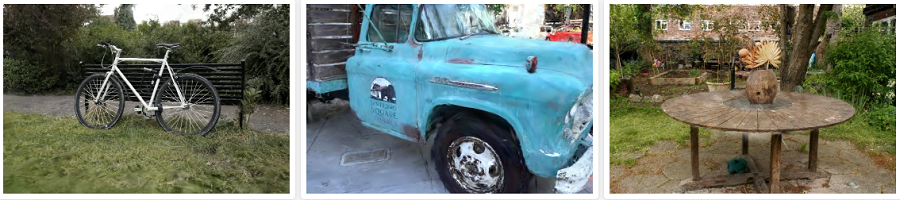

>However, in between these two extremes there are other configurations, that make the data 5x-10x smaller while looking quite okay.

然而，在这两个极端之间，还有其他配置，可以使数据小 5 倍到 10 倍，同时看起来还不错。

>So we are starting at 248 bytes for each splat, and we want to get that down. Note: everywhere here I will be exploring **both** storage and runtime memory usage, i.e. not “file compression”! Rather, I want to cut down on GPU memory consumption too. Getting runtime data smaller also makes the data on disk smaller as a side effect, but “storage size” is a whole another and partially independent topic. Maybe for some other day!

因此，我们从每个 splat 的 248 字节开始，我们希望将其减少。 注意：在这里我将探索存储和运行时内存的使用，即不是“文件压缩”！ 相反，我也想减少 GPU 内存消耗。 减小运行时数据的副作用也会使磁盘上的数据变小，但“存储大小”是另一个完全独立的主题。 也许改天吧！

>One obvious and easy thing to do with the splat data, is to notice that the “normal” (12 bytes) is completely unused. That does not save much though. Then you can of course try making all the numbers be Float16 instead of Float32, this is acceptably good but only makes the data 2x smaller.

使用 splat 数据要做的一件明显且简单的事情是注意“法线”（12 字节）完全未使用。 但这并不能节省太多。 那么你当然可以尝试将所有数字设置为 Float16 而不是 Float32，这还算不错，但只会使数据变小 2 倍。

>You could also throw away all the spherical harmonics data and leave only the “base color” (i.e. SH0), and that would cut down 75% of the data size! This does change the lighting and removes some “reflections”, and is more visible in motion, but progressively dropping SH bands with lower quality levels (or progressively loading them in) is easy and sensible.

你还可以丢弃所有球谐函数数据，只留下“基色”（即 SH0），这将减少 75% 的数据大小！ 这确实会改变照明并消除一些“反射”，并且在运动中更加明显，但逐渐降低质量水平较低的 SH 频段（或逐渐加载它们）是简单且明智的。

>So of course, let’s look at what else we can do :)

当然，让我们看看我们还能做什么:)

## Reorder and cut into chunks 重新排序并切成块

>The ordering of splats inside the data file does not matter; we are going to sort them by distance at rendering time anyway. In the PLY data file they are effectively random (each point here is one splat, and color is gradient based on the point index):

数据文件中 splats 的顺序并不重要； 无论如何，我们将在渲染时按距离对它们进行排序。 在 PLY 数据文件中，它们实际上是随机的，这里的每个点都是一个图块，颜色是基于点索引的渐变：

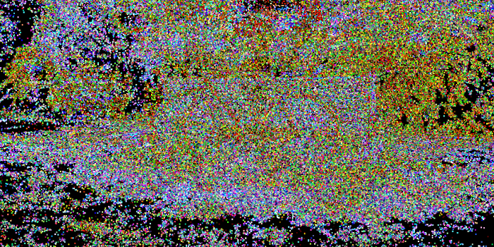

>But we could reorder them based on “locality” (or any other criteria). For example, ordering them in a [3D Morton order](https://en.wikipedia.org/wiki/Z-order_curve), generally, makes nearby points in space be near each other inside the data array:

但我们可以根据“位置”（或任何其他标准）对它们重新排序。 例如，按 [3D Morton 顺序](https://en.wikipedia.org/wiki/Z-order_curve)对它们进行排序通常会使空间中的邻近点在数据数组内彼此靠近：

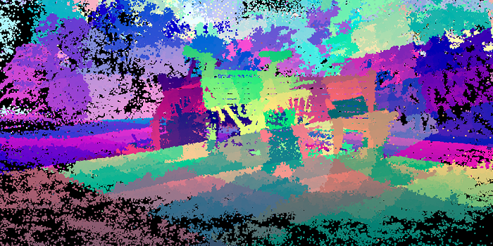

>And then, I can group splats into chunks of N (N=256 was my choice), and hope that since they would generally be close together, maybe they have lower variance of their data, or at least their data can be *somehow* represented in fewer bits. If I visualize the chunk bounding boxes, they are generally small and scattered all over the scene:

然后，我可以将 splats 分组为 N 块（N = 256 是我的选择），并希望由于它们通常会靠近在一起，也许它们的数据方差较低，或者至少它们的数据可以以某种方式表示 更少的位。 如果我想象块边界框，它们通常很小并且分散在整个场景中：

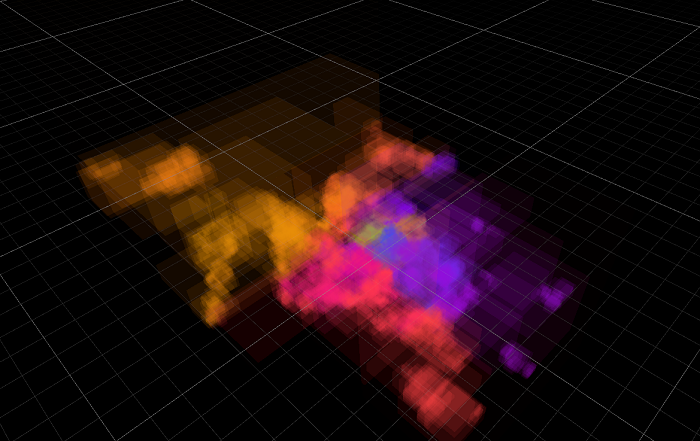

>This is pretty much slides 112-113 of [“Learning from Failure”](https://advances.realtimerendering.com/s2015/#_TESSELLATION_IN_CALL) Dreams talk.

这几乎就是[“从失败中学习”](https://advances.realtimerendering.com/s2015/#_TESSELLATION_IN_CALL)梦想演讲的幻灯片 112-113。

>>Future work: try Hilbert curve ordering instead of Morton. Also try “partially filled chunks” to break up large chunk bounds, that happen whenever the Morton curve flips to the other side.
>
>未来的工作：尝试希尔伯特曲线排序而不是莫顿。 还可以尝试“部分填充块”来打破大块边界，每当莫顿曲线翻转到另一侧时就会发生这种情况。

>By the way, Morton reordering can also make the rendering faster, since even after sorting by distance the nearby points are more likely to be nearby in the original data array. And of course, nice code to do Morton calculations without relying on [BMI](https://en.wikipedia.org/wiki/X86_Bit_manipulation_instruction_set) or similar CPU instructions can be found on [Fabian’s blog](https://fgiesen.wordpress.com/2009/12/13/decoding-morton-codes/), adapted here for 64 bit result case:

顺便说一句，莫顿重新排序还可以使渲染速度更快，因为即使在按距离排序后，附近的点更有可能位于原始数据数组中附近。 当然，可以在 [Fabian 的博客](https://fgiesen.wordpress.com/2009/12/13/decoding-morton-codes/)上找到在不依赖 [BMI](https://en.wikipedia.org/wiki/X86_Bit_manipulation_instruction_set) 或类似 CPU 指令的情况下执行 Morton 计算的好代码，此处针对 64 位结果情况进行了调整：

```cpp
// Based on https://fgiesen.wordpress.com/2009/12/13/decoding-morton-codes/
// Insert two 0 bits after each of the 21 low bits of x
static ulong MortonPart1By2(ulong x)
{
    x &= 0x1fffff;
    x = (x ^ (x << 32)) & 0x1f00000000ffffUL;
    x = (x ^ (x << 16)) & 0x1f0000ff0000ffUL;
    x = (x ^ (x << 8)) & 0x100f00f00f00f00fUL;
    x = (x ^ (x << 4)) & 0x10c30c30c30c30c3UL;
    x = (x ^ (x << 2)) & 0x1249249249249249UL;
    return x;
}
// Encode three 21-bit integers into 3D Morton order
public static ulong MortonEncode3(uint3 v)
{
    return (MortonPart1By2(v.z) << 2) | (MortonPart1By2(v.y) << 1) | MortonPart1By2(v.x);
}
```

## Make all data 0..1 relative to the chunk 使所有数据相对于块为 0..1

>Now that all the splats are cut into 256-splat size chunks, we can compute minimum and maximum data values of everything (positions, scales, colors, SHs etc.) for each chunk, and store that away. We don’t care about data size of that (yet?); just store them in full floats.

现在所有的图块都被切割成 256 个图块大小的块，我们可以计算每个块的所有内容（位置、比例、颜色、SH 等）的最小和最大数据值，并将其存储起来。 我们不关心数据大小（还？）； 只需将它们存储在完整的浮动中即可。

>And now, adjust the splat data so that all the numbers are in 0..1 range between chunk minimum & maximum values. If that is kept in Float32 as it was before, then this does not really change precision in any noticeable way, just adds a bit of indirection inside the rendering shader (to figure out final splat data, you need to fetch chunk min & max, and interpolate between those based on splat values).

现在，调整 splat 数据，使所有数字都在块最小值和最大值之间的 0..1 范围内。 如果像以前一样保留在 Float32 中，那么这并不会以任何明显的方式真正改变精度，只是在渲染着色器内添加一些间接（要计算出最终的 splat 数据，你需要获取块 min 和 max， 并根据 splat 值在它们之间进行插值）。

>Oh, and for rotations, I’m encoding the quaternions in [“smallest three”](https://marc-b-reynolds.github.io/quaternions/2017/05/02/QuatQuantPart1.html#smallest-three) format (store smallest 3 components, plus index of which component was the largest).

哦，对于旋转，我以“最小三个”格式对四元数进行编码（存储最小的 3 个分量，加上最大分量的索引）。

>And now that the data is all in 0..1 range, we can try representing it with smaller data types than full Float32!

现在数据都在 0..1 范围内，我们可以尝试用比完整 Float32 更小的数据类型来表示它！

>But first, how does all that 0..1 data look like? The following is various data displayed as RGB colors, one pixel per splat, in row major order. With positions, you can clearly see that it changes within the 256 sized chunk (it’s two chunks per horizontal line):

但首先，所有 0..1 数据是什么样子的？ 以下是以 RGB 颜色显示的各种数据，每个图一个像素，按行主要顺序。 通过位置，你可以清楚地看到它在 256 大小的块内发生变化（每条水平线有两个块）：

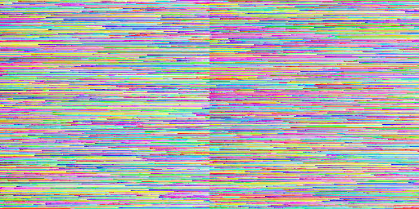

>Rotations do have some horizontal streaks but are way more random:

旋转确实有一些水平条纹，但更加随机：

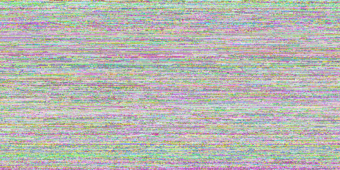

>Scale has some horizontal patterns too, but we can also see that most of scales are towards smaller values:

比例也有一些水平模式，但我们也可以看到大多数比例都朝向较小的值：

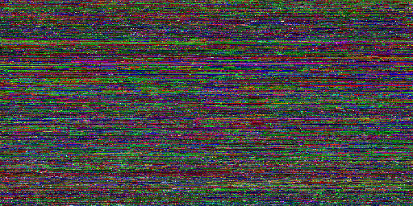

>Color (SH0) is this:

颜色(SH0)是这样的：

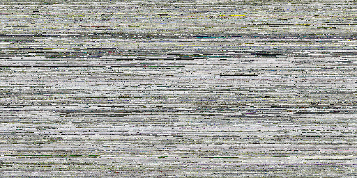

>And opacity is often either almost transparent, or almost opaque:

不透明度通常要么几乎透明，要么几乎不透明：

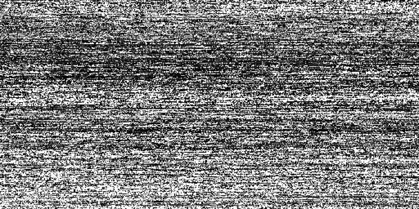

>There’s a lot of spherical harmonics bands and they tend to look like a similar mess, so here’s one of them:

有很多球谐函数带，它们往往看起来像一团乱麻，所以这是其中之一：

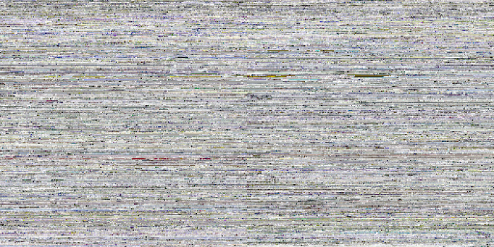

## Hey this data looks a lot like textures! 嘿，这个数据看起来很像纹理！

>We’ve got 3 or 4 values per each “thing” (position, color, rotation, …) that are all in 0..1 range now. I know! Let’s put them into textures, one texel per splat. And then we can easily experiment with using various texture formats on them, and have the GPU texture sampling hardware do all the heavy lifting of turning the data into numbers.

我们为每个“事物”（位置、颜色、旋转……）提供了 3 或 4 个值，现在这些值都在 0..1 范围内。 我知道！ 让我们将它们放入纹理中，每个 splat 一个纹理元素。 然后我们可以轻松地在它们上尝试使用各种纹理格式，并让 GPU 纹理采样硬件完成将数据转换为数字的所有繁重工作。

>We could even, I dunno, use something crazy like use compressed texture formats (e.g. BC1 or BC7) on these textures. Would that work well? Turns out, not immediately. Here’s turning all the data (position, rotation, scale, color/opacity, SH) into BC7 compressed texture. Data is just 122MB (12x smaller), but PSNR is a low 21.71 compared to [full Float32 data](https://aras-p.info/img/blog/2023/gaussian-splat/GsBike_1VeryHigh.jpg):

我不知道，我们甚至可以使用一些疯狂的东西，比如在这些纹理上使用压缩纹理格式（例如 BC1 或 BC7）。 这样效果好吗？ 事实证明，不是立即。 这里将所有数据（位置、旋转、比例、颜色/不透明度、SH）转换为 BC7 压缩纹理。 数据只有 122MB（小 12 倍），但与[完整 Float32 数据](https://aras-p.info/img/blog/2023/gaussian-splat/GsBike_1VeryHigh.jpg)相比，PSNR 低至 21.71：


>However, we know that GPU texture compression formats are block based, e.g. on typical PC the BCn compression formats are all based on 4x4 texel blocks. But our texture data is laid out in 256x1 stripes of splat chunks, one after another. Let’s reorder them some more, i.e. lay out each chunk in a 16x16 texel square, again arranged in Morton order within it.

然而，我们知道 GPU 纹理压缩格式是基于块的，例如 在典型的 PC 上，BCn 压缩格式均基于 4x4 纹素块。 但我们的纹理数据是以 256x1 条带的 splat 块的形式排列的，一个接一个。 让我们对它们进行更多的重新排序，即将每个块布置在 16x16 纹素正方形中，再次按照莫顿顺序排列。

```cpp
uint EncodeMorton2D_16x16(uint2 c)
{
    uint t = ((c.y & 0xF) << 8) | (c.x & 0xF); // ----EFGH----ABCD
    t = (t ^ (t << 2)) & 0x3333;               // --EF--GH--AB--CD
    t = (t ^ (t << 1)) & 0x5555;               // -E-F-G-H-A-B-C-D
    return (t | (t >> 7)) & 0xFF;              // --------EAFBGCHD
}
uint2 DecodeMorton2D_16x16(uint t)      // --------EAFBGCHD
{
    t = (t & 0xFF) | ((t & 0xFE) << 7); // -EAFBGCHEAFBGCHD
    t &= 0x5555;                        // -E-F-G-H-A-B-C-D
    t = (t ^ (t >> 1)) & 0x3333;        // --EF--GH--AB--CD
    t = (t ^ (t >> 2)) & 0x0f0f;        // ----EFGH----ABCD
    return uint2(t & 0xF, t >> 8);      // --------EFGHABCD
}
```
>And if we rearrange all the texture data that way, then it looks like this now (position, rotation, scale, color, opacity, SH1):

如果我们以这种方式重新排列所有纹理数据，那么现在看起来像这样（位置、旋转、缩放、颜色、不透明度、SH1）：

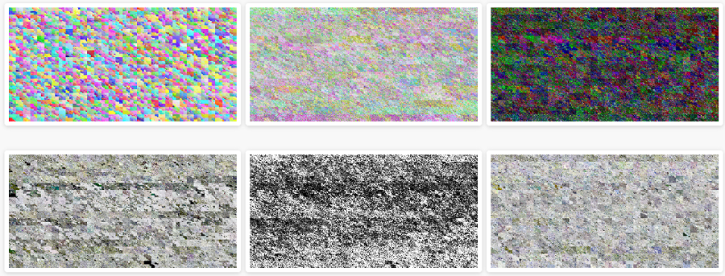

>And encoding all that into BC7 improves the quality quite a bit (PSNR 21.71→24.18):

将所有这些编码到 BC7 中可以大大提高质量（PSNR 21.71→24.18）：


## So what texture formats should be used? 那么应该使用什么纹理格式呢？

>After playing around with a whole bunch of possible settings, here’s the quality setting levels I came up with. Formats indicated in the table below:

在尝试了一大堆可能的设置之后，这是我想出的质量设置级别。 格式如下表所示：

>* F32x4: 4x Float32 (128 bits). Since GPUs typically do not have a three-channel Float32 texture format, I expand the data quite uselessly in this case, when only three components are needed.
>* F16x4: 4x Float16 (64 bits). Similar expansion to 4 components as above.
>* Norm10_2: unsigned normalized 10.10.10.2 (32 bits). GPUs do support this, and Unity almost supports it – it exposes the format enum member, but actually does not allow you to create texture with said format (lol!). So I emulate it by pretending the texture is in a single component Float32 format, and manually “unpack” in the shader.
>* Norm11: unsigned normalized 11.10.11 (32 bits). GPUs do not have it, but since I’m emulating a similar format anyway (see above), then why not use more bits when we only need three components.
>* Norm8x4: 4x unsigned normalized byte (32 bits).
>* Norm565: unsigned normalized 5.6.5 (16 bits).
>* BC7 and BC1: obvious, 8 and 4 bits respectively.

* F32x4：4x Float32（128 位）。 由于 GPU 通常没有三通道 Float32 纹理格式，因此在这种情况下，当只需要三个组件时，我扩展数据毫无用处。
* F16x4：4x Float16（64 位）。 与上面的 4 个组件类似的扩展。
* Norm10_2：无符号标准化 10.10.10.2（32 位）。 GPU 确实支持这一点，并且 Unity 几乎支持它 - 它公开了格式枚举成员，但实际上不允许您使用所述格式创建纹理（哈哈！）。 因此，我通过假装纹理采用单个组件 Float32 格式来模拟它，并在着色器中手动“解包”。
* Norm11：无符号标准化 11.10.11（32 位）。 GPU 没有它，但既然我无论如何都在模拟类似的格式（见上文），那么当我们只需要三个组件时为什么不使用更多的位。
* Norm8x4：4x 无符号标准化字节（32 位）。
* Norm565：无符号标准化 5.6.5（16 位）。
* BC7和BC1：明显，分别是8位和4位。

质量|Pos|Rot|Scl|Col|SH|Compr|PSNR
-|-|-|-|-|-|-|-
极高|F32x4|F32x4|F32x4|F32x4|F32x4|0.8x|
高|F16x4|Norm10_2|Norm11|F16x4|Norm11|2.9x|54.82
中|Norm11|Norm10_2|Norm11|Norm8x4|Norm565|5.2x|47.82
低|Norm11|Norm10_2|Norm565|BC7|BC1|12.2x|34.79
极低|BC7|BC7|BC7|BC7|BC1|18.7x|24.02

>Here are the “reference” (“Very High”) images again (1.42GB, 0.59GB, 1.35GB data size):

以下是“参考”图像，1.42GB、0.59GB、1.35GB 数据大小：

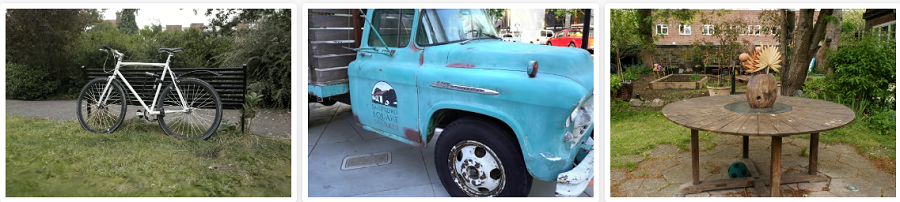

>The “Medium” preset looks pretty good! (280MB, 116MB, 267MB – 5.2x smaller; PSNR respectively 47.82, 48.73, 48.63):

“中等”看起来很棒，280MB, 116MB, 267MB – 缩小5.2倍; PSNR 47.82, 48.73, 48.63:

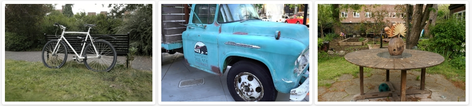

“非常低”则主要供参考； 在如此低的质量下它几乎变得毫无用处，74MB、32MB、74MB – 缩小 18.7 倍；PSNR 24.02、22.28、23.1：

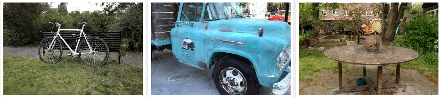

>Oh, and I also recorded an awkwardly-moving-camera video, since people like moving pictures:

[https://youtu.be/0vS3yh908TU](https://youtu.be/0vS3yh908TU)

## Conclusions and future work 结论和未来的工作

>The gaussian splatting data size (both on-disk and in-memory) can be fairly easily cut down 5x-12x, at fairly acceptable rendering quality level. Say, for that “garden” scene 1.35GB data file is “eek, sounds a bit excessive”, but at 110-260MB it’s becoming more interesting. Definitely not small yet, but way more within being usable.

高斯泼溅数据大小（磁盘上和内存中）可以相当容易地减少 5 倍到 12 倍，渲染质量水平相当可接受。 比如说，对于“花园”场景，1.35GB 数据文件“哎呀，听起来有点过分”，但在 110-260MB 时，它变得更有趣。 绝对还不算小，但更实用。

>I think the idea of arranging the splat data “somehow”, and then compressing them not by just individually encoding each spat into smaller amount of bits, but also “within neighbors” (like using BC7 or BC1), is interesting. Spherical Harmonics data in particular looks quite ok even with BC1 compression (it helps that unlike “obviously wrong” rotation or scale, it’s much harder to tell when your spherical harmonics coefficient is wrong :)).

我认为“以某种方式”排列 splat 数据，然后不仅通过将每个 splat 单独编码为更少量的位，而且还“在邻居内”（例如使用 BC7 或 BC1）来压缩它们，这一想法很有趣。 特别是，即使使用 BC1 压缩，球谐函数数据看起来也相当不错（与“明显错误”的旋转或缩放不同，它有助于判断球谐函数系数何时出错:)）。

>There’s a bunch of small things I could try:

我可以尝试很多小事情：

>* Splat reordering: reorder splats not only based on position, but also based on “something else”. Try Hilbert curve instead of Morton. Try using not-fully-256 size chunks whenever the curve flips to the other side.
>* Color/Opacity encoding: maybe it’s worth putting that into two separate textures, instead of trying to get BC7 to compress them both.
>* I do wonder how would reducing the texture resolution work, maybe for some components (spherical harmonics? color if opacity is separate?) you could use lower resolution texture, i.e. below 1 texel per splat.

* Splat 重新排序：不仅根据位置重新排序 splat，还根据“其他内容”重新排序。 尝试希尔伯特曲线而不是莫顿曲线。 每当曲线翻转到另一侧时，尝试使用不完全 256 大小的块。
* 颜色/不透明度编码：也许值得将其放入两个单独的纹理中，而不是尝试让 BC7 压缩它们。
* 我确实想知道如何降低纹理分辨率，也许对于某些组件（球面谐波？颜色，如果不透明度是独立的？）您可以使用较低分辨率的纹理，即每个splat低于1个纹素。

>And then of course there are larger questions, in a sense of whether this way looking at reducing data size is sensible at all. Maybe something along the lines of “[Random-Access Neural Compression of Material Textures](https://research.nvidia.com/labs/rtr/neural_texture_compression/)” (Vaidyanathan, Salvi, Wronski 2023) would work? If only I knew anything about this “neural/ML” thing :)

当然，还有更大的问题，从某种意义上说，这种减少数据大小的方式是否明智。 也许类似于“材质纹理的随机访问神经压缩”（Vaidyanathan、Salvi、Wronski 2023）的东西会起作用？ 如果我对“神经/机器学习”这个东西有所了解就好了:)

>All my code for the above is in this [PR](https://github.com/aras-p/UnityGaussianSplatting/pull/3) on github (merged 2023 Sep).

我的上述所有代码都在 github 上的[这个 PR](https://github.com/aras-p/UnityGaussianSplatting/pull/3)中。