# 3DGS转Mesh方法汇总

## 把3DGS和SDF对应起来，然后应用SDF转Mesh的方法

前置知识：
* [Marching Cube](./MarchingCube.md)
* [Marching Tetrahedra](./MarchingTetrahedra.md)

### GOF

## 把3DGS作为深度测量的手段，然后应用多视角深度融合方法

3DGS -> 渲染深度图 -> [TSDF fusion](TSDF.md) -> [Marching Cubes](MarchingCube.md) -> Mesh

3DGS -> 渲染深度图 -> 对深度图算梯度提取法线 -> [Poisson Surface Reconstruction](PoissonRecon.md) -> [Marching Cubes](MarchingCube.md) -> Mesh

3DGS -> 渲染深度图和法线 -> [Poisson Surface Reconstruction](PoissonRecon.md) -> [Marching Cubes](MarchingCube.md) -> Mesh

这个模式最重要的地方在于要让3DGS渲染出正确的深度值。
所以这类论文的优化主要都是在优化深度正确性。

### (CVPR 2024) SuGaR：把“棉花团”压扁

### (SIGGRAPH 2024) 2D Gaussian Splatting：把“棉花团”换成“薄纸片”

3D Gaussian 是有厚度的椭球。即使它靠近真实表面，也无法明确说“椭球内部哪一层才是表面”。

核心insight：想获得稳定深度，最好让 primitive 本身就有明确表面，而不是从一个有厚度的体积中事后解释表面。

2DGS 直接把椭球压成一张有方向的二维 Gaussian disk：

>真实场景主要由薄表面组成，因此直接用薄表面 primitive，而不是先用体积 blob，再猜表面在哪里。

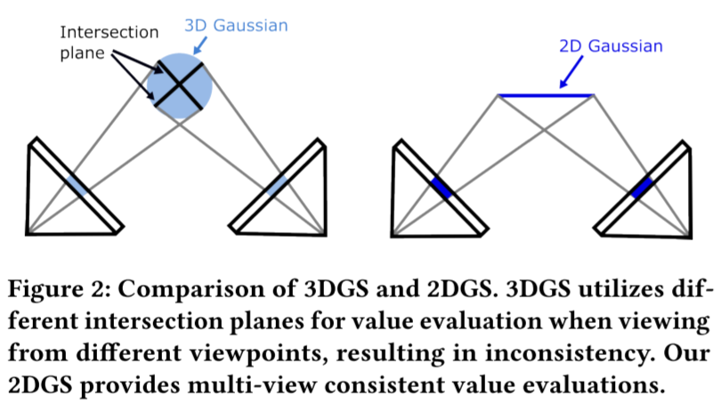

对每个像素，它不再简单使用 Gaussian 中心计算深度，而是计算相机射线与这张 2D Gaussian disk 的真实交点，使得同一个 disk 在不同像素处能够产生不同深度。

它还加入：
* depth distortion loss：让同一条射线上参与渲染的 2DGS 聚集到同一表面附近
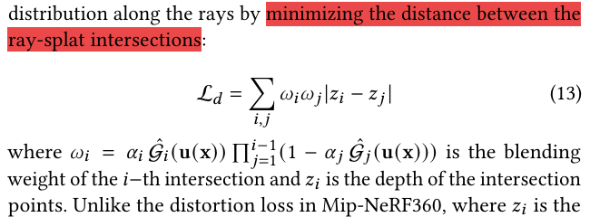
* normal consistency：把每个 2DGS 的法线按渲染权重分别对齐到深度图导出的表面法线（深度的梯度），从而让 2DGS 法线与深度图导出的法线一致
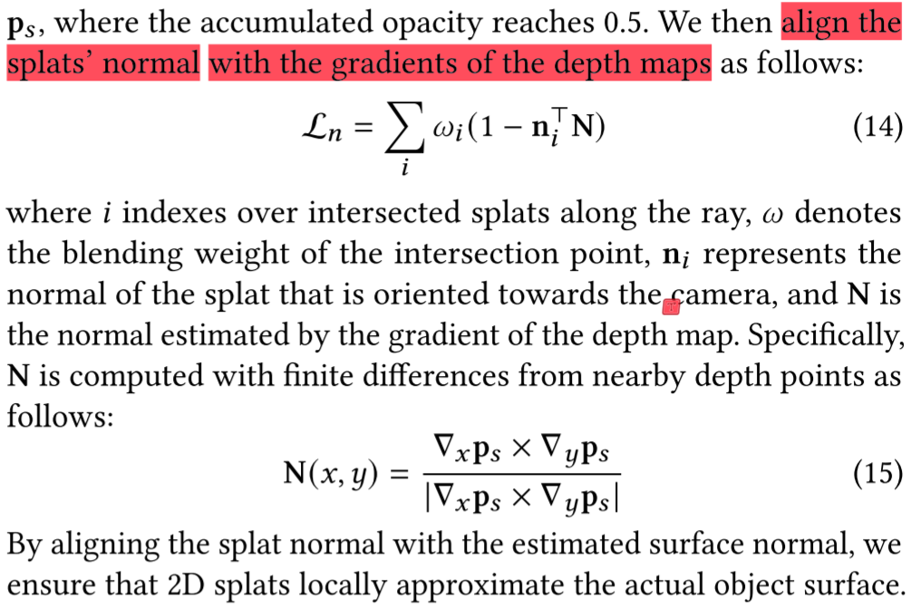

最后从训练视角渲染出深度图，用[TSDF fusion](TSDF.md)提取Mesh：
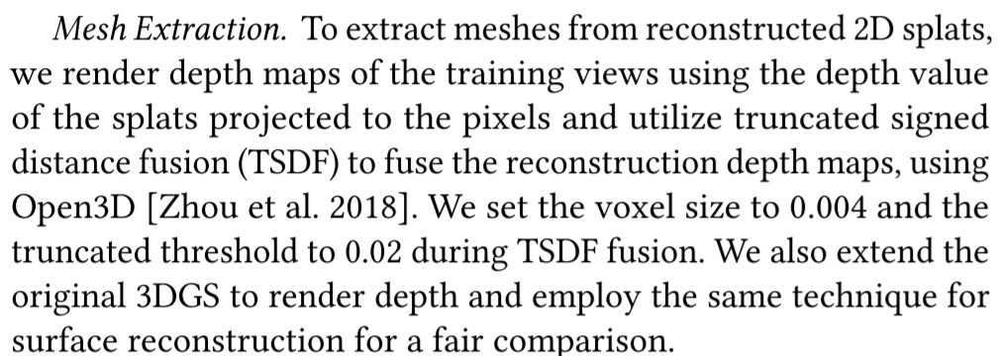

当然也可以从训练视角渲染出深度图和法线，用[Poisson Surface Reconstruction](PoissonRecon.md)提取Mesh，不过论文里用的[TSDF fusion](TSDF.md)。

作为最早一批探索 3DGS转Mesh方法的论文，2DGS 成为后续方法的重要基线：

* RaDe-GS 直接采用其 depth distortion 和 normal consistency；
* QGS 将二维平面 disk 推广成可弯曲的二次曲面；
* AGS-Mesh 将自己的先验过滤和 meshing 方法直接实现到 2DGS 上；
* PGSR 证明其多视角正则也可以直接用于 2DGS。

### (SIGGRAPH 2024) Gaussian Surfels：把椭球压成零厚度，并清理轮廓处的“幽灵深度”

和 2DGS 很接近，也是定义法向量且把 3DGS 的一个轴长度设为0，使其变成 2D Gaussian disk。

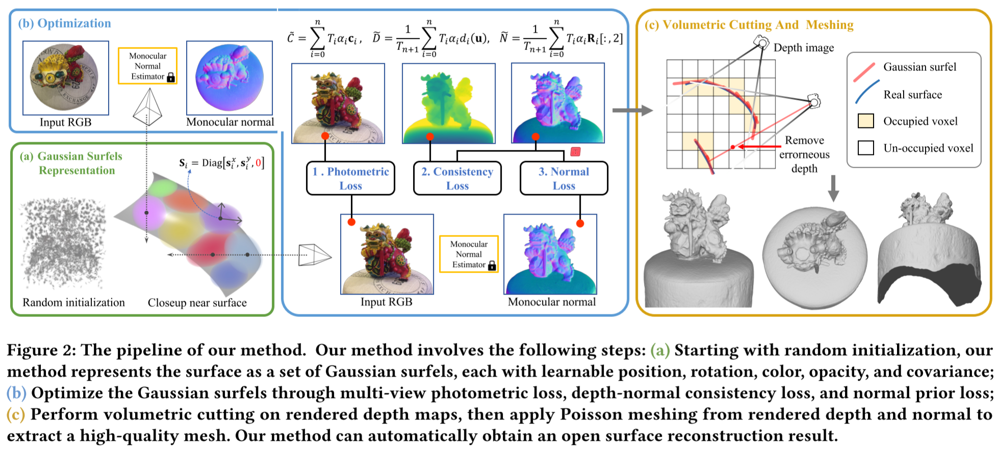

和 2DGS 的不同之处在于，其加入了不同的loss：
* Depth-normal consistency loss 对渲染得到的深度和法线计算loss，强制他们保持一致
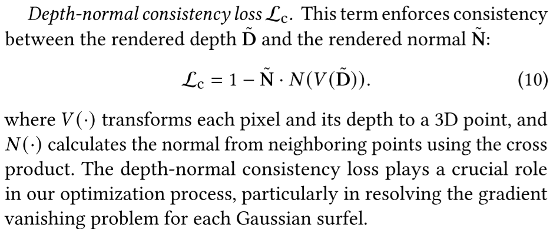
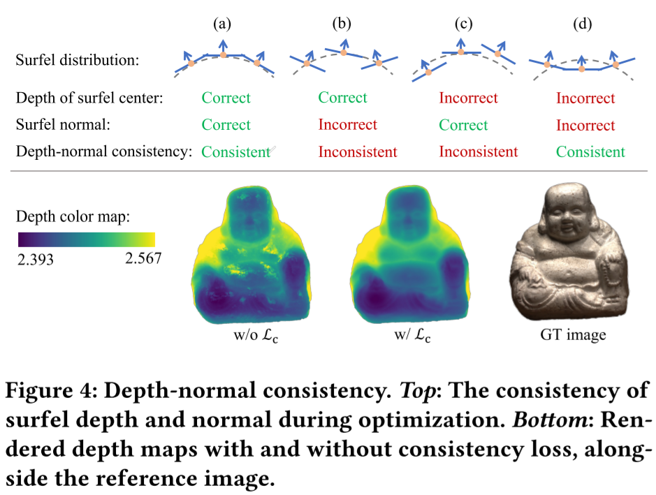
* Normal-prior loss 用外部法线告诉模型表面大致朝哪边，本文是先用一个深度估计模型 Omnidata 从训练视角图像中提取法线，再以此个渲染出的法线算loss
* Opacity loss 强制 Gaussian 的透明度分布在0附近或者1附近。

此外，Gaussian Surfels还有一个核心创新点是深度图渲染后执行[Poisson Surface Reconstruction](PoissonRecon.md)之前的点云清理操作。

本文发现，即使 surfel 是平面的，Gaussian 在二维平面内仍有无限衰减尾部。轮廓附近，一条本应看到背景的射线可能受到前景 surfel 尾部的一点 alpha 影响，产生位于前景附近的错误深度点。

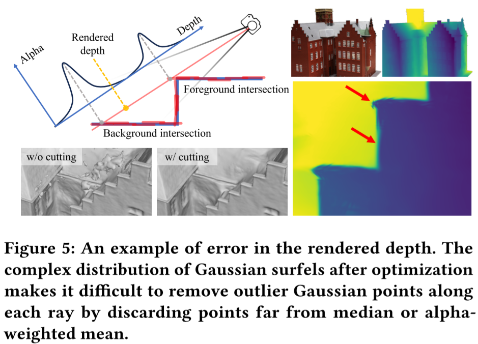

本文的解决方法是先根据所有 surfels 的空间覆盖情况建立一个体积支持区域，再删除那些落在低支持区域中的反投影深度点。具体来说，先将场景划分为$512^3$的网格，对于其中的每个体素，计算其相交的 Gaussian Surfels 在此处的透明度并累加。如果最后累计的透明度小于一定阈值，就标注为un-occupied，之后如果深度渲染结果中有点落在这个un-occupied体素内，这个点就不进入[Poisson Surface Reconstruction](PoissonRecon.md)。

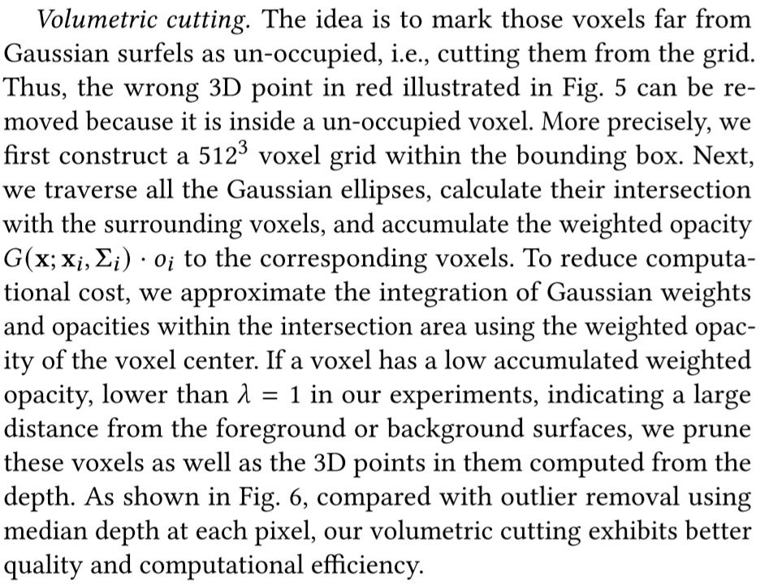

结果显示这种方式可以显著降低[Poisson Surface Reconstruction](PoissonRecon.md)重建结果中的错误。

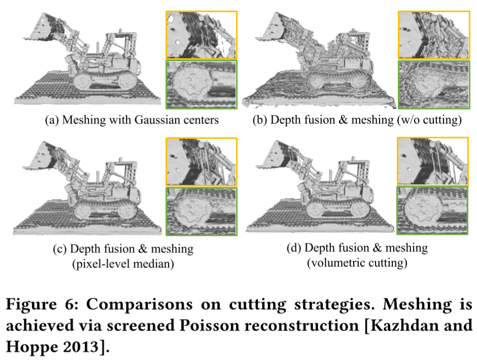

最后从训练视角渲染出深度图和法线，用[Poisson Surface Reconstruction](PoissonRecon.md)提取Mesh。

### (2024 arxiv 完稿 ACM ToG 2026 录取) RaDe-GS - 不必把 3D Gaussian 压平，只需正确读取它的深度

RaDe-GS 对 2DGS 提出了反驳：3DGS 本身未必有问题，3DGS 的错误可能主要来自“用 Gaussian 中心深度代表整个投影区域”的做法，不需要修改 3DGS 的底层表示。

原版 3DGS 在渲染时时先将 3DGS 在成像平面上拍扁，并以 Gaussian 椭球中心的深度作为整个拍扁后的椭圆深度。

而 RaDe-GS 则进一步考虑相机发出的射线穿过 Gaussian 椭球时，其射线方向上的透明度，将透明度最高的点定义为深度：

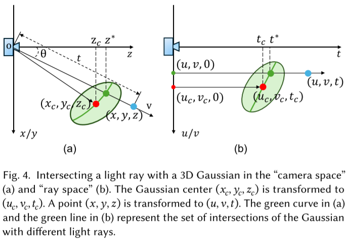

通俗地说：

> 射线穿过椭球时，找它经过该椭球“最浓”的位置，而不是把整个椭球都记成中心的深度。

累计深度使用考虑透明度的 median depth 计算。

论文进一步发现，在 3DGS 的局部仿射投影近似下，这些深度可以写成适合光栅化的平面形式，不需要昂贵的逐射线 ray tracing，所以速度也挺快。

RaDe-GS 的核心创新点在渲染过程。
其训练过程明确复用了 2DGS 的 depth distortion loss 和 normal consistency loss。

### (IEEE TVCG 2024) PGSR：单视图深度正确还不够，必须让相邻相机互相核验

PGSR 的核心创新点有两个：
* unbiased depth
* multi-view regularization loss

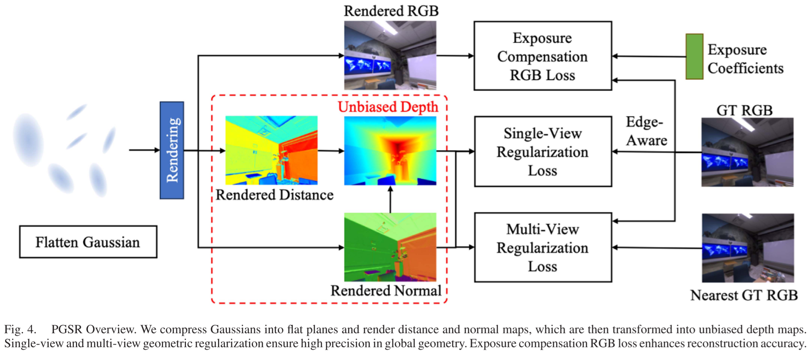

和 2DGS Gaussian Surfels 一样，PGSR 也把3DGS拍扁成平面 disk。
但不是直接把一个轴设为0，而是设置了一个loss强制拉低最短轴长。

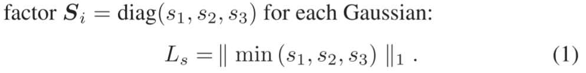

#### unbiased depth

在渲染深度方面，PGSR 并没有先计算射线每个平面的交点深度，再平均这些深度，而是提出 unbiased depth 先对平面做平均算出一个“平均平面”，再计算射线对这个“平均平面”的交点深度。

具体来说，PGSR 人为规定了一个短轴方向，这个短轴方向可以看成是法线，根据法线方向和 Gaussian 位置，每个 Gaussian 都可以写出一个平面方程。
对于从相机发出的每个射线，其相交的每个 Gaussian 都能写一个平面方程，PGSR 的策略是先对这些平面方程的参数求alpha-blending，再求这个alpha-blending后的“平均平面”和射线的交点。

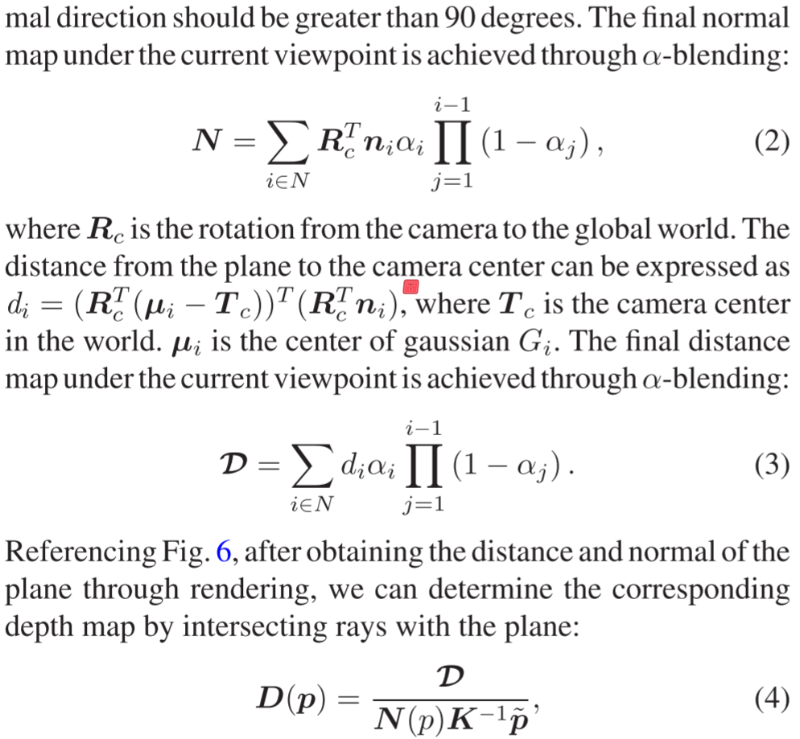

由于求射线相交的计算过程中有个除法，平面方程的参数求alpha-blending之后进入这个除法会导致alpha-blending算出的透明度项在一定程度上被抵消。

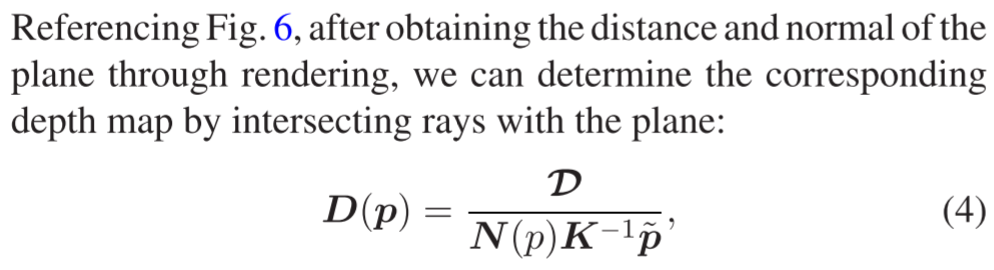

**所以两条射线从不同方向穿过同一批 3DGS，其相交的平面必然相同。**
这就是该方法称为 unbias depth 的原因。
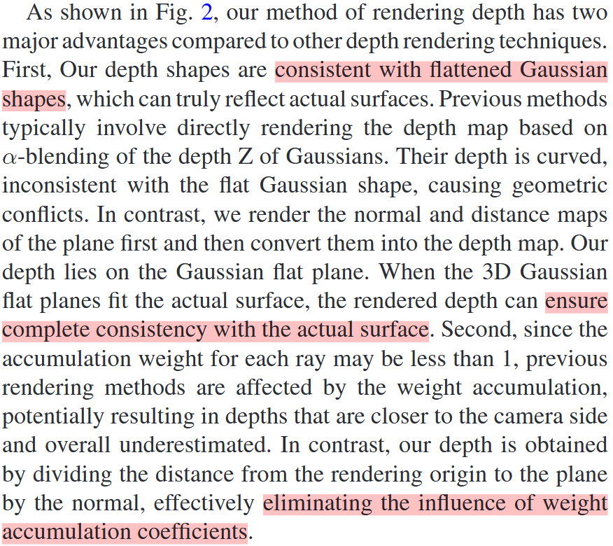

那么很明显，这个方法的优势在于多视角稳定性，这就联系其本文的第二个核心创新点了：multi-view regularization loss 让多视角互相核验Mesh。

#### multi-view regularization loss

multi-view regularization loss 包含两块：多视图几何一致性和多视图光度一致性。

##### 多视图几何一致性

**多视图几何一致性**的核心思想是让同一个表面必须能来回投影。其主要流程是：
先渲染某个视角，获取每个参考像素的深度值，然后根据渲染得到的深度和相机位姿投影到另外一个视角上：
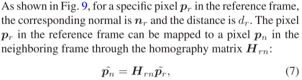
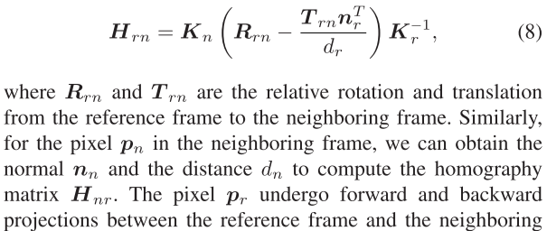
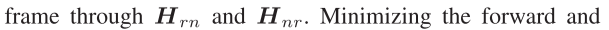
然后在这个另外视角上的投影位置读取渲染得到的深度值，再投影回来，这样一来一回得到的就能得到一个像素位置误差：
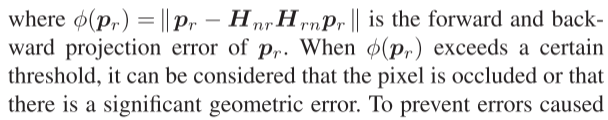
就是多视图几何一致性loss：
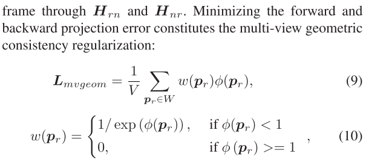

这个 loss 的实际作用是要求参考视图认为某像素位于某个局部平面上；邻居视图也必须在对应位置预测出同一个三维表面。

另外，本文还考虑了遮挡的情况，如果重投影误差过大，则推测该像素在另一个视角可能位于被遮挡的位置。PGSR 针对这种情况给loss项设置了一个权重，重投影误差越大权重越小。
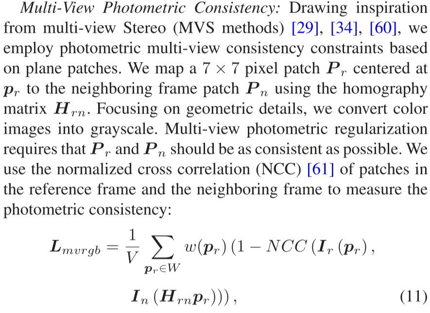

##### 多视图光度一致性

仅靠几何循环仍可能存在一个问题：两张深度图可以彼此一致，但共同收敛到了错误表面。因此 PGSR 再加入 MVS 风格的 **多视图光度一致性** patch photometric consistency。

这个算法在colmap里有类似的，就是在一个视角里取一个patch投影到另一个视角，和另一个视角的对应区域内的像素比较，计算normalized cross correlation (NCC)：

除此之外，PGSR 还加了和 Gaussian Surfels 一样的 Depth-normal consistency loss，只不过多加了一项图像梯度，使得颜色梯度大的区域loss小。文章中说是为了避免物体边缘梯度太大。

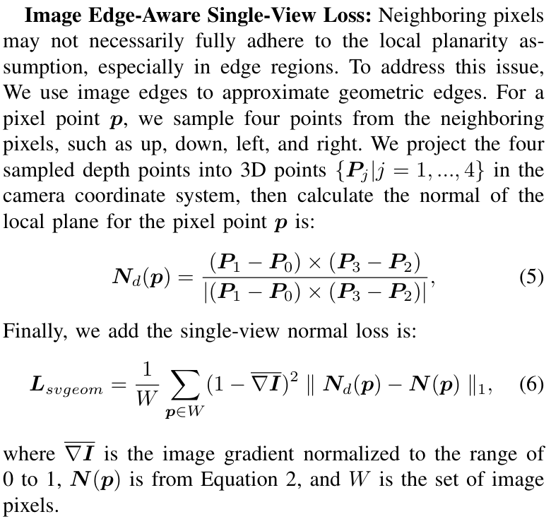

### (Eurographics 2026) GS-2M 显式建模材质有利于外观优化

GS-2M 在 PGSR 基础上进一步改进，主要针对反光表面的问题，设计了一种 Mesh 和材质联合优化的方法。

GS-2M 的几何基础基本建立在 PGSR 上。相比于 PGSR，GS-2M 在多视图几何一致性和多视图光度一致性的基础上进一步增加了多视角法线一致性。
PGSR 原本的几何约束主要检查像素重投影误差。GS-2M 指出，两个错误但彼此配合的深度值，也可能产生较小的重投影误差。
因此它进一步比较参考视图与邻居视图中同一三维点的法线，要求不仅两个视图认为表面点的位置一致，还要认为该点的朝向一致。
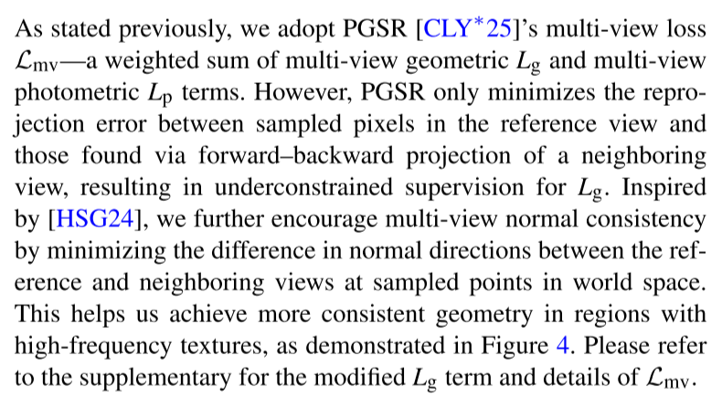

另外，PGSR 主要通过较大的重投影误差间接判定遮挡，GS-2M 则通过显式地比较深度来判定遮挡。
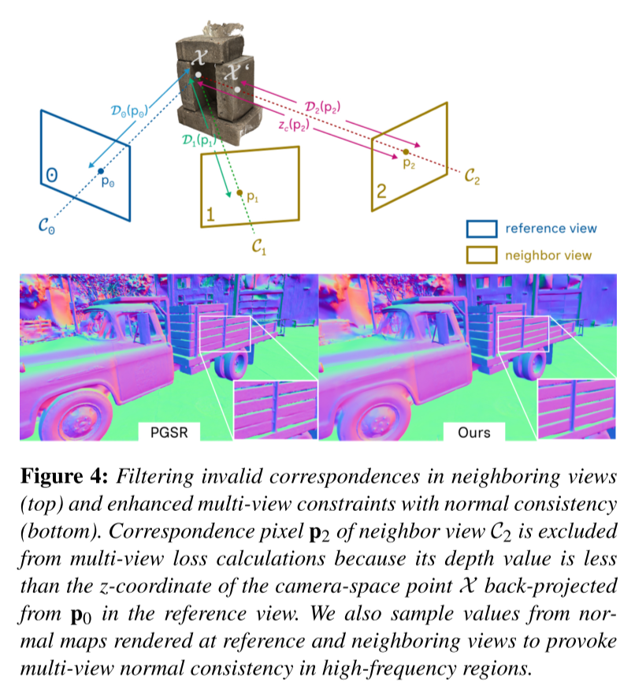

#### 材质表示和渲染流程

为了表示材质，GS-2M 给每个 Gaussian 增加一个 albedo 参数和一个 roughness 参数，用 PBR renderer 进行渲染，并采用 Cook-Torrance microfacet BRDF 计算光线的扩散和高光。
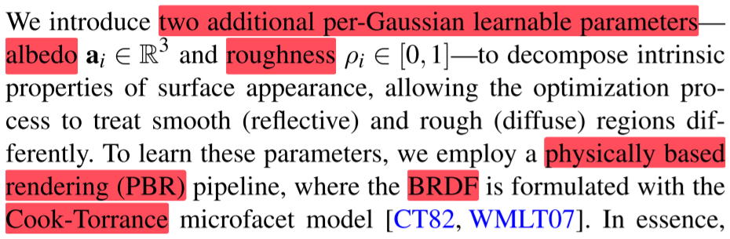
使用可微 environment cubemap 表示环境光照。
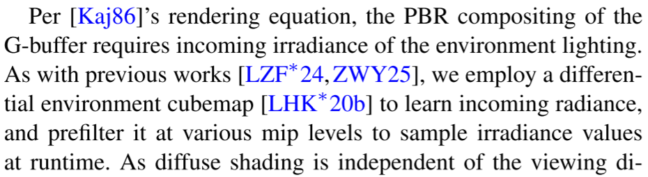
在渲染时对 albedo 参数和 roughness 参数进行alpha-blending，得到 albedo map、roughness map、normal map、depth map、alpha map。没有独立学习 metallic，而是使用 1 - roughness map 作为 metallic map。
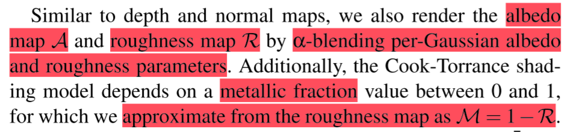
进入 PBR renderer 和 Cook-Torrance BRDF 渲染后再 composite 得到最终渲染结果。
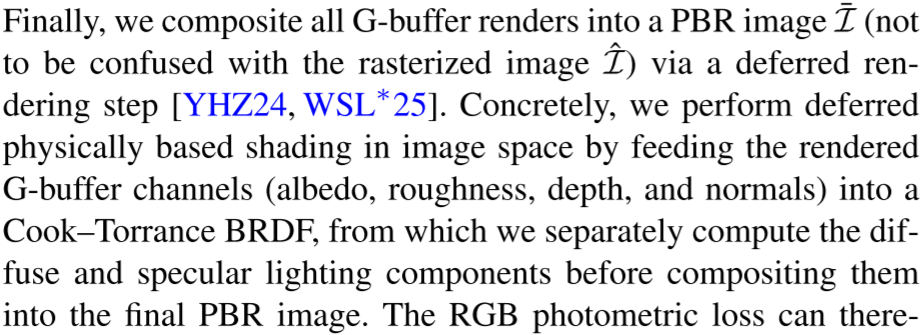

#### 多视角外观变化监督 roughness

GS-2M 最核心的创新在于利用**多视角外观变化监督 roughness**。
仅靠 PBR 渲染结果的 RGB loss 无法可靠分解 image → geometry + albedo + roughness + lighting，因为同一张图像可以被很多组合解释：albedo 变亮/环境光变亮/roughness 变小/法线转向光源/Gaussian 移动/高光被写入 albedo。因此，GS-2M 为 roughness 引入多视角外观变化作为监督信号。

这个监督信号在 PGSR 的多视图光度一致性基础上实现。在多视图光度一致性计算中，如果几何正确且表面近似漫反射，那么 patch 投影到另一个视角的另一个视角的对应区域像素应该相似；如果表面强烈反光，相机位置变化会导致高光图案变化，即使几何完全正确，patch 仍然可能不相似。

GS2M 的多视角 roughness 监督使用 NCC error 构造了一个二分类器。
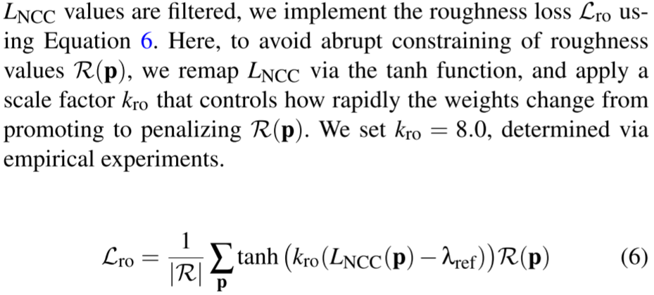

当 NCC error 较大，$L_{\mathrm{NCC}}>\lambda_{\mathrm{ref}}$，则$\tanh(\cdot)<0$，最小化$\text{negative}\times\rho$会将$\rho$向较小值推，即判定为光滑、反光表面。

当 NCC error 较小，$L_{\mathrm{NCC}}<\lambda_{\mathrm{ref}}$，则$\tanh(\cdot)<0$，最小化$\text{negative}\times\rho$会将$\rho$向较大值推，即判定为粗糙、漫反射表面。

此外，NCC计算本身还有缺陷。NCC公式分母是像素的方差。对于方差很低的平滑区域，NCC计算结果会爆炸。对于这些区域，本文将NCC计算换成梯度计算。

#### 更重要但论文没有特别强调的设计：roughness 反向决定几何约束

仅仅预测 roughness 还不足以改善 mesh。关键是 roughness 如何反馈给几何。

公开代码显示了两个重要耦合。

##### Roughness-weighted normal TV

代码使用 $w_n=1-\rho$ 作为 normal TV 的权重。

因此：

* 低 roughness、高反射区域：$w_n$ 大，强烈平滑法线；
* 高 roughness、漫反射区域：$w_n$ 小，允许更多法线细节。

逻辑是：

> 对一个光滑反射物体，如果局部法线到处乱跳，那么这些法线很可能是在拟合移动的高光，而不是真实的几何起伏。

所以 GS-2M 在低粗糙度区域加强 $\mathcal L_{\mathrm{tv-normal}}$，再通过 $\mathcal L_{\mathrm{dn}}$ 把平滑后的法线约束传回深度和 Gaussian 几何。

论文明确将这种 roughness-weighted normal TV 作为修复 distorted/non-watertight surfaces 的手段。

##### Roughness-weighted photometric consistency

公开实现中还有一个很关键的细节：$w_{\mathrm{NCC}} \leftarrow w_{\mathrm{NCC}}\rho^2$。

也就是说，在 material stage：

* 高 roughness、漫反射区域：强制多视图 patch 一致；
* 低 roughness、镜面区域：弱化多视图 photometric loss。

这是非常合理的，因为 photometric constancy 主要对漫反射表面成立，而对镜面表面本来就不成立。

所以 roughness 在 GS-2M 中不只是输出材质图，而是一个**约束可信度开关**：

* $\rho$高$\Rightarrow$相信跨视图颜色一致性；
* $\rho$低$\Rightarrow$不要强迫高光在不同视图中对齐。

这使优化器不再需要通过扭曲几何来消除高光移动造成的 NCC error。该实现细节在论文主文中不算突出，但从公开代码看，是 GS-2M 中技术价值很高的部分。

### (2026 arxiv) Geometry-Grounded GS

### 其他相关方法

(WACV 2025) DN-Splatter 给原版 3DGS 加上各种 loss 函数，从而更好利用深度数据和法线数据训练 3DGS。

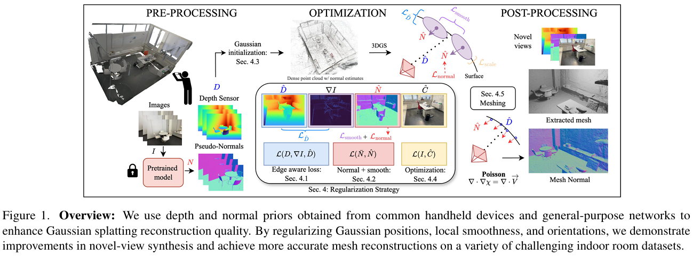

(ECCV 2024 Workshops，Wild3D) GS2Mesh 不相信 Gaussian 几何，只相信它合成新图像的能力，在在每个原始相机附近生成水平偏移的虚拟相机做传统双目测距。

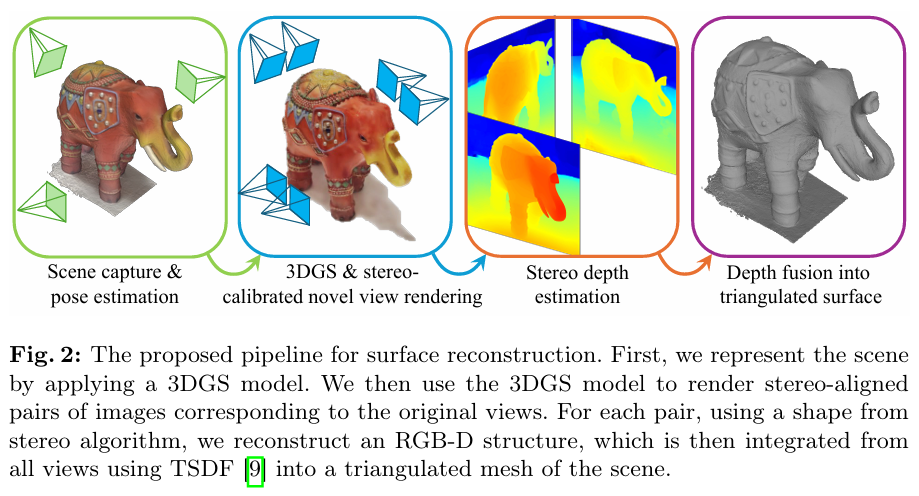

(ICCV 2025) QGS 改进 2DGS，将平面 disk 推广成可变形的 quadric surface，例如椭圆曲面或抛物面。2DGS 和 PGSR 都用局部平面近似表面。对于大平面很合适，但圆球、雕塑、弯曲边缘需要很多小平面才能逼近。所以与其用很多小平面拼出曲面，不如让一个 primitive 自身带曲率。

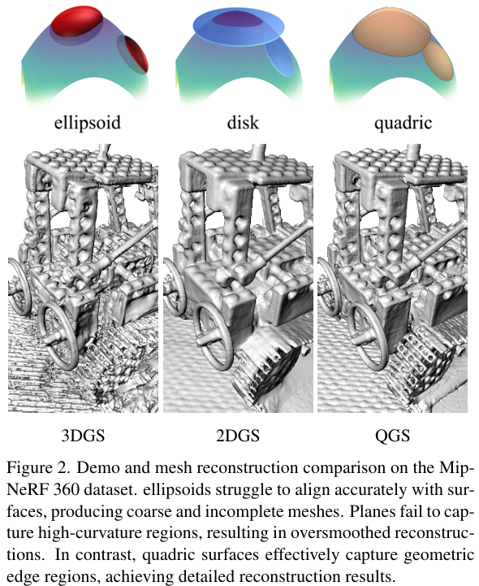

## 把3DGS作为生成定向点云的手段，然后应用定向点云转Mesh的方法

3DGS -> 渲染深度图+法线 -> [Poisson Surface Reconstruction](PoissonRecon.md) -> [Marching Cubes](MarchingCube.md) -> Mesh

## 把3DGS作为生成点云的手段，然后应用点云转Mesh的方法

前置知识：
* [Delaunay Tetrahedralization](DelaunayTetrahedralization.md)

## 把3DGS绑定在Mesh上

### (CVPR 2024) SuGaR
