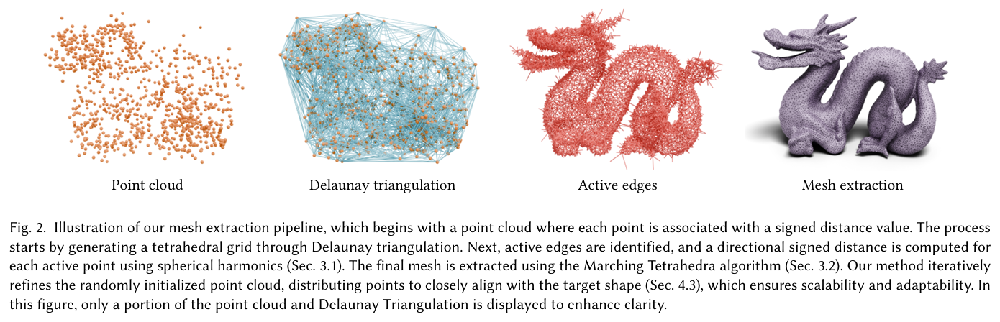
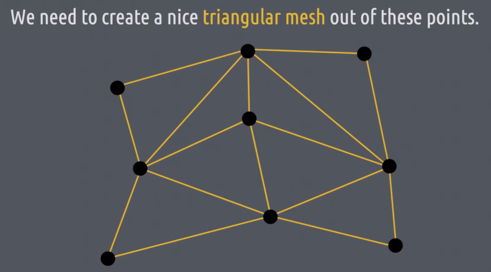
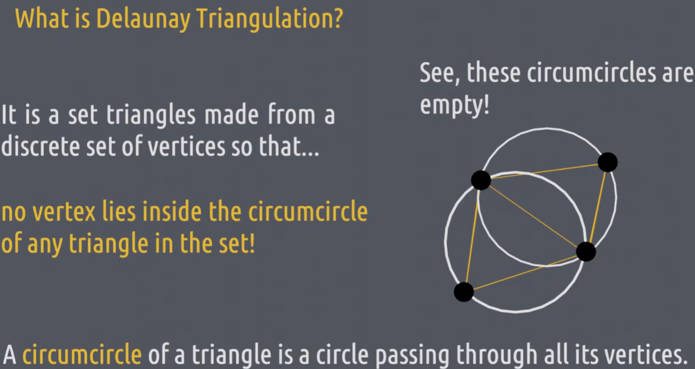
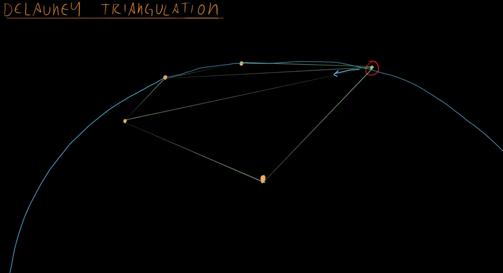
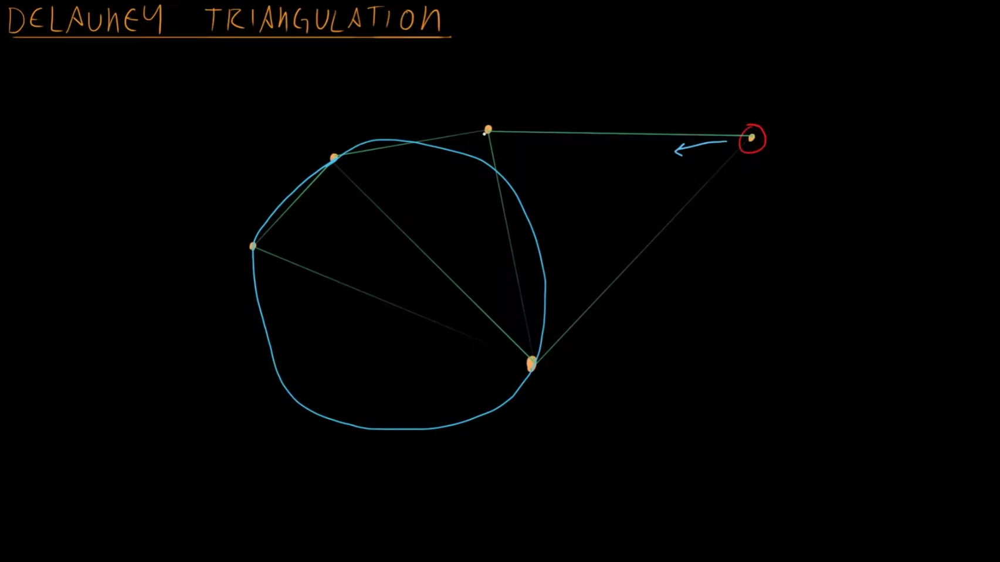

# Delaunay Triangulation 和 Delaunay Tetrahedralization

Delaunay Triangulation 的目标是从任意点云中找到一种无相交边的点连接方式，从而构造出不重合三角面：

其算法的核心思想是找外接圆：

对于每个点，都以这个点为顶点往其他方向发出一个圆，只要这个圆框住另外两个点构成这三个点的外接圆且内部不包含其他点，那这三个点就能连成一个 Delaunay Triangle。不断这样找 Delaunay Triangle，最后Delaunay Triangle必然能连接上全部的点。

注意，将点连接为不重合三角面的方式并不唯一，比如下面的这种情况：

虽然确实连成了不重合三角面，但是其中有外接圆包含其他点，所以不是 Delaunay Triangle。得这样才对：

在三维中，也能用类似的方法找四个点的外接球，这样每四个点构成一个四面体因此称为 Delaunay tetrahedralization。

<video poster="" id="toast" autoplay="" controls="" muted="" loop="" playsinline="" width="100%"><source src="./i/Delaunay.mp4" type="video/mp4"></video>

Delaunay Triangulation 和 Delaunay Tetrahedralization 可以为任意点云找出一种连接方式，但光有连接还不够，连接只能给出一个外接的凸包，具体里面这些面哪些是表面还需要进一步操作。
具体来说，为了找到哪些面是表面，还需要给每个 Delaunay 顶点设置一个类似 [SDF](SDF.md) 的标量值指示该点位于物体内还是物体外以及其距离表面的距离。
已知了该标量值，则可以调用 [Marching Tetrahedra](MarchingTetrahedra.md) 给出 Mesh：

上图中的 active edges 其实就是在做 Marching Tetrahedra。
active edges 是指穿过 Mesh 的那些 edges，只需要判定 edge 两端一个在物体内一个在物体外即可找到。
找到 active edges 可以预先删选一批穿过 Mesh 的 Tetrahedra，后续 Marching Tetrahedra 只需要在这些 edges 所连接的 Tetrahedra 上进行即可，可以节约计算量。
