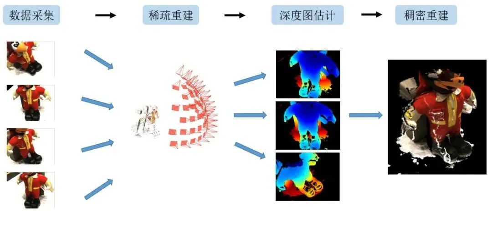
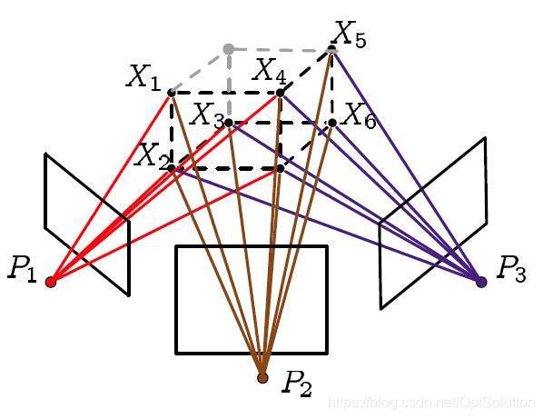
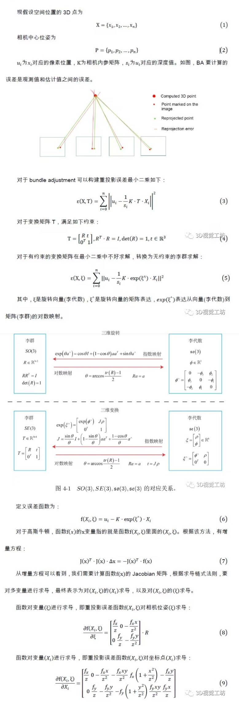
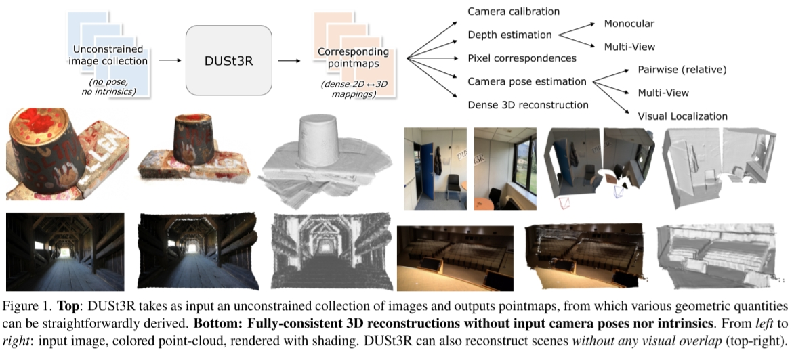
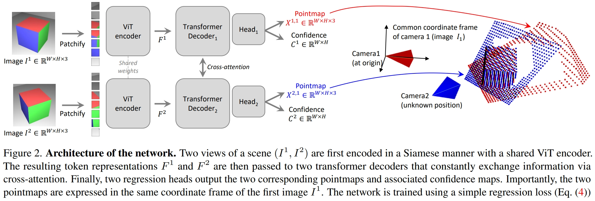
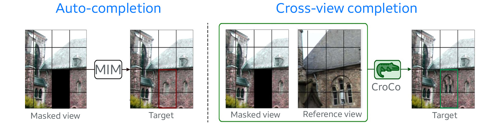

# Dense Reconstruction in Multi View Stereo (MVS)

一言以蔽之，Dense Reconstruction就是根据输入的RGB图像和稀疏重建结果重建出高密度点云。
其中包括深度图估计、点云融合及过滤操作。



## Colmap中的Dense Reconstruction


在[《【摘录】相机位姿估计相关代码解读》](./相机代码.md)的开头我们进行了相机位姿估计并生成了稀疏点云，还基于估计出的相机参数将输入图像扭回了针孔相机模式。
接下来即可在Colmap中进行Dense Reconstruction。

还记得`image_undistorter`生成了两个`.sh`文件？里面就写着Dense Reconstruction的例程。

`run-colmap-geometric.sh`:

```sh
# You must set $COLMAP_EXE_PATH to 
# the directory containing the COLMAP executables.
$COLMAP_EXE_PATH/colmap patch_match_stereo \
  --workspace_path . \
  --workspace_format COLMAP \
  --PatchMatchStereo.max_image_size 2000 \
  --PatchMatchStereo.geom_consistency true
$COLMAP_EXE_PATH/colmap stereo_fusion \
  --workspace_path . \
  --workspace_format COLMAP \
  --input_type geometric \
  --output_path ./fused.ply
$COLMAP_EXE_PATH/colmap poisson_mesher \
  --input_path ./fused.ply \
  --output_path ./meshed-poisson.ply
$COLMAP_EXE_PATH/colmap delaunay_mesher \
  --input_path . \
  --input_type dense \
  --output_path ./meshed-delaunay.ply
```

`run-colmap-photometric.sh`:

```sh
# You must set $COLMAP_EXE_PATH to 
# the directory containing the COLMAP executables.
$COLMAP_EXE_PATH/colmap patch_match_stereo \
  --workspace_path . \
  --workspace_format COLMAP \
  --PatchMatchStereo.max_image_size 2000 \
  --PatchMatchStereo.geom_consistency false
$COLMAP_EXE_PATH/colmap stereo_fusion \
  --workspace_path . \
  --workspace_format COLMAP \
  --input_type photometric \
  --output_path ./fused.ply
$COLMAP_EXE_PATH/colmap poisson_mesher \
  --input_path ./fused.ply \
  --output_path ./meshed-poisson.ply
$COLMAP_EXE_PATH/colmap delaunay_mesher \
  --input_path . \
  --input_type dense \
  --output_path ./meshed-delaunay.ply
```

其中的四个指令分别是：
* `patch_match_stereo`深度估计: 利用 Patch Match 在输入图像之间进行Patch匹配从而估计深度。这一步会在`stereo/depth_maps`和`stereo/normal_maps`中生成深度图和法线图
* `stereo_fusion`多目融合: 每张深度图都对应一个点云，这一步把各图像的点云融合成一个点云
* `poisson_mesher`: 一种网格生成算法，使用 Poisson 表面重建生成彩色点云 Mesh
* `delaunay_mesher`: 一种网格生成算法，基于 Delaunay 三角剖分生成Delaunay Mesh

可以看到geometric和photometric就只有`--PatchMatchStereo.geom_consistency`和`--input_type`参数不一样。

在`patch_match_stereo`中，其深度一开始是随机赋值的，在对于纹理缺少的地方，无法获得准确深度信息而残留随机值，所以初始计算的深度图在纹理缺失的光滑表面是不光滑的。这里的`--PatchMatchStereo.geom_consistency`就是通过光学一致性和几何一致性约束，对初始深度图进行过滤。详情可见[*Pixelwise View Selection for Unstructured Multi-View Stereo*](https://demuc.de/papers/schoenberger2016mvs.pdf)

## Bundle Adjustment

Bundle Adjustment中文译为 光束法平差、束调整、捆集调整、捆绑调整 等等。

Bundle Adjustment的本质是一个优化模型，其目的是**最小化重投影误差**

所谓bundle，来源于bundle of light，其本意就是指的光束，这些光束指的是三维空间中的点投影到像平面上的光束，而重投影误差正是利用这些光束来构建的，因此称为光束法强调光束也正是描述其优化模型是如何建立的。剩下的就是平差，那什么是平差呢？借用一下百度词条 测量平差 中的解释吧。

>由于测量仪器的精度不完善和人为因素及外界条件的影响，测量误差总是不可避免的。为了提高成果的质量，处理好这些测量中存在的误差问题，观测值的个数往往要多于确定未知量所必须观测的个数，也就是要进行多余观测。有了多余观测，势必在观测结果之间产生矛盾，测量平差的目的就在于消除这些矛盾而求得观测量的最可靠结果并评定测量成果的精度。测量平差采用的原理就是“最小二乘法”。

### 重投影误差



* 投影：利用这些图像对一些特征点进行三角定位(triangulation)，计算特征点在三维空间中的位置
* 重投影：利用相机参数和投影计算得到的三维点的坐标，将这些三维点投影到相机成像平面上
* 重投影误差：输入图像上的像素点位置和其在重投影图像上的位置之差

设相机$i$的内参为$\bm K_i$（已知）、外参为$[\bm R_i|t_i]$（优化变量）、点$X_j$（优化变量）在相机$i$中拍摄到的图像归一化坐标系上的坐标为$[u_{ij},v_{ij}]$（已知）。
则该点在重投影图像上的位置为$z[\hat u_{ij},\hat v_{ij},1]^T=\bm K_i(\bm R_iX_j+t_i)$。
于是重投影误差为：

$$E(T_i,X_j)=\sum_{i}\sum_{j}\sigma_{ij}|[\hat u_{ij},\hat v_{ij},1]-[u_{ij},v_{ij},1]|=\sum_{i}\sum_{j}\sigma_{ij}|\frac{1}{z}\bm K_i(\bm R_iX_j+t_i)-[u_{ij},v_{ij},1]|$$

其中当点$X_j$在相机$i$中有投影时$\sigma_{ij}=1$，否则为$\sigma_{ij}=0$。

于是Bundle Adjustment的优化问题为：

$$\min\limits_{\bm R_i,t_i,X_j}E(T_i,X_j)$$

求解方法：[梯度下降法、Newton型方法、Gauss-Newton方法、Levenberg-Marquardt方法等](https://optsolution.github.io/archives/58892.html)

#### 梯度下降法

懂得都懂，详略

最速下降法保证了每次迭代函数都是下降的，在初始点离最优点很远的时候刚开始下降的速度非常快，但是最速下降法的迭代方向是折线形的导致了收敛非常非常的慢。

#### Newton型方法

现在先回顾一下中学数学，给定一个开口向上的一元二次函数，如何知道该函数何处最小？这个应该很容易就可以答上来了，对该函数求导，导数为0处就是函数最小处。Newton型方法也就是这种思想。

首先将函数利用泰勒展开到二次项：

$$f(\bm x+\Delta \bm x) \approx f(\bm x)+\nabla f(\bm x)\Delta \bm x+\frac{1}{2}\Delta \bm x^T\bm H(\bm x)\Delta \bm x$$

$\bm H$为Hessian矩阵，是二次偏导矩阵。

也就是说Newton型方法**将函数局部近似成一个二次函数进行迭代**，令$\bm x$在$\Delta \bm x$方向上迭代直至收敛，接下来自然就对这个函数求导了：

$$f'(\bm x)=\lim_{\delta\rightarrow 0}\frac{f(\bm x+\Delta \bm x)-f(\bm x)}{\Delta \bm x}\approx \nabla f(\bm x)+\bm H(\bm x)\Delta \bm x$$

于是优化问题为求$\bm x$使得：

$$\nabla f(\bm x)+\bm H(\bm x)\Delta \bm x=0$$

Newton型方法收敛的时候特别快，尤其是对于二次函数而言一步就可以得到结果。但是该方法有个最大的缺点就是Hessian矩阵计算实在是太复杂了，并且Newton型方法的迭代并不像最速下降法一样保证每次迭代都是下降的。

#### 其他方法

更多详情可见[《Bundle Adjustment简述》](https://blog.csdn.net/OptSolution/article/details/64442962)

* [Gauss-Newton方法](https://en.wikipedia.org/wiki/Gauss%E2%80%93Newton_algorithm)：Gauss-Newton方法是一种求解非线性最小二乘问题的方法，其避免了求Hessian矩阵，并且在收敛的时候依旧很快。但是无法保证每次迭代的时候函数都是下降的。
* Gauss-Newton方法+[稀疏矩阵Cholesky分解](https://en.wikipedia.org/wiki/Cholesky_decomposition)：Gauss-Newton方法中需要求解超定参数方程，通常矩阵分解的计算量是$O(n^3)$，面对BA这种超大规模的优化有点不太实用，而Cholesky分解在求解线性方程组中的效率约两倍于LU分解。
* [Levenberg-Marquardt(LM)方法](https://en.wikipedia.org/wiki/Levenberg%E2%80%93Marquardt_algorithm)：LM方法又称阻尼最小二乘(DLS)方法，用于求解非线性最小二乘问题。LM方法就是在以上方法基础上的改进，通过参数的调整使得优化能在最速下降法和Gauss-Newton法之间自由的切换，在保证下降的同时也能保证快速收敛。
* 李群求解：详情可见[《Bundle Adjustment原理及应用（附代码）》](https://www.bilibili.com/read/cv9304256/)



## CVPR2023《DUSt3R: Geometric 3D Vision Made Easy》:不需要相机位姿输入的Dense Reconstruction

给定一个无约束的图像集合，即**一组具有未知相机姿态和内参的照片**，DUSt3R输出一组相应的 **点图(pointmap)** 和对应的 **置信度图(confidence maps)** ，从而可用于各种下游任务，例如相机参数估计、深度估计、3D重建等。



### 网络结构



简言之就是 一个ViT提取特征、Transformer Decoder做Cross Attention、MLP Head输出pointmap和confidence map。

输入为两张图片切成Patch分别为$I_1,I_2$，输出为：
* pointmap $X^{1,1},X^{2,1}\mathbb R^{w\times H\times 3}$: 图像上的每个点在三维空间中的位置
* confidence map $C^{1},C^{2}\in\mathbb R^{w\times H}$: 图像上的每个点的置信度

其中，Transformer Decoder使用[CroCo](https://github.com/naver/croco)中的预训练模型。
相关论文：[CroCo: Self-Supervised Pre-training for 3D Vision Tasks by Cross-View Completion](https://openreview.net/pdf?id=wZEfHUM5ri)
CroCo是一个Self-Supervised Pre-training的Cross-View Completion模型，根据一个视角中的图像对另一个视角中的图像进行补全：



其模型结构与DUSt3R类似，也是用ViT提取特征然后用Transformer Decoder做Cross Attention、Head输出结果：


DUSt3R就改了最后的Head，让它从输出RGB图片变成输出pointmap和confidence map，前面预训练好的模型参数直接拿来就用，所以论文里说DUSt3R可以"benefit from powerful pretraining schemes"。

### 训练方式

#### 3D Regression loss

两张输入图片的ground truth pointmap分别记为$\bar X_i^{1,1}，\bar X_i^{2,1}$，则两张图的 3D Regression loss $\ell(v,i)$定义为：

$$\ell(v,i)=\left\|\frac{1}{z}X_i^{v,1}-\frac{1}{\bar z}\bar X_i^{v,1}\right\|,v\in\{1,2\}$$

其中，$z=\text{norm}(X_i^{1,1},X_i^{2,1})$、$\bar z=\text{norm}(\bar X_i^{1,1},\bar X_i^{2,1})$为缩放参数，用于处理3D空间中不同的尺度：

$$\text{norm}(X^1,X^2)=\frac{\sum_i\|X_i^1\|+\sum_i\|X_i^2\|}{|\mathcal D^1|+|\mathcal D^2|}$$

#### Confidence-aware loss

两张输入图片拍摄到的区域不一定完美重合，且可能会有深度不好确定的远景或眩光，因此图像上的某些区域深度不好确定。
confidence map就是为了应对这种情况。

为了训练模型输出的confidence map，作者定义了一个巧妙而合理的Confidence-aware loss:

$$\mathcal L_{conf}=\sum_{v\in\{1,2\}}\sum_iC_i^{v,1}\ell(v,i)-\alpha\log C_i^{v,1}$$

可以看出，Confidence-aware loss由两项组成。
首先，$C_i^{v,1}\ell(v,i)$强迫模型在$\ell(v,i)$较高时给出较低置信度$C_i$，从而使得模型对自己预测的point map给出置信度；其次，模型总是给出较低的$C_i^{v,1}$也可以降低loss，因此再用一个正则化项$\alpha\log C_i^{v,1}$强迫模型给出较高的$C_i^{v,1}$。

如此这般，模型就能学到预测point map的准确度，在不准确的地方给出较低的$C_i^{v,1}$。

### Global Alignment 全局对齐

DUSt3R的模型只能输入两张图片，但通常3D重建会拍很多张图片，比只拍两张效果要好。
为了和传统方法竞争，DUSt3R也要实现更多视角更高精度。
为了实现这一目的，本文作者提出了Global Alignment：

首先构造一个连通图$\mathcal G=(\mathcal V,\mathcal E)$表示相机Pairwise的连通性，其中每个Pairwise $e=(m,n)\in\mathcal E$表示输入图像$I^m,I^n$有部分内容重合。

将每个视角都与其他所有有重合内容的视角输入到模型中推断一遍，得到多对pointmap和confidence map $\{((X^{m,e},C^{m,e}),(X^{m,e},C^{n,e}))|e=(m,n)\in\mathcal E\}$，而后用梯度下降优化各视角下的pointmap $\chi=\{\chi^v|v\in\mathcal V\}$使loss最小：

$$\chi^* = \argmin_{\chi,P,\sigma} \sum_{e \in \mathcal E} \sum_{v \in e} \sum_{i=1}^{HW}C^{v,e}_i \left\Vert \chi_i^v - \sigma_e P_e X^{v,e}_i \right\Vert$$

其中，$\sigma_e>0$和$P_e\in\mathbb R^{3\times 4}$分别表示Pairwise之间的缩放尺度和相对位姿；$\sum_{i=1}^{HW}C^{v,e}_i \left\Vert \chi_i^v - \sigma_e P_e X^{v,e}_i \right\Vert$表示待优化的pointmap和推断出的pointmap之间的置信度加权差。
使该loss最小就是让$\chi^v$与所有推断出的$X^{v,e}$的置信度加权差最小。