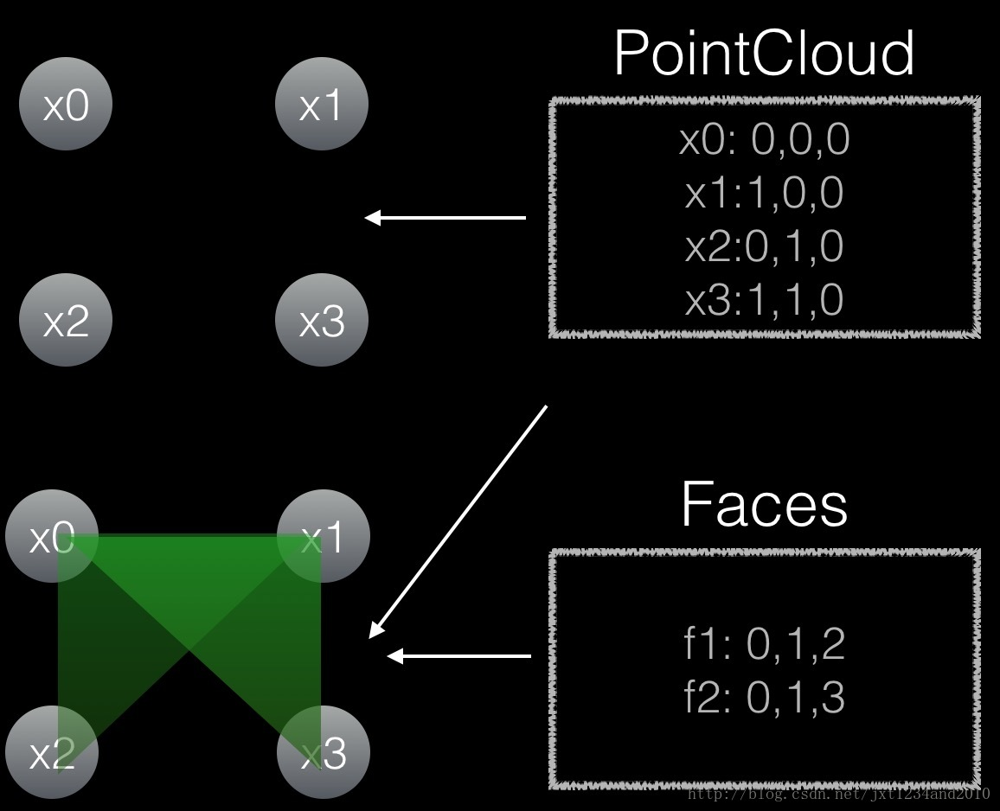
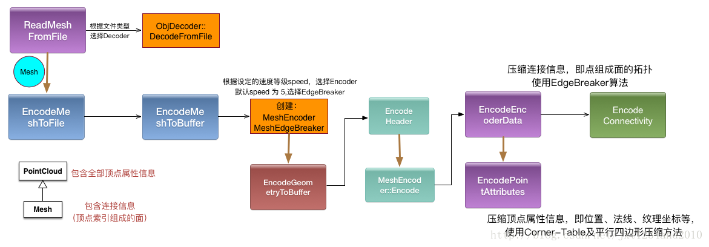

# Draco简介和【转载】代码分析

Draco是谷歌在2017年1月发布的一个3D图形开源压缩库，提供了多种算法进行压缩和解压缩。
对于encoder过程，Draco整体思路是将网格的连接信息和几何信息进行分别编码并进行存储。
其中，连接信息使用了edgebreaker等算法进行了编码压缩，几何信息对数据进行量化、预测压缩、熵编码。其中熵编码采用了rANS算法。

一个3D模型文件，一般包含顶点、面、材质、动画等各种引擎渲染所需要的信息。
ply文件格式只包含顶点信息，而obj文件包含顶点信息和面的信息。
这两者的联系如图所示：



Draco 可以被用来压缩mesh和点云数据。在压缩点云数据时，连接信息被忽略，仅保留几何信息。

Draco 的算法既支持有损模式，也支持无损。这给普通消费者带来的好处还不太明显——毕竟大多数人对分辨率并没有强迫症，有损压缩带来的轻微画质改变完全在承受范 围之内。但对专业应用和科研应用的意义就很大了。这就好比  JPEG 之于 PNG。后者用于游戏和 VR 应用完全没有问题，降低的画质很难用肉眼察觉。但在科研点云数据中，任何信息都不能丢失。

它用 [Edge Breaker 算法](http://www.cc.gatech.edu/~jarek/papers/CornerTableSMI.pdf)去压缩面的信息，并产生 [CornerTable](http://www.cc.gatech.edu/~jarek/papers/CornerTableSMI.pdf)，用平行四边形差分方式压缩顶点属性信息。

Draco 里面还有其他的压缩顶点属性值的算法，如kd-tree、差分等。

>总的来说，Draco整体思路是将网格的连接信息和几何信息进行分别编码并进行存储。 
其中，几何信息使用SequentialAttributeEncodersController/KdTreeAttributesEncoder进行编码。而Sequential内部会对数据进行量化、预测压缩、熵编码。其中熵编码采用了rANS算法。 
Draco进行了层层封装、科学地使用多态，使得代码层次清晰，可扩展性好，但也带来了一定的阅读障碍。采用的Edgebreaker算法压缩性能方面还有待提升，对float的编码采用动态建立熵编码可能会比较慢，在直播情景下还需要实验验证并改进。



## 【转载】Draco encode过程代码分析 - 探究其数据编码方式

[原文在此](https://blog.csdn.net/Woolseyyy/article/details/63684045)

### Introduction


Draco是谷歌在2017年1月发布的一个3D图形开源压缩库，提供了多种算法进行压缩和解压缩。

对于encoder过程，Draco整体思路是将网格的连接信息和几何信息进行分别编码并进行存储。

其中，连接信息使用了edgebreaker等算法进行了编码压缩，几何信息对数据进行量化、预测压缩、熵编码。其中熵编码采用了rANS算法。

不过和原先预想的不同，Draco并未建立一张静态查询表，而是利用算法动态地生成。

本文从encoder入口开始，一层一层分析其代码，试图弄清其数据编码方式。

github源码:[https://github.com/google/draco](https://github.com/google/draco)


### encoder 过程

#### encode 过程入口


…/tools/draco_encoder.cc: int main()

```cpp
int main(int argc, char **argv) {
  Options options;
  const int argc_check = argc - 1;
 
  for (int i = 1; i < argc; ++i) {
    if (!strcmp("-h", argv[i]) || !strcmp("-?", argv[i])) {
      Usage();
      return 0;
    } else if (!strcmp("-i", argv[i]) && i < argc_check) {
      options.input = argv[++i];
    } else if (!strcmp("-o", argv[i]) && i < argc_check) {
      options.output = argv[++i];
    } else if (!strcmp("-point_cloud", argv[i])) {
      options.is_point_cloud = true;
    } else if (!strcmp("-qp", argv[i]) && i < argc_check) {
      options.pos_quantization_bits = StringToInt(argv[++i]);
      if (options.pos_quantization_bits > 31) {
        printf(
            "Error: The maximum number of quantization bits for the position "
            "attribute is 31.\n");
        return -1;
      }
    } else if (!strcmp("-qt", argv[i]) && i < argc_check) {
      options.tex_coords_quantization_bits = StringToInt(argv[++i]);
      if (options.tex_coords_quantization_bits > 31) {
        printf(
            "Error: The maximum number of quantization bits for the texture "
            "coordinate attribute is 31.\n");
        return -1;
      }
    } else if (!strcmp("-qn", argv[i]) && i < argc_check) {
      options.normals_quantization_bits = StringToInt(argv[++i]);
      if (options.normals_quantization_bits > 31) {
        printf(
            "Error: The maximum number of quantization bits for the normal "
            "attribute is 31.\n");
        return -1;
      }
    } else if (!strcmp("-cl", argv[i]) && i < argc_check) {
      options.compression_level = StringToInt(argv[++i]);
    }
  }
  if (argc < 3 || options.input.empty()) {
    Usage();
    return -1;
  }
 
  std::unique_ptr<draco::PointCloud> pc;
  draco::Mesh *mesh = nullptr;
  if (!options.is_point_cloud) {
    std::unique_ptr<draco::Mesh> in_mesh =
        draco::ReadMeshFromFile(options.input);
    if (!in_mesh) {
      printf("Failed loading the input mesh.\n");
      return -1;
    }
    mesh = in_mesh.get();
    pc = std::move(in_mesh);
  } else {
    pc = draco::ReadPointCloudFromFile(options.input);
    if (!pc) {
      printf("Failed loading the input point cloud.\n");
      return -1;
    }
  }
 
  // Setup encoder options.
  draco::EncoderOptions encoder_options = draco::CreateDefaultEncoderOptions();
  if (options.pos_quantization_bits > 0) {
    draco::SetNamedAttributeQuantization(&encoder_options, *pc.get(),
                                         draco::GeometryAttribute::POSITION,
                                         options.pos_quantization_bits);
  }
  if (options.tex_coords_quantization_bits > 0) {
    draco::SetNamedAttributeQuantization(&encoder_options, *pc.get(),
                                         draco::GeometryAttribute::TEX_COORD,
                                         options.tex_coords_quantization_bits);
  }
  if (options.normals_quantization_bits > 0) {
    draco::SetNamedAttributeQuantization(&encoder_options, *pc.get(),
                                         draco::GeometryAttribute::NORMAL,
                                         options.normals_quantization_bits);
  }
  // Convert compression level to speed (that 0 = slowest, 10 = fastest).
  const int speed = 10 - options.compression_level;
  draco::SetSpeedOptions(&encoder_options, speed, speed);
 
  if (options.output.empty()) {
    // Create a default output file by attaching .drc to the input file name.
    options.output = options.input + ".drc";
  }
 
  PrintOptions(*pc.get(), options);
 
  int ret = -1;
  if (mesh && mesh->num_faces() > 0)
    ret = EncodeMeshToFile(*mesh, encoder_options, options.output);
  else
    ret = EncodePointCloudToFile(*pc.get(), encoder_options, options.output);
 
  if (ret != -1 && options.compression_level < 10) {
    printf(
        "For better compression, increase the compression level '-cl' (up to "
        "10).\n\n");
  }
 
  return ret;
}
```

这一部分前大半都是在处理命令，核心代码就是最后两行：

```cpp
if (mesh && mesh->num_faces() > 0)
    ret = EncodeMeshToFile(*mesh, encoder_options, options.output);
  else
    ret = EncodePointCloudToFile(*pc.get(), encoder_options, options.output);
```

这里先做判断，判断数据中是否有多个面:

* 如果有面，则进行Mesh to File的过程
* 若不存在面，则只进行PointCloud to File的过程

其中，两个函数都会一个bool变量，来表示是否成功
>     PointCloud是n维空间中的点的集合，PointCloud的相关信息在 …/point_cloud/point_cloud.h 中，内容较多，暂不贴出

而Mesh是PointCloud的继承类，Mesh只是比PointCloud多了Face数据:

…/mesh/mesh.h

```cpp
class Mesh : public PointCloud {
 public:
  typedef std::array<PointIndex, 3> Face;
  Mesh();
  void AddFace(const Face &face) { faces_.push_back(face); }
  void SetFace(FaceIndex face_id, const Face &face) {
    if (face_id >= faces_.size()) {
      faces_.resize(face_id.value() + 1, Face());
    }
    faces_[face_id] = face;
  }
```
#### MeshToFile


接下来分析MeshToFile过程

```cpp
int EncodeMeshToFile(const draco::Mesh &mesh,
                     const draco::EncoderOptions &options,
                     const std::string &file) {
  draco::CycleTimer timer;
  // Encode the geometry.
  draco::EncoderBuffer buffer;
  timer.Start();
  if (!draco::EncodeMeshToBuffer(mesh, options, &buffer)) {
    printf("Failed to encode the mesh.\n");
    return -1;
  }
  timer.Stop();
  // Save the encoded geometry into a file.
  std::ofstream out_file(file, std::ios::binary);
  if (!out_file) {
    printf("Failed to create the output file.\n");
    return -1;
  }
  out_file.write(buffer.data(), buffer.size());
  printf("Encoded mesh saved to %s (%" PRId64 " ms to encode)\n", file.c_str(),
         timer.GetInMs());
  printf("\nEncoded size = %zu bytes\n\n", buffer.size());
  return 0;
}
```

这里可以分为两步：

* 调用 draco::EncodeMeshToBuffer 将 Mesh encode         并存入buffer中
* 将buffer内容调用系统i/o写入file中

这里draco::EncodeMeshToBuffer的前两个参数是输入，第三个参数是输出，即buffer


#### draco::EncodeMeshToBuffer


这个函数的功能是根据option选择相应的encoder并进行编码，将结果存入buffer中

先来看下整个函数:

…/compression/encode.cc

```cpp
bool EncodeMeshToBuffer(const Mesh &m, const EncoderOptions &options,
                        EncoderBuffer *out_buffer) {
  std::unique_ptr<MeshEncoder> encoder;
  // Select the encoding method only based on the provided options.
  int encoding_method = options.GetGlobalInt("encoding_method", -1);
  if (encoding_method == -1) {
    // For now select the edgebreaker for all options expect of speed 10
    if (options.GetSpeed() == 10) {
      encoding_method = MESH_SEQUENTIAL_ENCODING;
    } else {
      encoding_method = MESH_EDGEBREAKER_ENCODING;
    }
  }
  if (encoding_method == MESH_EDGEBREAKER_ENCODING) {
    encoder = std::unique_ptr<MeshEncoder>(new MeshEdgeBreakerEncoder());
  } else {
    encoder = std::unique_ptr<MeshEncoder>(new MeshSequentialEncoder());
  }
  if (encoder)
    encoder->SetMesh(m);
  return EncodeGeometryToBuffer(encoder.get(), options, out_buffer);
}
```

这个函数前面一部分都在处理option，根据option选择哪种encoder:

* Sequential encoding
* [Edgebreaker            encoding](http://www.cc.gatech.edu/~jarek/papers/EdgeBreaker.pdf)

```cpp
  if (encoding_method == MESH_EDGEBREAKER_ENCODING) {
    encoder = std::unique_ptr<MeshEncoder>(new MeshEdgeBreakerEncoder());
  } else {
    encoder = std::unique_ptr<MeshEncoder>(new MeshSequentialEncoder());
  }
```

然后利用encoder->SetMesh(const Mesh &m)来对encoder内部的一些数据进行了初始化
>     就是把Mesh和CloudPoint信息在Encoder里也存了一下

…/compression/mesh/mesh_encoder.cc

```cpp
void MeshEncoder::SetMesh(const Mesh &m) {
  mesh_ = &m;
  SetPointCloud(m);
}
```

…/compression/point_cloud/point_cloud_encoder.cc

```cpp
void PointCloudEncoder::SetPointCloud(const PointCloud &pc) {
  point_cloud_ = &pc;
}
```

（这里因为Mesh是PointCloud的继承，所以直接把Mesh数据传进SetPointCloud函数了）


最后进行了几何信息的编码，这是这个函数的核心代码，之前都没干什么正事，这里进行了真正的编码

```cpp
return EncodeGeometryToBuffer(encoder.get(), options, out_buffer);
```

这个函数从encoder中拿到encoder的指针，进行相应操作，然后将结果写入buffer中


#### EncodeGeometryToBuffer


…/compression/encode.cc

```cpp
bool EncodeGeometryToBuffer(PointCloudEncoder *encoder,
                            const EncoderOptions &options,
                            EncoderBuffer *out_buffer) {
  if (!encoder)
    return false;
  if (!EncodeHeader(*encoder, out_buffer))
    return false;
  if (!encoder->Encode(options, out_buffer))
    return false;
  return true;
}
```

这里首先用EncoderHeader将encoder的一些基本信息写入buffer，以便今后decode

这些信息包括:”DRACO”字符串标识、major version、minor      version、encoder type(point cloud, mesh, …)、selected encoding method (edgebreaker, etc…)、保留标识


然后用encoder->Encode根据option对数据进行编码，写入buffer


#### encoder->Encode


在这个函数中，具体对encoder data、geometry data、point atrributes进行了编码

…/compression/point_cloud/point_cloud_encoder.cc

```cpp
bool PointCloudEncoder::Encode(const EncoderOptions &options,
                               EncoderBuffer *out_buffer) {
  options_ = &options;
  buffer_ = out_buffer;
 
  // Cleanup from previous runs.
  attributes_encoders_.clear();
  attribute_to_encoder_map_.clear();
  attributes_encoder_ids_order_.clear();
 
  if (!point_cloud_)
    return false;
  if (!InitializeEncoder())
    return false;
  if (!EncodeEncoderData())
    return false;
  if (!EncodeGeometryData())
    return false;
  if (!EncodePointAttributes())
    return false;
  return true;
}
```

这里InitializeEncoder的功能是
>Can be implemented by derived classes to      perform any custom initialization of the encoder. Called in the Encode() method.


EncodeEncoderData的功能是
>Should be used to encode any encoder-specific      data.


不过这两个都是预留接口，设置了虚函数但没有实现，直接返回true


EncoderGeometryData()会把mesh 的 connectivity进行编码并存入buffer，根据encoder的不同，编码connectivity的方式会分为sequential encoding 和      edgebreaker encoding。

这里暂时先暂停对connectivity编码过程的进一步探究，先研究顶点坐标等信息是如何压缩编码的


#### EncodePointAttributes


这里point attributes 的意思是
>point specific data about each attribute. In      general, multiple points stored in a point cloud can share the same attribute value and this class provides the      necessary mapping between point ids and attribute value ids.


是顶点坐标一类的信息


…/compression/point_cloud/point_cloud_encoder.cc

```cpp
bool PointCloudEncoder::EncodePointAttributes() {
  if (!GenerateAttributesEncoders())
    return false;
 
  // Encode the number of attribute encoders.
  buffer_->Encode(static_cast<uint8_t>(attributes_encoders_.size()));
 
  // Initialize all the encoders (this is used for example to init attribute
  // dependencies, no data is encoded in this step).
  for (auto &att_enc : attributes_encoders_) {
    if (!att_enc->Initialize(this, point_cloud_))
      return false;
  }
 
  // Rearrange attributes to respect dependencies between individual attributes.
  if (!RearrangeAttributesEncoders())
    return false;
 
  // Encode any data that is necessary to create the corresponding attribute
  // decoder.
  for (int att_encoder_id : attributes_encoder_ids_order_) {
    if (!EncodeAttributesEncoderIdentifier(att_encoder_id))
      return false;
  }
 
  // Also encode any attribute encoder data (such as the info about encoded
  // attributes).
  for (int att_encoder_id : attributes_encoder_ids_order_) {
    if (!attributes_encoders_[att_encoder_id]->EncodeAttributesEncoderData(
            buffer_))
      return false;
  }
 
  // Lastly encode all the attributes using the provided attribute encoders.
  if (!EncodeAllAttributes())
    return false;
  return true;
}
```

Initialize() 初始化值传递 将值传入AttributesEncoder中


RearrangeAttributesEncoders()

(有待仔细求证)

这里主要考虑了不止有顶点信息这一种attribute，可能还有color等attribute，而这里的作用就是把这些attribute的encoder排好序。

暂不继续探究，继续探究float数据是如何储存的


EncodeAttributesEncoderIdentifier是一个预留接口，无实质内容，直接返回true


然后用每一种attribute encoder，对attribute的一些基本信息进行编码和记录。

基本信息包括：attribute number、attribute type、data      type、components count等


最后用EncodeAllAttributes对数据进行编码

```cpp
bool PointCloudEncoder::EncodeAllAttributes() {
  for (int att_encoder_id : attributes_encoder_ids_order_) {
    if (!attributes_encoders_[att_encoder_id]->EncodeAttributes(buffer_))
      return false;
  }
  return true;
}
```

EncodeAttributes()是多态的，框架目前实现了SequentialAttributeEncodersController和KdTreeAttributesEncoder两种encoder，我们选前者进行讨论


#### SequentialAttributeEncodersController


…/compression/attributes/sequential_attribute_encoders_controller.cc

```cpp
bool SequentialAttributeEncodersController::EncodeAttributes(
    EncoderBuffer *buffer) {
  if (!sequencer_ || !sequencer_->GenerateSequence(&point_ids_))
    return false;
  for (uint32_t i = 0; i < sequential_encoders_.size(); ++i) {
    if (!sequential_encoders_[i]->Encode(point_ids_, buffer))
      return false;
  }
  return true;
}
```

(这里不明白哪来那么多sequential_encoders…还有哪些sequential_encoders)


继续深一层 SequentialAttributeEncoder::Encode


#### SequentialAttributeEncodersController


…/compression/attributes/sequential_attribute_encoders_encoder.cc

```cpp
bool SequentialAttributeEncoder::Encode(
    const std::vector<PointIndex> &point_ids, EncoderBuffer *out_buffer) {
  if (!EncodeValues(point_ids, out_buffer))
    return false;
  if (is_parent_encoder_ && IsLossyEncoder()) {
    if (!PrepareLossyAttributeData())
      return false;
  }
  return true;
}
```

这里又是一层封装 而后面的is_parent_encoder是与预测有关，IsLossyEncoder是拓展接口，未实现，直接返回false


深入EncodeValues


#### EncodeValues


…/compression/attributes/sequential_attribute_encoder.cc

```cpp
bool SequentialAttributeEncoder::EncodeValues(
    const std::vector<PointIndex> &point_ids, EncoderBuffer *out_buffer) {
  const int entry_size = attribute_->byte_stride();
  const std::unique_ptr<uint8_t[]> value_data_ptr(new uint8_t[entry_size]);
  uint8_t *const value_data = value_data_ptr.get();
  // Encode all attribute values in their native raw format.
  for (uint32_t i = 0; i < point_ids.size(); ++i) {
    const AttributeValueIndex entry_id = attribute_->mapped_index(point_ids[i]);
    attribute_->GetValue(entry_id, value_data);
    out_buffer->Encode(value_data, entry_size);
  }
  return true;
}
```

该函数根据index将atrribute的值取出，然后存入buffer
>     这里out_buffer->Encode是直接将内容插入buffer末尾，并未进行压缩或编码，可能之后谷歌出2.0还会对这个地方做一些文章吧

…/core/encoder_buffer.h

```cpp
bool Encode(const void *data, size_t data_size) {
    if (bit_encoder_active())
      return false;
    const uint8_t *src_data = reinterpret_cast<const uint8_t *>(data);
    buffer_.insert(buffer_.end(), src_data, src_data + data_size);
    return true;
  }
```

这个地方看起来很纳闷，怎么会没有进行任何压缩呢？

但SequentialAttributeEncoder这个类是这样描述的：

>

A base class for encoding attribute values of a single attribute      using a given sequence of point ids. The default implementation encodes all attribute values directly to the buffer but derived classes can perform any custom encoding (such as      quantization) by overriding the EncodeValues() method.


查看SequentialAttributeEncoder类就可以发现，它有一些继承

那么到底在哪里决定具体的继承呢？

通过搜索和查找，我们发现在 `EncodePointAttributes` 决定了具体是哪个继承类

刚才在PointCloudEncoder::EncodePointAttributes的分析中，没有对Initialize进行仔细分析

…/compression/point_cloud/point_cloud_encoder.cc

```cpp
  // Initialize all the encoders (this is used for example to init attribute
  // dependencies, no data is encoded in this step).
  for (auto &att_enc : attributes_encoders_) {
    if (!att_enc->Initialize(this, point_cloud_))
      return false;
  }
```

追踪入Initialize

…/compression/attribute/attribute_encoder.cc

```cpp
bool AttributesEncoder::Initialize(PointCloudEncoder *encoder,
                                   const PointCloud *pc) {
  point_cloud_encoder_ = encoder;
  point_cloud_ = pc;
  return true;
}
```

原先以为这就是初始化，仅仅做了一些初始化值传递，但事实上这是一个虚函数

…/compression/attributes/sequential/attribute_encoders_controller.cc

```cpp
bool SequentialAttributeEncodersController::Initialize(
    PointCloudEncoder *encoder, const PointCloud *pc) {
  if (!AttributesEncoder::Initialize(encoder, pc))
    return false;
  if (!CreateSequentialEncoders())
    return false;
  // Initialize all value encoders.
  for (int i = 0; i < num_attributes(); ++i) {
    const int32_t att_id = GetAttributeId(i);
    if (!sequential_encoders_[i]->Initialize(encoder, att_id))
      return false;
  }
  return true;
}
```

而其中的CreateSequentialEncoders()干了这样一件事：

它用另一个函数CreateSequentialEncoder为每一个attribute建立了一个encoder

…/compression/attributes/sequential/attribute_encoders_controller.cc

```cpp
equentialAttributeEncodersController::CreateSequentialEncoder(int i) {
  const int32_t att_id = GetAttributeId(i);
  const PointAttribute *const att = encoder()->point_cloud()->attribute(att_id);
 
  switch (att->data_type()) {
    case DT_UINT8:
    case DT_INT8:
    case DT_UINT16:
    case DT_INT16:
    case DT_UINT32:
    case DT_INT32:
      return std::unique_ptr<SequentialAttributeEncoder>(
          new SequentialIntegerAttributeEncoder());
    case DT_FLOAT32:
      if (encoder()->options()->GetAttributeInt(att_id, "quantization_bits",
                                                -1) > 0) {
        if (att->attribute_type() == GeometryAttribute::NORMAL) {
          // We currently only support normals with float coordinates
          // and must be quantized.
          return std::unique_ptr<SequentialAttributeEncoder>(
              new SequentialNormalAttributeEncoder());
        } else {
          return std::unique_ptr<SequentialAttributeEncoder>(
              new SequentialQuantizationAttributeEncoder());
        }
      }
      break;
    default:
      break;
  }
  // Return the default attribute encoder.
  return std::unique_ptr<SequentialAttributeEncoder>(
      new SequentialAttributeEncoder());
}
```

而CreateSequentialEncoder则根据data type建立对应的encoder，目前框架内支持的只有三种：SequentialIntegerAttributeEncoder,      SequentialNormalAttributeEncoder, SequentialQuantizationAttributeEncoder


我们可以继续分析EncodeValues了，因为SequentialNormalAttributeEncoder,      SequentialQuantizationAttributeEncoder是SequentialIntegerAttributeEncoder的继承类，我们来分析SequentialIntegerAttributeEncoder   


#### SequentialIntegerAttributeEncoder


…/compression/attributes/sequential_integer_attribute_encoder.cc

```cpp
bool SequentialIntegerAttributeEncoder::EncodeValues(
    const std::vector<PointIndex> &point_ids, EncoderBuffer *out_buffer) {
  // Initialize general quantization data.
  const PointAttribute *const attrib = attribute();
  if (attrib->size() == 0)
    return true;
 
  int8_t prediction_scheme_method = PREDICTION_NONE;
  if (prediction_scheme_)
    prediction_scheme_method =
        static_cast<int8_t>(prediction_scheme_->GetPredictionMethod());
  out_buffer->Encode(prediction_scheme_method);
  if (prediction_scheme_) {
    out_buffer->Encode(
        static_cast<int8_t>(prediction_scheme_->GetTransformType()));
  }
 
  if (!PrepareValues(point_ids))
    return false;
 
  const int num_components = values_.size() / point_ids.size();
  // All integer values are initialized. Process them using the prediction
  // scheme if we have one.
  if (prediction_scheme_) {
    prediction_scheme_->Encode(values_.data(), &values_[0], values_.size(),
                               num_components, point_ids.data());
  }
 
  if (prediction_scheme_ == nullptr ||
      !prediction_scheme_->AreCorrectionsPositive()) {
    ConvertSignedIntsToSymbols(values_.data(), values_.size(),
                               reinterpret_cast<uint32_t *>(values_.data()));
  }
 
  if (encoder() == nullptr || encoder()->options()->GetGlobalBool(
                                  "use_built_in_attribute_compression", true)) {
    out_buffer->Encode(static_cast<uint8_t>(1));
    if (!EncodeSymbols(reinterpret_cast<uint32_t *>(values_.data()),
                       point_ids.size() * num_components, num_components,
                       out_buffer)) {
      return false;
    }
  } else {
    // No compression. Just store the raw integer values, using the number of
    // bytes as needed.
 
    // To compute the maximum bit-length, first OR all values.
    uint32_t masked_value = 0;
    for (uint32_t i = 0; i < values_.size(); ++i) {
      masked_value |= values_[i];
    }
    // Compute the msb of the ORed value.
    int value_msb_pos = 0;
    if (masked_value != 0) {
      value_msb_pos = bits::MostSignificantBit(masked_value);
    }
    const int num_bytes = 1 + value_msb_pos / 8;
 
    out_buffer->Encode(static_cast<uint8_t>(0));
    out_buffer->Encode(static_cast<uint8_t>(num_bytes));
 
    if (num_bytes == sizeof(decltype(values_)::value_type)) {
      out_buffer->Encode(values_.data(), sizeof(int32_t) * values_.size());
    } else {
      for (uint32_t i = 0; i < values_.size(); ++i) {
        out_buffer->Encode(&values_[i], num_bytes);
      }
    }
  }
  if (prediction_scheme_) {
    prediction_scheme_->EncodePredictionData(out_buffer);
  }
  return true;
}
```

这里主要做了三件事

* 预处理数据
* 利用预测压缩数据
* 将int编码为symbol 并利用rANS熵编码算法进行压缩编码

预处理 - PrepareValues

进行一些格式转换等处理，此外，在SequentialQuantizationAttributeEncoder和SequentialNormalAttributeEncoder中，会进行量化


利用预测压缩数据

```cpp
 prediction_scheme_->Encode(values_.data(), &values_[0], values_.size(),
                               num_components, point_ids.data());
```

目前框架内包含了parallelogram, multi parallelogram, tex coords三种预测方法


进行压缩编码

```cpp
EncodeSymbols(reinterpret_cast<uint32_t *>(values_.data()),
                       point_ids.size() * num_components, num_components,
                       out_buffer)
```
#### EncodeSymbols


EncodeSymbols内部是先对待处理数据进行了测算，根据测算结果决定利用哪种熵编码技术


…/core/symbol_encoding.cc

```cpp
bool EncodeSymbols(const uint32_t *symbols, int num_values, int num_components,
                   EncoderBuffer *target_buffer) {
  if (num_values < 0)
    return false;
  if (num_values == 0)
    return true;
  if (num_components <= 0)
    num_components = 1;
  std::vector<int> bit_lengths;
  uint32_t max_value;
  ComputeBitLengths(symbols, num_values, num_components, &bit_lengths,
                    &max_value);
 
  // Compute the total bit length used by all values. This will be used for
  // computing a heuristic that chooses the optimal entropy encoding scheme.
  uint64_t total_bit_length = 0;
  for (size_t i = 0; i < bit_lengths.size(); ++i) {
    total_bit_length += bit_lengths[i];
  }
 
  const int64_t num_component_values = num_values / num_components;
 
  // The average number of bits necessary for encoding a single entry value.
  const int64_t average_bit_length =
      static_cast<int64_t>(ceil(static_cast<double>(total_bit_length) /
                                static_cast<double>(num_component_values)));
  // The estimated average number of bits necessary for encoding a single
  // bit-length tag.
  int64_t average_bits_per_tag = static_cast<int64_t>(
      ceil(static_cast<float>(bits::MostSignificantBit(average_bit_length)) /
           static_cast<float>(num_components)));
  if (average_bits_per_tag <= 0)
    average_bits_per_tag = 1;
 
  // Estimate the number of bits needed for encoding the values using the tagged
  // scheme. 32 * 8 is the overhead for encoding the entropy encoding table.
  const int64_t tagged_scheme_total_bits =
      num_component_values *
          (num_components * average_bit_length + average_bits_per_tag) +
      32 * 8;
 
  // Estimate the number of bits needed by the "raw" scheme. In this case,
  // max_value * 8 is the overhead of the entropy table.
  const int64_t raw_scheme_total_bits =
      num_values * average_bit_length + max_value * 8;
 
  // The maximum bit length of a single entry value that we can encode using
  // the raw scheme.
  const int max_value_bit_length = bits::MostSignificantBit(max_value) + 1;
 
  if (tagged_scheme_total_bits < raw_scheme_total_bits ||
      max_value_bit_length > kMaxRawEncodingBitLength) {
    // Use the tagged scheme.
    target_buffer->Encode(static_cast<uint8_t>(0));
    return EncodeTaggedSymbols<RAnsSymbolEncoder>(
        symbols, num_values, num_components, bit_lengths, target_buffer);
  }
  // Else use the raw scheme.
  target_buffer->Encode(static_cast<uint8_t>(1));
  return EncodeRawSymbols<RAnsSymbolEncoder>(symbols, num_values, &max_value,
                                             target_buffer);
}
```

前面大部分都在算各种特征，来决定用哪种scheme

```cpp
  // The maximum bit length of a single entry value that we can encode using
  // the raw scheme.
  const int max_value_bit_length = bits::MostSignificantBit(max_value) + 1;
 
  if (tagged_scheme_total_bits < raw_scheme_total_bits ||
      max_value_bit_length > kMaxRawEncodingBitLength) {
    // Use the tagged scheme.
    target_buffer->Encode(static_cast<uint8_t>(0));
    return EncodeTaggedSymbols<RAnsSymbolEncoder>(
        symbols, num_values, num_components, bit_lengths, target_buffer);
  }
  // Else use the raw scheme.
  target_buffer->Encode(static_cast<uint8_t>(1));
  return EncodeRawSymbols<RAnsSymbolEncoder>(symbols, num_values, &max_value,
                                             target_buffer);
```

有TaggedSymbols和RawSymbols两种，但是都用了RAnsSymbolEncoder

其中，rANS(Asymmetric Numeral      Systems)是一种熵编码，框架参考了 [http://arxiv.org/abs/1311.2540v2](http://arxiv.org/abs/1311.2540v2) 实现   


### 小结


总的来说，Draco整体思路是将网格的连接信息和几何信息进行分别编码并进行存储。

其中，几何信息使用SequentialAttributeEncodersController/KdTreeAttributesEncoder进行编码。而Sequential内部会对数据进行量化、预测压缩、熵编码。其中熵编码采用了rANS算法。

Draco进行了层层封装、科学地使用多态，使得代码层次清晰，可扩展性好，但也带来了一定的阅读障碍。采用的Edgebreaker算法压缩性能方面还有待提升，对float的编码采用动态建立熵编码可能会比较慢，在直播情景下还需要实验验证并改进。   


@Woolsey


2017/3/19