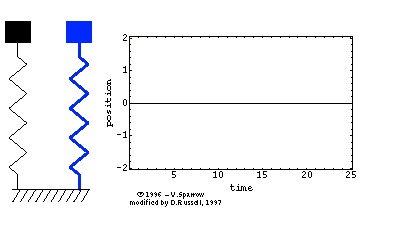
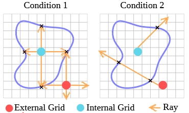

# 【摘录】Generative Dynamics/生成式动力学

## (大概是Generative Dynamics的前世) Animating Pictures with Stochastic Motion Textures, ACM SIGGRAPH 2005

这篇文章介绍了一种增强静态图片的技术，通过在图片中加入微妙的动画效果来让静止的图像看起来具有动态感。研究的重点是处理那些包含被动元素的场景，这些元素会以某种方式响应自然力量。文章中采用了一种半自动的方法，首先由用户将场景分割成一系列可以单独动画化的层。然后，使用一种称为随机运动纹理（stochastic motion texture）的技术自动合成动画效果。这种纹理是一种随时间变化的二维位移图，通过傅里叶变换的逆过程，即滤波噪声谱的逆傅里叶变换来生成。

生成的运动纹理被应用到每一层上，然后这些变形后的层重新组合形成动画帧。这种方法的结果是，从单个静态图像创建了一个循环的视频纹理，它比从视频源创建的视频纹理更可控，通常具有更高的图像质量和分辨率。

## (大概是视频Generative Dynamics的鼻祖) Image-space modal bases for plausible manipulation of objects in video, ACM SIGGRAPH 2015

<iframe width="560" height="315" src="https://www.youtube.com/embed/4f09VdXex3A?si=Z_uoxvae_k3VBuLX" title="YouTube video player" frameborder="0" allow="accelerometer; autoplay; clipboard-write; encrypted-media; gyroscope; picture-in-picture; web-share" referrerpolicy="strict-origin-when-cross-origin" allowfullscreen></iframe>

### 作者: Abe Davis

[个人主页](https://www.abedavis.com/index.html): Assistant Professor, Cornell University

>麻省理工攻读PhD的Abe Davis，是一位计算机视觉领域奇才，也是一位说唱歌手，他与他的伙伴们共同创建了这世上不可思议的声音器械。2014年，Davis和他的伙伴们首次推出了“视觉麦克风”技术，这是一种算法，对普通高速摄像脚本的通感震动进行取样，并将此震动转化为可视音轨。

经典作品：各种视觉震动分析(Visual Vibrometry)、视觉显微镜(Motion Microscope)、高速摄影机的相关工作

[(CVPR 2015 & PAMI 2016) Visual Vibrometry](https://www.youtube.com/watch?v=5apFqYEx5ew): 根据视频中物体的振动分析出物体的密度材质等信息

[(SIGGRAPH 2014) Visual Microphone](https://www.youtube.com/watch?v=FKXOucXB4a8): 根据视频中物体的振动恢复环境声音

[(SIGGRAPH Asia 2015) Interactive Dynamic Video](https://www.youtube.com/watch?v=4f09VdXex3A): 根据视频中物体的振动制作可交互的视频

(MIT EECS PhD Thesis) Visual Vibration Analysis: 视觉震动分析 Winner of the MIT Sprowls thesis award, ACM SIGGRAPH Thesis Award, Honorable mention

<iframe width="560" height="315" src="https://www.youtube.com/embed/npNYP2vzaPo?si=vG8o_h8CFiIr_T3K" title="YouTube video player" frameborder="0" allow="accelerometer; autoplay; clipboard-write; encrypted-media; gyroscope; picture-in-picture; web-share" referrerpolicy="strict-origin-when-cross-origin" allowfullscreen></iframe>

[(SIGGRAPH 2018) Visual Rhythm and Beat](https://www.youtube.com/watch?v=K3z68mOLbNo): 提取任意视频中的韵律并将其与音乐对齐 Make arbitrary video dance to arbitrary music.

[(CVPR 2020 Oral) Visual Chirality](https://www.youtube.com/watch?v=gc5IvTozU9M): AI如何知道图片是否经过了镜像翻转？

2015年TED演讲 [Abe Davis: New video technology that reveals an object's hidden properties](https://www.youtube.com/watch?v=npNYP2vzaPo) 包括 Visual Microphone 和 Interactive Dynamic Video

### 基础知识：模态分析/频率分析 (Modal Analysis)

模态分析主要用于计算结构的振动频率和振动形态，因此又可以叫做频率分析或者是振型分析。动力学分析可分为时域分析与频域分析，模态分析是动力学频域分析的基础分析类型。

#### 有限元模型

有限元模型(Finite Element Model)将结构视为有限个刚体和弹簧连接而成的震动系统，其震动过程的受力平衡为可表示为微分方程：

$$\bm M\ddot{\bm u}(t)+\bm C\dot{\bm u}(t)+\bm K\bm u(t)=\bm f(t)$$

其中：

$\ddot{\bm u}$、$\dot{\bm u}$、$\bm u$分别表示$t$时刻的加速度矢量、速度矢量、位移矢量，其中的元素$\ddot{\bm u}_i$、$\dot{\bm u}_i$、$\bm u_i$分别表示刚体$i$的加速度、速度、位移

$\bm M$表示质量矩阵(Mass)，是一个对角矩阵，$M_{i,i}$为刚体$i$的质量。
i.e. $\bm M_{i,i}\ddot{\bm u}_i$表示外力产生加速度$F=ma$

$\bm C$表示阻尼矩阵(Damping)，是一个对称矩阵，$\bm C_{i,j}$为刚体$i$和刚体$j$之间的阻尼。
e.g. 刚体$i$受到的外部阻力（如空气阻力）与他自身的速度$\dot{\bm u}_i$成正比，刚体$i$受到的来自刚体$j$的阻力与他们之间的相对速度$\dot{\bm u}_i-\dot{\bm u}_j$成正比，若分别表示为$c_{i}\dot{\bm u}_i$和$c_{i,j}(\dot{\bm u}_i-\dot{\bm u}_j)$，则刚体$i$受到总阻力为：

$$c_{i}\dot{\bm u}_i+\sum_{j=0}^Nc_{i,j}(\dot{\bm u}_i-\dot{\bm u}_j)=(c_{i}+\sum_{j=0}^Nc_{i,j})\dot{\bm u}_i+\sum_{j=0}^N-c_{i,j}\dot{\bm u}_j=(c_{i}+\sum_{j=0}^{N,i\not=j}c_{i,j})\dot{\bm u}_i+\sum_{j=0}^{N,i\not=j}-c_{i,j}\dot{\bm u}_j$$

而矩阵乘中的得到的刚体$i$受到总阻力为$\sum_{j=0}^N\bm C_{i,j}\dot{\bm u}_j$，因此有：

$$\begin{aligned}
    \bm C_{i,i}&=c_{i}+\sum_{j=0}^{N,j\not=i}c_{i,j}\\
    \bm C_{i,j}&=-c_{i,j}\quad(i\not=j)\\
\end{aligned}$$

阻尼的种类很多，在有限元分析中有材料阻尼、结构阻尼、系统阻尼以及瑞利阻尼等。
上述推导是线性阻尼的情况，适用于粘性阻尼和瑞利阻尼等，有些阻尼并不是线性不能直接套用。

$\bm K$表示刚度矩阵(Stiffness)，是一个对称矩阵，$\bm K_{i,j}$为刚体$i$和刚体$j$之间的阻尼。
e.g. 刚体$i$受到的外部拉力（如和地面或墙壁相连）与他自身的位移$\bm u_i$成正比，刚体$i$受到的来自刚体$j$的拉力与他们之间拉伸的长度$\bm u_i-\bm u_j$成正比，若分别表示为$k_{i}\bm u_i$和$k_{i,j}(\bm u_i-\bm u_j)$，则同理可得：

$$\begin{aligned}
    \bm K_{i,i}&=k_{i}+\sum_{j=0}^{N,j\not=i}k_{i,j}\\
    \bm K_{i,j}&=-k_{i,j}\quad(i\not=j)\\
\end{aligned}$$

$\bm f(t)$表示受到的随时间变化的外力载荷函数 Load，抵消阻力$\bm C\dot{\bm u}$、弹簧的拉力$\bm K\bm u$并给质量为$\bm M$的各刚体带来加速度$\ddot{\bm u}$

#### 无阻尼固有频率（模态振型）

结构系统在受到外界激励产生运动时，将按特定频率发生自然振动，这个特定的频率被称为结构的固有频率，通常一个结构有很多个固有频率。固有频率与外界激励没有关系，是结构的一种固有属性。不管外界有没有对结构进行激励，结构的固有频率都是存在的，只是当外界有激励时，结构是按固有频率产生振动响应的。

对应到有限元模型中就是$\bm C=\bm 0$和$\bm f(t)=\bm 0$，于是微分方程变为：

$$\bm M\ddot{\bm u}(t)+\bm K\bm u(t)=\bm 0$$

用傅里叶变换将其转换到频域，令$U(\omega)=\mathcal F(\bm u(t))$，则方程化为：

$$\begin{aligned}
    -\bm M\omega^2\bm U(\omega)+\bm K\bm U(\omega)&=\bm 0\\
    (\bm K-\omega^2\bm M)\bm U(\omega)&=\bm 0\\
\end{aligned}$$

有限元模型的简谐震动中，各刚体的震动频率相同都是$\omega$（系统的固有圆周频率）且相位相同，仅有震动幅度不一样。
若以正弦函数表示各刚体的震动，设各刚体的震动幅度组成幅度向量$\bm\phi$，则位移矢量可表示为$\bm u(t)=\bm\phi\sin(\omega t)$，其，代入上式可将正弦函数部分消去只留下震动幅度：

$$\begin{aligned}
    (\bm K-\omega^2\bm M)\bm\phi&=\bm 0\\
    \bm K\bm\phi&=\omega^2\bm M\bm\phi\\
\end{aligned}$$

$\bm K$为实对称矩阵、$\bm M$为对角矩阵矩阵也是实对称正定矩阵，于是$\bm K\bm\phi=\omega^2\bm M\bm\phi$的求解是一个**广义特征值问题**，$\omega^2$和$\bm\phi$分别为$\bm M,\bm K$的广义特征值和广义特征向量。

求解这个特征值问题可得到多组固有频率$\omega^2$和振幅向量$\bm\phi$，每组都对应模态(mode)中的一个阶，模态的阶数最多等于方阵$\bm M,\bm K$的长宽，也就是系统中的刚体数量，也称为自由度(Degree of Freedom, DOF)。

在高中物理课本中，我们就学习过单自由度系统的固有频率公式$\omega=\sqrt{\frac{k}{m}}$。用的是单自由度的弹簧-集中质量模型，如下面左图所示。其运动方程为正弦波Asinωt（简谐运动），对应一阶固有频率。对于两自由度系统而言，如下面中图所示，运动方程是两个正弦波叠加的结果，因而，对应两阶固有频率。

同时，三自由度系统对应三个正弦波，因而，有三阶固有频率。

再来一个例子，对于二维平面内的质点，它可以在空间中上下左右移动，于是是两自由度，因而，有二阶固有频率。
同时，对于二维平面内的刚体，它除了可以在空间中上下左右移动外，还可以旋转，于是有三阶固有频率。

因此，似乎“阶”与自由度相对应：1个自由度对应1阶固有频率（或者是1阶模态），情况的确是这样的。自由度是指用于确定结构在空间上运动所需要的最少、独立的坐标个数。三维空间质点有三个平动自由度；三维空间刚体有六个自由度，分别为三个平动和三个转动自由度。
 
一个连续体或弹性体实际上有无穷多个自由度，此时，任意连续结构都可以看成是无限多个微刚体组成的，每个微刚体有6个自由度，因而，我们可以认为任意连续结构具有无限多个自由度，但是，所有这些结构又可以近似地看作是由有限个微刚体组成的（比方有限元分析时只能划分有限数量的单元），因此又可以认为连续结构具有有限个自由度。该自由度数决定了解析质量矩阵、刚度矩阵和阻尼矩阵的维数，也决定上理论上存在的固有频率阶数和模态振型阶数。
 
虽然连续体在理论上是有无限多阶固有频率，但很多情况下我们只关心低阶的固有频率或者特定阶的固有频率。这是因为固有频率越低，越容易被外界所激励起来。另外，结构也可能受到特定的激励，如在某恒定转速下运行，因此，也可能关心特定阶的固有频率。

### ‌‌模态坐标转换

模态坐标转换‌是将线性定常系统振动微分方程组中的物理坐标变换为模态坐标，使方程组解耦，成为一组以模态坐标及模态参数描述的独立方程，以便求出系统的模态参数。这种转换的变换矩阵为模态矩阵，其每列为模态振型。

模态坐标转换在工程领域有广泛的应用，特别是在‌机械振动分析、结构动力学分析和控制系统设计中。例如，在机械振动理论中，通过模态分析可以得到系统的固有频率和振型，进而进行结构的优化设计。此外，在试验模态分析中，通过传感器和数据采集设备获得输入输出数据，然后通过参数识别获得模态参数，这也是模态坐标转换的一个重要应用。在结构损伤识别中，结合扩展卡尔曼滤波算法和模态坐标转换，可以对结构损伤参数进行有效识别。

将各阶模态的振幅向量组成特征向量矩阵（模态振型矩阵）$\Phi=[\bm\phi_i]$即可进行‌模态坐标转换$\bm u(t)=\Phi\bm q(t)$。

质量和刚度矩阵化为对角矩阵：

$$\begin{aligned}
    \Phi^T\bm M\Phi&=\text{diag}(\bm m_i)\\
    \Phi^T\bm K\Phi&=\text{diag}(\bm k_i)\\
\end{aligned}$$

带入原式：

$$\begin{aligned}
    \bm M\Phi\ddot{\bm q}(t)+\bm C\Phi\dot{\bm q}(t)+\bm K\Phi\bm q(t)&=\bm f(t)\\
    \Phi^T\bm M\Phi\ddot{\bm q}(t)+\Phi^T\bm C\Phi\dot{\bm q}(t)+\Phi^T\bm K\Phi\bm q(t)&=\Phi^T\bm f(t)\\
    \text{diag}(\bm m_i)\ddot{\bm q}(t)+\Phi^T\bm C\Phi\dot{\bm q}(t)+\text{diag}(\bm k_i)\bm q(t)&=\Phi^T\bm f(t)\\
\end{aligned}$$

这样，如果能有$\Phi^T\bm C\Phi=\text{diag}(\bm c_i)$，则方程可直接按行拆开：

$$\begin{aligned}
    \text{diag}(\bm m_i)\ddot{\bm q}(t)+\text{diag}(\bm c_i)\dot{\bm q}(t)+\text{diag}(\bm k_i)\bm q(t)&=\Phi^T\bm f(t)\\
    \bm m_i\ddot{\bm q_i}(t)+\bm c_i\dot{\bm q_i}(t)+\bm k_i\bm q_i(t)&=\bm\phi_i^T\bm f(t)\\
\end{aligned}$$

这样，方程中的参数完全解耦，化成了阶数个标量方程，更好求解。

### 有瑞利阻尼情况下的冲击响应

瑞利(Rayleigh)阻尼简单、方便，因而在结构动力分析中得到了广泛应用。
瑞利阻尼假设结构的阻尼矩阵是质量矩阵和刚度矩阵的组合：

$$\bm C=\alpha\bm M+\beta\bm K$$

它简单就简单在可以满足$\Phi^T\bm C\Phi=\text{diag}(\bm c_i)$：

$$\Phi^T\bm C\Phi=\Phi^T(\alpha\bm M+\beta\bm K)\Phi=\alpha\text{diag}(\bm m_i)+\beta\text{diag}(\bm k_i)$$

从而可以按‌模态坐标转换将方程解耦：

$$\bm m_i\ddot q(t)+(\alpha\bm m_i+\beta\bm k_i)\dot q(t)+\bm k_i q(t)=\bm\phi_i^T\bm f(t)$$

如果假设结构体系的阻尼满足正交条件，并采用振型叠加法求解，则不必构造整体阻尼，而直接采用振型阻尼比，其中刚体$i$的振型阻尼比$\xi_i$可由其固有频率$\omega_i$表示：

$$\xi_i=\frac12(\frac\alpha\omega_i+\beta\omega_i)$$

令$f_i(t)=\bm\phi_i^T\bm f(t)$，可带入各刚体的固有频率$\omega_i=\sqrt{\frac{\bm k_i}{\bm m_i}}$和振型阻尼比$\xi_i=\frac12(\frac\alpha\omega_i+\beta\omega_i)$：

$$\begin{aligned}
    \bm m_i\ddot q(t)+(\alpha\bm m_i+\beta\bm k_i)\dot q(t)+\bm k_i q(t)&=f_i(t)\\
    \ddot q(t)+(\alpha+\beta\frac{\bm k_i}{\bm m_i})\dot q(t)+\frac{\bm k_i}{\bm m_i} q(t)&=\frac{f_i(t)}{\bm m_i}\\
    \ddot q(t)+(\alpha+\beta\omega_i^2)\dot q(t)+\omega_i^2 q(t)&=\frac{f_i(t)}{\bm m_i}\\
    \ddot q(t)+2\xi_i\omega_i\dot q(t)+\omega_i^2 q(t)&=\frac{f_i(t)}{\bm m_i}\\
\end{aligned}$$

## (用Diffusion生成Abe Davis提出的Image-Space Modal Bases并用Softmax Splatting渲染之) Generative Image Dynamics, CVPR24 best paper

[原文](https://zhuanlan.zhihu.com/p/705219283)

CVPR今年2篇best paper都给了图像生成模型，可见社区对生产式模型的关注度还是空前高涨的。这篇文章《 **Generative Image Dynamics** 》 **GID** 重点解决的是某种特定类型的动态视频的生成： **图像全局的自然摇曳** ，例如下图中由风引起的树叶、花朵、灯笼、烛火的摆动，甚至是猫咪的呼吸导致的腹部起伏。

原文本质上是对《Image-Space Modal Bases for Plausible Manipulation of Objects in Video》[0]这篇 **2015年TOG** 的 **深度学习化改造** 。原文GID和这篇TOG文章从效果上做了几乎一致的事情，形成自然摇曳的目标（或图像），用户可编辑其摇动方向和力度。所以两者建模的物理数据结构（Spectral Volume，本质上可以理解为光流轨迹的傅里叶频域系数表示）是一致的，不同的点在于GID的组件全部深度学习化，借助了现有成熟的生成式模型技术。

如上图所示，GID原文具体改造[0]中有3点：

（1） TOG文章[0]需要从视频输入中分析提取出Spectral Volume(TOG文章中称为Image-Space Modal Bases)，而GID输入可以变为单张图片来预测Spectral Volume；

（2） 将单张图像作为condition，利用Latent Diffusion Model（[LDM](https://zhida.zhihu.com/search?q=LDM&zhida_source=entity&is_preview=1)）[1]强大的生成能力直接预测出Spectral Volume；

（3） 将Spectral Volume通过傅里叶逆变换FFT^(-1)获取光流场，采用Softmax Splatting技术[2]借助网络来生成未来每一帧的图像。

接下来，我们采用 **庖丁解牛** 的方式，从最原始的视频生成一步步导出原文的设计思路（当然这可能和原作者的思考顺序不同，但笔者认为这样的思考更具灵感和启发性）。

首先我们知道任务是某种特定类型的动态视频的生成： **图像全局的自然摇曳。** 不管有多特殊，它依然是一个视频生成任务；一个最粗暴的想法就是直接端到端生成：采集大量该类型的视频数据，端到端训个Image to Video（I2V）模型即可。

当然，这样黑盒的模型完全丧失了我们对视频中运动物理的认知和控制。如果我们需要加入一点点运动方向的可控性或者可解释性，我们通常会引入光流：光流本身的定义是视频两帧之间像素的移动。有了光流，我们可以从物理上简单地把控和认知视频运动，当然其也可以作为[condition](https://zhida.zhihu.com/search?q=condition&zhida_source=entity&is_preview=1)成为生成视频的一种手段，正如《Softmax Splatting for Video Frame Interpolation》[2]工作中所展示的：

当然，如果仅仅采用光流来进行对视频中物理运动的把控，依然存在如下的问题：

1） **复杂度高。** 如果我们生成T帧的视频，需要生成T帧Dense的全图光流估计，计算复杂度非常高；

2） **可控性弱。** 如果我们要人为修改其中的运动，需要对T帧Dense的[光流图](https://zhida.zhihu.com/search?q=%E5%85%89%E6%B5%81%E5%9B%BE&zhida_source=entity&is_preview=1)进行时间轴上一致性且合理的改动，这样的改动相对比较困难；

于是，我们需要一个更加High-Level的可控量，即2015年TOG工作《Image-Space Modal Bases for Plausible Manipulation of Objects in Video》中所提出的Image-Space Modal Bases，在GID文中被称为Spectral Volume。这个原理其实很简单，就是将每个像素在空间域的移动轨迹，通过傅里叶变换变化到频域，用少量的傅里叶系数来近似表征。之所以能够这么做是和该任务的特殊性质有一定关联：该任务（ **图像全局的自然摇曳** ）中像素的移动都是略带周期感的、微量性的，这就为少量傅里叶系数来表示整个运动轨迹带来了可能性，如图所示：

上图中的[曲线图](https://zhida.zhihu.com/search?q=%E6%9B%B2%E7%BA%BF%E5%9B%BE&zhida_source=entity&is_preview=1)比较有趣，是一个时空图，纵向代表时间变化，横向代表左图中的蓝色横线对应的像素：从该时空图中大体能够感知到图像摇曳的情况，的确是一种微量的振动式运动。

经过建模，网络的回归目标就由原来的光流（T个全图位移量），变成了少量的傅里叶系数（4K个全图系数，文中K取16）表示的数据结构，随之而来的就是两大好处：

1） **复杂度低。** 理论上有 K << T，而T作为视频长度可以非常长，文中K默认取16；

2） **可控性强。** 我们可以很好地操控少量的傅里叶系数来控制运动的幅度、方向等等，该操控是贯穿整个视频运动的，视频一致性、稳定性的保持自然也是非常良好的。

最后，整个技术就剩最后一个拼图了：怎么得到这些傅里叶系数呢？那么作者掏出了Diffusion大法LDM：Latent Diffusion Model，如下图所示，通过单张图片作为condition，将这些4K个全图傅里叶系数去噪生成出来。具体训练过程相对简单，作者是收集一些类似运动的视频，对其进行傅里叶系数标签的计算来进行LDM的训练。

好了， **庖丁解牛** 完毕，进入总结。整体上来看，今年的这篇best paper的确存在多个现有工作组合的痕迹，但这样的组合的确也是需要一定功底的：对问题特殊性的探查、对多种现有技术能力的掌握、对任务的选择和可行性的预见。

那么从技术层面我们能有哪些遐想呢？笔者认为，这篇工作的成功，或许为运动可控型视频生成提供了一种有趣的途径：我们是否可以将傅里叶系数调整为更一般的曲线系数（例如[高阶贝塞尔曲线](https://zhida.zhihu.com/search?q=%E9%AB%98%E9%98%B6%E8%B4%9D%E5%A1%9E%E5%B0%94%E6%9B%B2%E7%BA%BF&zhida_source=entity&is_preview=1)），来建模更加复杂和任意的运动？如此一来，我们或许就能更好的控制更加一般化的视频生成，例如让图中的人从A位置自然地走到B位置。

[0] Davis A, Chen J G, Durand F. Image-space modal bases for plausible manipulation of objects in video[J]. ACM Transactions on Graphics (TOG), 2015, 34(6): 1-7.

[1] Rombach R, Blattmann A, Lorenz D, et al. [High-resolution](https://zhida.zhihu.com/search?q=High-resolution&zhida_source=entity&is_preview=1) image synthesis with latent diffusion models[C]//Proceedings of the IEEE/CVF conference on computer vision and pattern recognition. 2022: 10684-10695.

[2] Niklaus S, Liu F. Softmax splatting for video [frame interpolation](https://zhida.zhihu.com/search?q=frame+interpolation&zhida_source=entity&is_preview=1)[C]//Proceedings of the IEEE/CVF conference on computer vision and [pattern recognition](https://zhida.zhihu.com/search?q=pattern+recognition&zhida_source=entity&is_preview=1). 2020: 5437-5446.

### 方法详述

#### 原文4.1节 Motion representation：如何表示运动

运动纹理(motion texture)是一系列时变 2D 位移图（光流） $\mathcal{F}=\left\{ F_t|t=1,2,...,T \right\}$，其中输入图像 $I_0$ 中每个像素坐标 $\bm p$ 处的 2D 位移向量 $F_t\left( \bm p \right)$ 定义了该像素在未来时刻 $t$ 的位置。即时刻 $t$ 的图像$I'_t$（各像素由 $\bm p$ 移动到 $\bm p+F_t\left( \bm p \right)$）可表示为：

$$I'_t(\bm p+F_t\left( \bm p \right))=I_0(\bm p)$$

如果直接通过运动纹理生成视频，对于长度为 $T$ 的视频，则需要同样长度为 $T$ 的运动纹理。要在这么多运动纹理中保持模型预测时空一致性，很难。

而根据Abe Davis的观点[2][3]，可以使用光谱体积（spectral volume）在频域中对这些自然运动（近似周期性运动）进行建模。因此，本文中使用 $4K$ 个通道的光谱体积图对运动进行表征。其中 $K$ 是频率数量，$K <<T$ 。
对于每个频率，4个通道分别对应 $x$ 轴和 $y$ 轴的**复数傅里叶系数**。像素在未来时刻 $t$ 的运动轨迹 $\mathcal{F}(\bm p)=\left\{ F_t(\bm p)|t=1,2,...,T \right\}$ 和光谱体积 $\mathcal{S}(\bm p)=\left\{ S_{f_k}(\bm p)|k=0,1,...,\frac{T}{2}-1 \right\}$ 之间和通过傅里叶变换进行转换：

$$\mathcal{S}(\bm p)=\text{FFT}(\mathcal{F}(\bm p))$$

对于频率数 $K$ 的选取，作者认为 $K=16$ 个傅里叶系数足以在一系列真实视频和场景中真实地再现原始的自然运动。

上图展示了从真实视频中提取的X和Y运动分量的平均功率谱，分别用蓝色和绿色曲线表示。自然振动运动主要由低频分量组成，因此使用前K = 16项，用红点标出。

#### 原文4.1节 Predicting motion with a diffusion model：扩散模型生成光谱体积

采用了潜在扩散模型（LDM）用于重建光谱体积 $\mathcal{S}$，包括变分自编码器（VAE）和基于U-Net的扩散模型：

* 变分自编码器 $E$ 将 $\mathcal{S}$ 压缩到潜在空间 $z=E(\mathcal{S})$，对应的解码器从潜在空间恢复光谱体积 $\mathcal{S}=D(z)$。
* 基于U-Net的扩散模型通过 $n$ 步加噪 $n\in(1,2,...,N)$ 对隐空间 $z$ 进行处理，去噪过程通过如下损失进行训练，以对第 $n$ 步的噪声 $\epsilon_{\theta}(z^n;n,c)$ 进行预测。其中 $c$ 表示条件，本例中以视频第一帧 $I_0$ 作为条件。

$$\mathcal{L}_{\text{LDM}}=\mathbb{E}_{n\in \mathcal{U}[1,N],\epsilon \in \mathcal{N}(0,1)}[|| \epsilon^n-\epsilon_{\theta}(z^n;n,c)||^2]$$

为保证模型收敛，采用如下两个技巧

##### 技巧1：频率自适应归一化 (Frequency adaptive normalization)

扩散模型需要输出在$[-1,1]$之间才能稳定训练，但傅里叶级数的系数取值范围$(-\infty,+\infty)$。实际应用中存在低频系数较大，如果按照先前工作对 $\mathcal{S}$ 进行归一化，则大部分高频系数会趋近于0。

为解决此问题，本文进行如下自适应归一化处理：

$$S'_{f_j}(\bm p)=\text{sign}(S_{f_j})\sqrt{|\frac{(S_{f_j})(\bm p)}{s_{f_j}}|}$$

* 每个频率$f_j$单独进行归一化，有各自的归一化系数$s_{f_j}$
* 对于每个单独的频率 $f_j$，统计训样本中的傅立叶系数，取95%处的值
* 归一化后开方以防止极限值

上图展示了3.0 Hz傅里叶项幅度的直方图：（1）按图像宽度和高度缩放幅度（蓝色），或（2）频率自适应归一化（红色）。我们的自适应归一化方法防止系数集中于极端值。

##### 技巧2：频率协调去噪 (Frequency-coordinated denoising)

原有工作直接预测K个频带的光谱体积（即每个样本维度为 $K\times C \times H \times W$ ），这样可能会产生过于平滑和不稳定的输出。另一种预测单个频带的方法（即每个样本维度为 $C \times H \times W$ ）会导致频率之间不相关。

本方法如图中红框所示。编码器输出隐层时独立 $K$ 个频率，输入U-Net的空间层（Spatial layer）时也把 $K$ 个频率当成不相关的样本，即批大小 $B$ x 频率数 $K$ 个样本。但是通过频率注意力层时，将样本量视为批大小 $B$ ，让注意力层去捕获不同频率之间的相关性。

#### 原文5节 Image-based rendering：基于图像的渲染

本节描述如何通过给定的输入图像 $I_0$ 和预测的光谱体积 $\mathcal{S}$ 在时间 $t$ 渲染视频帧 $\hat{I_t}$。

1. 使用傅里叶逆变换得到运动纹理 $\mathcal{F}(\bm p)=\text{FFT}^{-1}(\mathcal{S}(\bm p))$ 
2. 通过 $I_0$ 和 $F_t$ ，使用特征金字塔softmax splatting技术渲染 $\hat{I_t}$ 。

前向扭曲（wraping）过程（指公式 $I'_t(\bm p+F_t\left( \bm p \right))=I_0(\bm p)$ ）可能带来像素空洞，因为多个源像素可能映射到同一个位置。

为解决此问题，深度神经网络沿用之前关于帧插值的工作中提出的特征金字塔Softmax Splatting策略：

* Softmax Splatting策略输入运动场 $F_t$ ，每个像素的权重 $W$ 和起始帧 $I_0$ 经过特征提取器（Feature extractor）多尺度编码后的特征（本文实验用的ResNet34）。其中每个像素的权重通过所有时刻平均运动场进行计算 $W(\bm p)=\frac{1}{T}\sum_{T}{||F_t(\bm p)||_2}$ 。
* 将通过Softmax Splatting策略后得到的扭曲特征送入解码器合成网络（Synthesis network）得到 $t$ 时刻的预测图像 $\hat{I_t}$ 。

Softmax Splatting论文：Softmax Splatting for Video Frame Interpolation, CVPR 2020。
原版Softmax Splatting是用来插帧的，如下图所示，本文只用到了Softmax Splatting结构的左半边，且因为有$F_t$输入所以不需要光流估计，因此速度很快（25FPS on a Nvidia V100 GPU）。

Softmax Splatting的过程就像是用运动场$\hat F_t$在特征图上挪动像素。距离越远的像素权重越小，距离近、L2范数大的像素权重越高，更优先可见。这样经过融合就能得到运动物体在未来时刻的变形结果。

训练过程：使用从真实视频中随机采样的起始帧和目标帧 $(I_0,I_t)$ 联合训练特征提取器和合成网络；使用从 $I_0$ 到 $I_t$ 的估计运动场来扭曲（wrap，我理解为约束） $I_0$ 的编码特征；并使用VGG 感知损失对 $\hat{I_t}$ 和 $I_t$ 进行监督。

### 应用

#### 图像到视频 (Image-to-video)

我们的系统通过先从输入图像预测运动频谱体积，然后将频谱体积转换的运动纹理应用于图像渲染模块来动画单张静止图片。由于我们明确建模场景运动，这使我们能够

* 通过线性插值运动纹理来生成慢动作视频
* 通过调整预测的频谱体积系数的幅度来放大（或缩小）动画运动。

#### 无缝循环 (Seamless looping)

开发了运动自引导 motion self-guidance 技术，使用显式循环约束来指导运动去噪采样处理。

* 在标准的无分类器指导旁边结合了一个额外的运动引导信号
* 强制每个像素在开始帧和结束帧的位置和速度尽可能相似

$$\hat{\epsilon}^n=(1+w)\epsilon_{\theta}(z^n;n,c)-w\epsilon_{\theta}(z^n;n,\emptyset)+u\sigma^n\nabla_{z^n}\mathcal{L}^n_g$$

$$\mathcal{L}^n_g=||F^n_T-F^n_1||_1+||\nabla F^n_T-\nabla F^n_1||_1$$

其中  $F^n_t$ 是  $t$ 时刻去噪步骤  $n$ 的运动场，  $w$ 是无分类器引导权重，  $u$ 是运动自引导权重。

#### 来自单个图像的交互动态 (Interactive dynamics from a single image)

根据Davis的观点[2][3]，在某些共振频率下评估的光谱体积可以近似为图像空间模态基，其是底层场景振动模式的投影（或更广泛地捕捉到振荡动态中的空间和时间相关性），并可用于模拟物体对用户定义力的响应。

采用了这种模态分析方法，能够将物体物理响应的图像空间二维运动位移场表示为运动谱系数  $S_{f_j}$ 的加权和，调制由每个模拟时间步  $t$ 的复数模态坐标  $\bold{q}_{f_{j}}(t)$ 的状态控制。

$$F_t(\bm p)=\sum_{f_j}{S_{f_j}(\bm p)\bold{q}_{f_{j}}(t)}$$

(作者建议读者参考补充材料和原始工作以获得完整的推导)

请注意，这个方法从单张图片生成交互式场景，而这些先前的方法需要视频作为输入。

## (3DGS的Generative Dynamics) PhysGaussian: Physics-Integrated 3D Gaussians for Generative Dynamics

将3DGS静态场景变成符合物理的可交互场景：手工给3D Gaussians绑定物理参数👉用Material Point Method (MPM)进行物理仿真

<video poster="" id="toast" autoplay="" controls="" muted="" loop="" playsinline="" width="20%"><source src="./i/fox.mp4" type="video/mp4"></video>
<video poster="" id="toast" autoplay="" controls="" muted="" loop="" playsinline="" width="20%"><source src="./i/ruins_cropped.mp4" type="video/mp4"></video>
<video poster="" id="toast" autoplay="" controls="" muted="" loop="" playsinline="" width="20%"><source src="./i/jam.mp4" type="video/mp4"></video>
<video poster="" id="toast" autoplay="" controls="" muted="" loop="" playsinline="" width="20%"><source src="./i/toast_cropped.mp4" type="video/mp4"></video>

### 仿真过程

连续介质力学(Continuum mechanics)将材料的扭曲建模为一个材质空间$\bm X$到扭曲后的世界空间$\bm x$的映射$\bm x=\phi(\bm X, t)$，这个映射对位置$\bm X$的偏导数（雅可比行列式）$\bm F(\bm X, t)=\nabla\bm X\phi(\bm X, t)$称为形变梯度(deformation gradient)。

不同的物理系统中$\bm F$的计算方法多种多样。在本文实验中，作者测了6种经典的$\bm F$的计算方法，分别对应6种MPM物理效果：

>The dynamics include: **Elasticity** refers to the property where the rest shape of the object remains invariant during deformation, representing the simplest form of daily-life dynamics. **Metal** can undergo permanent rest shape changes, which follows von-Mises plasticity model. **Fracture** is naturally supported by MPM simulation, where large deformations can cause particles to separate into multiple groups. **Sand** follows Druker-Prager plasticity model \cite{klar2016drucker}, which can capture granular-level frictional effects among particles. **Paste** is modeled as viscoplastic non-Newtonian fluid, adhering to Herschel-Bulkley plasticity model \cite{yue2015continuum}. **Collision** is another key feature of MPM simulation, which is automatically handled by grid time integration. Explicit MPM can be highly optimized to run on GPUs. We highlight that some of the cases can achieve real-time based on the $1/24$-s frame duration: \emph{plane} (30 FPS), \emph{toast} (25 FPS) and \emph{jam} (36 FPS). While utilizing FEM may further accelerate the elasticity simulation, it will involve an additional step of mesh extraction and lose the generalizability of MPM in inelasticity simulation.

令$\bm F_p$表示3D Gaussian $p$附近的形变梯度，本文推导了形变过程的计算公式：

#### Gaussian Evolution

原版3D高斯分布：

$$G_p(\bm X) = e^{-\frac12 (\bm X - \bm X_p)^T \bm A^{-1}_p(\bm X - \bm X_p)}$$

加上了形变$\bm x=\phi(\bm X, t)$的3D高斯分布随时间变化：

$$G_p(\bm x, t) = e^{-\frac12 (\bm \phi^{-1}(\bm x, t) - \bm X_p)^T \bm A^{-1}_p(\bm \phi^{-1}(\bm x, t) - \bm X_p)}$$

为了方便计算，本文取了形变梯度的一阶近似：

$$\tilde{\phi}_p(\bm X, t)= \bm x_p + \bm F_p (\bm X - \bm X_p)$$

从而3D高斯分布的变化成为仿射变换，高斯分布的仿射变换还是高斯分布：

$$G_p(\bm x, t) = e^{-\frac12 (\bm x - \bm x_p)^T (\bm F_p\bm A_p\bm F_p^{T})^{-1}(\bm x - \bm x_p)}$$

这样就计算出了形变后3D Gaussian的位置和形状。

#### Harmonics Transform

除了位置和形状的变化，形变还会导致旋转，于是再给球谐系数加上旋转：

$$f^{t}(\bm d) = f^0(\bm R^{T}\bm d)$$

其中旋转矩阵$\bm R^{T}$可从形变梯度$\bm F_p$中提取得到。

### 3D Gaussian Kernel Filling

本文还考虑了某些物理效果会导致物体内部结构暴露在外的情况，比如撕裂等。
于是提出了对3DGS场景的内部结构进行填充。

方法很简单，就是用Ray Marching算透明度的方式检测内部空间，然后在内部空间中填3D Gaussians，其参数直接借用附近的3D Gaussians参数：

>Those filled particles inherit $\sigma_p, \mathcal{C}_p$ from their closet Gaussian kernels. Each particle's covariance matrix is initialized as $\operatorname{diag}(r^2_p, r^2_p, r^2_p)$, where $r$ is the particle radius calculated from its volume: $r_p = ({3V^0_p}/{4\pi})^{\frac{1}{3}}$. 

### Anisotropic Loss Term

细长3D Gaussian在扭曲时可能会捅破surface导致artifacts：

>The anisotropy of Gaussian kernels increases the efficiency of 3D representation while over-skinny kernels may point outward from the object surface under large deformations, leading to unexpected plush artifacts.

本文的解决方法是提出Anisotropy Regularizer在3DGS的训练过程中强迫3D Gaussian变胖：

$$\mathcal{L}_{aniso} = \frac{1}{|\mathcal{P}|}\sum_{p\in \mathcal{P}}\max\{\max(\bm S_p) / \min(\bm S_p), r\} - r$$

## (PhysGaussian扩展) PhysDreamer: Physics-Based Interaction with 3D Objects via Video Generation

将3DGS静态场景变成符合物理的可交互场景：静态场景渲染出一个图片👉用Image2Video模型生成一段视频👉用视频训练出PhysGaussian中的物理参数👉直接套用PhysGaussian

<video style="height: 512px; max-width: 100%;" m="" loop="" playsinline="" autoplay="" muted=""><source src="./i/view4_force_0.mp4"></video>

### 实现流程

1. 3DGS静态场景渲染出一张图片
2. 用Image2Video模型从渲染出的图片生成一小段运动视频
3. 以视频作为训练数据用可微物理仿真+可微渲染训练一个材质场(material field)和一个初始速度场(velocity field)
4. 材质场拿去 Material Point Methods (MPM) 实现物理仿真

### 仿真过程（连续介质力学和MPM简介）

连续介质力学(Continuum mechanics)将材料的扭曲建模为一个材质空间$\bm X$到扭曲后的世界空间$\bm x$的映射$\bm x=\phi(\bm X, t)$，这个映射对位置$\bm X$的偏导数（雅可比行列式）$\bm F(\bm X, t)=\nabla\bm X\phi(\bm X, t)$称为形变梯度(deformation gradient)。

<iframe src="//player.bilibili.com/player.html?isOutside=true&aid=764452804&bvid=BV1nr4y1Q73e&cid=448248024&p=1" scrolling="no" border="0" frameborder="no" framespacing="0" allowfullscreen="true"></iframe>

不同的物理系统中$\bm F$的计算多种多样。在本文中，$\bm F$的定义和杨氏模量、泊松比、密度相关。

本文所谓的材质场实际上就是给3D Gaussian的参数增加杨氏模量、泊松比、密度、体积的四项参数，从而可计算$\bm F$，进而放进MPM里根据上一时刻各点的位置和速度计算下一时刻的位置和速度：

于是实现物理仿真。

### Loss函数定义

上述可微仿真过程可以表示为一个函数：

$$\bm x^{t+1},\bm v^{t+1},\bm F^{t+1},\bm C^{t+1}=\mathcal S(\bm x^t,\bm v^t,\bm F^t,\bm C^t,\theta,\Delta t)$$

其中$\theta$包含每个3D Gaussian点的：质量$\bm m=[m_1,\dots m_P]$、杨氏模量$\bm E=[E_1,\dots E_P]$、泊松比$\bm v=[v_1,\dots v_P]$、体积$\bm V=[V_1,\dots V_P]$。

待训练的参数有初始速度场$\bm v_0$和杨氏模量$\bm E=[E_1,\dots E_P]$。

可微渲染表示为：

$\hat I^t=\mathcal F_{render}(\bm x^{t+1},\bm\alpha,\bm R^t,\Sigma,\bm c)$

进而定义loss函数为渲染图$\hat I^t$和Image2Video模型输出的视频帧$I^t$之间的差：

$$L^t=\lambda L_1(\hat I^t,I^t)+(1-\lambda) L_D-\text{SSIM}(\hat I^t,I^t)$$

杨氏模量场和初始速度场在训练时的数据结构类似NeRF，是Triplane+3层MLP，并且用正则化保证平滑。

### 训练过程

为了保证训练的稳定性，本文没有进行杨氏模量场和初始速度场的联合训练，而是分了两步：
1. 随机初始化杨氏模量场参数并冻结之，在前视频前三帧上训练初始速度场参数
2. 冻结初始速度场参数，在整个视频上训练杨氏模量场参数