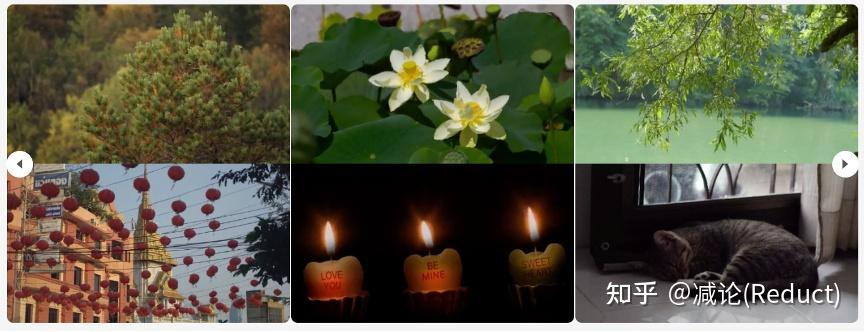
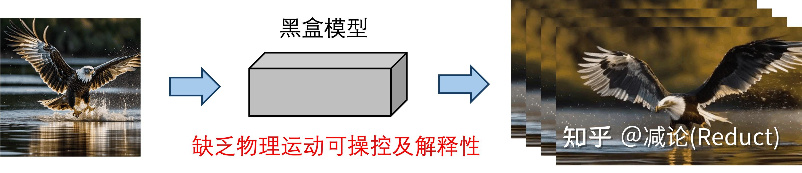

# 【摘录】Generative Dynamics/生成式动力学

## (大概是Generative Dynamics的前世) Animating Pictures with Stochastic Motion Textures, ACM SIGGRAPH 2005

这篇文章介绍了一种增强静态图片的技术，通过在图片中加入微妙的动画效果来让静止的图像看起来具有动态感。研究的重点是处理那些包含被动元素的场景，这些元素会以某种方式响应自然力量。文章中采用了一种半自动的方法，首先由用户将场景分割成一系列可以单独动画化的层。然后，使用一种称为随机运动纹理（stochastic motion texture）的技术自动合成动画效果。这种纹理是一种随时间变化的二维位移图，通过傅里叶变换的逆过程，即滤波噪声谱的逆傅里叶变换来生成。

生成的运动纹理被应用到每一层上，然后这些变形后的层重新组合形成动画帧。这种方法的结果是，从单个静态图像创建了一个循环的视频纹理，它比从视频源创建的视频纹理更可控，通常具有更高的图像质量和分辨率。

## (大概是视频Generative Dynamics的鼻祖) Image-space modal bases for plausible manipulation of objects in video, ACM SIGGRAPH 2015

<iframe width="560" height="315" src="https://www.youtube.com/embed/4f09VdXex3A?si=Z_uoxvae_k3VBuLX" title="YouTube video player" frameborder="0" allow="accelerometer; autoplay; clipboard-write; encrypted-media; gyroscope; picture-in-picture; web-share" referrerpolicy="strict-origin-when-cross-origin" allowfullscreen></iframe>

### 作者: Abe Davis

[个人主页](https://www.abedavis.com/index.html): Assistant Professor, Cornell University

>麻省理工攻读PhD的Abe Davis，是一位计算机视觉领域奇才，也是一位说唱歌手，他与他的伙伴们共同创建了这世上不可思议的声音器械。2014年，Davis和他的伙伴们首次推出了“视觉麦克风”技术，这是一种算法，对普通高速摄像脚本的通感震动进行取样，并将此震动转化为可视音轨。

经典作品：各种视觉震动分析(Visual Vibrometry)、视觉显微镜(Motion Microscope)、高速摄影机的相关工作

[(CVPR 2015 & PAMI 2016) Visual Vibrometry](https://www.youtube.com/watch?v=5apFqYEx5ew): 根据视频中物体的振动分析出物体的密度材质等信息

[(SIGGRAPH 2014) Visual Microphone](https://www.youtube.com/watch?v=FKXOucXB4a8): 根据视频中物体的振动恢复环境声音

[(SIGGRAPH Asia 2015) Interactive Dynamic Video](https://www.youtube.com/watch?v=4f09VdXex3A): 根据视频中物体的振动制作可交互的视频

(MIT EECS PhD Thesis) Visual Vibration Analysis: 视觉震动分析 Winner of the MIT Sprowls thesis award, ACM SIGGRAPH Thesis Award, Honorable mention

<iframe width="560" height="315" src="https://www.youtube.com/embed/npNYP2vzaPo?si=vG8o_h8CFiIr_T3K" title="YouTube video player" frameborder="0" allow="accelerometer; autoplay; clipboard-write; encrypted-media; gyroscope; picture-in-picture; web-share" referrerpolicy="strict-origin-when-cross-origin" allowfullscreen></iframe>

[(SIGGRAPH 2018) Visual Rhythm and Beat](https://www.youtube.com/watch?v=K3z68mOLbNo): 提取任意视频中的韵律并将其与音乐对齐 Make arbitrary video dance to arbitrary music.

[(CVPR 2020 Oral) Visual Chirality](https://www.youtube.com/watch?v=gc5IvTozU9M): AI如何知道图片是否经过了镜像翻转？

2015年TED演讲 [Abe Davis: New video technology that reveals an object's hidden properties](https://www.youtube.com/watch?v=npNYP2vzaPo) 包括 Visual Microphone 和 Interactive Dynamic Video

## (视频Generative Dynamics集大成者) Generative Image Dynamics, CVPR24 best paper

[原文](https://zhuanlan.zhihu.com/p/705219283)

大家好，这里是[减论](https://zhida.zhihu.com/search?q=%E5%87%8F%E8%AE%BA&zhida_source=entity&is_preview=1)为您带来的5分钟极减阅读CVPR24 best paper《 **Generative Image Dynamics** 》，生成式图像动态。

CVPR今年2篇best paper都给了图像生成模型，可见社区对生产式模型的关注度还是空前高涨的。这篇文章《 **Generative Image Dynamics** 》 **GID** 重点解决的是某种特定类型的动态视频的生成： **图像全局的自然摇曳** ，例如下图中由风引起的树叶、花朵、灯笼、烛火的摆动，甚至是猫咪的呼吸导致的腹部起伏。

原文本质上是对《Image-Space Modal Bases for Plausible Manipulation of Objects in Video》[0]这篇 **2015年TOG** 的 **深度学习化改造** 。原文GID和这篇TOG文章从效果上做了几乎一致的事情，形成自然摇曳的目标（或图像），用户可编辑其摇动方向和力度。所以两者建模的[物理数据结构](https://zhida.zhihu.com/search?q=%E7%89%A9%E7%90%86%E6%95%B0%E6%8D%AE%E7%BB%93%E6%9E%84&zhida_source=entity&is_preview=1)（Spectral Volume，本质上可以理解为光流轨迹的傅里叶频域系数表示）是一致的，不同的点在于GID的组件全部深度学习化，借助了现有成熟的生成式模型技术。

如上图所示，GID原文具体改造[0]中有3点：

（1） TOG文章[0]需要从视频输入中分析提取出Spectral Volume，而GID输入可以变为单张图片来预测Spectral Volume；

（2） 将单张图像作为condition，利用Latent Diffusion Model（[LDM](https://zhida.zhihu.com/search?q=LDM&zhida_source=entity&is_preview=1)）[1]强大的生成能力直接预测出Spectral Volume；

（3） 将Spectral Volume通过傅里叶逆变换FFT^(-1)获取光流场，采用Softmax Splatting技术[2]借助网络来生成未来每一帧的图像。

接下来，我们采用 **庖丁解牛** 的方式，从最原始的视频生成一步步导出原文的设计思路（当然这可能和原作者的思考顺序不同，但笔者认为这样的思考更具灵感和启发性）。

首先我们知道任务是某种特定类型的动态视频的生成： **图像全局的自然摇曳。** 不管有多特殊，它依然是一个视频生成任务；一个最粗暴的想法就是直接端到端生成：采集大量该类型的视频数据，端到端训个Image to Video（I2V）模型即可。

当然，这样黑盒的模型完全丧失了我们对视频中运动物理的认知和控制。如果我们需要加入一点点运动方向的可控性或者可解释性，我们通常会引入光流：光流本身的定义是视频两帧之间像素的移动。有了光流，我们可以从物理上简单地把控和认知视频运动，当然其也可以作为[condition](https://zhida.zhihu.com/search?q=condition&zhida_source=entity&is_preview=1)成为生成视频的一种手段，正如《Softmax Splatting for Video Frame Interpolation》[2]工作中所展示的：

当然，如果仅仅采用光流来进行对视频中物理运动的把控，依然存在如下的问题：

1）  **复杂度高。** 如果我们生成T帧的视频，需要生成T帧Dense的全图光流估计，计算复杂度非常高；

2）  **可控性弱。** 如果我们要人为修改其中的运动，需要对T帧Dense的[光流图](https://zhida.zhihu.com/search?q=%E5%85%89%E6%B5%81%E5%9B%BE&zhida_source=entity&is_preview=1)进行时间轴上一致性且合理的改动，这样的改动相对比较困难；

于是，我们需要一个更加High-Level的可控量，即2015年TOG工作《Image-Space Modal Bases for Plausible Manipulation of Objects in Video》中所提出的Image-Space Modal Bases，在GID原文中也可以称为Spectral Volume。这个原理其实很简单，就是将每个像素在空间域的移动轨迹，通过傅里叶变换变化到频域，用少量的傅里叶系数来近似表征。之所以能够这么做是和该任务的特殊性质有一定关联：该任务（ **图像全局的自然摇曳** ）中像素的移动都是略带周期感的、微量性的，这就为少量傅里叶系数来表示整个运动轨迹带来了可能性，如图所示：

上图中的[曲线图](https://zhida.zhihu.com/search?q=%E6%9B%B2%E7%BA%BF%E5%9B%BE&zhida_source=entity&is_preview=1)比较有趣，是一个时空图，纵向代表时间变化，横向代表左图中的蓝色横线对应的像素：从该时空图中大体能够感知到图像摇曳的情况，的确是一种微量的振动式运动。

经过建模，网络的回归目标就由原来的光流（T个全图位移量），变成了少量的傅里叶系数（4K个全图系数，文中K取16）表示的数据结构，随之而来的就是两大好处：

1）  **复杂度低。** 理论上有 K << T，而T作为视频长度可以非常长，文中K默认取16；

2）  **可控性强。** 我们可以很好地操控少量的傅里叶系数来控制运动的幅度、方向等等，该操控是贯穿整个视频运动的，视频一致性、稳定性的保持自然也是非常良好的。

最后，整个技术就剩最后一个拼图了：怎么得到这些傅里叶系数呢？那么作者掏出了Diffusion大法LDM：Latent Diffusion Model，如下图所示，通过单张图片作为condition，将这些4K个全图傅里叶系数去噪生成出来。具体训练过程相对简单，作者是收集一些类似运动的视频，对其进行傅里叶系数标签的计算来进行LDM的训练。

好了， **庖丁解牛** 完毕，进入总结。整体上来看，今年的这篇best paper的确存在多个现有工作组合的痕迹，但这样的组合的确也是需要一定功底的：对问题特殊性的探查、对多种现有技术能力的掌握、对任务的选择和可行性的预见。

那么从技术层面我们能有哪些遐想呢？笔者认为，这篇工作的成功，或许为运动可控型视频生成提供了一种有趣的途径：我们是否可以将傅里叶系数调整为更一般的曲线系数（例如[高阶贝塞尔曲线](https://zhida.zhihu.com/search?q=%E9%AB%98%E9%98%B6%E8%B4%9D%E5%A1%9E%E5%B0%94%E6%9B%B2%E7%BA%BF&zhida_source=entity&is_preview=1)），来建模更加复杂和任意的运动？如此一来，我们或许就能更好的控制更加一般化的视频生成，例如让图中的人从A位置自然地走到B位置。

备注：本文对某些组件的细节没有深入，例如Softmax Splatting，还有LDM中作者提出的Frequency Attention等，但不影响对本工作核心的理解。需要了解细节实现的读者需要自行深入对应章节或相关论文。

[0] Davis A, Chen J G, Durand F. Image-space modal bases for plausible manipulation of objects in video[J]. ACM Transactions on Graphics (TOG), 2015, 34(6): 1-7.

[1] Rombach R, Blattmann A, Lorenz D, et al. [High-resolution](https://zhida.zhihu.com/search?q=High-resolution&zhida_source=entity&is_preview=1) image synthesis with latent diffusion models[C]//Proceedings of the IEEE/CVF conference on computer vision and pattern recognition. 2022: 10684-10695.

[2] Niklaus S, Liu F. Softmax splatting for video [frame interpolation](https://zhida.zhihu.com/search?q=frame+interpolation&zhida_source=entity&is_preview=1)[C]//Proceedings of the IEEE/CVF conference on computer vision and [pattern recognition](https://zhida.zhihu.com/search?q=pattern+recognition&zhida_source=entity&is_preview=1). 2020: 5437-5446.

## (3DGS的Generative Dynamics) PhysGaussian: Physics-Integrated 3D Gaussians for Generative Dynamics

将3DGS静态场景变成符合物理的可交互场景：手工给3D Gaussians绑定物理参数👉用Material Point Method (MPM)进行物理仿真

<video poster="" id="toast" autoplay="" controls="" muted="" loop="" playsinline="" width="20%"><source src="./i/fox.mp4" type="video/mp4"></video>
<video poster="" id="toast" autoplay="" controls="" muted="" loop="" playsinline="" width="20%"><source src="./i/ruins_cropped.mp4" type="video/mp4"></video>
<video poster="" id="toast" autoplay="" controls="" muted="" loop="" playsinline="" width="20%"><source src="./i/jam.mp4" type="video/mp4"></video>
<video poster="" id="toast" autoplay="" controls="" muted="" loop="" playsinline="" width="20%"><source src="./i/toast_cropped.mp4" type="video/mp4"></video>

### 仿真过程

连续介质力学(Continuum mechanics)将材料的扭曲建模为一个材质空间$\bm X$到扭曲后的世界空间$\bm x$的映射$\bm x=\phi(\bm X, t)$，这个映射对位置$\bm X$的偏导数（雅可比行列式）$\bm F(\bm X, t)=\nabla\bm X\phi(\bm X, t)$称为形变梯度(deformation gradient)。

不同的物理系统中$\bm F$的计算方法多种多样。在本文实验中，作者测了6种经典的$\bm F$的计算方法，分别对应6种MPM物理效果：

>The dynamics include: **Elasticity** refers to the property where the rest shape of the object remains invariant during deformation, representing the simplest form of daily-life dynamics. **Metal** can undergo permanent rest shape changes, which follows von-Mises plasticity model. **Fracture** is naturally supported by MPM simulation, where large deformations can cause particles to separate into multiple groups. **Sand** follows Druker-Prager plasticity model \cite{klar2016drucker}, which can capture granular-level frictional effects among particles.  **Paste** is modeled as viscoplastic non-Newtonian fluid, adhering to  Herschel-Bulkley plasticity model \cite{yue2015continuum}. **Collision** is another key feature of MPM simulation, which is automatically handled by grid time integration. Explicit MPM can be highly optimized to run on GPUs. We highlight that some of the cases can achieve real-time based on the $1/24$-s frame duration: \emph{plane} (30 FPS), \emph{toast} (25 FPS) and \emph{jam} (36 FPS). While utilizing FEM may further accelerate the elasticity simulation, it will involve an additional step of mesh extraction and lose the generalizability of MPM in inelasticity simulation.

令$\bm F_p$表示3D Gaussian $p$附近的形变梯度，本文推导了形变过程的计算公式：

#### Gaussian Evolution

原版3D高斯分布：

$$G_p(\bm X) = e^{-\frac12 (\bm X - \bm X_p)^T \bm A^{-1}_p(\bm X - \bm X_p)}$$

加上了形变$\bm x=\phi(\bm X, t)$的3D高斯分布随时间变化：

$$G_p(\bm x, t) = e^{-\frac12 (\bm \phi^{-1}(\bm x, t) - \bm X_p)^T \bm A^{-1}_p(\bm \phi^{-1}(\bm x, t) - \bm X_p)}$$

为了方便计算，本文取了形变梯度的一阶近似：

$$\tilde{\phi}_p(\bm X, t)= \bm x_p + \bm F_p (\bm X - \bm X_p)$$

从而3D高斯分布的变化成为仿射变换，高斯分布的仿射变换还是高斯分布：

$$G_p(\bm x, t) = e^{-\frac12 (\bm x - \bm x_p)^T (\bm F_p\bm A_p\bm F_p^{T})^{-1}(\bm x - \bm x_p)}$$

这样就计算出了形变后3D Gaussian的位置和形状。

#### Harmonics Transform

除了位置和形状的变化，形变还会导致旋转，于是再给球谐系数加上旋转：

$$f^{t}(\bm d) = f^0(\bm R^{T}\bm d)$$

其中旋转矩阵$\bm R^{T}$可从形变梯度$\bm F_p$中提取得到。

### 3D Gaussian Kernel Filling

本文还考虑了某些物理效果会导致物体内部结构暴露在外的情况，比如撕裂等。
于是提出了对3DGS场景的内部结构进行填充。

方法很简单，就是用Ray Marching算透明度的方式检测内部空间，然后在内部空间中填3D Gaussians，其参数直接借用附近的3D Gaussians参数：

>Those filled particles inherit $\sigma_p, \mathcal{C}_p$ from their closet Gaussian kernels. Each particle's covariance matrix is initialized as $\operatorname{diag}(r^2_p, r^2_p, r^2_p)$, where $r$ is the particle radius calculated from its volume: $r_p = ({3V^0_p}/{4\pi})^{\frac{1}{3}}$. 

### Anisotropic Loss Term

细长3D Gaussian在扭曲时可能会捅破surface导致artifacts：

>The anisotropy of Gaussian kernels increases the efficiency of 3D representation while over-skinny kernels may point outward from the object surface under large deformations, leading to unexpected plush artifacts.

本文的解决方法是提出Anisotropy Regularizer在3DGS的训练过程中强迫3D Gaussian变胖：

$$\mathcal{L}_{aniso} = \frac{1}{|\mathcal{P}|}\sum_{p\in \mathcal{P}}\max\{\max(\bm S_p) / \min(\bm S_p), r\} - r$$

## (PhysGaussian扩展) PhysDreamer: Physics-Based Interaction with 3D Objects via Video Generation

将3DGS静态场景变成符合物理的可交互场景：静态场景渲染出一个图片👉用Image2Video模型生成一段视频👉用视频训练出PhysGaussian中的物理参数👉直接套用PhysGaussian

<video style="height: 512px; max-width: 100%;" m="" loop="" playsinline="" autoplay="" muted=""><source src="./i/view4_force_0.mp4"></video>

### 实现流程

1. 3DGS静态场景渲染出一张图片
2. 用Image2Video模型从渲染出的图片生成一小段运动视频
3. 以视频作为训练数据用可微物理仿真+可微渲染训练一个材质场(material field)和一个初始速度场(velocity field)
4. 材质场拿去 Material Point Methods (MPM) 实现物理仿真

### 仿真过程（连续介质力学和MPM简介）

连续介质力学(Continuum mechanics)将材料的扭曲建模为一个材质空间$\bm X$到扭曲后的世界空间$\bm x$的映射$\bm x=\phi(\bm X, t)$，这个映射对位置$\bm X$的偏导数（雅可比行列式）$\bm F(\bm X, t)=\nabla\bm X\phi(\bm X, t)$称为形变梯度(deformation gradient)。

<iframe src="//player.bilibili.com/player.html?isOutside=true&aid=764452804&bvid=BV1nr4y1Q73e&cid=448248024&p=1" scrolling="no" border="0" frameborder="no" framespacing="0" allowfullscreen="true"></iframe>

不同的物理系统中$\bm F$的计算多种多样。在本文中，$\bm F$的定义和杨氏模量、泊松比、密度相关。

本文所谓的材质场实际上就是给3D Gaussian的参数增加杨氏模量、泊松比、密度、体积的四项参数，从而可计算$\bm F$，进而放进MPM里根据上一时刻各点的位置和速度计算下一时刻的位置和速度：

于是实现物理仿真。

### Loss函数定义

上述可微仿真过程可以表示为一个函数：

$$\bm x^{t+1},\bm v^{t+1},\bm F^{t+1},\bm C^{t+1}=\mathcal S(\bm x^t,\bm v^t,\bm F^t,\bm C^t,\theta,\Delta t)$$

其中$\theta$包含每个3D Gaussian点的：质量$\bm m=[m_1,\dots m_P]$、杨氏模量$\bm E=[E_1,\dots E_P]$、泊松比$\bm v=[v_1,\dots v_P]$、体积$\bm V=[V_1,\dots V_P]$。

待训练的参数有初始速度场$\bm v_0$和杨氏模量$\bm E=[E_1,\dots E_P]$。

可微渲染表示为：

$\hat I^t=\mathcal F_{render}(\bm x^{t+1},\bm\alpha,\bm R^t,\Sigma,\bm c)$

进而定义loss函数为渲染图$\hat I^t$和Image2Video模型输出的视频帧$I^t$之间的差：

$$L^t=\lambda L_1(\hat I^t,I^t)+(1-\lambda) L_D-\text{SSIM}(\hat I^t,I^t)$$

杨氏模量场和初始速度场在训练时的数据结构类似NeRF，是Triplane+3层MLP，并且用正则化保证平滑。

### 训练过程

为了保证训练的稳定性，本文没有进行杨氏模量场和初始速度场的联合训练，而是分了两步：
1. 随机初始化杨氏模量场参数并冻结之，在前视频前三帧上训练初始速度场参数
2. 冻结初始速度场参数，在整个视频上训练杨氏模量场参数