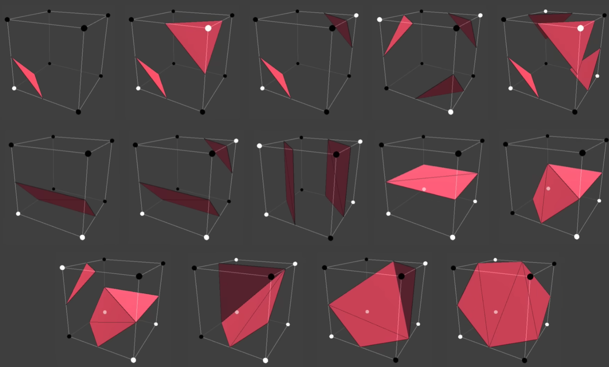

# Marching Cube 算法

经典教程 [Coding Adventure: Marching Cubes](https://youtu.be/Cp5WWtMoeKg?si=oHv76wTEmrjODrk5)

<iframe width="560" height="315" src="https://www.youtube.com/embed/M3iI2l0ltbE?si=4rNVvG5G6YuaC_dz" title="YouTube video player" frameborder="0" allow="accelerometer; autoplay; clipboard-write; encrypted-media; gyroscope; picture-in-picture; web-share" referrerpolicy="strict-origin-when-cross-origin" allowfullscreen></iframe>

前置知识：[Signed Distance Field](./SDF.md)

Marching Cube 算法是一种从三维标量场中提取等值面的方法。

Marching Cube 算法开始前，先要在三维标量场的网格顶点采样形成cubes。对于任意的这种cubes网格，总是可以设置一个阈值筛掉其中的某些网格顶点形成形状：

<video poster="" id="toast" autoplay="" controls="" muted="" loop="" playsinline="" width="100%"><source src="./i/marchingcubesdf.mp4" type="video/mp4"></video>

而Marching Cube 算法的目标就是从剩下的这些网格顶点中提取包围他们的surface：

<video poster="" id="toast" autoplay="" controls="" muted="" loop="" playsinline="" width="100%"><source src="./i/marchingcubemesh.mp4" type="video/mp4"></video>

每个cube有8个顶点，每个顶点有在surface内和在surface外两种情况，8个顶点共$2^8=256$种情况，每种情况都可以对应到一个cube内部的surface结构：

最后把它们拼上就完事了（注意虽然这个视频里展示的过程是串行的，但是实际上每个cube的surface结构不依赖其他cube，所以是完全并行的）：

<video poster="" id="toast" autoplay="" controls="" muted="" loop="" playsinline="" width="100%"><source src="./i/marchingcube.mp4" type="video/mp4"></video>

