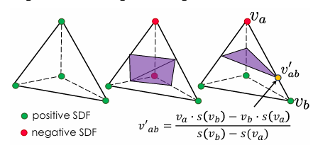

# Marching Tetrahedra 算法

前置知识：[Marching Cube](./MarchingCube.md)

Marching Tetrahedra 与 Marching Cube 的基本思想相同，但基本单元从 cube 变成 tetrahedron。

一个四面体有4个顶点,每个顶点有在surface内和在surface外两种情况，4个顶点共$2^4=16$种情况，每种情况都可以对应到一个tetrahedron内部的surface结构：

所以 Marching Tetrahedra 的 case table 比 Marching Cube 简单得多。

此外，Marching Tetrahedra 并不像 Marching Cube 那样必须输入 grid，可以输入一些散乱的点组成

在固定、相容的四面体剖分上，三角形共享面中的线性等值线是唯一的，因此避免了经典 cube 的某些连接歧义。

四面体连接方式比 cube 更自由。
Marching Cube 通常要输入网格顶点，无法应用于任意散乱点；而 Marching Tetrahedra 因为有 [Delaunay Tetrahedralization](DelaunayTetrahedralization.md) 算法可以从任意散乱的点中提取四面体剖分，所以应用范围更广。

但四面体数量通常更多，且较差的 tetrahedra 剖分会影响数值稳定性和表面质量。