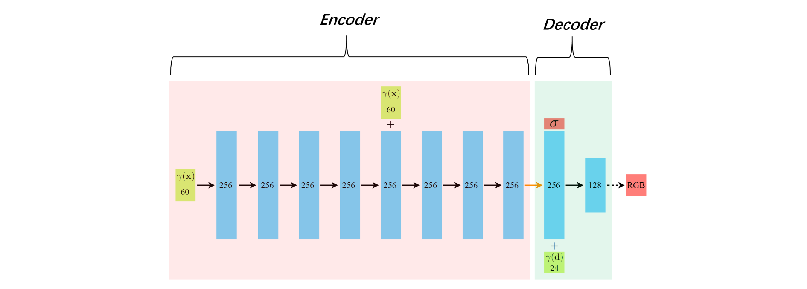
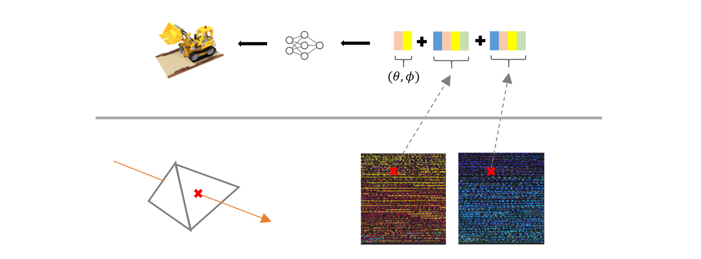

# 【转载】MobileNeRF论文解析

[原文在此](https://zhuanlan.zhihu.com/p/568916195)


本文亮点：首次实现在移动设备上的实时神经渲染

## 1.预备知识 

### 1.1 NeRF回顾

1）给定相机内外参数，可计算出一条穿过每个像素的射线。在该射线上采样N个点。

2）创建一个神经网络，输入为5维数据，输出为4维数据。将这N个点的空间坐标  $(x, y, z)$  

，以及射线方向  $(\theta, \phi)$  ,输入到该网络中，获得每个点的颜色和浓度  $(r,g,b,\sigma)$  

3）将每个点的颜色按照浓度进行加权融合，计算得到该像素最终的颜色。


NeRF训练和推理非常缓慢。在推理时，渲染一张800x800的图像耗时1min左右， 原因是因为对于每个像素要采样N个采样点，每个采样点要经过一个MLP进行推理计算，导致计算量较大。

那么如何提升NeRF的推理效率？

把NeRF的MLP部分进一步拆解成Encoder和Decoder，见图2。 Encoder部分将一个空间坐标点编码成256的特征向量，然后通过Decoder部分，把特征向量以及视线方向解码成一个色彩值RGB和浓度值  $\sigma$  。若能将Encoder部分输出的特征向量提前存储，在实时渲染阶段，直接读取该特征向量，仅使用Decoder部分实时推理, 则会节省大量的计算。



### 1.2 图形渲染基本原理

我们看到的渲染画面（例如游戏画面），一般由GPU的渲染管线来完成。这里仅介绍最简单的基本原理。感兴趣的可以去看闫令琪的Game101课程。


 **模型数据** ：模型的几何形状由一堆三角面片描述，每个三角面片由三个顶点构成。而每个三角面片的颜色存储在模型纹理图像中。模型会存储每个顶点的空间坐标，如图3左下的“OBJ”，以及每个顶点对应的纹理坐标，即每个三角网格面片对应着纹理图像中的一块三角区域，如图3左上的“TEXTURE”

模型数据要经过如下 **渲染流程** ，如图3：

1）读取OBJ里的顶点3d坐标，以及对应的uv坐标

2）顶点坐标依次经过model, viewport, projection坐标空间变换，将3d坐标变成2d的屏幕坐标（像素坐标）

3）找出在屏幕坐标系下，当前三角面片覆盖的所有像素坐标，这一步也叫做光栅化。

4） 在已知每个顶点坐标的情况下，很容易获得每个像素坐标对应的纹理坐标（双线性插值，Mipmap插值等等）

5）根据纹理图像中对应坐标的颜色，赋值给该像素

其中, 步骤（2）和（5），在现代GPU渲染管线里，允许写脚本进行定制化操作，这部分代码叫做“ **shader** ”

>例如，美术提供了一个带彩色纹理的怪物，但是当怪物死亡时，可以通过shader代码实现黑白色的怪物外表，而不需要美术同时提供黑白色的纹理。

而光栅化，可以看成是对于每个像素发射一条穿过相机中心的射线，找出该射线与三角网格的交点。当射线与场景中多个网格存在交点时，一般会使用离相机最近的交点作为唯一交点。这类似于NeRF的光线路径采样时，仅采样离相机最近的表面交点。

伪代码如下：

```python
# 3D模型的定义
class Model3D:
    list_vertice_coord 	# 所有顶点坐标
    list_uv_coord  		# 所有纹理坐标，与顶点位置一一对应
    list_face_index   	# 每个三角面片由哪几个顶点组成

Model3D  # 加载模型顶点数据
TEXTURE	 # 加载模型纹理数据

# 采用Shader来对渲染管线进行定制化
class Shader:
    # 处理每个顶点坐标
    def vert(vertice): 
        # 变换模型坐标到屏幕坐标
        screen_coord = MVP(vertice)
        # 此处可以写其他顶点操作，例如膨胀
        return screen_coord
        
    # 计算每个像素值
    def frag(uv):
        rgb = TEXTURE[uv] # 根据uv坐标，获得纹理图像上的像素值
        # 此处可以写其他颜色操作，例如转成黑白色
        return rgb

for each_face in Model3D.list_face_index:
    # 获得每个三角面片的顶点坐标和uv坐标
    vertices = get_vertices(each_face)          # 3x3
    uvs = get_uvs(each_face)			# 3x2
    # 将顶点坐标由模型坐标系变换到屏幕坐标系
    screen_coords = Shader.vert(vertices)       # 3x3，此处还保留着每个像素的深度
    
    # 当前三角面片在屏幕显示时，会覆盖哪些像素
    covered_pixels = get_covered_pixels(screen_coords)      # Nx2 
    # 计算像素值
    for each_pixel_coord in covered_pixels
        # 给定每个顶点的uv，插值计算当前pixel的uv
        interpolated_uv = get_interpolated_uv(each_pixel_coord, uvs)
        # 该像素上最终的色彩值
        rgb = Shader.frag(interpolated_uv) 
```

### 2.MobileNeRF的渲染过程

假如我们设计了一种NeRF，结构如下：

1）每条射线上的采样点位置和个数（且远少于原始NeRF）是已知的

2）每个采样点的位置特征向量（NeRF的Encoder部分输出）是预先存储好的

3）仅执行NeRF的Decoder推理

4）对于当前待渲染画面的每个像素，上述的计算是在GPU上并行的

那么这种新NeRF，相比原始NeRF，显然会大幅降低计算量。

MobileNeRF通过利用GPU渲染管线的光栅化过程，实现了这种能在移动设备上实时渲染的NeRF, 见图4与图5：

1）将整个场景的几何表面，使用非半透明的三角网格来表示。这意味着，对于待渲染画面的每个像素，会直接获得射线与三角面片的交点，作为整条射线路径上唯一的采样点

2）顶点对应的纹理图像，存储的不再是该顶点的颜色，而是该空间点的“空间特征”，即NeRF的Encoder输出特征

3）将NeRF的Decoder部分，写入到Shader里，可以称之为Neural Shader


如图5， 因为纹理图像的每个像素仅能存储4个通道（RGBA）的数据，所以当Encoder输出8维特征时，需要分别使用两张纹理图像来表示。在Neural Shader中，把根据uv坐标读取的两个特征，以及射线方向，一起输出到一个浅层mlp中，最终解码出该像素的色彩值



## 3. MobileNeRF的训练过程

为了实现上述的渲染过程，作者将训练分为三个阶段：

（1）初始化一个grid mesh，基于可微渲染思想，学习场景的几何结构，以及透明度  $\alpha$  连续的 Radius Field 

（2）将  $\alpha$  二值化 

（3）对grid mesh进行剪枝操作，保存为OBJ，以及烘培特征向量为纹理图像TEXTURE，保存Decoder的网络权重

### 3.1 训练阶段一


 **3.1.1 总览** 

（1）初始化一个形状如格子间的三维grid mesh, 见图6最左侧

（2）根据相机位姿以及像素坐标，计算一条射线

（3）射线与grid mesh的交点  $p_k$  作为采样点, 见图6最右侧。这里与近似平均采样的原始NeRF策略不同

（4）创建3个MLP：


 $\mathcal A$  ：预测采样点的透明度  $\alpha$  （ **注意** ，此处非NeRF系列中的浓度  $\sigma$  ）

 $\mathcal F$  ：预测采样点的空间特征向量  $f_k$  ，即 $\mathcal F$ 是前面提到的 **Encoder** 

 $\mathcal H$  ：根据特征向量和视线方向，预测采样点的颜色  $c_k$  ，即 $\mathcal H$ 是前面提到的 **Decoder** 

将每个交点的颜色  $c_k$  按照透明度  $\alpha_k$  进行加权融合，获得该像素的预测值  $C(r)$  ，然后与真值  $C_{gt}(r)$  

计算L2 Loss。加权融合计算如下式：


 **3.1.2 初始grid mesh的定义与优化** 

定义一个中心在原点，尺寸为1的PxPxPx3的voxel grid， 每个网格中设置一个点，作为顶点vertice，将相邻的4个vertice连接，组成mesh的face, 整个mesh被称为grid mesh：


MobileNeRF采用了可微渲染的思想，把vertice位置作为可训练的参数，通过反向传播loss，优化其位置，达到“三维重建”的目的。

>可以将顶点位置理解为某个函数的“权重参数”，该函数负责计算射线与mesh的交点，那么最终的loss显然会推动顶点位置的变化：
>  $p_k = \mathcal P(r(t_k));\mathcal V)$  

作者通过正则化限制每个顶点的“活动范围”在格子内：


我个人的理解是，这么做可以防止学习到的顶点之间互相穿插:


 **3.1.3 训练加速** 


作者借鉴instant NGP，创建了另一个PxPxPx1的grid mesh，用于加速训练过程，见图9。每个网格用来预测当前网格内存在几何表面的可能性。加速过程如下：

（1）先在加速网格中找到射线穿过的grids

（2）根据加速网格的预测值，删除不含几何表面的grids

（3）在剩下的网格中，计算射线与mesh的交点


作者又增加了一个sparsity loss和smooth loss, 


原始NeRF在训练时，对于未观测到的区域，或者背景区域，会因为缺乏足够的立体约束，导致生成了大量的“solid”噪点。通过引入sparsity 正则化（原文称为loss），会迫使上述区域变得“empty”, 如图10


在第一阶段训练完毕后，我们获得了：

（1）顶点位置优化过后的 **grid mesh** ， 充当整个场景的“三维几何结构”

（2）透明度  $\alpha$  在0到1之间的神经网络  $\mathcal A$  

（3）NeRF Encoder部分：  $\mathcal F$  

（4）NeRF Decoder部分：  $\mathcal H$  

### 3.2 训练阶段二

上一阶段训练完毕后，每个采样点的透明度  $\alpha$  为0到1之间。因为在渲染引擎里，处理半透明的mesh，比不透明的要更耗时，因此需要将透明度进行二值化——0或者1。将  $\alpha_k$  修改如下：


" Please note that the gradients are transparently passed through the discretization operation (i.e. ∇αˆ ≡ ∇α), regardless of the values of  $\alpha_k$  and the resulting  $\alpha_k \in \{0,1\}$ "

为了让训练更稳定，在第二阶段的训练过程中，作者既渲染合成透明度二值化时的最终图像  $\hat C(r)$  ，又渲染合成透明度连续时的图像  $C(r)$  , 然后同时计算两者的loss：


当loss（14）收敛后，会固定住其他参数，仅finetune神经网络  $\mathcal F$  和  $\mathcal H$  

### 3.3 训练阶段三

接下来，需要把前两阶段训练好的几何结构grid mesh保存为OBJ，以及将Encoder部分(  $\mathcal F$  )输出的特征向量烘培到纹理图像中。

（1）将训练图像完全无法“看到”的face删除。通过下表，可以看出95%以上的grid，都要被删除


（2）将剩余的每个face的顶点数据保存到OBJ中

（3）给每个face（四边形）分配一个分辨率为KxK的纹理区域（texture patch），因为face的顶点坐标是已知的，那么很容易计算出texture patch上每个像素对应的空间坐标，从而根据公式（4）获得相应的特征值。这样，就完成了烘培特征纹理的工作。


（4）保存Decoder网络的权重

### 3.4 抗锯齿

略

## 4. 优缺点

 **优点：** 

1. 第一次实现了移动设备上的实时神经渲染
2. 通过引入OBJ和TEXTURE，使得很多传统图形优化技术，可以直接使用。例如对大型场景的LOD，九宫格加载等

 **缺点：** 

1. 仅通过一个采样点来代表整条光线路径，当需要表现出半透明或者高光等复杂光学现象时，需要较高的模型精度以及准确的材质模型，mobileNeRF并不擅长解决后两者。
2. 通过固定分辨率的网格，来学习表达整个空间，会导致两个问题：（1）细节分辨率不够（2）大块平坦区域的mesh过于碎片化，顶点数过多。
3. 为了降低最终的obj顶点数量，在第三个阶段，删除了对于训练图像完全不可见的face。这会要求采集训练图像时，需要覆盖几乎所有渲染阶段需要的相机角度。否则会在渲染画面中出现大量的空洞。另外，这种删除策略也会损失模型的“泛化能力”，表现是在相邻相机角度切换时，出现“画面突变”
4. 训练时间太长：8卡A100，训练24小时左右
