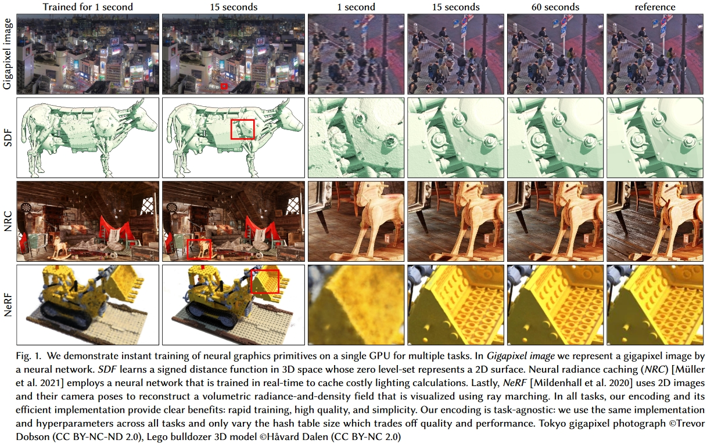

# 体渲染、体素、位置编码——主流Nerf质量优化和计算加速方法学习

* 体渲染：渲染粒子云
* 体素渲染：Minecraft

## (NIPS'20) Neural sparse voxel fields

* 场景划分为体素，每个体素8个顶点分配8个Embedding，体素内的任意点的Embedding由8个顶点Embedding插值得到，渲染任意点时合并8个Embedding作为MLP(Multi-layer Perceptron Network)输入，输出该点的颜色和占据概率
* 何谓之“稀疏”：训练时不包含场景信息的稀疏体素将被修剪

### 原理

对于体素集合$V=\{V_1,\dots,V_K\}$中的每个体素$V_i$，都定义一个函数$F_\theta^i$，其以体素中的点$\bm p\in V_i$为输入，输出颜色$\bm c$和概率密度$\sigma$：

$$
\begin{aligned}
    F_\theta^i&:(\bm g_i(\bm p), \bm v)\rightarrow(\bm c,\sigma)&\forall\bm p\in V_i\\
    g_i(\bm p)&=\zeta(\chi(\tilde{g_i}(\bm p_1^*),\dots,\tilde{g_i}(\bm p_8^*)))\\
    \mathcal V&=\{V_1,\dots,V_K\}
\end{aligned}
$$

其中，$g_i(\bm p)$表示其对输入的坐标进行了一些处理，具体是：
1. 将体素的顶点上存储的嵌入向量进行插值得到体素内坐标点$\bm p$处的嵌入向量：$\chi$表示插值函数，$\bm p_1^*,\dots,\bm p_8^*$表示体素$V_i$的8个顶点，$\tilde{g_i}(\bm p_i^*)$表示这8个顶点对应的嵌入向量（注意这里公式不严谨，不同的点$\bm p$插值出来的嵌入向量应该是不一样的，公式中没有体现）；
2. 位置编码：$\zeta$是位置编码，即对插值得到的坐标点$\bm p$处的嵌入向量进行位置编码；
3. DNN推断：位置编码后的$\bm p$点特征向量和光线方向一起输入到$F_\theta^i$中推断，输出输出颜色$\bm c$和概率密度$\sigma$。

#### Nerf是NSVF的特殊情况

坐标不转化成嵌入直接位置编码后输入的话：

$$\chi(\tilde{g_i}(\bm p_1^*),\dots,\tilde{g_i}(\bm p_8^*))=\bm p$$

$F_\theta^i$就变成：

$$F_\theta^i:(\zeta(\bm p), \bm v)\rightarrow(\bm c,\sigma)$$

就是Nerf里的DNN推断。

所以Nerf就是没有坐标嵌入的特殊情况。
反过来讲，NSVF就是把Nerf里的输入点改成输入基于体素计算出的嵌入向量，这些嵌入向量在训练中可以预先存入一些信息，从而使得输入到DNN里的信息更多。
此外，稀疏体素给NSVF带来的性能提升也可以在Nerf上实现，只要想办法把三维区域用体素包起来就能实现一样的稀疏体素ray marching了。

#### 体素存储颜色信息的渲染方案是NSVF的特殊情况

显然，如果$\tilde{g_i}(\bm p_i^*)$输出就是颜色：

$$\tilde{g_i}(\bm p_i^*):\tilde{g_i}(\bm p)\rightarrow(\bm c,\sigma)$$

并令$F_\theta^i$、$\zeta$、$\chi$都把输入做输出，那相当于就是每个体素存储一些颜色信息的方案（从不同方向看去颜色相同的点以体素为单位分别存储）。

Lombardi S, Simon T, Saragih J, et al. Neural volumes: Learning dynamic renderable volumes from images[J]. arXiv preprint arXiv:1906.07751, 2019.

### 估计透明度

本文定义的透明度为：

其中$(\bm p_0, \bm v)$是在用起点和方向表示一条光线，$A(\bm p_0, \bm v)$是这条光线上所有的采样点$\bm p$积累的透明度。结合上文写的体渲染公式：

可以看出这个透明度实际上就是：

$$A(\bm p_0, \bm v)=e^{-\sum_{k=1}^{N}\sigma_k \delta_k}$$

其实就是[Nerf体渲染公式](./体渲染.md)里背景光项$I_0T_{N+1}$中的$T_{N+1}$。回忆学习[体渲染](./体渲染.md)时对背景光项的理解，$T_{N+1}$来自于透射比，其值越小表示背景光中透过的光强越低。

### 渲染流程

1. 计算各条光线起点和方向
2. 体素交叉判断：AABB test找出每条光线与体素交叉的位置
3. 体素内采样：在与体素交叉的位置内部进行采样，得到待计算的各$\bm p$点
4. DNN推断：将采样出的各$\bm p$点按上述公式转为嵌入向量后输入DNN，得到$(\bm c,\sigma)$
5. 提前退出：借鉴“表面”的思想，当光线上积累的透明度$A(\bm p_0, \bm v)$跌至阈值$\epsilon$以下时，视为物体内部，立即停止计算
6. 体渲染：之后的操作同Nerf里的体渲染

背景光项里的透射比->用作透明度估计->判定物体表面->用于计算优化，这真是个天才的想法。
顺着光线的方向采样，当背景光无法透过的时候不就说明物体此时已经不透明了吗！
这简直是算法优化对物理过程的完美利用。
Nerf中的体渲染公式是没有体现背景光项的，作者一定对体渲染的公式有一个非常深刻的理解，并且知道Nerf里那个体渲染公式的推导过程，才能知道公式里实际上是忽略了这一项的。
作者把这一项找回来了不说，还顺着其的物理含义找到了一种能极大优化计算速度的方法。
很久没有体验这种茅塞顿开的感觉了。
佩服！

### 优势

因为体素是稀疏的，而且渲染时已知只有体素内有东西，所以只需要在光线与体素交叉的地方采样；并且还通过透明度$A(\bm p_0, \bm v)$估计和积累把采样控制在物体表面，所以：

1. 不需要像Nerf那样对光线上的所有点采样计算，极大节约计算成本；
2. 在体素内可以采样密度很高，有效提升计算精度。

总而言之，**在重点区域提升采样密度**，极大提高效率。
不过仔细想想这些东西其实也可以无缝迁移到Nerf上，毕竟前面也说了Nerf是个特殊情况。

### 损失函数

$$\mathcal L=\sum_{\bm p_0,\bm v}\|\bm C(\bm p_0,\bm v)-\bm C^*(\bm p_0,\bm v)\|^2+\lambda\Omega(A(\bm p_0,\bm v))$$

其中，$\Omega$表示贝塔分布（BetaDistribution）正则化。

显然，$\|\bm C(\bm p_0,\bm v)-\bm C^*(\bm p_0,\bm v)\|$是输出与Ground truth之间的差；最后加上的$\Omega(A(\bm p_0,\bm v))$是要强迫$A(\bm p_0,\bm v)$降到0，即每个像素的光线上积累的透明度都必须降到0，从而方便优化。

### 体素裁剪

损失函数已经有了，相比于Nerf的训练，NSVF的训练就多了一个体素裁剪的步骤。

体素裁剪的标准为：

$$V_i \text{ is pruned if } \mathop{min}\limits_{j=1\dots G}e^{-\sigma(\tilde{g_i}(\bm p_j))}>\gamma, \bm p_j\in V_i, V_i\in\mathcal{V}$$

其中$\{\bm p_j\}^G_{j=1}$表示在体素$V_i$内部均匀采样$G$个点
即：对于体素集$\mathcal{V}$中的某个体素$V_i$，在体素内部均匀采样$G$个点进行推断取得概率密度$\sigma(\tilde{g_i}(\bm p))$，并计算$e^{-\sigma(\tilde{g_i}(\bm p))}$，若所有这些点的计算结果中的最小值大于$\gamma$（即所有点$\bm p$的$\sigma(\tilde{g_i}(\bm p))$中的最大值都不到$-ln(\gamma)$），就裁掉这个体素$V_i$。

### 训练流程

1. 将空间初始化为边长为$l\approx\sqrt[3]{V/1000}$的1000个体素（即把空间划分成$10\times 10\times 10$个体素）
2. 按照上述损失函数进行训练
3. 按照上述体素裁剪方法进行裁剪
4. 将每个剩余体素再划分为8个（即$2\times 2\times 2$）边长减半的更小体素，小体素多出来的顶点嵌入向量由原有体素的顶点嵌入向量插值而来
5. 回到步骤2，知道达到指定的体素精度

## 总结

不仅Nerf用体素思想，[Neural SDF](NeuralSDF.md)的加速也用了同样的体素思想

核心思想：
* 传统Nerf/NeuralSDF推断：DNN**输入坐标**输出颜色密度/SDF值，3D模型信息存储于**DNN内部**
* 结合体素思想的Nerf/NeuralSDF推断：DNN**输入坐标和向量**输出颜色密度/SDF值，向量来自于待渲染坐标所在体素的顶点处存储的向量在坐标处的插值，3D模型信息存储于**DNN内部和向量**中
  * 表示模型信息的向量在不同的论文里叫不同的名字：
    * “feature vector”、“embedding” Neural sparse voxel fields
    * “latent vector” [DeepSDF: Learning Continuous Signed Distance Functions for Shape Representation](NeuralSDF.md)
    * “encoding” Instant neural graphics primitives with a multiresolution hash encoding
* 传统Nerf/NeuralSDF训练：反向传播更新模型参数
* 结合体素思想的Nerf/NeuralSDF训练：反向传播更新模型参数和各体素顶点处存储的向量，并标记空体素
* 传统Nerf/NeuralSDF渲染：ray marching采样生成输入坐标
* 结合体素思想的Nerf/NeuralSDF渲染：ray marching跳过空体素采样生成输入坐标

优势：
* DNN模型可以很小还能保证输出效果，因为大部分模型信息存在表示模型信息的向量里，DNN只需要进行“解码”
* 同样数量的采样点ray marching采样密度可以很高，因为可以跳过空体素，把采样点全放非空体素里
* 训练速度快，因为DNN训练好后对新的3D模型只需要“训练”各体素顶点处存储的向量，这个过程比反向传播训练DNN简单

劣势：
* 初次训练过程复杂：不仅需要改DNN参数，还需要改各体素顶点处存储的向量，还需要判定并标记空体素
* 数据量大：需要在各体素顶点处存储向量，要存储的数据量通常比传统Nerf/NeuralSDF里的DNN模型大很多

## 针对上述劣势进一步优化: (ACM TC 2022) Instant neural graphics primitives with a multiresolution hash encoding

**一种通用的模型输入编码数据结构**，实验展示了其可用于图像生成模型、SDF模型、NRC光场模型、Nerf模型的快速训练。

注：NRC是Neural Radiance Caching，一种针对[路径追踪](全局光照.md)中的加速方法，来自Real-time neural radiance caching for path tracing

>Real-time neural radiance caching for path tracing
>
>我们知道Path tracing慢的一个原因，就是要递归求解传输方程。那么很自然有一个思路就是把场景的Radiance全cache起来，然后在合适的时机终止路径，直接用cache的结果。这不是什么新想法了。但是这篇文章干了啥呢，一个radiance场可以看成一个5d的映射对不对(3维位置+2维方向)，是映射就能学对不对。好的咱们拿网络去拟合一个radiance cache出来。好处是什么，随着学习的进行，cache自然的能够被实时更新，而且因为学习过程，网络的权重能够自适应的去稀疏编码场景的特征达到压缩数据的目的，且与空间占用与场景规模无关，甚至还能瞎猜猜已知参数空间之外的场景状况，所谓泛化嘛。妙~啊！

* 原本存在**Octree里的稀疏体素数据**现在**存在Hash表里**
  * 不同尺度的体素数据存在不同的Hash表
  * 不处理Hash碰撞，让DNN自己学会避免碰撞

优势：内存结构可预测，可针对设备底层架构进行优化，传统的树结构在缓存系统里不太好实现

### 相关工作

#### Encoding

这图直观地展示了在输入中增加信息的重要性：
* 图a纯Nerf很糊，DNN很大
* 图b给输入加上了不可学习的三角函数位置编码（同初代Transformer位置编码），变清晰了一点
* 图c就是NSVF的体素+可学习编码方案，但是没有多尺度体素也没有体素裁剪，可以看到质量差不多的情况下，DNN显著变小，但是要存很大的编码数据，$128^3$个体素里面只有53807个（2.57%）体素有内容
* 图d就是完整的NSVF方案，比图c多了多尺度和体素裁剪，体素分辨率从$16^3$到$173^3$，分辨率大大提升的同时编码数据大大减小了，输出的效果还更精致
* 图e
* 图f

#### Spatial Hash Function 空间哈希函数

空间哈希函数原本就是为了在检测碰撞检测领域中的Octree和AABB树等的替代方法。具体见[空间哈希函数](空间哈希.md)

### 方法：多尺度哈希编码（Multiresolution Hash Encoding）

其实从上面的介绍基本已经能知道本文主要是做什么了，就是把体素数据从Octree里放进Hash表里。下面这个图里是Hash表的超参数，有分层数量、每层Hash表大小、特征维度、最粗和最细粒度的分辨率：

本文的抽象Level很高，直接把指定输出数据训练输入数据的过程统一视为一种抽象过程，DNN**输入Encoding**，**输出可以是点云数据、SDF数据、NRC数据甚至直接是像素颜色**，**对于模型形状或图像的描述以Encoding矩阵的形式存储**，DNN输入的Encoding则是根据输入坐标在此二维或三维Encoding矩阵上采样混合得到。具体如下：

将上述抽象DNN记为$m(\bm y,\Phi)$，其中$\Phi$为模型参数、输入为Encoding矩阵$\theta$在坐标$\bm x$处Encoding的采样结果$\bm y=enc(\bm x,\theta)$。这里模型参数$\Phi$和Encoding矩阵$\theta$均是可学习的变量。

Encoding矩阵$\theta$分为$L$层，各层的分辨率设为$N_{min}$到$N_{max}$之间的等比数列，即第$l\in[1,L]$层的的分辨率计为：

$$
\begin{aligned}
N_l&=\lfloor N_{min}b^l\rfloor\\
b&=e^{\frac{\ln{N_{max}}-\ln{N_{min}}}{L-1}}
\end{aligned}
$$

文中将$b$叫做“growth factor”，并提到本文设置的$b\in[1.26,2]$。

这样，可以直接计算输入坐标$\bm x\in\mathbb R^d$（生成2D图像$d=2$；3D模型$d=3$）在第$l$层被哪个体素包围：

$$
\begin{aligned}
\lfloor\bm x_l\rfloor&=\lfloor\bm xN_l\rfloor\\
\lceil\bm x_l\rceil&=\lceil\bm xN_l\rceil
\end{aligned}
$$

$\lfloor\bm x_l\rfloor$和$\lceil\bm x_l\rceil$就是第$l$层一个包围$\bm x$的体素的两个顶点坐标，对其坐标值排列组合就能得到该体素全部的$2^d$个坐标值（可以看出，这里的体素顶点坐标都是连续整数编号的，一个整数就跨一个体素，例如在三维空间情况下，$l$层体素的最大坐标值为$N_l$，共$N_l^3$个体素，而输入的$\bm x_l$显然就是个01之间的浮点数）。

对于$L$中的某一层，Hash函数就是一个从体素集合$\mathbb Z^d$到散列表键空间$\mathbb Z_T$的映射$h:\mathbb Z^d\rightarrow\mathbb Z_T$，散列表的值为对应体素上的Encoding值。本文使用[空间哈希函数](空间哈希.md)进行映射，其表达式为：

$$h(\bm x)=\left(\bigoplus_{i=1}^dx_i\pi_i\right)\text{mod }T$$

即将各维度坐标$x_i$与一个大质数$\pi_i$异或后模散列表大小$T$（与[空间哈希函数](空间哈希.md)里讲的直接把坐标拼成字符串然后Hash的方法没有本质区别，这里的大质数异或模散列表大小是Hash算法的一种，不是空间哈希函数独有）。

按照Table 1，所有层都有一样的散列表大小$T$，但不同的$l$层体素顶点数量$(N_l+1)^d$各不相同，于是就会出现这样一种情况：对于大尺度的体素（$l$小），会有$(N_l+1)^d\leq T$，即该尺度下所有体素里的模型数据都被存下来，而尺度在此之下（$l$大）必须抛弃部分体素数据。想想还是挺合理的，大尺度体素存的低频信号是模型的大致外观轮廓，必须完整保留，而小尺度体素存的是高频信号，少一点也没关系，与图像压缩算法有异曲同工之妙。

>It may appear counter-intuitive that this encoding is able to reconstruct scenes faithfully in the presence of hash collisions. Key to its success is that the different resolution levels have different strengths that complement each other. The coarser levels, and thus the encoding as a whole, are injective—that is, they suffer from no collisions at all. However, they can only represent a low-resolution version of the scene, since they offer features which are linearly interpolated from a widely spaced grid of points. Conversely, fine levels can capture small features due to their fine grid resolution, but suffer from many collisions—that is, disparate points which hash to the same table entry.

### 渲染过程

大致的渲染过程和[SVO](NeuralSDF.md)差不多，只不过把基于Octree查多级体素数据改成了直接基于$\lfloor\bm x_l\rfloor$和$\lceil\bm x_l\rceil$的Hash查多级体素数据，查出来体素数据之后也还是插值到坐标位置之后把多级数据拼在一起。

### 哈希碰撞的解决

本来有哈希碰撞是不能精确重建的，其成功的关键在于，不同的分辨率水平有不同的优势，可以相互补充。粗分辨率下，角点是一一映射的，但是最终也只能表示低分辨率的场景。精细分辨率下，会出现哈希碰撞，但这种碰撞是伪随机分布的，很难在每一层上都出现碰撞。

### Online adaptivity 在线自适应

如果输入$\bm x$的分布在训练过程中随时间变化，例如，如果它们集中在一个小区域，那么更细的网格级别将经历更少的碰撞，并可以学习更准确的函数。换句话说，多分辨率哈希编码自动适应训练数据的分布，继承了基于树的编码的优点并且防止训练中的离散跳跃。

所以实际上哈希碰撞并没有解决，只是依托了模型的自适应性，让上级和下级的数据填补哈希碰撞带来的数据缺失。

### 怎么没有体素裁剪？

本文似乎也没有讲体素裁剪，估计体素裁剪也被DNN自适应了，Hash表里的空体素可能会与其他体素发生Hash冲突，这样空体素就直接被替代了。这样在训练时就不用去管体素是不是空，直接训练就行了。
但是这样就没法实现跳过体素节约计算量的机制了，渲染速度应该会减慢？

### 实验和各种加速Tricks

* Hash表值（encoding）为fp16存储，从而充分利用GPU，训练时配合全精度参数进行混合精度训练
* Hash查找过程逐级进行，每次都在同一层对所有的输入坐标查找完Hash再进行下一层的查找，这样查找完一层后该层Hash表可以调出内存再把下一层调入，从而节约时间和空间
* 当$T<2^{19}时$减小$T$不会再让训练速度（训练到PSNR趋于稳定的时长）变快，因为实验用的RTX 3090的L2缓存为6MB，选用的$F=2$，所以当$2\text{Byte}\cdot T\cdot F<6\cdot 2^{20}\text{Byte}$时，每个层的整个Hash表都可以读到L2缓存里来，再减小Hash表大小没法提升性能

* 固定$F$调$T$，发现$F=2$时调$T$的“PSNR-训练到稳定的耗时”曲线最接近左上，表明$F=2$是训练收敛速度和输出质量的Trade-off
  * 从图上看，即使是小$L$的情况下大的$F$也没有比$F=2$输出质量提升很多，大$L$的情况下输出质量更是基本上一样了
  * 显然大的$F$能存更多的数据从而有利于提升输出效果，但$L$到16的时候$F=2$可存的数据量已经很大了，继续增大$F$不能显著提高输出效果，反而会因为数据量过大增加内存调入调出的时间

## (SIGGRAPH '22) Variable Bitrate Neural Fields

可变码率Nerf
