# 【转载】OpenVDB简介

[原文](https://cloud.tencent.com/developer/article/2197787)

OpenVDB 是一个获得奥斯卡奖的数据结构，在github上有对应的C++开源库，包含一个分层数据结构和一套工具，用于高效存储和操作在三维网格上离散化的稀疏体积数据。它由 DreamWorks Animation 开发，用于故事片制作中通常遇到的体积应用程序，现在由 Academy Software Foundation (ASWF) 维护，采用 MPL2.0 协议。

读者可以通过上面的视频对该数据结构有一个直观的了解，在整个视觉效果行业中，它被用于模拟和渲染水、火、烟、云和大量其他依赖于稀疏体积数据的效果。而这类数据通常的特点是全局稀疏而局部稠密（如下图）。而现实中这类数据也很常见，比如风场，污染等场数据。这类数据往往数据量比较大，且存在动态更新，空间分析等各类应用场景。因此，个人认为，OpenVDB可以作为场数据,甚至也是点云数据的一种存储格式，和现有的解决方案做一个对比。

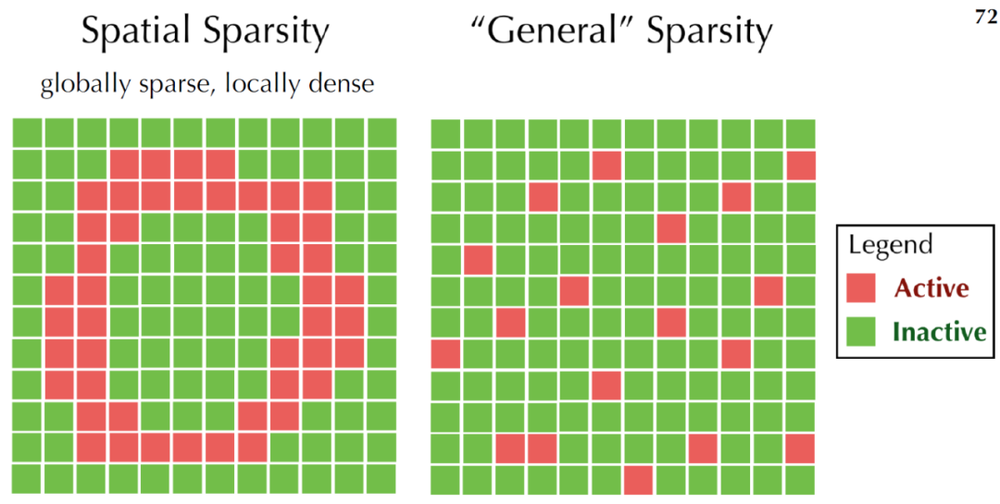

Spatial Sparsity（GAMES201课件）

OpenVDB格式的特点有：

* 动态，包括随时间的模拟和动画，以及拓扑结构的动态变换
* 内存高效，包括内存的动态和分层分配和数据的向量化压缩
* 泛型拓扑，支持任意动态拓扑结构
* 快速数据访问（随机或顺序）
* 没有范围限制，无限范围
* 高效的层级算法，基于B+树的缓存优化和bounding-volume查询，以及SSE，多线程，blocking等加速技术
* 自适应分辨率，树状结构
* 简易
* 可配置，比如树深度，节点大小等
* out of core，动态调度

另外，VDB的英文全称一直是个谜，比如‘voxel data base’，‘volumetric data block’,'volumetric dynamic B+tree'。所以，我们也没必要纠结这个名字的本意了，感兴趣的可以看一下奥斯卡给这个数据格式颁奖的视频梗，女主持忍不住说："I don't know why it sounds so sexual to me"。然后忍不住的笑了整场，搞得场下的理工男一脸懵逼。

## 基本概念

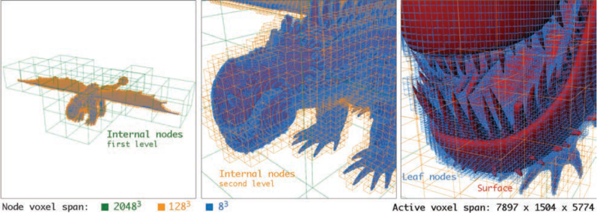

如上图，是驯龙高手中的一份数据，左侧可见，存在大量的冗余体素，而Active的体素网格是长7897宽1504高5774，采用VDB格式的大小是1GB，而对应的体素数据则需要TB。可以看到，体素的精度从绿色（左），到橙色（中），再到蓝色（右），采用了自适应的树状结构，逐步变得稠密。

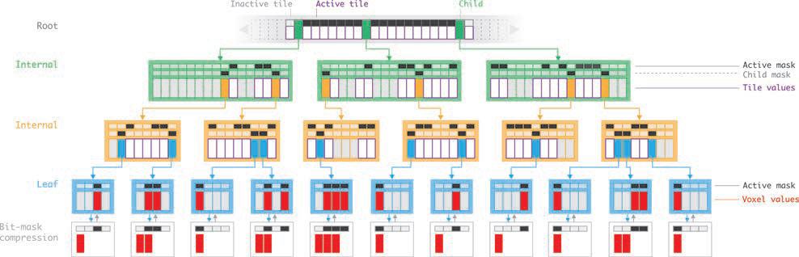

1D对应的VDB结构（VDB: High-Resolution Sparse Volumes with Dynamic Topology）

OpenVDB的数据结构是一种B+ Tree的变体，NTFS和Oracle中也采用了该格式，在大数据量下具有较好的性能。上图是VDB的1D示意图，在这个树状结构中，Root（灰色文字）是稀疏的，大小可调节。而其他节点（绿色，橙色和蓝色文字）则是稠密的，且长度是2的N次方。节点上对应的数组（竖长的大方块）分别是`mRootMap`，`mInternalDAT`，`mLeafDAT`，分别保存了指向子节点的指针（绿色，橙色，蓝色），上层切片的值（白色，灰色）或者体素的值（叶子节点中的灰色和红色）。其中，灰色表明该节点术语不活跃状态，最下面的白色节点则是压缩后的叶子节点，去除灰色节点。而DAT（direct access table）上面的扁平的小方块是压缩后的bit mask，用来记录局部的拓扑结构。

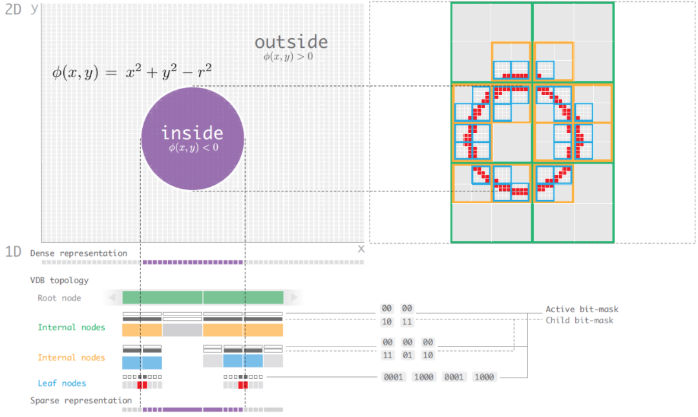

圆形在VDB的展示（VDB: High-Resolution Sparse Volumes with Dynamic Topology）

上图对应的是一个圆的2D结构，可以看到bit-mask如何记录节点间的拓扑结构。通常，在OpenVDB上，会保存density属性，还有一个可选的temperature属性，每个voxel存储的是signed distance field（SDF），标识inside或outside的距离。如下是离散形式下的计算过程，根据曲线获取临近四个点的distance value，通过插值方式计算voxel内任意点的distance值。

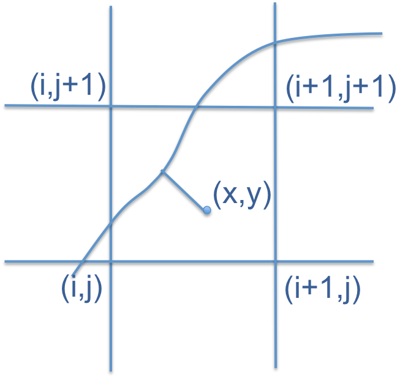

Level set（来自Level Sets With OpenVDB）

* 分辨率和分支因子/树的深度成正比
* 通常树越小，随机访问的性能越高
* 自适应能力更适合分支因子小且深度大的树
* 内存和节点的个数，大小成正比
* 缓存命中率更喜欢节点小，深度大的数

数据存储后，下一步就是读取操作，而存储和读取之间存在天然的矛盾，理想中，我们希望时间都花费在计算而不是查询中，而现实中，特别是稀疏数据下，如何优化查询时间是一个问题，如何控制边界，如何保持拓扑关系，内存关联，以及调度的平衡等，而 OpenVDB 中也总结了如上的几点，并针对三种访问形式进行了优化：

* Random Access：基于Hash map，采用CPU Cache的策略（缓存已经访问过的节点）
* Sequential Access：利用mChildMask和mValueMask空间locality能力，基于DeBruijn
* Stencil Access：建立全局坐标下的offset，通过iterator和Accessors的方式实现`setValue`和`getValue`

在具体的应用算法上，OpenVDB支持一些拓扑运算，偏微分计算，CSG建模，布尔运算，填充算法以及Ray Marching的优化。如下是三个个人认为比较有代表性的应用案例。

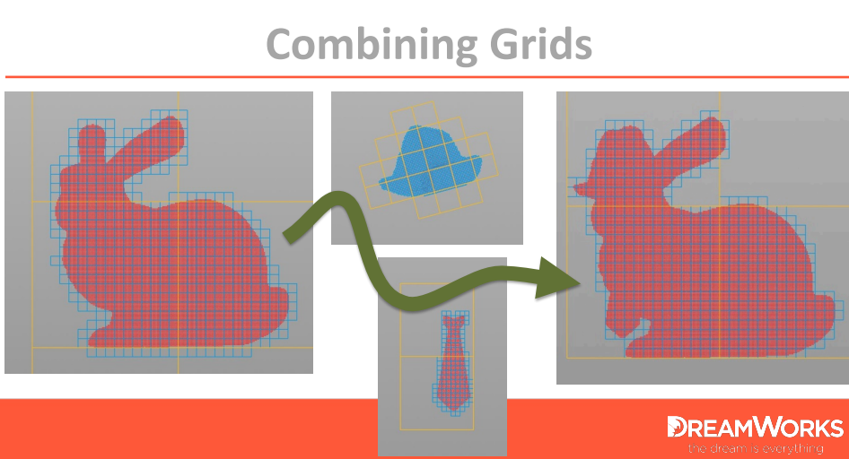

布尔运算：基于空间的拓扑信息，求并后得到新数据（DreamWorks Animation）

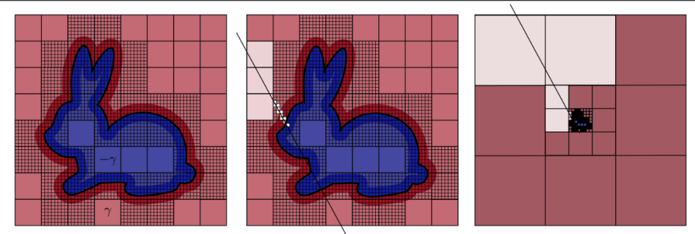

Ray Marching算法优化（DreamWorks Animation）

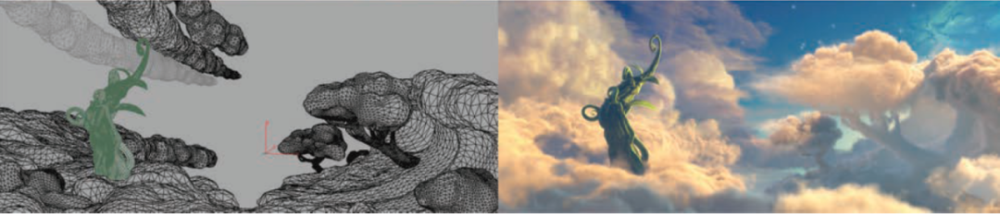

左图是原始的云，是一个多边形表面，采用VDB的树状结构，转化为15000900500的体素网格，并最终渲染得到右图（DreamWorks Animation）

## PBRT V4

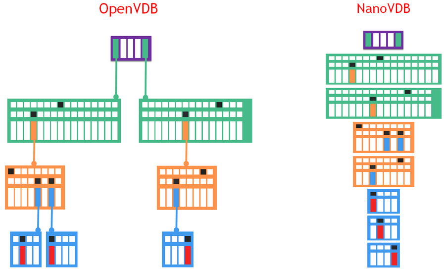

NanoVDB（来自NV官网）

在数据结构上，NanoVDB是对OpenVDB的线性快照，节点严格的4字节对齐，广度优先，如上图，同一个level的节点都紧凑的存储在一起而抛弃了指针（链表），因此在不同设备（CPU与GPU）之间的拷贝性能更快，且对缓存更为友好。并且，支持元数据的统计能力，以及 out-of-core 和 in-core 的数据压缩支持。而NanoVDB最大的局限是无法修改数据的拓扑结构。此外，个人很好奇WebGL上如何支持NanoVDB，搜了一下没有相关信息，所以不确定它是如何宣称支持的。

在PBRT V4中，依赖openvdb[2]实现对NanoVDB数据格式的解析。针对NanoVDB数据格式，封装了`NanoVDBMediumProvider::Create`读取该数据文件，该对象中通过`densityGrid`记录数据内容，`bounds`记录数据范围。

```cpp
// media.h
 const nanovdb::FloatGrid densityFloatGrid = densityGrid.grid<float>();

  __hostdev__ Vec3T worldToIndexF(const Vec3T& xyz) const;
```

如上图，`densityGrid`通过`FloatGrid`对象实现范围值到索引值的转换，里面的`__hostdev__`说明该方法支持CPU和GPU两种形式。有了该索引值后，NanoVDB提供了两种方式获取该索引的内容：

```cpp
// 基于Accessor,Stencil Access 
 auto accessor = densityFloatGrid->getAccessor();
float density = accessor.getValue({nx, ny, nz});

// 基于Random Access：Bottom-up或Top down
using Sampler = nanovdb::SampleFromVoxels<nanovdb::FloatGrid::TreeType, 1, false>;
float density = Sampler(densityFloatGrid->tree())(pIndex);
```

这样，PBRT V4支持了丰富的OpenVDB的体数据，而自身提供了Bunny Cloud，Disney Cloud，Explosion均是NanoVDB格式。下图是PBRT渲染Explosion的效果

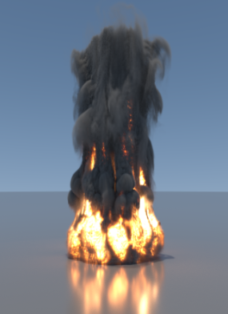

## 总结

本文是学习PBRT V4读取OpenVDB时的总结，包括OpenVDB，NanoVDB的概念和特点，OpenVDB的数据结构，读取优化以及主要的应用，最后是通过PBRT V4源码，了解openvdb开源库中读取文件，访问数据对应的API。

## 提升标准：NVIDIA 推出 NeuralVDB，将 AI 和 GPU 优化引入屡获殊荣的 OpenVDB

[原文](https://zhuanlan.zhihu.com/p/554464130)

**NeuralVDB 可将烟雾、云和其他稀疏体积数据的内存占用量减少多达 100 倍。**

NVIDIA 近日发布了 NeuralVDB，可将 AI 的强大功能引入 OpenVDB。OpenVDB 是用于模拟和渲染稀疏体积数据（例如水、火焰、烟雾和云）的行业标准库。

鉴于 OpenVDB 在过去十年内的发展历程，在 SIGGRAPH 上推出的 NeuralVDB 可为科学计算和可视化、医学成像、火箭科学和视觉效果等领域的专业人士带来颠覆性的变革。通过将内存占用量减少高达 100 倍，创作者、开发者和研究人员可以与高度复杂的大型数据集进行实时交互。

在过去十年中，作为视觉效果行业中广泛运用的核心技术，OpenVDB 赢得了奥斯卡金像奖。此后，它已从娱乐业扩展到稀疏体积数据普遍存在的工业和科学用例，例如工业设计和机器人开发。

去年，NVIDIA 推出了 NanoVDB，为 OpenVDB 添加了 GPU 支持。这带来了数量级的加速，实现了更快速的性能和更轻松的开发，并开启了实时模拟和渲染的大门。

NeuralVDB 建立在 NanoVDB 的 GPU 加速基础上，通过添加机器学习来引入紧凑型神经表示，大大减少了其内存占用率。这使得 3D 数据能够以更高的分辨率和比 OpenVDB 大得多的规模来表示。其结果是，用户可以在个人工作站甚至笔记本电脑等设备上轻松处理大规模的体积数据集。在 OpenVDB 的基础上，NeuralVDB 显著提高了效率，相比 NanoVDB，NeuralVDB 将体积数据的内存足迹压缩了高达 100 倍。这使得用户能够更高效地传输和共享复杂的大型体积数据集。

为了将训练速度提高 2 倍，NeuralVDB 允许将一帧的权重用于后续帧。NeuralVDB 还允许用户通过使用前一帧的网络结果实现时间一致性或流畅编码。

借助大幅降低内存需求、加速训练以及实现时间一致性的三重优势，NeuralVDB 为科学和工业用例带来了新的可能性，包括用于 AI 医学成像、大规模数字孪生模拟等用途的大规模复杂数据集。

### NeuralVDB：使用分层神经网络的高分辨率稀疏体积表示

NeuralVDB: High-resolution Sparse Volume Representation using Hierarchical Neural Networks [论文链接](https://arxiv.org/abs/2208.04448)

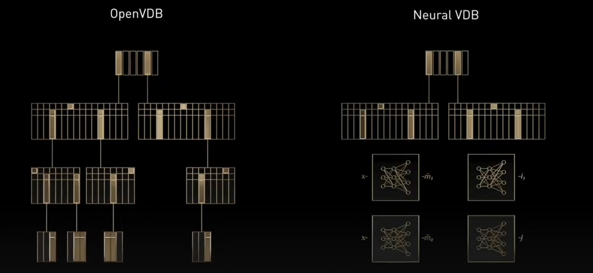

[官网视频介绍](https://www.youtube.com/watch?v=uAs8X5es1DE&ab_channel=NVIDIADeveloper)