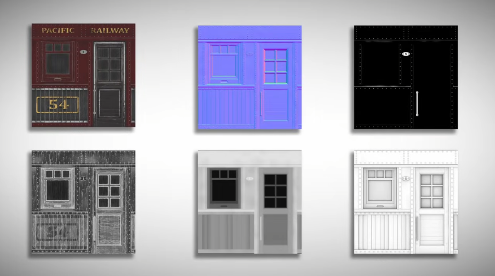
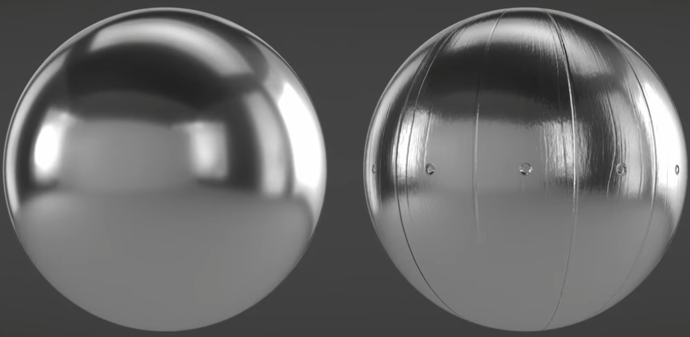

# PBR Physically-Based Rendering

各种参数互相组合可以得到大量材质效果。

一个材质参数汇总网站：[physicallybased.info](https://physicallybased.info/)

## Base Color/Albedo/Diffuse map: 物体的基础颜色

## Alpha map: 控制材质透明度

## Roughness map: 控制粗糙程度

Roughness 值越低，物体反射光线在反射角附近的采样角度范围越小，看起来越像镜面反射。

## Metallic map: 控制金属度

现实中的金属以电子反射光线，直接反射环境光，呈现自身颜色的部分较少。

Metallic 值越高，物体反射的光线中会有更多的环境光更少的基础颜色。

<video poster="" id="toast" autoplay="" controls="" muted="" loop="" playsinline="" width="100%"><source src="./i/PBRMetallic.mp4" type="video/mp4"></video>

## Hight/Displacement map: 控制表面高度

## Normal map: 法线向量控制光线反射方向

用高精度模型也能呈现这种效果，但是Normal map计算速度更快，且凹凸不是很大的情况下效果看着差不多，所以能用Normal map的地方就不用高精度模型。

Hight map可以通过计算得到Normal map，也可以用单独的Normal map

## Ambient Occlusion map: 控制材质阴影

## Emission map: 控制材质发光
