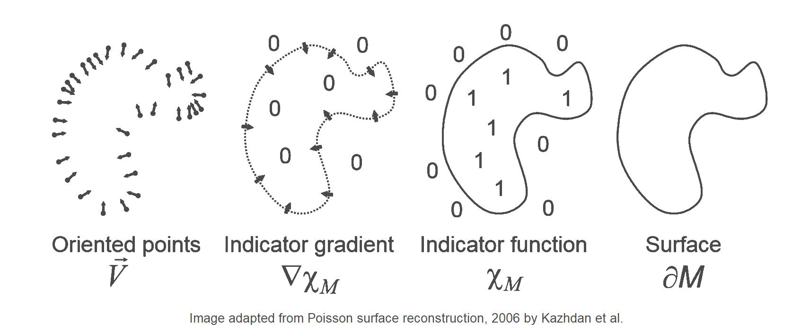
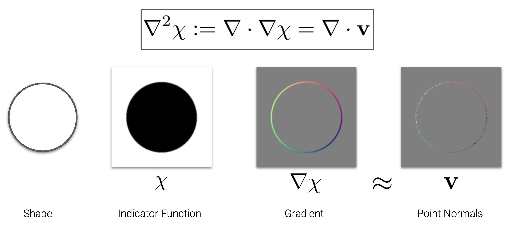
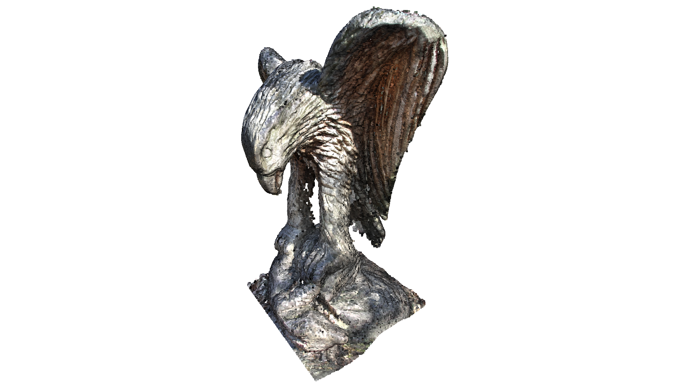
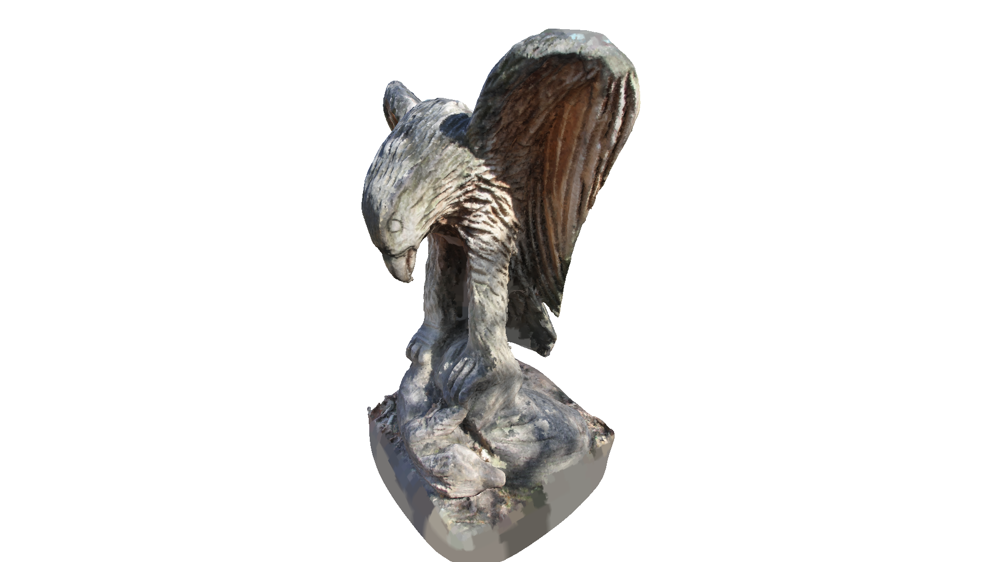
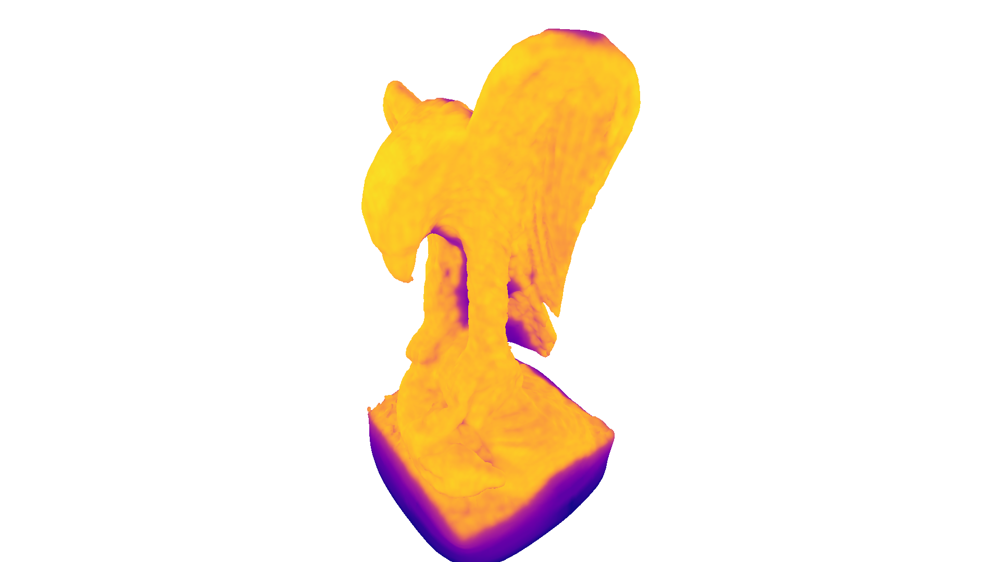
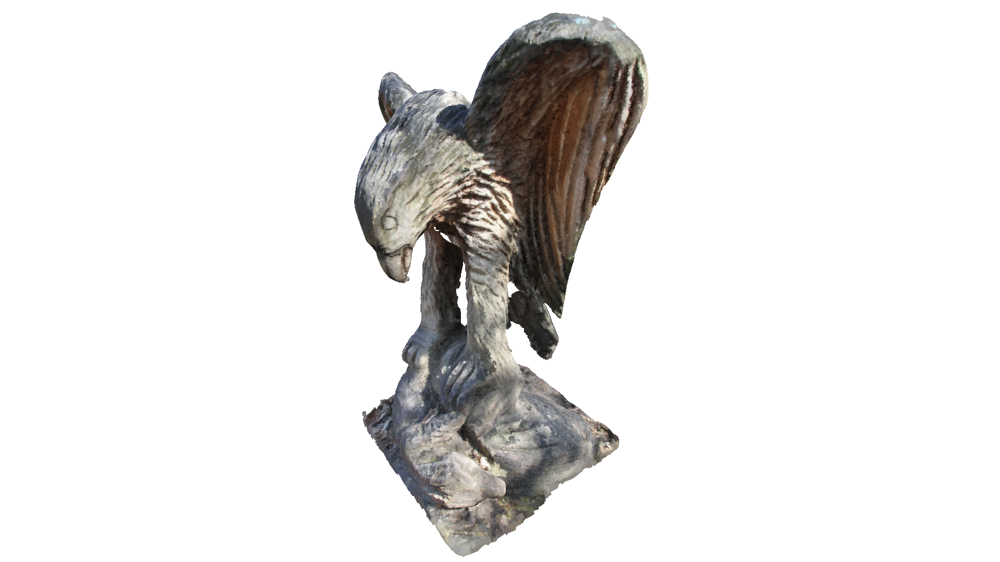

# Poisson Surface Reconstruction

Poisson Surface Reconstruction 是一种从**带法线的点云**重建 Mesh 的方法：

Poisson Surface Reconstruction 算法最终会构造一个函数 $\chi(\mathbf x)$ 表示这个物体，物体内部的函数值为 1，物体外部的函数值为 0：

于是，函数值在表面处发生变化，梯度方向应该与法线一致。

所以点云中的每个法线，都可以看成对梯度 $\nabla\chi$ 的一次采样。算法先把这些法线散射到空间中形成向量场 $\mathbf V$，再求解泊松方程 $\Delta\chi=\nabla\cdot\mathbf V$，得到梯度满足 $\nabla\chi\approx\mathbf V$ 的函数 $\chi$。这样就能从零散的梯度样本恢复出完整的内外标量场。

恢复出了标量场，那接下来就简单了。
这标量场本质是一种 [SDF](SDF.md)，直接用 [Marching Cube](MarchingCube.md) 等算法提取等值面即可表示物体表面。

因此 Poisson 和 [Marching Cube](MarchingCube.md) 不属于同一层：Poisson 负责从点云恢复标量场，Marching Cube 负责把标量场转换成三角网格。
Poisson 恢复出的场和标准 [SDF](SDF.md) 区别在于：它的数值不表示到表面的实际距离，真正有用的是 $\chi(\mathbf x)=\gamma$ 这个等值面。

由于 Poisson 求解的是全局标量场，它生成的表面通常比较平滑、闭合，也能自动填补点云中的小洞。但这也意味着：

* 它不会严格经过每个输入点；
* 开放曲面可能被强行封口；
* 没有观测的区域也可能被补出错误表面；
* 错误或方向不一致的法线会严重影响结果；
* 尖锐细节可能被平滑。

## Open3D 教程中的实际效果

[Open3D 官方 Surface Reconstruction 教程](https://www.open3d.org/docs/release/tutorial/geometry/surface_reconstruction.html)用一个鹰的点云直观展示了 Poisson Surface Reconstruction 的效果。以下图片均来自该教程。

输入是一个带法线的点云：

调用 `create_from_point_cloud_poisson(pcd, depth=9)` 后会生成平滑、闭合的 Mesh：

注意鹰的底部被补出了点云中不存在的表面。这是因为 Poisson 会在采样稀疏甚至没有采样的区域继续外推。

Open3D 在返回 Mesh 的同时，还会返回每个顶点的 `density`。下图中黄色表示输入点支持较多，紫色表示输入点支持较少：

因此可以删除 `density` 最低的一部分顶点。官方教程删除了低于 1% 分位数的顶点和相连三角形，去掉了大部分底部的错误表面：

常见的 **Screened Poisson Surface Reconstruction** 在原方法上增加了“表面应靠近输入点”的约束，因此通常比原始 Poisson 更贴合点云。`pointWeight` 越大，结果越靠近输入点，但也越容易跟随噪声；设为 0 时就是原始 Poisson。

另一个常见参数 `depth` 控制空间离散的最高分辨率。值越大，可以保留的细节越多，但计算量、内存和最终三角面数量也会增加。实际使用中，法线的质量和方向一致性通常比单纯增大 `depth` 更重要。
