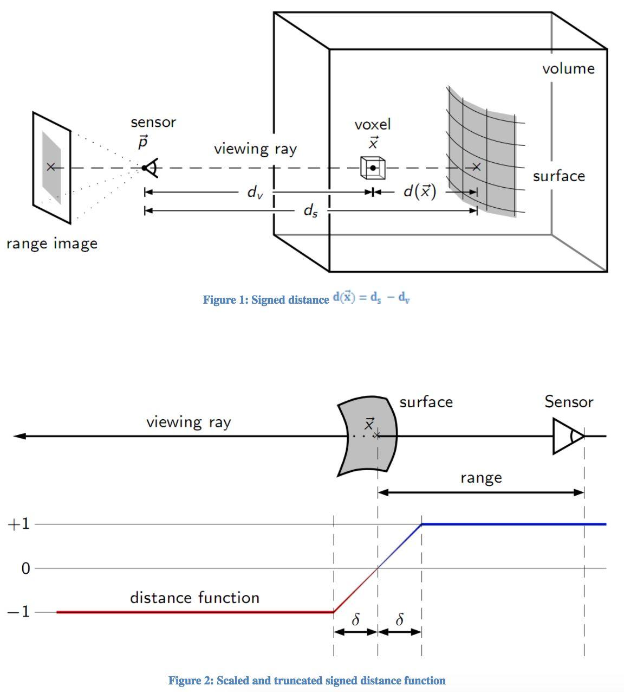
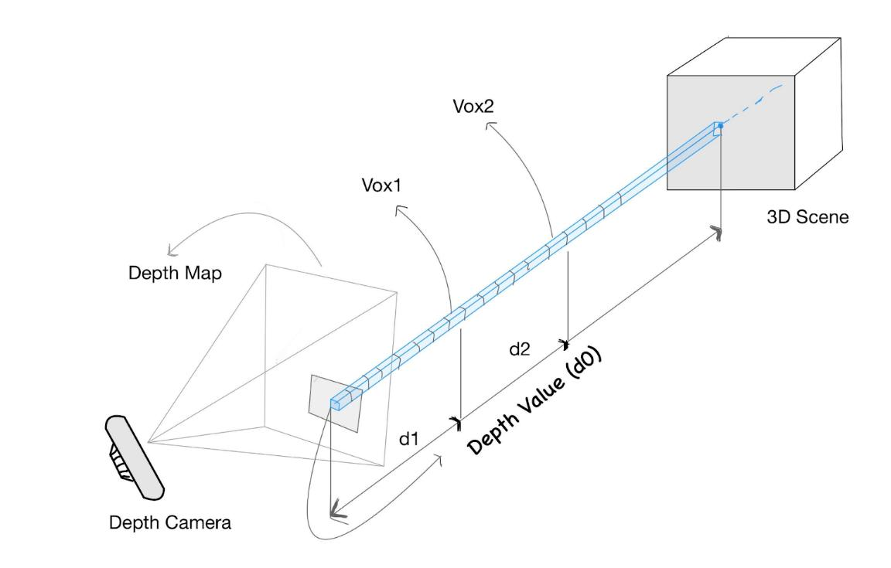
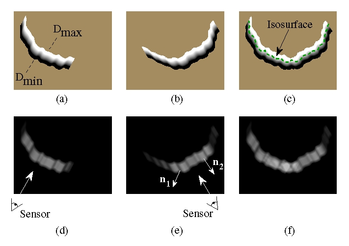

# TSDF (Truncated Signed Distance Function) 和 TSDF Fusion

TSDF Fusion 是一种将多帧 RGB-D 图像融合为 SDF 格式 Mesh 的方法，而 TSDF 是针对这种融合过程而专门设计的特殊格式的 SDF。

前置知识：[SDF(Signed Distance Field)](SDF.md)

回忆一下普通 SDF 的格式：每个像素（体素）记录自己与距离自己最近物体之间的距离，如果在物体内，则距离为负，正好在物体边界上则为0。

和SDF一样，TSDF也是一个包围待重建场景的长方体包围盒，并按照指定分辨率划分了体素。

RGB-D 图像中的每一个像素天生就对应到观测表面上的一个点，可直接作为体素中 Signed Distance 的来源：在观测表面处的体素 Distance 为 0、比观测表面更靠近相机的体素符号位正、在观测表面之后的体素符号为负：

这也就是 TSDF Fusion 从 RGB-D 图像构建 SDF 格式 Mesh 的核心思想。

显然，直接这样定体素的 SDF 值是不行的，因为每个 RGB-D 相机观测的范围有限，每个体素可能被多个 RGB-D 像素穿过，且观测表面之后的体素实际上是没有观测数据的，如果直接用其值那就意味着观测表面之后全是实心的，如果有另一个相机从反面观测那 SDF 的值为正就冲突了，显然不符合实际。

TSDF 正是为解决这些问题而设计：

针对表面之后无观测数据的问题，TSDF 引入权重的概念，将体素的 SDF 值设置为多条像素观测数据的加权平均，这样只要把观测表面之后的权重设置为0就解决了冲突问题。除此之外，权重还可以用于处理一些不稳定的观测结果，在已知深度图的置信度等数据的情况下，给置信度低的深度数据降低权重可以减少不稳定的观测结果对重建效果的影响。

光有权重还不够，有些异常的深度数据会产生很大的深度值，即使设置了权重算均值也容易被带偏，所以 TSDF 还加了 Truncated 机制，将体素的 SDF 值截断在一定范围内。

最经典、最直观的是 Curless & Levoy 1996 的 Figure 4。它不是画整个三维体素网格，而是用一个二维截面把“两个视角的距离场如何融合”完整画出来：

这张图应当按“列”来读：

### 第一列：视角 1 的观测

* **(d)**：传感器从左下方观察表面，灰度表示该视角给每个位置分配的权重。
* **(a)**：由该帧观测生成的 signed distance field。

  * 白黑交界附近是观测到的表面；
  * (D_{\min}) 和 (D_{\max}) 表示距离值的截断或限定范围。

### 第二列：视角 2 的观测

* **(e)**：传感器换到右下方，相当于对同一物体从另一个角度进行第二次扫描。
* **(b)**：第二帧独立产生的 signed distance field。
* 因为观察方向不同，第二帧能对第一帧不可靠或不可见的区域提供补充。
* (n_1) 处接近掠射角，可信度较低；(n_2) 更正对相机，权重更高。

### 第三列：融合结果

* **(f)**：两个视角的权重相加，重叠观测区域的总置信度更高。
* **(c)**：把 (a) 和 (b) 的 signed distance 按权重逐位置平均。
* 绿色虚线就是融合距离场的零水平集 $F(\mathbf x)=0$ 也就是最终重建出的表面。

最关键的理解是：

> 多帧 TSDF Fusion 并不是先把每一帧分别生成一个 mesh，再把 mesh 拼起来；而是每一帧都对同一个全局体素场提供一组带权的距离测量，持续更新同一个 $F(\mathbf x)$。
