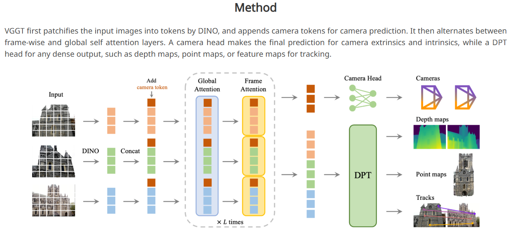

# VGGT 原理解析



原版[VGGT](https://github.com/facebookresearch/vggt/blob/44b3afbd1869d8bde4894dd8ea1e293112dd5eba)由一个骨干网络和4个Head构成：

```python
self.aggregator = Aggregator(img_size=img_size, patch_size=patch_size, embed_dim=embed_dim)

self.camera_head = CameraHead(dim_in=2 * embed_dim) if enable_camera else None
self.point_head = DPTHead(dim_in=2 * embed_dim, output_dim=4, activation="inv_log", conf_activation="expp1") if enable_point else None
self.depth_head = DPTHead(dim_in=2 * embed_dim, output_dim=2, activation="exp", conf_activation="expp1") if enable_depth else None
self.track_head = TrackHead(dim_in=2 * embed_dim, patch_size=patch_size) if enable_track else None
```

其运行时输入为一批图片和一批用于track的查询点，输出为相机位置编码和深度+点云及其置信度，如果有track查询点输入还会输出查询点在每张图片上的像素位置、可见性及置信度：

```python
def forward(self, images: torch.Tensor, query_points: torch.Tensor = None):
    """
    Forward pass of the VGGT model.

    Args:
        images (torch.Tensor): Input images with shape [S, 3, H, W] or [B, S, 3, H, W], in range [0, 1].
            B: batch size, S: sequence length, 3: RGB channels, H: height, W: width
        query_points (torch.Tensor, optional): Query points for tracking, in pixel coordinates.
            Shape: [N, 2] or [B, N, 2], where N is the number of query points.
            Default: None

    Returns:
        dict: A dictionary containing the following predictions:
            - pose_enc (torch.Tensor): Camera pose encoding with shape [B, S, 9] (from the last iteration)
            - depth (torch.Tensor): Predicted depth maps with shape [B, S, H, W, 1]
            - depth_conf (torch.Tensor): Confidence scores for depth predictions with shape [B, S, H, W]
            - world_points (torch.Tensor): 3D world coordinates for each pixel with shape [B, S, H, W, 3]
            - world_points_conf (torch.Tensor): Confidence scores for world points with shape [B, S, H, W]
            - images (torch.Tensor): Original input images, preserved for visualization

            If query_points is provided, also includes:
            - track (torch.Tensor): Point tracks with shape [B, S, N, 2] (from the last iteration), in pixel coordinates
            - vis (torch.Tensor): Visibility scores for tracked points with shape [B, S, N]
            - conf (torch.Tensor): Confidence scores for tracked points with shape [B, S, N]
    """        
    # If without batch dimension, add it
    if len(images.shape) == 4:
        images = images.unsqueeze(0)
        
    if query_points is not None and len(query_points.shape) == 2:
        query_points = query_points.unsqueeze(0)

    aggregated_tokens_list, patch_start_idx = self.aggregator(images)

    predictions = {}

    with torch.cuda.amp.autocast(enabled=False):
        if self.camera_head is not None:
            pose_enc_list = self.camera_head(aggregated_tokens_list)
            predictions["pose_enc"] = pose_enc_list[-1]  # pose encoding of the last iteration
            predictions["pose_enc_list"] = pose_enc_list
            
        if self.depth_head is not None:
            depth, depth_conf = self.depth_head(
                aggregated_tokens_list, images=images, patch_start_idx=patch_start_idx
            )
            predictions["depth"] = depth
            predictions["depth_conf"] = depth_conf

        if self.point_head is not None:
            pts3d, pts3d_conf = self.point_head(
                aggregated_tokens_list, images=images, patch_start_idx=patch_start_idx
            )
            predictions["world_points"] = pts3d
            predictions["world_points_conf"] = pts3d_conf

    if self.track_head is not None and query_points is not None:
        track_list, vis, conf = self.track_head(
            aggregated_tokens_list, images=images, patch_start_idx=patch_start_idx, query_points=query_points
        )
        predictions["track"] = track_list[-1]  # track of the last iteration
        predictions["vis"] = vis
        predictions["conf"] = conf

    if not self.training:
        predictions["images"] = images  # store the images for visualization during inference

    return predictions
```

VGGT的结构决定了它只能输入固定尺寸的图片。
原版VGGT参数输入尺寸为518x518，patch_size为14x14。
在原版代码中，对于任意尺寸的图片，在输入VGGT之前是先由[`load_and_preprocess_images_square`](https://github.com/facebookresearch/vggt/blob/44b3afbd1869d8bde4894dd8ea1e293112dd5eba/vggt/utils/load_fn.py#L13)padding为正方形再缩放到1024x1024，再在[`run_VGGT`](https://github.com/facebookresearch/vggt/blob/44b3afbd1869d8bde4894dd8ea1e293112dd5eba/demo_colmap.py#L72)里缩放到518x518。

## `Aggregator` 结构解析

### `patch_embed`

图片输入先经过一个`patch_embed`：

```python
B, S, C_in, H, W = images.shape

if C_in != 3:
    raise ValueError(f"Expected 3 input channels, got {C_in}")

# Normalize images and reshape for patch embed
images = (images - self._resnet_mean) / self._resnet_std

# Reshape to [B*S, C, H, W] for patch embedding
images = images.view(B * S, C_in, H, W)
patch_tokens = self.patch_embed(images)

if isinstance(patch_tokens, dict):
    patch_tokens = patch_tokens["x_norm_patchtokens"]
```

这个`patch_embed`就是DINOv2或者卷积：

```python
if "conv" in patch_embed:
    self.patch_embed = PatchEmbed(img_size=img_size, patch_size=patch_size, in_chans=3, embed_dim=embed_dim)
else:
    vit_models = {
        "dinov2_vitl14_reg": vit_large,
        "dinov2_vitb14_reg": vit_base,
        "dinov2_vits14_reg": vit_small,
        "dinov2_vitg2_reg": vit_giant2,
    }

    self.patch_embed = vit_models[patch_embed](
        img_size=img_size,
        patch_size=patch_size,
        num_register_tokens=num_register_tokens,
        interpolate_antialias=interpolate_antialias,
        interpolate_offset=interpolate_offset,
        block_chunks=block_chunks,
        init_values=init_values,
    )

    # Disable gradient updates for mask token
    if hasattr(self.patch_embed, "mask_token"):
        self.patch_embed.mask_token.requires_grad_(False)
```

### `camera_token`和`register_token`

再拿两个`camera_token`和`register_token`给拼在`patch_embed`后面：

```python
_, P, C = patch_tokens.shape

# Expand camera and register tokens to match batch size and sequence length
camera_token = slice_expand_and_flatten(self.camera_token, B, S)
register_token = slice_expand_and_flatten(self.register_token, B, S)

# Concatenate special tokens with patch tokens
tokens = torch.cat([camera_token, register_token, patch_tokens], dim=1)
```

这里的`slice_expand_and_flatten`就是根据`patch_embed`的尺寸把`token_tensor`复制几遍：

```python
def slice_expand_and_flatten(token_tensor, B, S):
    """
    Processes specialized tokens with shape (1, 2, X, C) for multi-frame processing:
    1) Uses the first position (index=0) for the first frame only
    2) Uses the second position (index=1) for all remaining frames (S-1 frames)
    3) Expands both to match batch size B
    4) Concatenates to form (B, S, X, C) where each sequence has 1 first-position token
       followed by (S-1) second-position tokens
    5) Flattens to (B*S, X, C) for processing

    Returns:
        torch.Tensor: Processed tokens with shape (B*S, X, C)
    """

    # Slice out the "query" tokens => shape (1, 1, ...)
    query = token_tensor[:, 0:1, ...].expand(B, 1, *token_tensor.shape[2:])
    # Slice out the "other" tokens => shape (1, S-1, ...)
    others = token_tensor[:, 1:, ...].expand(B, S - 1, *token_tensor.shape[2:])
    # Concatenate => shape (B, S, ...)
    combined = torch.cat([query, others], dim=1)

    # Finally flatten => shape (B*S, ...)
    combined = combined.view(B * S, *combined.shape[2:])
    return combined
```

这两个`camera_token`和`register_token`就是两个可训练的`nn.Parameter`：

```python
# Note: We have two camera tokens, one for the first frame and one for the rest
# The same applies for register tokens
self.camera_token = nn.Parameter(torch.randn(1, 2, 1, embed_dim))
self.register_token = nn.Parameter(torch.randn(1, 2, num_register_tokens, embed_dim))
```

并且经过`normal_`初始化参数：

```python
# Initialize parameters with small values
nn.init.normal_(self.camera_token, std=1e-6)
nn.init.normal_(self.register_token, std=1e-6)
```

所以，这两个`camera_token`和`register_token`就是把可训练的两个token拼接在图片的`patch_embed`后面输入给transformer，每张图片后面都拼了一个相同的token。

### patch位置信息

接下来获取patch的位置信息：

```python
pos = None
if self.rope is not None:
    pos = self.position_getter(B * S, H // self.patch_size, W // self.patch_size, device=images.device)

if self.patch_start_idx > 0:
    # do not use position embedding for special tokens (camera and register tokens)
    # so set pos to 0 for the special tokens
    pos = pos + 1
    pos_special = torch.zeros(B * S, self.patch_start_idx, 2).to(images.device).to(pos.dtype)
    pos = torch.cat([pos_special, pos], dim=1)
```

其实就是每个patch在图像上的坐标：

```python
class PositionGetter:
    """Generates and caches 2D spatial positions for patches in a grid.

    This class efficiently manages the generation of spatial coordinates for patches
    in a 2D grid, caching results to avoid redundant computations.

    Attributes:
        position_cache: Dictionary storing precomputed position tensors for different
            grid dimensions.
    """

    def __init__(self):
        """Initializes the position generator with an empty cache."""
        self.position_cache: Dict[Tuple[int, int], torch.Tensor] = {}

    def __call__(self, batch_size: int, height: int, width: int, device: torch.device) -> torch.Tensor:
        """Generates spatial positions for a batch of patches.

        Args:
            batch_size: Number of samples in the batch.
            height: Height of the grid in patches.
            width: Width of the grid in patches.
            device: Target device for the position tensor.

        Returns:
            Tensor of shape (batch_size, height*width, 2) containing y,x coordinates
            for each position in the grid, repeated for each batch item.
        """
        if (height, width) not in self.position_cache:
            y_coords = torch.arange(height, device=device)
            x_coords = torch.arange(width, device=device)
            positions = torch.cartesian_prod(y_coords, x_coords)
            self.position_cache[height, width] = positions

        cached_positions = self.position_cache[height, width]
        return cached_positions.view(1, height * width, 2).expand(batch_size, -1, -1).clone()
```

### Attention计算

经过多个Attention模块，每个Attention模块里都有几个全局attention和帧内attention子模块，根据`aa_order`决定是全局attention还是帧内attention，最后`output_list`输出attention后的所有token：

```python
# update P because we added special tokens
_, P, C = tokens.shape

frame_idx = 0
global_idx = 0
output_list = []

for _ in range(self.aa_block_num):
    for attn_type in self.aa_order:
        if attn_type == "frame":
            tokens, frame_idx, frame_intermediates = self._process_frame_attention(
                tokens, B, S, P, C, frame_idx, pos=pos
            )
        elif attn_type == "global":
            tokens, global_idx, global_intermediates = self._process_global_attention(
                tokens, B, S, P, C, global_idx, pos=pos
            )
        else:
            raise ValueError(f"Unknown attention type: {attn_type}")

    for i in range(len(frame_intermediates)):
        # concat frame and global intermediates, [B x S x P x 2C]
        concat_inter = torch.cat([frame_intermediates[i], global_intermediates[i]], dim=-1)
        output_list.append(concat_inter)

del concat_inter
del frame_intermediates
del global_intermediates
return output_list, self.patch_start_idx
```

默认值为一个帧内加一个全局Attention：

```python
aa_order=["frame", "global"]
```

帧内Attention和全局Attention模型结构都一样：

```python
self.frame_blocks = nn.ModuleList(
    [
        block_fn(
            dim=embed_dim,
            num_heads=num_heads,
            mlp_ratio=mlp_ratio,
            qkv_bias=qkv_bias,
            proj_bias=proj_bias,
            ffn_bias=ffn_bias,
            init_values=init_values,
            qk_norm=qk_norm,
            rope=self.rope,
        )
        for _ in range(depth)
    ]
)

self.global_blocks = nn.ModuleList(
    [
        block_fn(
            dim=embed_dim,
            num_heads=num_heads,
            mlp_ratio=mlp_ratio,
            qkv_bias=qkv_bias,
            proj_bias=proj_bias,
            ffn_bias=ffn_bias,
            init_values=init_values,
            qk_norm=qk_norm,
            rope=self.rope,
        )
        for _ in range(depth)
    ]
)
```

区别在于推断时`token`的重排方式不一样：

```python
def _process_frame_attention(self, tokens, B, S, P, C, frame_idx, pos=None):
    """
    Process frame attention blocks. We keep tokens in shape (B*S, P, C).
    """
    # If needed, reshape tokens or positions:
    if tokens.shape != (B * S, P, C):
        tokens = tokens.view(B, S, P, C).view(B * S, P, C)

    if pos is not None and pos.shape != (B * S, P, 2):
        pos = pos.view(B, S, P, 2).view(B * S, P, 2)

    intermediates = []

    # by default, self.aa_block_size=1, which processes one block at a time
    for _ in range(self.aa_block_size):
        if self.training:
            tokens = checkpoint(self.frame_blocks[frame_idx], tokens, pos, use_reentrant=self.use_reentrant)
        else:
            tokens = self.frame_blocks[frame_idx](tokens, pos=pos)
        frame_idx += 1
        intermediates.append(tokens.view(B, S, P, C))

    return tokens, frame_idx, intermediates

def _process_global_attention(self, tokens, B, S, P, C, global_idx, pos=None):
    """
    Process global attention blocks. We keep tokens in shape (B, S*P, C).
    """
    if tokens.shape != (B, S * P, C):
        tokens = tokens.view(B, S, P, C).view(B, S * P, C)

    if pos is not None and pos.shape != (B, S * P, 2):
        pos = pos.view(B, S, P, 2).view(B, S * P, 2)

    intermediates = []

    # by default, self.aa_block_size=1, which processes one block at a time
    for _ in range(self.aa_block_size):
        if self.training:
            tokens = checkpoint(self.global_blocks[global_idx], tokens, pos, use_reentrant=self.use_reentrant)
        else:
            tokens = self.global_blocks[global_idx](tokens, pos=pos)
        global_idx += 1
        intermediates.append(tokens.view(B, S, P, C))

    return tokens, global_idx, intermediates
```

注意这两个函数唯一的区别在于开头几行：

```python
def _process_frame_attention(self, tokens, B, S, P, C, frame_idx, pos=None):
    ......
    if tokens.shape != (B * S, P, C):
        tokens = tokens.view(B, S, P, C).view(B * S, P, C)

    if pos is not None and pos.shape != (B * S, P, 2):
        pos = pos.view(B, S, P, 2).view(B * S, P, 2)

    ......

def _process_global_attention(self, tokens, B, S, P, C, global_idx, pos=None):
    ......
    if tokens.shape != (B, S * P, C):
        tokens = tokens.view(B, S, P, C).view(B, S * P, C)

    if pos is not None and pos.shape != (B, S * P, 2):
        pos = pos.view(B, S, P, 2).view(B, S * P, 2)

    ......
```

帧内Attention的batch维是`B*S`，序列长度是`P`（单帧内部token），因此每个batch是在同一帧内计算attention。
全局Attention的batch 维是`B`，序列长度是`S*P`（所有帧token串起来），因此每个batch是在所有帧的所有token间计算attention。

## `CameraHead`：迭代式的相机参数细化

输入是 `aggregator` 输出的最后一层 token（`[B,S,P,2C]`），`CameraHead` 只取第 0 个 token（相机 token），得到 `pose_tokens: [B,S,2C]`，目标输出是每帧 9 维相机编码：`[T(3), quat(4), FoV(2)]`：

```python
def forward(self, aggregated_tokens_list: list, num_iterations: int = 4) -> list:
    """
    Forward pass to predict camera parameters.

    Args:
        aggregated_tokens_list (list): List of token tensors from the network;
            the last tensor is used for prediction.
        num_iterations (int, optional): Number of iterative refinement steps. Defaults to 4.

    Returns:
        list: A list of predicted camera encodings (post-activation) from each iteration.
    """
    # Use tokens from the last block for camera prediction.
    tokens = aggregated_tokens_list[-1]

    # Extract the camera tokens
    pose_tokens = tokens[:, :, 0]
    pose_tokens = self.token_norm(pose_tokens)

    pred_pose_enc_list = self.trunk_fn(pose_tokens, num_iterations)
    return pred_pose_enc_list
```

`CameraHead.trunk_fn`是`CameraHead`的核心功能，其包含迭代增量式相机回归。

下面是对 `trunk_fn` 迭代细化机制的逐步解读。

---

#### 总览

`trunk_fn` 的设计思想来自 DiT（Diffusion Transformer）中的 **AdaLN（Adaptive Layer Norm）调制** 和 RAFT 中的 **迭代增量更新**。它不是一次性回归出相机参数，而是每一轮都用"当前估计"去调制 token，然后预测一个增量，逐步逼近真实值。

---

#### Step 0：初始化

```python
B, S, C = pose_tokens.shape   # B=batch, S=帧数, C=2048
pred_pose_enc = None           # 还没有任何相机估计
pred_pose_enc_list = []        # 收集每轮输出
```

`pose_tokens` 是 aggregator 输出的 **camera token**（每帧 1 个），经过 `LayerNorm` 后传入。它编码了"这个场景中每帧的相机应该是什么"的全局信息，但还没有被解码成具体的 9D 参数。

---

接下来运行多轮：

```python
for _ in range(num_iterations):
```

---

#### Step 1：构造条件输入（当前相机估计）

```python
if pred_pose_enc is None:
    module_input = self.embed_pose(self.empty_pose_tokens.expand(B, S, -1))
else:
    pred_pose_enc = pred_pose_enc.detach()
    module_input = self.embed_pose(pred_pose_enc)
```

- **第 1 轮**：没有任何先验，用可学习的 `empty_pose_tokens`通过 `embed_pose`（Linear 9->2048）映射到 token 空间（全零初始化，形状 `[1,1,9]`广播到 `[B,S,9]`，所以每个相机token相同）。
- **后续轮次**：把上一轮的 9D 相机预测映射到 token 空间（`detach()` 切断跨迭代梯度，让每轮独立优化，类似 RAFT 的做法）。

此时 `module_input` 形状为 `[B, S, 2048]`，代表"当前对相机参数的最优估计"在 token 空间的表达。

---

#### Step 2：生成 AdaLN 调制参数

```python
shift_msa, scale_msa, gate_msa = self.poseLN_modulation(module_input).chunk(3, dim=-1)
```

`poseLN_modulation` 是 `SiLU -> Linear(2048, 3*2048)`，把条件输入变成三组参数：
- `shift_msa [B,S,2048]`：对特征做平移
- `scale_msa [B,S,2048]`：对特征做缩放
- `gate_msa  [B,S,2048]`：控制调制后特征的强度

---

#### Step 3：用 AdaLN 调制 pose token

```python
pose_tokens_modulated = gate_msa * modulate(self.adaln_norm(pose_tokens), shift_msa, scale_msa)
pose_tokens_modulated = pose_tokens_modulated + pose_tokens
```

展开来看：

1. `self.adaln_norm(pose_tokens)` — 先做 LayerNorm
2. `modulate(x, shift, scale)` 即 `x * (1 + scale) + shift` — 用当前相机估计来自适应地缩放和偏移特征
3. 再乘 `gate_msa` — 控制"调制信号"的强度
4. 最后加上原始 `pose_tokens` 作为残差连接

第 1 轮时条件接近零向量，调制几乎不生效，trunk 看到的近乎原始 token；后续轮次，条件越来越准，调制越来越有针对性。

---

#### Step 4：通过 Transformer Trunk 提炼

```python
pose_tokens_modulated = self.trunk(pose_tokens_modulated)
```

`self.trunk` 是 4 层 `Block`（标准 Transformer block，含 self-attention + FFN）。输入形状 `[B,S,2048]`，S 个帧之间互相 attend。

这一步让不同帧的相机估计互相参考——比如"如果第 1 帧朝左，第 2 帧应该朝右"这类跨帧几何约束，在这里被隐式建模。

---

#### Step 5：预测增量并累加

```python
pred_pose_enc_delta = self.pose_branch(self.trunk_norm(pose_tokens_modulated))

if pred_pose_enc is None:
    pred_pose_enc = pred_pose_enc_delta
else:
    pred_pose_enc = pred_pose_enc + pred_pose_enc_delta
```

`pose_branch` 是 `MLP(2048 -> 1024 -> 9)`，把 trunk 输出映射回 9D 相机编码空间。

关键：输出的是`pred_pose_enc_delta`增量而非绝对值。
网络每次输出的只是"修正量"。

---

#### Step 6：激活并收集

```python
activated_pose = activate_pose(
    pred_pose_enc, trans_act=self.trans_act, quat_act=self.quat_act, fl_act=self.fl_act
)
pred_pose_enc_list.append(activated_pose)
```

对 9D 参数的三个部分分别施加激活：
- `T[:3]` — `linear`（平移无约束）
- `quat[3:7]` — `linear`（四元数无约束，后续转矩阵时会归一化）
- `FoV[7:9]` — `relu`（视场角必须为正）

每一轮的 `activated_pose` 都被记录，训练时可以对所有轮次施加监督（deep supervision），推理时取最后一轮。

## `DPTHead` 结构解析

`point_head`和`depth_head`都是`DPTHead`，只是输出通道数不一样。

DPT（Dense Prediction Transformer）源自论文 *"Vision Transformers for Dense Prediction"*（Ranftl et al., 2021）。核心思想：**从 Transformer 不同深度抽取多尺度特征，用类似 FPN 的逐级融合恢复到像素级分辨率**。

VGGT 的 `DPTHead` 就是在这个框架上做的，但输入不是普通 ViT 特征，而是 Aggregator 产出的**跨帧聚合 token**。

---

### 第 1 步：从多层 token 中选 4 层

```python
    intermediate_layer_idx: List[int] = [4, 11, 17, 23],
```

从 Aggregator 的 24 层输出中选第 **4、11、17、23** 层——分别代表浅层、中层、深层、最深层的特征。每层 token 形状为 `[B, S, P, 2C]`，去掉特殊 token 后只保留 patch token。

### 第 2 步：投影 + reshape 成 2D 特征图

```python
        for layer_idx in self.intermediate_layer_idx:
            x = aggregated_tokens_list[layer_idx][:, :, patch_start_idx:]
            // ...
            x = x.reshape(B * S, -1, x.shape[-1])
            x = self.norm(x)
            x = x.permute(0, 2, 1).reshape((x.shape[0], x.shape[-1], patch_h, patch_w))
            x = self.projects[dpt_idx](x)
            if self.pos_embed:
                x = self._apply_pos_embed(x, W, H)
            x = self.resize_layers[dpt_idx](x)
            out.append(x)
```

对每层：
1. **LayerNorm** 归一化
2. reshape 成 `[B*S, 2C, patch_h, patch_w]`（恢复空间结构）
3. **1x1 Conv** 投影到各自的通道数 `[256, 512, 1024, 1024]`
4. 可选加入**位置编码**（UV 正弦余弦嵌入）
5. **resize** 到不同空间尺度：
   - 第 0 层：`ConvTranspose2d stride=4`（放大 4x）
   - 第 1 层：`ConvTranspose2d stride=2`（放大 2x）
   - 第 2 层：`Identity`（不变）
   - 第 3 层：`Conv2d stride=2`（缩小 2x）

这样就得到 4 张**不同尺度**的特征图。

### 第 3 步：自底向上逐级融合（RefineNet 风格）

```python
    def scratch_forward(self, features: List[torch.Tensor]) -> torch.Tensor:
        layer_1, layer_2, layer_3, layer_4 = features

        layer_1_rn = self.scratch.layer1_rn(layer_1)
        layer_2_rn = self.scratch.layer2_rn(layer_2)
        layer_3_rn = self.scratch.layer3_rn(layer_3)
        layer_4_rn = self.scratch.layer4_rn(layer_4)

        out = self.scratch.refinenet4(layer_4_rn, size=layer_3_rn.shape[2:])
        // ...
        out = self.scratch.refinenet3(out, layer_3_rn, size=layer_2_rn.shape[2:])
        // ...
        out = self.scratch.refinenet2(out, layer_2_rn, size=layer_1_rn.shape[2:])
        // ...
        out = self.scratch.refinenet1(out, layer_1_rn)
        // ...
        out = self.scratch.output_conv1(out)
        return out
```

- 先对 4 层各做 **3x3 Conv**（`layer_rn`）统一到 256 通道
- 然后从**最深层到最浅层**逐级融合：
  - `refinenet4` → 上采样 → 加 `layer_3` → `refinenet3` → ... → `refinenet1`
- 每个 `FeatureFusionBlock` 内部是：

```python
class FeatureFusionBlock(nn.Module):
    // ...
    def forward(self, *xs, size=None):
        output = xs[0]
        if self.has_residual:
            res = self.resConfUnit1(xs[1])
            output = self.skip_add.add(output, res)
        output = self.resConfUnit2(output)
        // ... bilinear upsample ...
        output = self.out_conv(output)
        return output
```

即：上一级输出 + 残差卷积处理当前级 → 残差卷积 → 双线性上采样 → 1x1 Conv。

这个过程和 U-Net / FPN 类似，但全部用**残差卷积单元**（`ResidualConvUnit`：两层 3x3 Conv + skip connection）。

### 第 4 步：恢复到原始像素分辨率

```python
        out = custom_interpolate(
            out,
            (int(patch_h * self.patch_size / self.down_ratio), int(patch_w * self.patch_size / self.down_ratio)),
            mode="bilinear",
            align_corners=True,
        )
```

融合后的特征图再做一次双线性插值，恢复到 `H x W`（或 `H/2 x W/2`，取决于 `down_ratio`）。

### 第 5 步：最终卷积 + 激活分离

```python
        out = self.scratch.output_conv2(out)
        preds, conf = activate_head(out, activation=self.activation, conf_activation=self.conf_activation)
```

- `output_conv2`：`3x3 Conv → ReLU → 1x1 Conv`，输出 `output_dim` 个通道
- `activate_head` 把最后一个通道分出来当 **置信度**，其余通道当**预测值**：

| 任务头 | output_dim | 预测值 | 激活 | 置信度激活 |
|--------|-----------|--------|------|-----------|
| DepthHead | 2 | 1 通道（深度） | `exp`（保证正） | `1 + exp(x)` |
| PointHead | 4 | 3 通道（xyz） | `inv_log`（保符号大范围） | `1 + exp(x)` |

---

### 一句话总结

DPTHead = **多层 token 恢复为多尺度 2D 特征图** → **自底向上残差融合**（像 FPN）→ **上采样到像素级** → **分离出预测值和置信度**。它本质上是把 Transformer 的"扁平 token 序列"重新恢复成"空间金字塔"，然后用类 U-Net 的逐级融合做稠密预测。

## `TrackHead`结构解析

`TrackHead` 的核心原理是**基于特征相关性（Correlation）和时空 Transformer 的迭代式点轨迹细化（Iterative Refinement）**。它的设计深受 [Co-Tracker](https://github.com/facebookresearch/co-tracker) 和 [VGGSfM](https://github.com/facebookresearch/vggsfm) 的启发。

简单来说，它的工作流程是：**提取稠密特征图 -> 在参考帧采特征 -> 粗略猜测轨迹 -> 局部搜索匹配（算相关性） -> Transformer 预测修正量 -> 循环细化**。

其由`DPTHead`和Tracker模块两个部分组成：

```python
# Feature extractor based on DPT architecture
# Processes tokens into feature maps for tracking
self.feature_extractor = DPTHead(
    dim_in=dim_in,
    patch_size=patch_size,
    features=features,
    feature_only=True,  # Only output features, no activation
    down_ratio=2,  # Reduces spatial dimensions by factor of 2
    pos_embed=False,
)

# Tracker module that predicts point trajectories
# Takes feature maps and predicts coordinates and visibility
self.tracker = BaseTrackerPredictor(
    latent_dim=features,  # Match the output_dim of feature extractor
    predict_conf=predict_conf,
    stride=stride,
    corr_levels=corr_levels,
    corr_radius=corr_radius,
    hidden_size=hidden_size,
)
```

这里 `down_ratio=2` 意味着输出的特征图分辨率是原图的一半（例如输入 518x518，特征图就是 259x259），这在保证跟踪精度的同时大幅节省了显存。

推断时先用这个`DPTHead`提取稠密特征，再用Tracker模块输出最终结果：

```python
def forward(self, aggregated_tokens_list, images, patch_start_idx, query_points=None, iters=None):
    """
    Forward pass of the TrackHead.

    Args:
        aggregated_tokens_list (list): List of aggregated tokens from the backbone.
        images (torch.Tensor): Input images of shape (B, S, C, H, W) where:
                                B = batch size, S = sequence length.
        patch_start_idx (int): Starting index for patch tokens.
        query_points (torch.Tensor, optional): Initial query points to track.
                                                If None, points are initialized by the tracker.
        iters (int, optional): Number of refinement iterations. If None, uses self.iters.

    Returns:
        tuple:
            - coord_preds (torch.Tensor): Predicted coordinates for tracked points.
            - vis_scores (torch.Tensor): Visibility scores for tracked points.
            - conf_scores (torch.Tensor): Confidence scores for tracked points (if predict_conf=True).
    """
    B, S, _, H, W = images.shape

    # Extract features from tokens
    # feature_maps has shape (B, S, C, H//2, W//2) due to down_ratio=2
    feature_maps = self.feature_extractor(aggregated_tokens_list, images, patch_start_idx)

    # Use default iterations if not specified
    if iters is None:
        iters = self.iters

    # Perform tracking using the extracted features
    coord_preds, vis_scores, conf_scores = self.tracker(query_points=query_points, fmaps=feature_maps, iters=iters)

    return coord_preds, vis_scores, conf_scores
```

这个Tracker模块是`TrackHead`的核心，它的原理来自 CoTracker / RAFT 家族：基于相关性的迭代坐标细化。