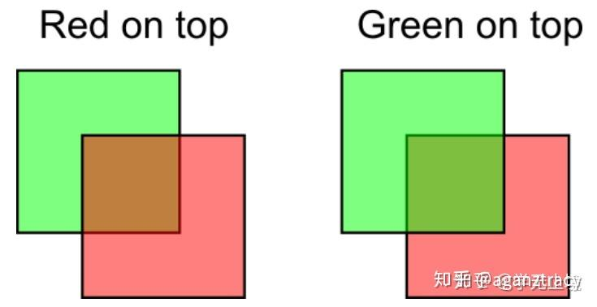

# 光栅化中的半透明物体：α-blending 透明度混合

[摘录原文](https://zhuanlan.zhihu.com/p/263566318)

学完[《【GAMES101课程笔记】投影和光栅化》](./投影和光栅化.md)可以知道，z-buffering算法可以以$O(n)$的复杂度正确处理光栅化过程中的遮挡。但是没法处理不透明物体。由于通过透明物体是可以看见被其遮挡的物体的，因此对于帧缓存就不能像之前那样直接替换更新颜色，而是要做透明度混合(α-blending)，用帧缓存中已有的颜色和透明片元的透明色混合出一个新的颜色。

透明度混合技术就提供了多种算法，将缓冲区中已有的颜色与新绘制的半透明片元的透明色做混合。

[《【GAMES101课程笔记】投影和光栅化》](./投影和光栅化.md)中讲到，为了处理遮挡，z-buffering算法总是将像素的颜色替换成空间中距离最近的的颜色，从而可以不用排序直接$O(n)$算完。那既然有不透明物体，那能不能直接在z-buffering算法里把有不透明物体距离更近的操作从替换缓存像素颜色改成和缓存像素颜色做平均呢？答案是不能：

1. 遮挡没有顺序，但是半透明是有顺序的，不能简单平均
2. 在“半透明->不透明1->不透明2”这样的顺序中，如果先来“不透明2”和“半透明”，那么颜色将被混合，不知道原本的“不透明2”和“半透明”各是多少，这时如果再来“不透明1”就没法计算
3. ......

还有很多类似的问题。归根结底，还是因为有半透明物体的渲染是有顺序的，半透明物体的绘制只能退回到[画家算法](./投影和光栅化.md)先排序再计算颜色值。
基于以上，渲染引擎一般会对物体先排序再渲染。在Unity中，整体上来说物体的渲染要按照如下顺序：

1. 先渲染不透明物：不用把半透明物体和不透明物体放在一起排序。不透明物体z-buffering算法就可完成，作为接下来半透明物体颜色混合的基础，之后就可以只对半透明物体进行排序和绘制。
2. 再渲染全透明物：这一步是个trick。渲染有透明度物体的时候，其实对于透明度极高的物体，那一点点透明度根本可以直接舍弃，对最终渲染效果影响又不大，还提升了效率。AlphaTest就是这样一种优化方式：我们设定一个alpha阈值，当偏于不满足条件（通常是小于阈值）就直接舍弃当作全透明，满足条件的片元就直接当作不透明物体进行处理。
3. 最后渲染半透明物：由远及近严格顺序在帧缓存中进行透明度混合。颜色混合公式有很多种。

但是，介绍[画家算法](./投影和光栅化.md)时就提到了物体相互交叠时无法判断哪个物体远或是近，所以才会用z-buffering解决了绘制不透明物体的部分。
但是此处半透明物体非得用画家算法，怎么解决透明物体相互交叠的情况？
而且，排序时间复杂度太高，有没有办法优化？

最直观的方法就是把替换buffer中的颜色和深度的操作换成在buffer里记录下每个像素的所有相关颜色和深度，最后再逐像素排个序，于是就能获取到每个像素的颜色顺序[[Kopanas et al. 2022]](https://dl.acm.org/doi/10.1145/3550454.3555497)。
当然还有很多trick，比如在[3D Gaussian Splatting](./3DGaussianSplatting.md)中就有针对Gaussian点云的画家算法。
