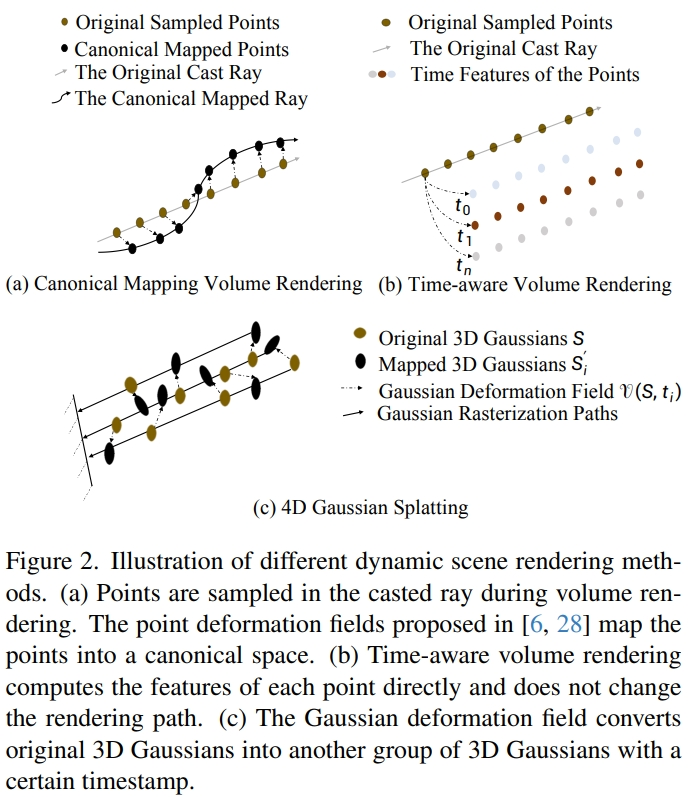
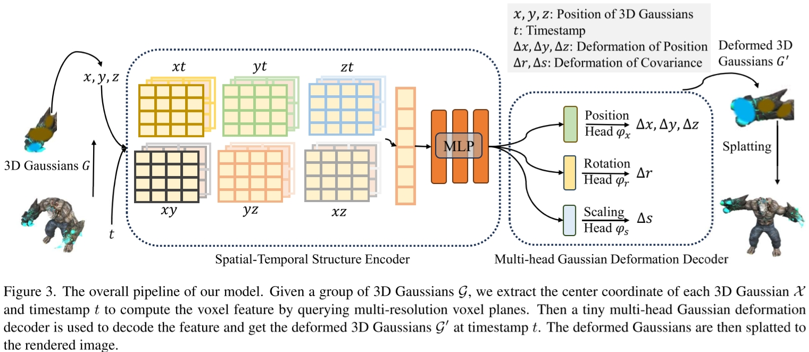

# 让NeRF动起来

动态NeRF的目标：输入坐标$\bm x$和时刻$t$输出颜色$c$和密度$\sigma$。

$$c,\sigma=\mathcal M(\bm x, t)$$

动态NeRF技术路线：

## Canonical-mapping volume rendering

基于NeRF的隐式表达难以修改，所以就修改Ray Marching采样路径，让采样路径变弯从而实现动态场景：

$$c,\sigma=\mathcal M(\bm x, t)=NeRF(\bm x+\Delta\bm x(t))$$

核心思想就是拟合这个$\Delta\bm x(t)$。

* Fast Dynamic Radiance Fields with Time-Aware Neural Voxels
* Robust Dynamic Radiance Fields
* D-NeRF: Neural Radiance Fields for Dynamic Scenes

## Time-aware volume rendering

基于体素的显式表达不能移动位置，但是可以直接修改每个体素上的参数从而实现动态场景。

* Hexplane: A fast representation for dynamic scenes
* Neural 3D Video Synthesis From Multi-View Video

## 4D Gaussian Splatting

基于3D高斯点的显示表达可以直接移动位置。

核心思想：计算高斯点位移$\Delta\mathcal G$，然后直接对高斯点云$\mathcal G$进行移动得到下一帧高斯点云$\mathcal G'$：
$$
\begin{aligned}
\mathcal G'&=\mathcal G+\Delta\mathcal G\\
\Delta\mathcal G&=\mathcal F(\mathcal G, t)
\end{aligned}
$$

模型设计：
* spatial-temporal structure encoder 特征提取 $f=\mathcal H(\mathcal G,t)$
  * $\mathcal G$被表示为6个K-Planes
  * 模型本体是一个MLP和6个multi-resolution K-Planes modules
  * K-Planes: Explicit Radiance Fields in Space, Time, and Appearance
* multi-head Gaussian deformation decoder 根据特征输出形变 $\Delta\mathcal G=\mathcal D(f)$

