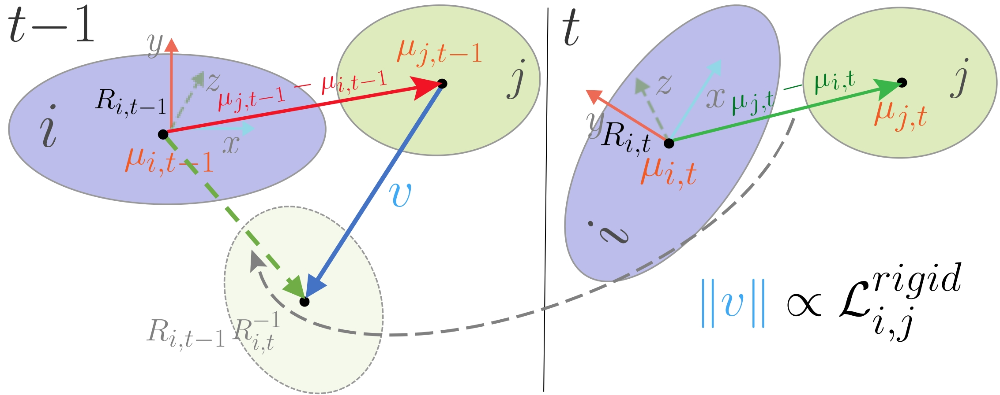
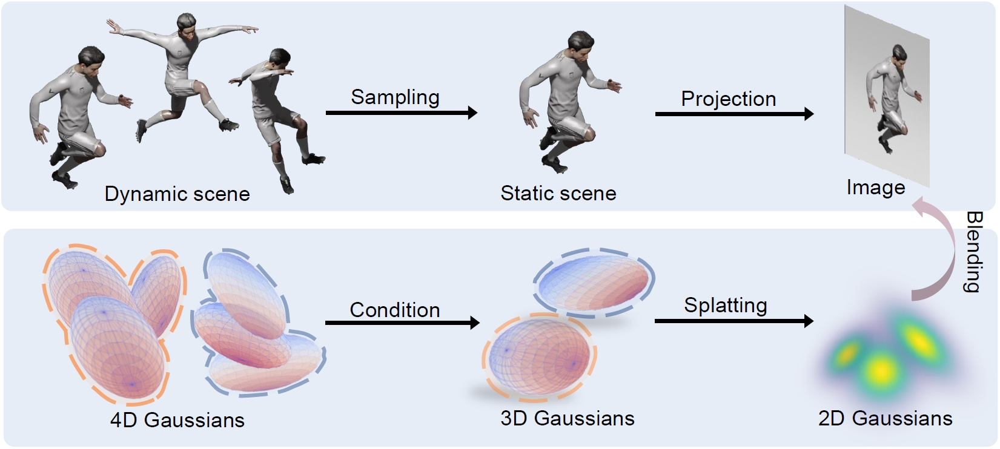
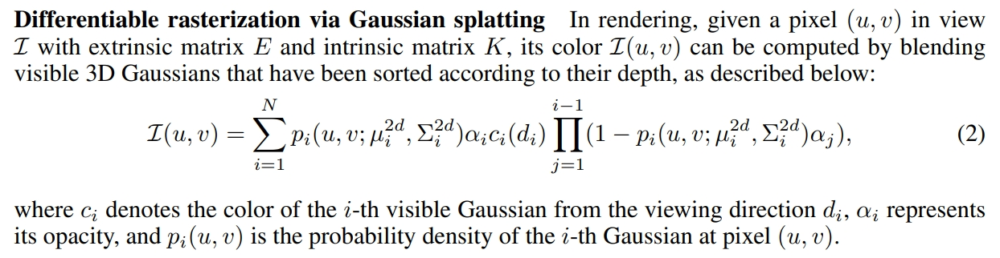
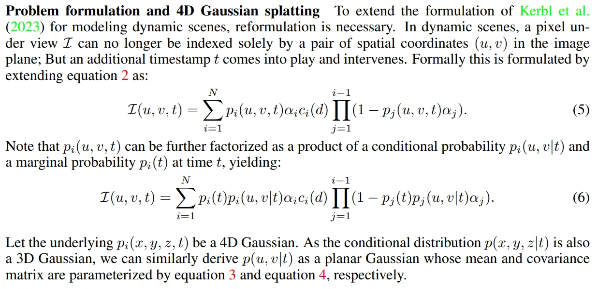
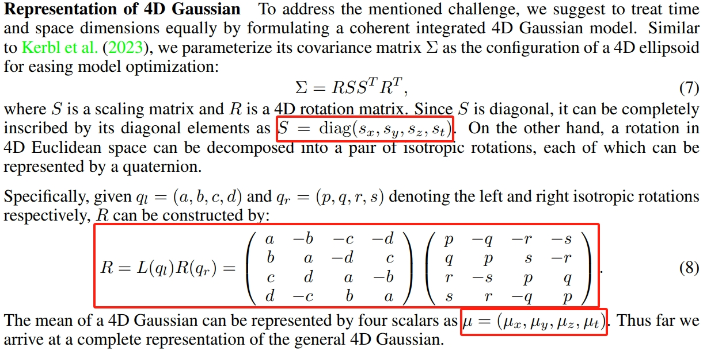
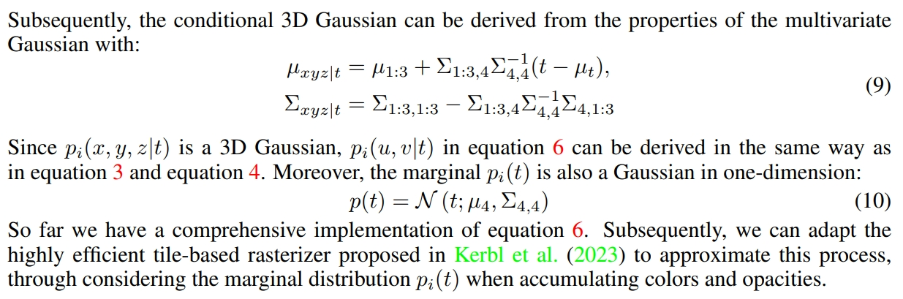
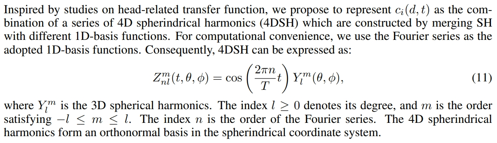
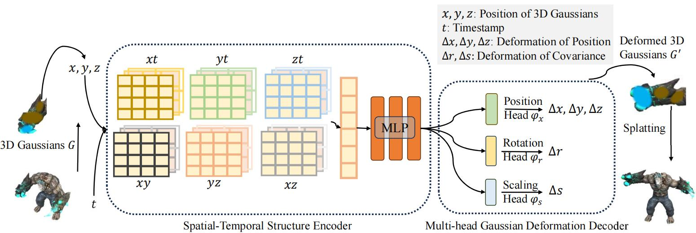

# 3D Gaussian Splatting 用于动态场景表示

## (3DV 2024) Dynamic 3D gaussians: Tracking by persistent dynamic view synthesis

基于物理启发出了三个正则化项加在loss函数里面：

* local-rigidity loss 局部刚度：一个Gaussian绕着某个轴旋转，相近的Gaussian都要跟着绕这个轴转
$$\mathcal{L}^{\text{rigid}}_{i, j} = w_{i,j} \left\| (\mu_{j,t-1} - \mu_{i,t-1}) - R^{}_{i,t-1} R^{-1}_{i,t} (\mu_{j,t} - \mu_{i,t}) \right\|_2$$
$$\mathcal{L}^{\text{rigid}} = \frac{1}{k |\mathcal{S}|} \sum_{i \in \mathcal{S}} \sum_{ j \in \text{knn}_{i;k}} \mathcal{L}^{\text{rigid}}_{i, j}$$
* local-rotation similarity 局部旋转相似性：相近的Gaussian相同旋转，作者加它的理由是实验发现效果更好
$$\mathcal{L}^{\text{rot}} = \frac{1}{k |\mathcal{S}|} \sum_{i \in \mathcal{S}} \sum_{ j \in \text{knn}_{i;k}} w_{i,j} \left\| \hat{q}^{}_{j,t} \hat{q}^{-1}_{j,t-1} - \hat{q}^{}_{i,t} \hat{q}^{-1}_{i,t-1}  \right\|_2$$
* local-isometry loss 局部等距：相近的Gaussian相对位置不变，作者加它的理由是上面两个loss容易导致撕裂，加它防止撕裂
$$\mathcal{L}^{\text{iso}}\hspace{-0.5ex}=\hspace{-0.5ex}\frac{1}{k |\mathcal{S}|} \sum_{ i \in \mathcal{S}} \sum_{ j \in \text{knn}_{i;k}}\hspace{-1.5ex}w_{i,j} \left| \left\| \mu_{j,0} - \mu_{i,0} \right\|_2\hspace{-0.5ex}-\left\| \mu_{j,t} - \mu_{i,t} \right\|_2 \right|$$

其中，这里的“相近的Gaussian”是用K-nearst给每个Gaussian找20个点，并将其距离作为算上述正则化项的权值：
$$w_{i,j} = \exp\left( -\lambda_w \left\|\mu_{j,0} - \mu_{i,0} \right\|^2_2 \right)$$

## (ICLR 2024) Real-time Photorealistic Dynamic Scene Representation and Rendering with 4D Gaussian Splatting

3D Gaussian形状参数里的位置、rotate和scale都变成4D，相当于3D Gaussian（椭圆）加一个时间维度变成了4D椭圆，渲染是**在时间轴上采样从而将这个4D椭圆投影到3D空间**。

文中介绍的3D Gaussian：

拓展到4D Gaussian：

缩放3D变4D在数学上是3x3对角矩阵变成4x4对角矩阵$S$；旋转3D变4D在数学上是两个啥矩阵相乘得到$R$；
从而4D Gaussian均值（中心点坐标）变成4维$\mu$、协方差也变成4x4矩阵$\Sigma$：

最后，每个时刻的3D Gaussian是从这个4D Gaussian中采样而来（4D椭圆于t时刻在3D空间中的一个投影）：

球谐系数加上一个维度用傅里叶级数组成的函数表示：

## 4D Gaussian Splatting for Real-Time Dynamic Scene Rendering

高斯点云只有一个，用Triplane存储运动信息。

任意高斯点位置xyz和时间t输入Triplane得到位移/旋转/缩放的变化情况，从而对高斯点进行变换。

（只有形状方面的变换，没有颜色和球谐系数的变化）