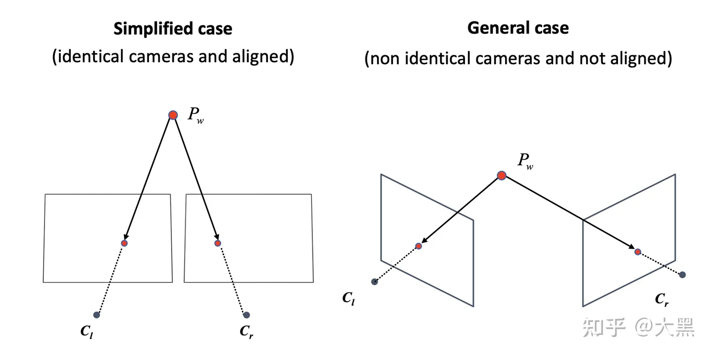

# 双目视觉模型

## 理想情况的三角化 triangulation in simplified case

我们首先研究简化的情况，这个情况的假设就是两个相机的内参矩阵是完全一样的，而且两个相机在x方向是完全对齐的。

## 带误差的三角化 triangulation in general case

理想情况的三角化很好，但是在现实生活中，由于生产和装配误差，再好的双目相机，两个相机之间也不可能是完全对齐的。

## stereo rectification

根据上面triangulation和对极约束的分析，我们可以看到，完全平行的双目相机计算是很有优势的。

其极线全都是相同位置的水平直线，在triangulation的时候也不再需要求解SVD之类的麻烦东西了。
所以我们就希望想方法，将拍到的图像投影到一个这样理想的双目相机模型中，这个过程就叫做stereo rectification.

