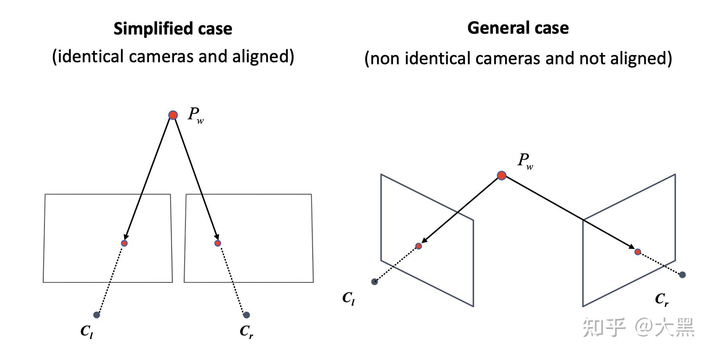
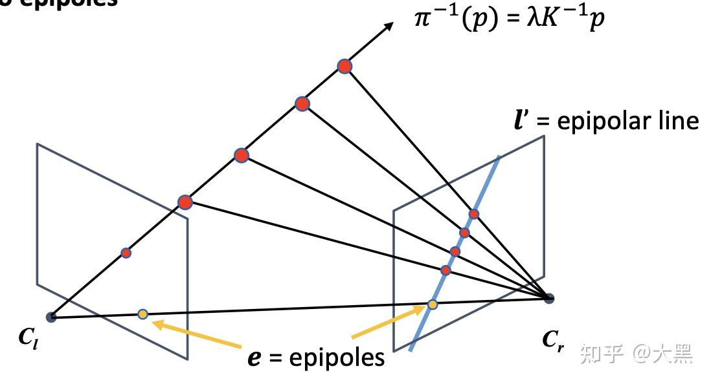

# 双目视觉模型

任务|场景数据|相机数据|输入|输出
-|-|-|-|-
Pose Estimation|已知|测得|相机视野内各点位置|相机位姿
Triangulation|测得|已知|相机位姿和相机视野内2D图片|相机视野内各点位置
Reconstruction|测得|测得|相机视野内2D图片|相机视野内各点位置

## 三角化 Triangulation

Triangulation解决的是从两张图片中计算对应点的三维坐标的问题。

这个问题的假设是：

* 两张图片对应的相机内参和外参都是已知的
* 相机中对应点关系是已知的并且正确的

这样我们就可以从这两张图片中计算出指向该点方向的两条光线，进而求其交点就得这个点对应的三维坐标

## 理想情况的三角化 triangulation in simplified case

我们首先研究简化的情况，这个情况的假设就是两个相机的内参矩阵是 **完全一样** 的，而且两个相机 **在x方向是完全对齐的。** 

这样我们就可以有如下的模型。

其中b被称为baseline，代表的是两个相机的光心对应的距离。图中分别以$C_lP$和$C_rP$为斜边可见左右两个直角三角形，其直角边可以写出如下的关系式：

$$
\begin{aligned}
    \frac{f}{Z_P}&=\frac{u_l}{X_P}&\text{(left image)}\\
    \frac{f}{Z_P}&=\frac{-u_r}{b-X_P}&\text{(right image)}\\
\end{aligned}
$$

左图公式写为：
$$X_p=\frac{u_lZ_P}{f}$$

带入右图公式：
$$\frac{f}{Z_P}=\frac{-u_r}{b-\frac{u_lZ_P}{f}}$$

解得：
$$Z_P=\frac{bf}{u_l-u_r}$$

进一步解得：
$$X_P=\frac{bu_l}{u_l-u_r}$$

而已知了$Z_P$，$Y_P$也就好解了：

很显然左右两图中看目标点在y轴上的位置应该是一样的，即$v_l=v_r$，这里以$v_l$为准：

$$Y_P=\frac{v_lZ_P}{f}$$

我们管  $u_l-u_r$  叫做“disparity”。其最大值就是图像本身的宽度，所以三角测量法存在一个最近距离，比最近距离还近的点无法同时出现在左右两图中所以没法三角测量。而对于无穷远的点，disparity=0。

### 误差？

这里我们又注意到一个问题，disparity本身是由像素点估算出来的，像素有大小是离散的，势必会带来一些误差。我们用量化的方法研究一下 **baseline, disparity, 还有点的距离Z对误差的影响** 。

 $Z_P$  关于D是一个非线性函数，我们一般使用函数的一阶泰勒展开来估算函数自变量不确定性带来的因变量的不确定性

 $$ \Delta Z_P = \vert\frac{\mathrm{d}Z_p}{\mathrm{d}D}\vert \Delta D = |-\frac{bf}{D^2}|\Delta D \\$$  

如果我们将的表达式带入的话，可以得到

 $$ \Delta Z_P = |-\frac{Z_P^2}{bf}|\Delta D \\$$  

所以我们可以得出一下几个结论：

* 对于同一个3D点，disparity越大，误差越小
* 对于固定位置关系的两张图片，3D点离得越近误差越小

我们同时还可以总结一下baseline对他们的影响：

* b越大，triangulate的误差越小
* b越大，最近可测量距离变大

那么我们就知道怎样来提高双目相机系统的精度了：

* 增大baseline
* 增大焦距
* 尽量测量近距离的点

## 带误差的三角化 triangulation in general case

理想情况的三角化很好，但是在现实生活中，由于生产和装配误差，再好的双目相机，两个相机之间也不可能是完全对齐的，求出来的光线也不一定能精准相交。于是，我们需要在相没对齐光线也不能相交的情况下求解点的坐标：

此时三角化问题描述为：
* 已知场景中的某个点在左侧和右侧相机照片上的位置分别为$(\bm x,\bm x')$
* 已知相机左右侧相机参数分别为$\bm P,\bm P'$
* 求该点在场景中的位置$X$

由于误差的存在，位置$X$不能精确求解，即$\bm x=\bm P\bm X$和$\bm x'=\bm P'\bm X$不能同时满足。
于是，三角化问题就成为了一个最优化问题，即：
$$\mathop{min}\limits_{\bm X} |\bm x-\bm P\bm X|+|\bm x-\bm P'\bm X|$$

回忆一下之前[相机参数与坐标系变换](./相机参数与坐标系变换.md)里讲的公式：

$$
z_p
\left[
    \begin{matrix}
        x\\y\\1
    \end{matrix}
\right]
=\bm P\cdot\bm X
=
\left[
    \begin{matrix}
        p_{11}&p_{12}&p_{13}&p_{14}\\p_{21}&p_{22}&p_{23}&p_{24}\\p_{31}&p_{32}&p_{33}&p_{34}
    \end{matrix}
\right]
\cdot
\left[
    \begin{matrix}
        x_w\\y_w\\z_w\\1
    \end{matrix}
\right]
$$

可拆为：

$$
\left\{
\begin{aligned}
    x&=\frac{1}{z_p}\bm p_1^T\cdot\bm X\\
    y&=\frac{1}{z_p}\bm p_2^T\cdot\bm X\\
    1&=\frac{1}{z_p}\bm p_3^T\cdot\bm X\\
\end{aligned}
\right.
$$

式1,2两边均乘上式3，可得两个约束：

$$
\left\{
\begin{aligned}
    \frac{x}{z_p}\bm p_3^T\cdot\bm X&=\frac{1}{z_p}\bm p_1^T\cdot\bm X\\
    \frac{x}{z_p}\bm p_3^T\cdot\bm X&=\frac{1}{z_p}\bm p_2^T\cdot\bm X\\
\end{aligned}
\right.
\Rightarrow
\left\{
\begin{aligned}
    x\bm p_3^T\cdot\bm X&=\bm p_1^T\cdot\bm X\\
    y\bm p_3^T\cdot\bm X&=\bm p_2^T\cdot\bm X\\
\end{aligned}
\right.
$$

将约束写成线性方程形式：

$$
\left\{
\begin{aligned}
    \bm p_1^T\cdot\bm X&-x\bm p_3^T\cdot\bm X&=0\\
    \bm p_2^T\cdot\bm X&-y\bm p_3^T\cdot\bm X&=0\\
\end{aligned}
\right.
$$

相当于把$\bm p_1^T,\bm p_2^T,\bm p_3^T$排成一行$[\bm p_1^T,\bm p_2^T,\bm p_3^T]$进行矩阵乘，所以可以写成矩阵形式：

$$
[\bm p_1^T,\bm p_2^T,\bm p_3^T]
\cdot
\left[
    \begin{matrix}
        \bm X&\bm 0\\
        \bm 0&\bm X\\
        -x\bm X&-y\bm X\\
    \end{matrix}
\right]
=[0,0]
$$

转置一下：

$$
\left[
    \begin{matrix}
        \bm X^T&\bm 0&-x\bm X^T\\
        \bm 0&\bm X^T&-y\bm X^T\\
    \end{matrix}
\right]
\cdot
\left[
    \begin{matrix}
        \bm p_1\\\bm p_2\\\bm p_3
    \end{matrix}
\right]
=
\left[
    \begin{matrix}
        0\\0
    \end{matrix}
\right]
$$

和[相机参数与坐标系变换](./相机参数与坐标系变换.md)里讲的DLT一模一样了。
但不一样的是，这次是$\bm P$已知求解$\bm X$，所以：
* 不会有更多的$\bm X$，而是会有更多的$\bm P$组成方程
* $\bm X$有三个值要解，一个相机两个方程是无穷多解，两个相机四个方程就成了超定方程了

于是就解此超定方程：

$$
\left[
    \begin{matrix}
        \bm X^T&\bm 0&-x\bm X^T\\
        \bm 0&\bm X^T&-y\bm X^T\\
    \end{matrix}
\right]
\cdot
\left[
    \begin{matrix}
        \bm p_1&\bm p_1'\\\bm p_2&\bm p_2'\\\bm p_3&\bm p_3'\\
    \end{matrix}
\right]
=
\left[
    \begin{matrix}
        0&0\\0&0
    \end{matrix}
\right]
$$

应用SVD求解即可，稍复杂，略。

## 对极几何（Epipolar Geometry）

刚才说的是知道了内参外参和点的对应关系之后，怎样进行三角定位。那往回推一步，怎样找点之间的对应关系呢？

如果直接在两张图里面找对应提取关键点进行匹配，只有在左右两边都找到的关键点才有可能匹配成功。如果对任意一点进行匹配的话，马上就会变成一个对左右两张图片所有像素的穷举搜索，复杂度为$O(hwh'w')$，其中$h,w$和$h',w'$分别为左右两图片的长款。

在已知相对位姿的双目相机中，能不能简化一些？
能！现在有了相对的位姿约束，我们可以将这 **个二维的搜索问题，降低到一维。** 

如图所示，两个相机之间的相对位姿，为我们提供了一个很好的先验知识：
已知相机位姿的情况下，**从左边相机中发出的指向某个特征点的射线在右边相机中的投影可以计算出来**，所以直接在这条投影线上搜索特征点即可。

* 这个约束叫做对极约束（epipolar constraint）
*  $c_l，c_r，p$  组成的平面成为极平面 (epipolar plane)
* 极平面与两个图像的交线成为极线 (epipolar line)
* 所有的极线的交点我们成为极点（epipole），也是baseline和像平面的交点

通过这个方法，我们就可以将二维搜索问题降低到一维。

### 对极约束

具体来说，以左侧相机坐标系为世界坐标系，右侧相机的外参为$[\bm R|\bm t]$，设待定位的点在世界坐标系下的坐标为$\bm X=[X,Y,Z]^T$、其在左右相机坐标系下z轴的坐标分别为$z_1$和$z_2$，于是根据[相机参数与坐标系变换](./相机参数与坐标系变换.md)中的建模可以知道该点在左右相机所拍摄图像上的位置：

$$
\begin{aligned}
\bm x&=\bm K_1\bm X\\
\bm x'&=\bm K_2(\bm R\bm X+\bm t)\\
\end{aligned}
$$

去掉相机内参，还原出对应点在左右两侧相机坐标系下的坐标$\bm x_1,\bm x_2$：

$$
\begin{aligned}
{\bm{x}_1} = {\bm{K}^{ - 1}_1}{\bm x}&=\bm X\\
{\bm{x}_2} = {\bm{K}^{ - 1}_2}{\bm x'}&=\bm R\bm X+\bm t\\
\end{aligned}
$$

那么右侧相机的$\bm x_2$就可从左侧相机的$\bm x_1$经过变换得到：

$${\bm{x}_2} = \bm{R} {\bm{x}_1} + \bm{t}$$

根据[相机参数与坐标系变换](./相机参数与坐标系变换.md)中的建模，这里的$\bm{R} {\bm{x}_1}$也可以看作是在右侧相机眼中的向量$\bm{x}_1$（图中向量$\overrightarrow{OX}$），而$\bm t$就是右侧相机相对于左侧相机的位置向量$\overrightarrow{O'O}$，所以${\bm{x}_2} = \bm{R} {\bm{x}_1} + \bm{t}$也就可以理解为上图的向量求和。

那么很显然，$\bm t$、$\bm R\bm x_1$、$\bm x_2$三向量共面。
接下来回忆两个关于向量的知识：
1. 向量叉积$\bm a\times\bm b$是求向量$\bm a,\bm b$所成平面的法向量
2. 相互垂直的向量点积为0

于是，对于三个共面向量，其任意两个向量的叉积与第三个向量的点积为0。这里就取$\bm t$和$\bm R\bm x_1$叉积与$\bm x_2$的点积：

$$(\bm t\times\bm R\bm x_1)\cdot\bm x_2=0$$

根据$\bm a\cdot\bm b=\bm a^T\bm b=\bm b^T\bm a$写成矩阵形式，再将叉乘等价于用反对称矩阵来点乘，从而把括号里面的$\bm x_1$拿出来：
$$
\bm x_2^T(\bm t_\times\bm R)\bm x_1=0\qquad
\bm t_\times=
\left[
    \begin{matrix}
        0&-t_3&t_2\\t_3&0&-t_1\\-t_2&t_1&0
    \end{matrix}
\right]
$$

此即对极约束方程。或重新带入$\bm x,\bm x'$：

$$\bm x'^T(\bm K_2^{-1})^T(\bm t_\times\bm R)\bm K_1^{-1}\bm x=0$$

即是对极约束方程的另一种形式。

### 本质矩阵 essential matrix 

矩阵论中存在一种Longuet-Higgins方程：

$$\bm x'^T\bm E\bm x=0$$

其中的$\bm E$称为“本质矩阵”（Essential Matrix）。在上述对极约束方程中，本质矩阵为$\bm E=\bm t_\times\bm R$或$\bm E=(\bm K^{-1}_2)^T(\bm t_\times\bm R)\bm K^{-1}_1$。其性质可以表示为：

$$
\left\{
\begin{aligned}
\bm x^T\bm l&=0\\
\bm l&=\bm E^T\bm x'
\end{aligned}
\right.
\qquad
\left\{
\begin{aligned}
\bm x'^T\bm l'&=0\\
\bm l'&=\bm E\bm x
\end{aligned}
\right.
$$

进一步解析可见对极约束方程的物理含义，以$\bm E=\bm t\times\bm R$为例，此时的：$\bm x,\bm x'$是目标点在相机坐标系下的坐标：

$$
\begin{aligned}
{\bm{x}_1} = {\bm{K}^{ - 1}_1}{\bm x}&=\bm X\\
{\bm{x}_2} = {\bm{K}^{ - 1}_2}{\bm x'}&=\bm R\bm X+\bm t\\
\end{aligned}
$$

其关系如图所示：

简言之，此处先回忆本科学的解析几何知识：“空间中的点$\bm x=[x,y,z]^T$位于平面$\bm l=[a,b,c]^T$上”等价于$ax+by+cz=0$，即$\bm x^T\bm l=0$。所以在像平面不确定的情况下，$\bm l=[a,b,c]^T$实际上描述了极平面位置，而显然像平面方程为“$z=\text{常数}$”的形式，其与极平面相交即为极线$ax+by=\text{常数}$。

所以，有了$\bm l=[a,b,c]^T$，对任意给定的像平面都能求出要找的极线。

### 基础矩阵 fundamental matrix

虽然$\bm E=\bm t\times\bm R$和$\bm E=(\bm K^{-1}_2)^T(\bm t_\times\bm R)\bm K^{-1}_1$都是本质矩阵，但$\bm E=(\bm K^{-1}_2)^T(\bm t_\times\bm R)\bm K^{-1}_1$通常叫做基础矩阵(fundamental matrix)，记为$\bm F$。

### 求基础矩阵：八点算法 8-point algorithm

求解基础矩阵$\bm E=(\bm K^{-1}_2)^T(\bm t_\times\bm R)\bm K^{-1}_1$即是在求左右两相机的相对位姿和各自的内参。

写下基础矩阵的Longuet-Higgins方程：

$$\bm x'^T\bm F\bm x=0$$

共9个变量要解：

$$
[x',y',z']
\left[
    \begin{matrix}
        f_1&f_2&f_3\\f_4&f_5&f_6\\f_7&f_8&f_9
    \end{matrix}
\right]
\left[
    \begin{matrix}
        x\\y\\z
    \end{matrix}
\right]
=0
$$

展开：

$$
x'xf_1+x'yf_2+x'zf_3+y'xf_4+y'yf_5+y'zf_6+z'xf_7+z'yf_8+z'zf_9=0
$$

每一对点就有一个方程，所以共需要9对点吗？并不，9对点存在内在联系，实际上只需要8对点。（是什么内在联系？）

$$
\left[
    \begin{matrix}
        x_1'x_1&x_1'y_1&x_1'z_1&y_1'x_1&y_1'y_1&y_1'z_1&z_1'x_1&z_1'y_1&z_1'z_1\\
        x_2'x_2&x_2'y_2&x_2'z_2&y_2'x_2&y_2'y_2&y_2'z_2&z_2'x_2&z_2'y_2&z_2'z_2\\
        x_3'x_3&x_3'y_3&x_3'z_3&y_3'x_3&y_3'y_3&y_3'z_3&z_3'x_3&z_3'y_3&z_3'z_3\\
        x_4'x_4&x_4'y_4&x_4'z_4&y_4'x_4&y_4'y_4&y_4'z_4&z_4'x_4&z_4'y_4&z_4'z_4\\
        x_5'x_5&x_5'y_5&x_5'z_5&y_5'x_5&y_5'y_5&y_5'z_5&z_5'x_5&z_5'y_5&z_5'z_5\\
        x_6'x_6&x_6'y_6&x_6'z_6&y_6'x_6&y_6'y_6&y_6'z_6&z_6'x_6&z_6'y_6&z_6'z_6\\
        x_7'x_7&x_7'y_7&x_7'z_7&y_7'x_7&y_7'y_7&y_7'z_7&z_7'x_7&z_7'y_7&z_7'z_7\\
        x_8'x_8&x_8'y_8&x_8'z_8&y_8'x_8&y_8'y_8&y_8'z_8&z_8'x_8&z_8'y_8&z_8'z_8\\
    \end{matrix}
\right]
\left[
    \begin{matrix}
        f_1\\f_2\\f_3\\f_4\\f_5\\f_6\\f_7\\f_8\\f_9
    \end{matrix}
\right]
=0
$$

这八个方程构成了一个线性方程组。它的系数矩阵由特征点位置构成，大小为 8 × 9，解之即得基础矩阵$\bm F$。由于测量误差的存在，还是应用SVD求解。

## 实例：已知基础矩阵和左图特征点位置求右图特征点搜索空间

就是求右图极线

## 实例：已知基础矩阵求极点位置

设左相机的极点坐标为$e$，而极点物理含义是左右相机中心连线$\overrightarrow{OO'}$与相机成像平面的交点，其显然在极线上，且其相当于右侧相机（即坐标原点）在左侧成像平面上的位置：

首先求右侧相机在左侧相机坐标系下的位置，用$\bm R$和$\bm t$列个方程，$\bm x_{o'}$表示右侧相机在左侧坐标系下的坐标，以$\bm x_{o'}'$表示右侧相机在右侧坐标系下的坐标（即$[0,0,0]^T$），则可以列如下方程：

$$\bm x_{o'}'=[0,0,0]^T=\bm R\bm x_{o'}+\bm t$$

为了产生$\bm F$先两边叉乘$\bm t$：

$$0=\bm t\times\bm R\bm x_{o'}$$

于是得到一个关于$\bm x_{o'}$的方程：

$$\bm E\bm x_{o'}=0$$

而$\bm e,\bm e'$是在成像平面上的点，所以还要加个内参$\bm e=\bm K_1\bm x_{o'}$和$\bm e'=\bm K_2\bm x_{o'}$于是可以写出方程并硬凑出来一个$\bm F$，且这里$e'$依然是原点，不管怎么变都是0：

$$
\begin{aligned}
    \bm K_2^{-1}\bm e'&=\bm R\bm K_1^{-1}\bm e+\bm t\\
    \bm t\times\bm K_2^{-1}\bm e'&=\bm t\times\bm R\bm K_1^{-1}\bm e\\
    (K_2^{-1})^T\bm t\times\bm K_2^{-1}\bm e'&=(K_2^{-1})^T\bm t\times\bm R\bm K_1^{-1}\bm e\\
    0=\bm F\bm e
\end{aligned}

$$

即得方程$\bm F\bm e=0$：

SVD解之即得$\bm e$。

## stereo rectification

根据上面triangulation和对极约束的分析，我们可以看到，完全平行的双目相机计算是很有优势的。

其极线全都是相同位置的水平直线，在triangulation的时候也不再需要求解SVD之类的麻烦东西了。
所以我们就希望想方法，将拍到的图像投影到一个这样理想的双目相机模型中，这个过程就叫做stereo rectification.

