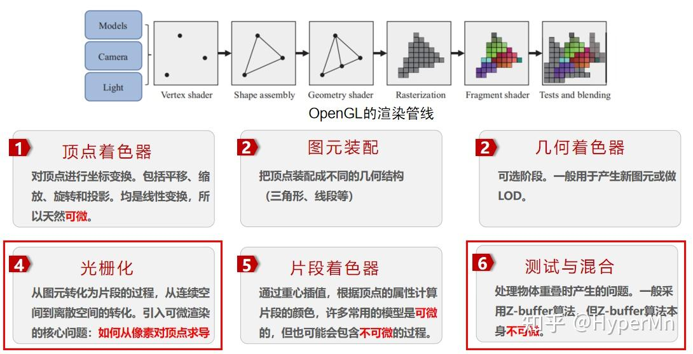
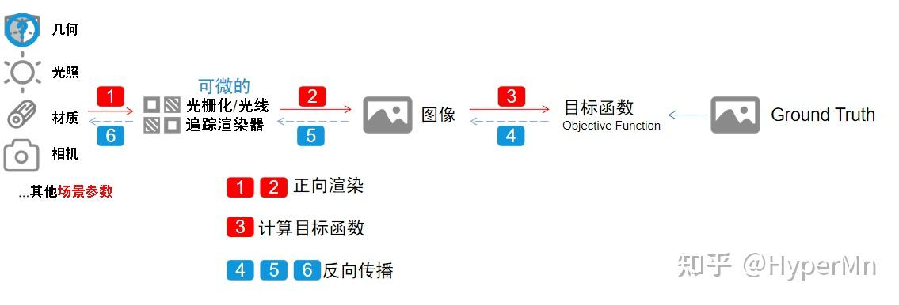
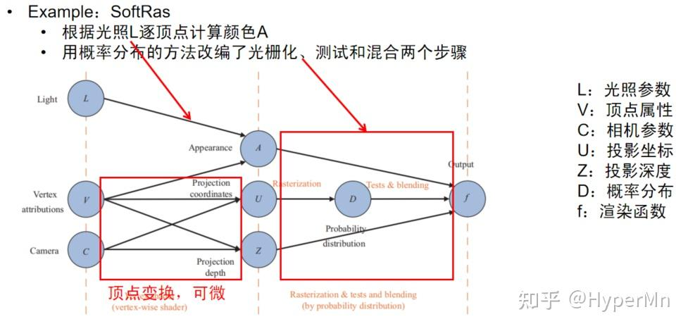
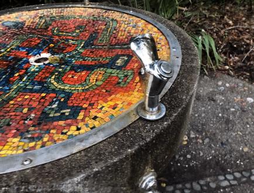
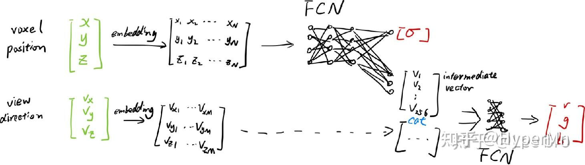
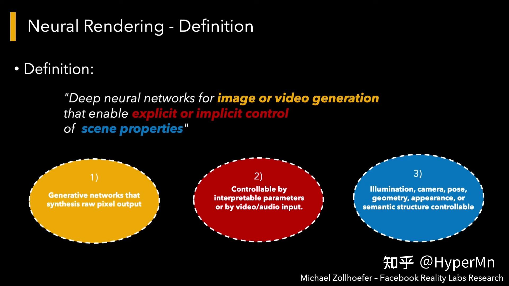
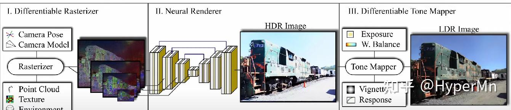
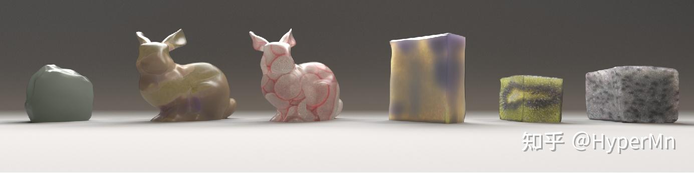

# 【转载】一文快速了解可微渲染与神经渲染

[原文在此](https://zhuanlan.zhihu.com/p/631784361)

## 前言

可微渲染和神经渲染是近年来大热的研究主题，不过作为新兴领域，相关的资料都零零散散，通常也需要对计算机图形学、机器学习等方面都有一些基础知识才能有一个较好的认识。本文是作者以一位计算机图形学学习者的角度，对现有资料的一些整理和理解。涉及的一些知识也尽可能地引用其他文章做一个补充理解。希望在阅读完本文后，大家能对可微渲染和神经渲染有一个较为清晰的认知。作者才疏学浅，如果有任何问题欢迎在评论区交流。

最近发现还有一篇文章也介绍地比较全面，是从工业界角度出发的，本篇文章试图更多地从学术理论的角度去看待问题。

图片及素材取自网络、论文以及视频截图，如有侵权请联系作者更换或删除。

## 为什么要使用可微渲染

1. 解决 **逆渲染** 问题：逆渲染是与渲染相反的过程，该过程从图片中获得物体的几何表示、材质、场景光照和相机参数等。逆渲染是个非常困难的不适定问题，为了正则化这个不适定问题，通常使用逆渲染对象的先验知识，比如对于人体组成部分（人脸、人体和人手），之前论文提出的方法可能会提前给定好一个标准结构（大众脸型，预先定好骨骼关节等），后续再从图像上学习到特征后对标准结构进行微调。借助可微渲染过程中计算的导数，我们可以解决更加宽泛的逆渲染问题。
1. 将 **前向渲染** 过程集成到 **概率推理（probabilistic inference）** 和 **机器学习** 等更大的优化系统中。比如，在训练时能够反向传播梯度。
1. 上述1.2点在计算机视觉，计算机图形学，计算成像（Computational imaging），VR/AR等领域中有数量庞大的应用。

## 从传统管线出发

我们从一个比较传统的OpenGL渲染管线出发，思考一下到底是其中的哪些步骤 **不可微** 。

1. 顶点着色器：对顶点进行各类操作，包括平移、缩放、旋转和投影，本质上都是矩阵乘法，均是线性操作，所以天然可微。
1. 图元装配：把顶点装配成不同的几何结构（三角形、线段等）
1. 几何着色器：可选阶段，一般用于产生新图元或做LOD操作。
1. 光栅化：通过将几何图元（如线段、三角形）映射到像素网格，对每个像素的采样和插值来确定像素的颜色。由于这是一个离散的过程，光栅化步骤不是在连续的参数空间上操作，因此 **不具备可微性** 。
1. 片段着色器：首先找到片段所在的三角形并计算片段中心的重心坐标, 通过重心插值把顶点的属性赋给每个片段。对许多常用模型来说都是可微的，但也可能会包含不可微的部分。
1. 测试与混合操作，包括深度测试、模板测试和颜色混合等。这些操作都是非线性操作，求导很困难，因此通常被认为是 **不可微** 的。

可以发现只有4、6中包含有必定不可微的部分。基于光栅化的可微渲染也是解决这两个问题为主。

### 从传统正向渲染到可微渲染

 **传统的渲染** ：把几何、光照、材质和相机位置等一系列输入传给光栅化或者是光追的渲染器，渲染器经过一系列管线操作后，输出一张图片。

 **可微的渲染** ：计算渲染过程中的导数，让渲染过程变得可微。然后通过图像和ground truth之间的差异，计算目标函数，得到loss后，对loss求导得到梯度，通过梯度反向传播来优化各种场景参数。

那么我们如何修改传统渲染管线使得整个渲染过程都变得可微分呢？这里首先跟随论文[1]的视角，从基于局部光照模型和全局光照模型这两个角度去看待这个问题。

## 基于局部光照模型的可微渲染方法

1. 使用近似的方法，计算近似导数用于反向传播

OpenDR提出了一种对渲染过程求近似导数的方法，限定了计算颜色的过程，要求颜色逐顶点确定的，顶点的颜色在光栅化之前已经计算完成。之后片段着色器只是对顶点颜色进行插值得到片段的颜色，但无需修改光栅化的过程。

如图所示，为了求得 f 对 V、A、C 的导数，由链式法则，我们总共需要求  $\frac{\partial f}{\partial A}$   $\frac{\partial f}{\partial U}$   $\frac{\partial U}{\partial V}$   $\frac{\partial U}{\partial C}$   $\frac{\partial V}{\partial A}$  五组偏导数。

其中  $\frac{\partial A}{\partial V}$  的可微性是由用户定义的计算颜色的函数的可导性决定的，通常这个函数是初等函数，可微。

而  $\frac{\partial U}{\partial V}$  和  $\frac{\partial U}{\partial C}$  是顶点变换，天然可微。

那么只剩下右边的两个偏导数，对于  $\frac{\partial f}{\partial A}$  ，由于 OpenDR 对顶点颜色进行插值得到片段的颜色，所以像素对顶点颜色的导数就是该像素对应的可见片段在其三角形的重心坐标，只需在正向过程中保存每个片段的重心坐标以及每个像素对应的可见片段即可。

对于  $\frac{\partial f}{\partial U}$  ，OpenDR根据像素跟遮挡边界的关系，把像素分为了内部像素和边界像素。对于不同种类的像素使用了不同的滤波核进行滤波操作来求得近似导数。

关于OpenDR，具体可以参考这篇文章：[理解可微渲染 (一) ：OpenDR - 知乎 (zhihu.com)](https://zhuanlan.zhihu.com/p/584510853)

2. 改编传统渲染模型，让像素对顶点可导。改编后的渲染方法依然拥有渲染的能力，渲染结果不发生较大变化，但过程完全可微，可以求得精确导数。通常改编其中光栅化的步骤。

和OpenDR类似，SoftRas也是通过逐顶点光照和顶点变换保证左边的几组偏导数可微。

对于右边的几组偏导数，SoftRas使用概率分布的方法改编了光栅化、测试与混合这两个步骤。也就是说传统的深度测试、光栅化这种非0即1的操作，都变成了0到1之间按概率分布的值，从而保证了可微。

## 基于全局光照模型的可微渲染

基于全局光照（Global Illumination, GI）模型的可微渲染，优点是能够对间接光照求导，渲染结果更具真实感，缺点是时间开销非常大。

路径追踪是基于GI的可微渲染方法的基础（关于路径追踪此处不再过多展开），基于GI的可微渲染所面临主要的 **难点** ：

* 需要对渲染方程（积分方程/路径积分）的解进行微分，而这些解和场景参数之间的关系可能是非常复杂的
* 需要处理非常多的梯度矩阵（可能  $10^{12}$  或更多），因为一张图片可能有几百万像素，而场景参数也可能会有百万级别的规模，矩阵数量已经多到已经不好存储的地步。

 **必须要注意的问题** ：

* 确保每一步的正确性：对于整个系统而言，每一步微小的误差累计后都是巨大的差别，所以直接把自动微分丢给Path Tracer是不可行的
* PDF是否可微？实际上两种情况都有可能。
* 渲染方程中函数的不连续性

 **为什么不使用差分？** 

如果对高等数学有一些了解的话，可以得知通过差分能够近似微分：

 $\frac{\partial F}{\partial \theta_i} \approx \frac{F(\theta+\epsilon e_i) - F(\theta-\epsilon e_i)}{2\epsilon}$  

但是使用差分会带来以下问题：

* 使用较大的ε带来了偏差，而使用较小的ε带来了舍入误差和蒙特卡洛积分的噪声
* 需要对蒙特卡洛积分进行相关性分析
* 无法处理众多的场景参数，当有百万级别的场景参数，需要至少对每个参数做一次差分，几乎不太可能用这种方法渲染有百万级别的像素的图像。

 **两种基于路径跟踪的GI可微渲染方法介绍** 

Differentiable Monte Carlo Ray Tracing through Edge Sampling (Siggraph Asia'18)

* 使用Reynolds transport theorem把路径积分转换成连续的积分和边界的积分。在不连续的边界上使用边采样来估计积分；
* 连续的部分仍然使用使用传统的面积采样；

 Reparameterizing Discontinuous Integrands for Differentiable Rendering (Siggraph Asia'19)

* 对积分进行参数变换, 使得采样过程中不连续的位置不随场景参数变化而变化；
* 近似导数，对某些场景有较大误差；
* 集成到了Mitsuba 2中；

## 不同几何表示的DR

重度参考了这篇文章：

如果以物体的几何表示角度来看可微渲染，又可以分为如下这些类别：

* 基于网格的可微渲染（前文基于局部光照模型中提到的两个例子）
  * OpenDR
  * SoftRas
* 基于点云的可微渲染
  * 传统方法：
    1. 点云做MVP变换
    2. 计算每个点的颜色和影响范围
    3. 对每个像素，根据点云深度计算像素颜色
  * 可微方法：
    * 将点云转化为高斯分布，扩大单个点的影响范围。（类似SoftRas）
* 基于体素的可微渲染
  * 传统方法：
    1. 确定每根光线经过哪些体素
    2. 选取或融合每根光线上体素的信息，得到渲染结果
  * 可微方法：
    * 一般只对第二部分进行可微化；
    * 基于隐式表示的可微渲染
* 流行的隐式表示：Occupancy field、SDF以及NeRF；
  * 问题相关的，固定点信息的优化；
  * 与体素表示的区别：采样策略

## 神经渲染

神经渲染并不是一个非常新的领域，很久以前就已经有人在做这方面的研究。但是将神经渲染重新带入大众视野中的论文就不得不提NeRF（ECCV2020 Oral）了。

不知道大家对NeRF的结果有什么感受，反正我第一次见的时候还是非常excited，被震撼到了

### NeRF(Neural Radiance Fields，神经辐射场)：用神经网络拟合一个场景的隐式表示

参考了这篇文章：图形学新高潮? NeRF 笔记 - Lee bro的文章 [https://zhuanlan.zhihu.com/p/187541908](https://zhuanlan.zhihu.com/p/187541908)

NeRF的主要步骤：

1. 沿着相机射线采样5D坐标（位置和View方向）来合成图像
1. 将位置输入到MLP中以产生颜色和体积密度
1. 使用体渲染技术将这些值合成到图像中
1. 根据loss来优化场景表示 

NeRF Details：

* 透明度α应该和view方向无关，但是rgb和view方向有关, 所以在模型中也force了这个条件, 将view方向(θ,ϕ)作为中间量输入
* Input Embedding：将输入映射到高维空间以学习更多细节（见下图）
* 重要性采样：体渲染时，先做Uniform采样，然后采用重要性采样提高采样质量；
* 开销: 
* 20~50张输入图片
* 在NVIDIA V100上需要100sssk~300k次迭代（1~2天）

### 再谈神经渲染

起初我对神经渲染的理解比较浅显，觉得就是把渲染器的工作交给神经网络来做，后来看了Siggraph2021 course，以及最近很多的神经渲染相关工作之后，确实觉得自己格局小了。这也是一个相当宽泛的领域。

让我们跟随Siggraph2021 Course的思路，以一个high-level的角度去看神经渲染。

1. "Regress it"

假设我们把相机位置和朝向编码，输入给一个2D Network，然后这个Network能够生成2D Image，这样我们就实现了从相机参数到图像上像素的一个映射。这个映射可能是非常复杂的，所以训练这个网络需要非常大量的数据。

注意我们训练输入的也只是2D图片，通过训练后，网络能够通过输入的相机参数“脑补”出新视角下的图片。

补充一下GQN：Generative Query Network(GQN)的核心思想是将场景建模为一个可查询的表示，通过查询网络来生成新的视角图像。通过将场景表示与查询过程相结合，GQN能够生成准确且一致的图像，以填补未观察到的视角。

吐槽一句：这篇是DeepMind团队2018年发到Science上的paper，idea确实有点意思，结果渲出来就是一堆像素级别的色块，感觉上就是数据过拟合整出来的，发science有点离谱

2. "Make it more real"

如果我们想少用点训练数据，更泛化一些。这个过程就用到了真正的图形学知识。简而言之就是用3D场景表示和相机数据（or其他场景参数），很正常地丢给传统的渲染器，这时候渲染器生成了一些2D Feature map（可以是深度图，剪影图等等），然后神经网络再通过这些2D Feature map生成最终的2D image。这个就是比较经典的可微神经渲染的方法。

3. "Regress & Render"

这类方法的特点就是，相比2，交换了传统渲染器和神经网络在系统中的位置。首先我们用一些code去描述场景，传递给神经网络后输出了3D场景，然后在用传统渲染器进行渲染正常操作。比如神经体（Nerual Volumes）渲染就是这类方法。

4. "Step, sample & blend"

这类方法有点像拿机器学习和图形学做的三明治，他们作为两种料（组件）被加进了三明治（系统）里，这类方法目前也比较热门，因为效果确实非常stunning。典型的应用NeRF，在前文中已经提到，具体步骤就不再赘述了。

通过一整套了解下来，神经渲染并没有之前理解的那么狭窄。

Siggraph2021Course中，对神经渲染的定义是：用于图像或视频生成的深度神经网络，允许显式或隐式地控制场景属性。

1. 首先我们关注的问题是生成2D像素输出
1. 第二是我们想控制生成哪些图像
1. 第三点是，这个控制是来自于一些物理的参数，相机参数，光照参数，几何的形状等等

## 可微渲染的前沿应用

文章的最后再插几个我认为比较有意思的可微渲染的前沿Paper

### Parameter-space ReSTIR for Differentiable and Inverse Rendering（Siggraph 2023)
[https://www.zhihu.com/video/1657174476067557376](https://www.zhihu.com/video/1657174476067557376)
没想到在除了GI之外的地方又见到了ReSTIR，这篇paper将ReSTIR（蓄水池时空复用重要性重采样）算法用在梯度下降迭代过程中复用样本，论文中列举的应用是优化一张粗糙度贴图，使得使用这张粗糙度贴图的轮胎图像和目标图像尽量相似，实验证明比Mitsuba3收敛要更快。

### ADOP: Approximate Differentiable One-Pixel Point Rendering（Siggraph 2022)

[https://www.zhihu.com/video/1657174370639417345](https://www.zhihu.com/video/1657174370639417345)
输入一些拍摄的图像、带纹理的点云和环境贴图，生成高质量的渲染结果。

管线里包括一个完全可微的基于物理的光度相机（photometric camera）模型，包括了曝光、白平衡和镜头畸变等其他相机参数。通过神经网络学习后，优化所有的结构化输入参数，以提高渲染质量。（效果非常好，github star>1.9k）

 **解决的问题** ：

* 点云空洞填补
* 自动优化相机参数（曝光、白平衡、畸变等）
* 高质量实时渲染

 **数据规模** ：

* Image:300~800张
* Points:~10M

 **训练时间** ：~4h(A100)

 **推理时间** ：~27ms(RTX3080)

 **缺点** ：

* 空洞填补比较局限，相机过近或点云稀疏时有闪烁，尤其是相机移动时；
* 参数太多，超参数不好调，需要先对场景做grid-search
* 学习率太大时，点位置的优化不稳定，可能是梯度近似导致。

### Reconstructing translucent objects using differentiable rendering (Siggraph 2022)

高真实度的半透明材质物体重建

* 提出一种新方法，针对BSSRDF材质的全局光照可微渲染
* 对合成半透明物体和基于网格的对象几何的联合重建
* 对L2 loss的梯度估计的双缓冲解决方案，在低spp情况下快速收敛

## 总结

 **逆渲染：** 

1. 渲染的逆过程

2.  **可微渲染** 是解决 **逆渲染** 问题的重要方法

 **可微渲染：** 

1. 一种工具：将三维信息可微地渲染到二维图像，使得二维信息可以对渲染过程做监督；

2. 核心问题：把不可微的渲染步骤变得可微，利用可微渲染进行问题相关的优化；

3. 借助 **可微渲染** ，可以将渲染过程嵌入到更大的优化框架中

 **神经渲染：** 

1.  **神经渲染：** 

* sig course的定义：用于图像或视频生成的深度神经网络，允许显式或隐式地控制场景属性；
* 我个人目前的理解：在类似传统渲染，生成二维图像的过程中，使用了神经网络完成了其中一部分甚至全部的工作；

2. 让神经网络学习场景表示、feature map到渲染结果image等过程；

3.  **可微渲染** 可以用于优化 **神经渲染** 的过程；

P.S. 很推荐有CG基础想了解可微渲染的朋友读一下参考资料1的论文，清华大学写的一篇关于可微渲染的综述，讲得很全面。知乎上有好几篇文章其实都是基于它来写的（包括我这篇）

如果对神经渲染感兴趣的朋友可以看一下参考资料4里的Siggraph Course，本身就在做这些topic的大牛对问题看得更透彻一些，几个油管链接b站基本都能找到对应的搬运视频。

## 参考资料

1. 叶子鹏,夏雯宇,孙志尧,易冉,余旻婧,刘永进.从传统渲染到可微渲染:基本原理、方法和应用[J].中国科学:信息科学,2021,51(07):1043-1067.
1. Physics-based differentiable rendering (CVPR 2021 tutorial) [https://youtu.be/Tou8or1ed6E](https://youtu.be/Tou8or1ed6E)
1. MIT 6.S191 (2020): Neural Rendering [https://youtu.be/BCZ56MU-KhQ](https://youtu.be/BCZ56MU-KhQ)
1. Advances in Neural Rendering (SIGGRAPH 2021 Course) [https://youtu.be/otly9jcZ0Jg](https://youtu.be/otly9jcZ0Jg)
1. Neural Rendering (CVPR 2020) - Morning Session [https://youtu.be/LCTYRqW-ne8](https://youtu.be/LCTYRqW-ne8)

