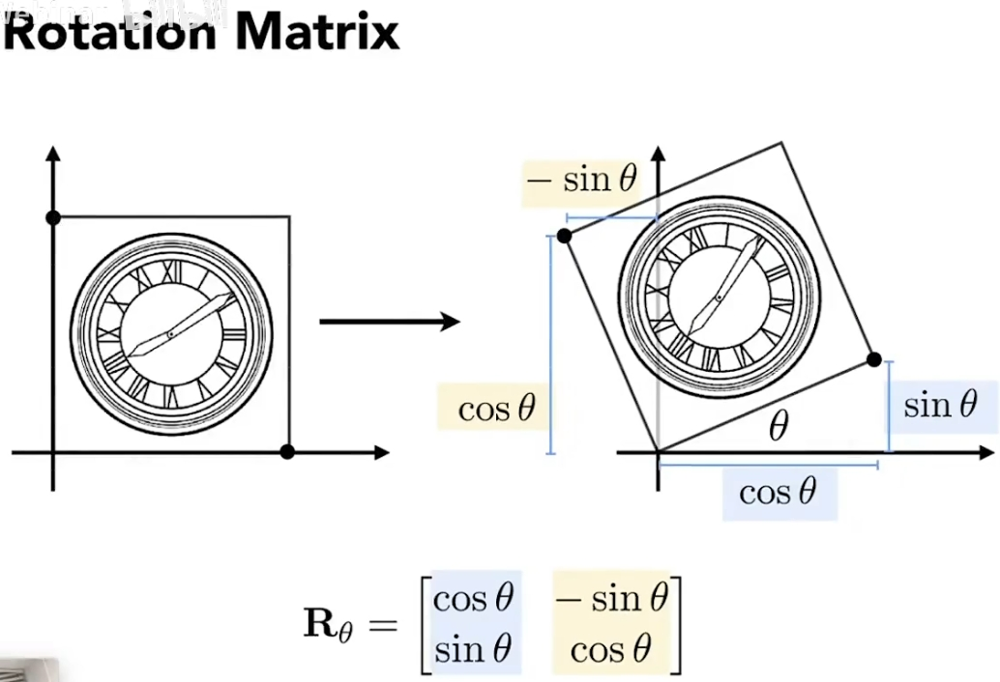
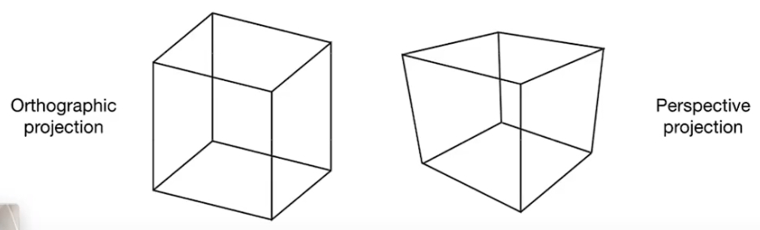
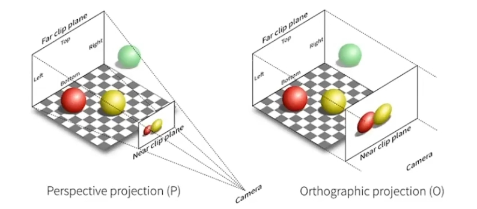
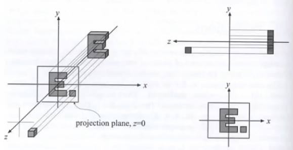
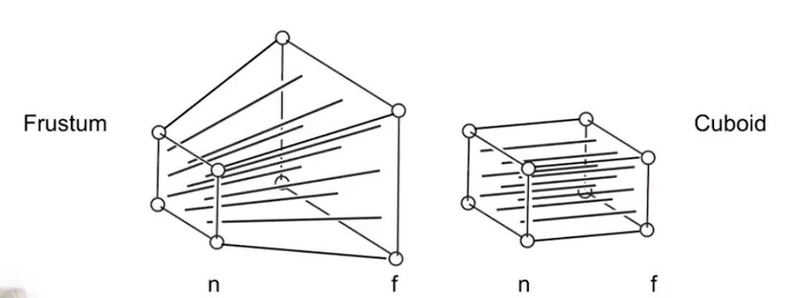
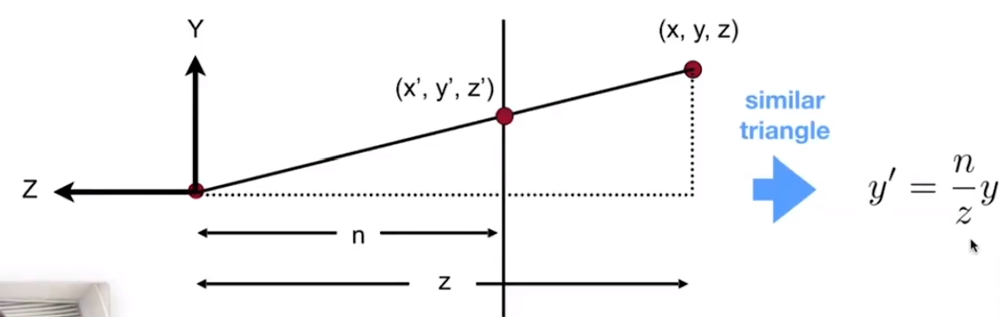
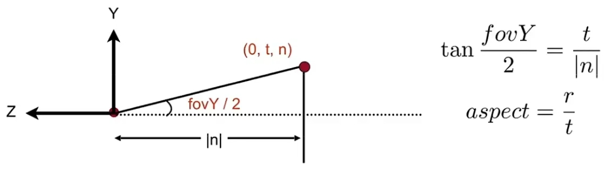

# 投影和光栅化

## 齐次坐标和齐次向量

所谓“齐次坐标”是一系列关于坐标和向量表示方法的规定。
通常，三维坐标和向量都可以表示为：

$$
\left[
\begin{matrix}
    x\\y\\z
\end{matrix}
\right]
$$

但齐次坐标表示这个点是：

$$
\left[
\begin{matrix}
    x\\y\\z\\1
\end{matrix}
\right]
$$

齐次坐标表示这个向量是：

$$
\left[
\begin{matrix}
    x\\y\\z\\0
\end{matrix}
\right]
$$

这样的表示可以方便很多东西，尤其是方便表示三维空间的线性变换。
比如我要对整个空间中的点进行一次线性变换，包含旋转和位移操作。
那么类似下图所示，一个旋转操作$\bm R$可以表示为矩阵相乘，位移操作$\bm t$可以表示为向量相加，于是对于空间中的任意点$[x,y,z]^T$，求变换后的坐标$[x',y',z']^T$就是：

$$
\left[
\begin{matrix}
    x'\\y'\\z'
\end{matrix}
\right]
=
\bm R
\cdot
\left[
\begin{matrix}
    x\\y\\z
\end{matrix}
\right]
+
\bm t
=
\left[
\begin{matrix}
    r_{11}&r_{12}&r_{13}\\r_{21}&r_{22}&r_{23}\\r_{31}&r_{32}&r_{33}
\end{matrix}
\right]
\cdot
\left[
\begin{matrix}
    x_w\\y_w\\z_w
\end{matrix}
\right]
+
\left[
\begin{matrix}
    t_1\\t_2\\t_3
\end{matrix}
\right]
=
\left[
\begin{matrix}
    r_{11}&r_{12}&r_{13}&t_1\\r_{21}&r_{22}&r_{23}&t_2\\r_{31}&r_{32}&r_{33}&t_3
\end{matrix}
\right]
\cdot
\left[
\begin{matrix}
    x_w\\y_w\\z_w\\1
\end{matrix}
\right]
=
[\bm R|\bm t]
\cdot
\left[
\begin{matrix}
    x_w\\y_w\\z_w\\1
\end{matrix}
\right]
$$

所以这样写成齐次坐标可以直接写成一个矩阵乘一个向量，看着更加清爽。

除此之外，齐次坐标还可以方便区分坐标和向量，并且方便计算。

比如“坐标-坐标=向量”就是直接能计算出来，因为最后一项1-1=0：

$$
\left[
\begin{matrix}
    x_1\\y_1\\z_1\\1
\end{matrix}
\right]
-
\left[
\begin{matrix}
    x_2\\y_2\\z_2\\1
\end{matrix}
\right]
=
\left[
\begin{matrix}
    x_1-x_2\\y_1-y_2\\z_1-z_2\\0
\end{matrix}
\right]
$$

再比如“坐标±向量=坐标”也直接能计算出来，因为最后一项1±0=1：

$$
\left[
\begin{matrix}
    x_1\\y_1\\z_1\\1
\end{matrix}
\right]
\pm
\left[
\begin{matrix}
    x_2\\y_2\\z_2\\0
\end{matrix}
\right]
=
\left[
\begin{matrix}
    x_1\pm x_2\\y_1\pm y_2\\z_1\pm z_2\\1
\end{matrix}
\right]
$$

又比如“向量±向量=向量”，因为最后一项0±0=0：

$$
\left[
\begin{matrix}
    x_1\\y_1\\z_1\\0
\end{matrix}
\right]
\pm
\left[
\begin{matrix}
    x_2\\y_2\\z_2\\0
\end{matrix}
\right]
=
\left[
\begin{matrix}
    x_1\pm x_2\\y_1\pm y_2\\z_1\pm z_2\\0
\end{matrix}
\right]
$$

### 其他性质

齐次坐标的四个项乘同一个值，所表示的点不变：

$$
\left[
\begin{matrix}
    x\\y\\z\\1
\end{matrix}
\right]
=
\left[
\begin{matrix}
    kx\\ky\\kz\\k
\end{matrix}
\right]
$$

“坐标-坐标=两坐标连线的中点”：

$$
\left[
\begin{matrix}
    x_1\\y_1\\z_1\\1
\end{matrix}
\right]
+
\left[
\begin{matrix}
    x_2\\y_2\\z_2\\1
\end{matrix}
\right]
=
\left[
\begin{matrix}
    x_1+x_2\\y_1+y_2\\z_1+z_2\\2
\end{matrix}
\right]
=
\left[
\begin{matrix}
    \frac{x_1+x_2}{2}\\\frac{y_1+y_2}{2}\\\frac{z_1+z_2}{2}\\1
\end{matrix}
\right]
$$

## 正交投影和透视投影

来两张图就看懂了：

正交投影是透视投影中相机无限远的特殊情况，没有了近大远小的效应。正交投影渲染方式也很简单，直接把z轴扔掉就行了：

### 透视投影

透视投影可以理解为将远处的平面挤压之后再做正交投影：

我们可以从直觉上规定这种挤压的规则：
* 近平面$z=n$上的点坐标不变
* 远平面$z=f$压缩后中心点坐标不变

这里注意，**我们无法再规定“各平面压缩后z轴坐标不变”**，虽然这样很符合直觉，但是**规定了这个的变换就不是线性变换了**，没法用一个矩阵表示。

设这个线性挤压的操作的变换矩阵为$M_{persp\rightarrow ortho}$，如何求？

如图所示，设近平面的z轴坐标为$n$，要将远处某平面上的坐标$[x,y,z]^T$进行挤压，仅从y轴坐标看，挤压操作会将$y$压缩到$y'=\frac{n}{z}y$：

同理，挤压操作会将$x$压缩到$x'=\frac{n}{z}x$，由于没有规定“各平面压缩后z轴坐标不变”，变换后的z轴坐标不知道会变成什么样，先用“?”代替一下，于是可写出变换的结果：

$$
\left[
\begin{matrix}
    x\\y\\z\\1
\end{matrix}
\right]
\Rightarrow
\left[
\begin{matrix}
    \frac{n}{z}x\\\frac{n}{z}y\\?\\1
\end{matrix}
\right]
\quad z\in[n,f]
$$

由于是齐次坐标，所以全部乘上$z$也表示同一个点：

$$
\left[
\begin{matrix}
    x\\y\\z\\1
\end{matrix}
\right]
\Rightarrow
\left[
\begin{matrix}
    \frac{n}{z}x\\\frac{n}{z}y\\?\\1
\end{matrix}
\right]
\Rightarrow
\left[
\begin{matrix}
    nx\\ny\\?\\z
\end{matrix}
\right]
\quad z\in[n,f]
$$

再看规则“近平面$z=n$上的点坐标不变”，很显然可以表示为$z=n$平面上的点映射关系：

$$
\left[
\begin{matrix}
    x\\y\\n\\1
\end{matrix}
\right]
\Rightarrow
\left[
\begin{matrix}
    x\\y\\n\\1
\end{matrix}
\right]
\Rightarrow
\left[
\begin{matrix}
    nx\\ny\\n^2\\n
\end{matrix}
\right]
$$

再看规则“远平面$z=f$压缩后中心点坐标不变”，很显然可以表示为$z=n$平面上的原点映射关系：

$$
\left[
\begin{matrix}
    0\\0\\f\\1
\end{matrix}
\right]
\Rightarrow
\left[
\begin{matrix}
    0\\0\\f\\1
\end{matrix}
\right]
\Rightarrow
\left[
\begin{matrix}
    0\\0\\f^2\\f
\end{matrix}
\right]
$$

所以上面三个坐标映射关系可以写成$M_{persp\rightarrow ortho}$的一个方程：

$$
\left[
\begin{matrix}
    nx&nx_n&0\\ny&ny_n&0\\?&n^2&f^2\\z&n&f
\end{matrix}
\right]
=
M_{persp\rightarrow ortho}
\left[
\begin{matrix}
    x&x_n&0\\y&y_n&0\\z&n&f\\1&1&1
\end{matrix}
\right]
$$

很容易推导出$M_{persp\rightarrow ortho}$，在近远两平面之间的点映射后的z轴坐标也知道了：

$$
\left[
\begin{matrix}
    nx&nx_n&0\\ny&ny_n&0\\z(n+f)-nf&n^2&f^2\\z&n&f
\end{matrix}
\right]
=
\left[
\begin{matrix}
    n&0&0&0\\0&n&0&0\\0&0&n+f&-nf\\0&0&1&0
\end{matrix}
\right]
\left[
\begin{matrix}
    x&x_n&0\\y&y_n&0\\z&n&f\\1&1&1
\end{matrix}
\right]
$$

### 正交投影

在开始光栅化之前，还需要把透视投影变换过的点全部缩放到$x,y,z\in[-1,1]$的正方体区域内，以方便光栅化计算。

## 相机内参

透视投影中的近平面距离$n$属于相机的参数，相关的相机参数还有水平和垂直可视角度$f_x,f_y$

## 光栅化

* 何时开始光栅化：已经通过透视投影和正交投影将场景中的所有对象都变换到$x,y,z\in[-1,1]$的正方体区域内
* 光栅化的目标是：将上述正方体区域内的
