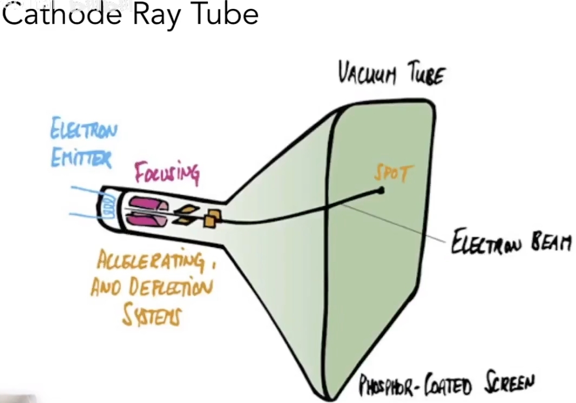

# 【GAMES101课程笔记】投影和光栅化

## 齐次坐标和齐次向量

所谓“齐次坐标”是一系列关于坐标和向量表示方法的规定。
通常，三维坐标和向量都可以表示为：

$$
\left[
\begin{matrix}
    x\\y\\z
\end{matrix}
\right]
$$

但齐次坐标表示这个点是：

$$
\left[
\begin{matrix}
    x\\y\\z\\1
\end{matrix}
\right]
$$

齐次坐标表示这个向量是：

$$
\left[
\begin{matrix}
    x\\y\\z\\0
\end{matrix}
\right]
$$

这样的表示可以方便很多东西，尤其是方便表示三维空间的线性变换。
比如我要对整个空间中的点进行一次线性变换，包含旋转和位移操作。
那么类似下图所示，一个旋转操作$\bm R$可以表示为矩阵相乘，位移操作$\bm t$可以表示为向量相加，于是对于空间中的任意点$[x,y,z]^T$，求变换后的坐标$[x',y',z']^T$就是：

$$
\left[
\begin{matrix}
    x'\\y'\\z'
\end{matrix}
\right]
=
\bm R
\cdot
\left[
\begin{matrix}
    x\\y\\z
\end{matrix}
\right]
+
\bm t
=
\left[
\begin{matrix}
    r_{11}&r_{12}&r_{13}\\r_{21}&r_{22}&r_{23}\\r_{31}&r_{32}&r_{33}
\end{matrix}
\right]
\cdot
\left[
\begin{matrix}
    x\\y\\z
\end{matrix}
\right]
+
\left[
\begin{matrix}
    t_1\\t_2\\t_3
\end{matrix}
\right]
=
\left[
\begin{matrix}
    r_{11}&r_{12}&r_{13}&t_1\\r_{21}&r_{22}&r_{23}&t_2\\r_{31}&r_{32}&r_{33}&t_3
\end{matrix}
\right]
\cdot
\left[
\begin{matrix}
    x\\y\\z\\1
\end{matrix}
\right]
=
[\bm R|\bm t]
\cdot
\left[
\begin{matrix}
    x\\y\\z\\1
\end{matrix}
\right]
$$

所以这样写成齐次坐标可以直接写成一个矩阵乘一个向量，看着更加清爽。

除此之外，齐次坐标还可以方便区分坐标和向量，并且方便计算。

比如“坐标-坐标=向量”就是直接能计算出来，因为最后一项1-1=0：

$$
\left[
\begin{matrix}
    x_1\\y_1\\z_1\\1
\end{matrix}
\right]
-
\left[
\begin{matrix}
    x_2\\y_2\\z_2\\1
\end{matrix}
\right]
=
\left[
\begin{matrix}
    x_1-x_2\\y_1-y_2\\z_1-z_2\\0
\end{matrix}
\right]
$$

再比如“坐标±向量=坐标”也直接能计算出来，因为最后一项1±0=1：

$$
\left[
\begin{matrix}
    x_1\\y_1\\z_1\\1
\end{matrix}
\right]
\pm
\left[
\begin{matrix}
    x_2\\y_2\\z_2\\0
\end{matrix}
\right]
=
\left[
\begin{matrix}
    x_1\pm x_2\\y_1\pm y_2\\z_1\pm z_2\\1
\end{matrix}
\right]
$$

又比如“向量±向量=向量”，因为最后一项0±0=0：

$$
\left[
\begin{matrix}
    x_1\\y_1\\z_1\\0
\end{matrix}
\right]
\pm
\left[
\begin{matrix}
    x_2\\y_2\\z_2\\0
\end{matrix}
\right]
=
\left[
\begin{matrix}
    x_1\pm x_2\\y_1\pm y_2\\z_1\pm z_2\\0
\end{matrix}
\right]
$$

### 其他性质

齐次坐标的四个项乘同一个值，所表示的点不变：

$$
\left[
\begin{matrix}
    x\\y\\z\\1
\end{matrix}
\right]
=
\left[
\begin{matrix}
    kx\\ky\\kz\\k
\end{matrix}
\right]
$$

“坐标-坐标=两坐标连线的中点”：

$$
\left[
\begin{matrix}
    x_1\\y_1\\z_1\\1
\end{matrix}
\right]
+
\left[
\begin{matrix}
    x_2\\y_2\\z_2\\1
\end{matrix}
\right]
=
\left[
\begin{matrix}
    x_1+x_2\\y_1+y_2\\z_1+z_2\\2
\end{matrix}
\right]
=
\left[
\begin{matrix}
    \frac{x_1+x_2}{2}\\\frac{y_1+y_2}{2}\\\frac{z_1+z_2}{2}\\1
\end{matrix}
\right]
$$

## 正交投影和透视投影

来两张图就看懂了：

正交投影是透视投影中相机无限远的特殊情况，没有了近大远小的效应。正交投影渲染方式也很简单，直接把z轴扔掉就行了：

### 透视投影

透视投影可以理解为将远处的平面挤压之后再做正交投影：

我们可以从直觉上规定这种挤压的规则：
* 近平面$z=n$上的点坐标不变
* 远平面$z=f$压缩后中心点坐标不变

这里注意，**我们无法再规定“各平面压缩后z轴坐标不变”**，虽然这样很符合直觉，但是**规定了这个的变换就不是线性变换了**，没法用一个矩阵表示。

设这个线性挤压的操作的变换矩阵为$M_{persp\rightarrow ortho}$，如何求？

如图所示，设近平面的z轴坐标为$n$，要将远处某平面上的坐标$[x,y,z]^T$进行挤压，仅从y轴坐标看，挤压操作会将$y$压缩到$y'=\frac{n}{z}y$：

同理，挤压操作会将$x$压缩到$x'=\frac{n}{z}x$，由于没有规定“各平面压缩后z轴坐标不变”，变换后的z轴坐标不知道会变成什么样，先用“?”代替一下，于是可写出变换的结果：

$$
\left[
\begin{matrix}
    x\\y\\z\\1
\end{matrix}
\right]
\Rightarrow
\left[
\begin{matrix}
    \frac{n}{z}x\\\frac{n}{z}y\\?\\1
\end{matrix}
\right]
\quad z\in[n,f]
$$

由于是齐次坐标，所以全部乘上$z$也表示同一个点：

$$
\left[
\begin{matrix}
    x\\y\\z\\1
\end{matrix}
\right]
\Rightarrow
\left[
\begin{matrix}
    \frac{n}{z}x\\\frac{n}{z}y\\?\\1
\end{matrix}
\right]
\Rightarrow
\left[
\begin{matrix}
    nx\\ny\\?\\z
\end{matrix}
\right]
\quad z\in[n,f]
$$

再看规则“近平面$z=n$上的点坐标不变”，很显然可以表示为$z=n$平面上的点映射关系，为方便后面计算，这里也利用齐次坐标性质，全部乘上$n$：

$$
\left[
\begin{matrix}
    x\\y\\n\\1
\end{matrix}
\right]
\Rightarrow
\left[
\begin{matrix}
    x\\y\\n\\1
\end{matrix}
\right]
\Rightarrow
\left[
\begin{matrix}
    nx\\ny\\n^2\\n
\end{matrix}
\right]
$$

再看规则“远平面$z=f$压缩后中心点坐标不变”，很显然可以表示为$z=n$平面上的原点映射关系，为方便后面计算，这里也利用齐次坐标性质，全部乘上$f$：

$$
\left[
\begin{matrix}
    0\\0\\f\\1
\end{matrix}
\right]
\Rightarrow
\left[
\begin{matrix}
    0\\0\\f\\1
\end{matrix}
\right]
\Rightarrow
\left[
\begin{matrix}
    0\\0\\f^2\\f
\end{matrix}
\right]
$$

所以上面三个坐标映射关系可以写成$M_{persp\rightarrow ortho}$的一个方程：

$$
\left[
\begin{matrix}
    nx&nx_n&0\\ny&ny_n&0\\?&n^2&f^2\\z&n&f
\end{matrix}
\right]
=
M_{persp\rightarrow ortho}
\cdot
\left[
\begin{matrix}
    x&x_n&0\\y&y_n&0\\z&n&f\\1&1&1
\end{matrix}
\right]
$$

很容易推导出$M_{persp\rightarrow ortho}$，在近远两平面之间的点映射后的z轴坐标也知道了：

$$
\left[
\begin{matrix}
    nx&nx_n&0\\ny&ny_n&0\\z(n+f)-nf&n^2&f^2\\z&n&f
\end{matrix}
\right]
=
\left[
\begin{matrix}
    n&0&0&0\\0&n&0&0\\0&0&n+f&-nf\\0&0&1&0
\end{matrix}
\right]
\cdot
\left[
\begin{matrix}
    x&x_n&0\\y&y_n&0\\z&n&f\\1&1&1
\end{matrix}
\right]
$$

这种变换又被称为“透视变换”。

### 视锥体

人的视野是有限的，摄像机也是一样，在计算机中，摄像机的视野范围被一个叫视锥的东西决定着，它决定了我们能看到的范围，在视锥外，因为视野受限我们看不到任何东西。而看到的大小都落在视锥内。

<video poster="" id="toast" autoplay="" controls="" muted="" loop="" playsinline="" width="100%"><source src="./i/mvp.webm" type="video/webm"></video>

视锥体由六个面组成，分别为上下平面(topper/bottom)，左右平面(left/right)，以及近裁剪平面（Near Clipping Plane）和远裁剪平面（Far Clipping Plane）。

上文中介绍的透视投影决定于视锥体的近裁剪平面和远裁剪平面位置$n$和$f$。

### 正交投影

在经过透视投影后，还需要确定哪些区域需要渲染，才能开始光栅化计算。
要渲染的就是视锥体范围，视锥体外的物体不需要进行渲染。

透视投影后视锥体范围就对应一长方体，视锥体各平面就是长方体的各平面，正交投影就是在透视投影后把这个长方体内的点全部缩放到$x,y,z\in[-1,1]^3$的正方体区域内以方便光栅化计算。

注：理论上可以转换到任意的大小，但是转换到立方体内对于后续的计算最为方便。

很简单，移动长方体中点到坐标原点后在xyz轴上等比例缩放即可。

设透视投影后视锥体左右平面位置（x轴坐标）为$l$和$r$、上下平面位置（y轴坐标）为$t$和$b$、近裁剪平面和远裁剪平面位置（z轴坐标）为$n$和$f$，则易得$(x,y,z)$正交投影后的坐标$(x',y',z')$为：

$$
\begin{aligned}
x_o&=\frac{2}{r-l}(x_p-\frac{r+l}{2})\\
y_o&=\frac{2}{t-b}(y_p-\frac{t+b}{2})\\
z_o&=\frac{2}{n-f}(z_p-\frac{n+f}{2})\\
\end{aligned}
$$

## 相机内参

透视投影中的近平面距离$n$属于相机的参数，相关的相机参数还有水平和垂直可视角度$f_x,f_y$

## MVP变换 Model/View/Projection Transformation

在真正的游戏引擎中，相机内外参通常会以MVP变换的形式进行处理。

### Model Transformation

Model Transformation 矩阵将物体顶点在模型空间下的坐标转换为在世界空间下的坐标。

#### 模型空间

**模型空间**是**以模型某一点为原点建立坐标系而形成的空间**，模型的个顶点最开始是以模型空间坐标系的坐标。

#### 世界空间

**世界空间**顾名思义就是**以世界原点为原点建立的坐标系**。显然可以知道，这与模型空间是两套坐标系，那么此时计算时就要进行相对的计算很麻烦，所以用Model Transformation 矩阵把模型顶点坐标从模型空间都转到世界空间有利于简化后面的计算。

#### Model Transformation 矩阵

Model Transformation 矩阵将模型空间下的齐次坐标$[x,y,z,1]^\top$转换为在世界空间下的齐次坐标$[x',y',z',1]^\top$，包括平移矩阵、旋转矩阵、缩放矩阵：

$$
\left[
\begin{matrix}
    x'\\y'\\z'\\1
\end{matrix}
\right]
=
M
\cdot
\left[
\begin{matrix}
    x\\y\\z\\1
\end{matrix}
\right]
=
\left[
\begin{matrix}
1&0&0&t_x\\
0&1&0&t_x\\
0&0&1&t_x\\
0&0&0&1\\
\end{matrix}
\right]
\cdot
\left[
\begin{matrix}
R_{11}&R_{12}&R_{13}&0\\
R_{21}&R_{22}&R_{23}&0\\
R_{31}&R_{32}&R_{33}&0\\
0&0&0&1\\
\end{matrix}
\right]
\cdot
\left[
\begin{matrix}
k_x&0&0&0\\
0&k_y&0&0\\
0&0&k_z&0\\
0&0&0&1\\
\end{matrix}
\right]
\cdot
\left[
\begin{matrix}
    x\\y\\z\\1
\end{matrix}
\right]
$$

### View Transformation

View Transformation 矩阵将物体顶点在世界空间下的坐标转换为视图空间下的坐标。

#### 视图空间

**视图空间**是**以摄像机为原点建立坐标系的空间**。我们最终想要的显示在屏幕上的结果是由摄像机决定的，所以世界空间显得不那么主要，而转到以摄像机为原点的视图空间有利于我们计算投影到屏幕上的图像。

#### View Transformation 矩阵

View Transformation 矩阵包括旋转矩阵，平移矩阵，其来自于上文中讲过的相机位姿$[\bm R|\bm t]$：

$$
\left[
\begin{matrix}
    x'\\y'\\z'
\end{matrix}
\right]
=
\bm R
\cdot
\left[
\begin{matrix}
    x\\y\\z
\end{matrix}
\right]
+
\bm t
$$

全部写成齐次就是View Transformation：

$$
\left[
\begin{matrix}
    x'\\y'\\z'\\1
\end{matrix}
\right]
=
\left[
\begin{matrix}
\bm R&\bm t\\
\bm 0&1\\
\end{matrix}
\right]
\cdot
\left[
\begin{matrix}
    x\\y\\z\\1
\end{matrix}
\right]
$$

这里的
$\left[
\begin{matrix}
\bm R&\bm t\\
\bm 0&1\\
\end{matrix}
\right]$
就是View Transformation 矩阵。

### Projection Transformation

Projection Transformation 矩阵将物体顶点在视图空间的坐标转换为裁剪空间的坐标。

#### 裁剪空间

裁剪空间是一个抽象的齐次坐标空间，是在视图空间坐标到标准设备坐标(Normalized Device Coordinate, NDC)之间的过渡空间。

我们在观察空间经过正射/透视投影变换后，得到的就是裁剪空间。

#### 标准设备坐标 Normalized Device Coordinate, NDC

标准设备坐标能通过对裁剪空间内的 xyz 坐标通过除以齐次坐标 w 得到，这个除以齐次坐标 w 的过程就是透视除法，在OpenGL渲染管线中，透视除法是顶点着色器最后的步骤，往往是自动进行的，然后使得顶点着色器最后的输出就是裁剪坐标经过透视除法后得到的标准设备坐标。

在透视除法得到NDC，转换到屏幕空间就十分方便了，从一个 $[-1,1]^2$ 的NDC范围区间变换到屏幕视口的 $[0, 1920]\times[0, 1080]$ 只需要简单线性变换即可。

#### Projection Transformation 矩阵

Projection Transformation 矩阵包括正交投影矩阵和透视投影矩阵。其来自于上文中的正交投影和透视投影。

回忆上文中的透视投影$M_{persp\rightarrow ortho}$：

$$
\left[
\begin{matrix}
    x_p\\y_p\\z_p\\1
\end{matrix}
\right]
=
\left[
\begin{matrix}
    n&0&0&0\\0&n&0&0\\0&0&n+f&-nf\\0&0&1&0
\end{matrix}
\right]
\left[
\begin{matrix}
    x\\y\\z\\1
\end{matrix}
\right]
$$

回忆上文中的正交投影$M_{ortho}$：

$$
\begin{aligned}
x_o&=\frac{2}{r-l}(x_p-\frac{r+l}{2})\\
y_o&=\frac{2}{t-b}(y_p-\frac{t+b}{2})\\
z_o&=\frac{2}{n-f}(z_p-\frac{n+f}{2})\\
\end{aligned}
$$

可以写成正交投影矩阵$M_{ortho}$：

$$
M_{ortho}
=
\left[
\begin{matrix}
    \frac{2}{r-l}&0&0&0\\
    0&\frac{2}{t-b}&0&0\\
    0&0&\frac{2}{n-f}&0\\
    0&0&0&1
\end{matrix}
\right]
\cdot
\left[
\begin{matrix}
    1&0&0&-\frac{r+l}{2}\\
    0&1&0&-\frac{t+b}{2}\\
    0&0&1&-\frac{n+f}{2}\\
    0&0&0&1
\end{matrix}
\right]
=
\left[
\begin{matrix}
    \frac{2}{r-l}&0&0&-\frac{r+l}{r-l}\\
    0&\frac{2}{t-b}&0&-\frac{t+b}{t-b}\\
    0&0&\frac{2}{n-f}&-\frac{n+f}{n-f}\\
    0&0&0&1
\end{matrix}
\right]
$$

Projection Transformation 矩阵就是他们的合体：

$$
\left[
\begin{matrix}
    x_o\\y_o\\z_o\\1
\end{matrix}
\right]
=
\left[
\begin{matrix}
    \frac{2}{r-l}&0&0&-\frac{r+l}{r-l}\\
    0&\frac{2}{t-b}&0&-\frac{t+b}{t-b}\\
    0&0&\frac{2}{n-f}&-\frac{n+f}{n-f}\\
    0&0&0&1
\end{matrix}
\right]
\cdot
\left[
\begin{matrix}
    n&0&0&0\\0&n&0&0\\0&0&n+f&-nf\\0&0&1&0
\end{matrix}
\right]
\cdot
\left[
\begin{matrix}
    x\\y\\z\\1
\end{matrix}
\right]
$$

化成一个矩阵：

$$
M
=M_{persp\rightarrow ortho}\cdot M_{ortho}
=\left[
\begin{matrix}
    \frac{2n}{r-l}&0&-\frac{r+l}{r-l}&0\\
    0&\frac{2n}{t-b}&-\frac{t+b}{t-b}&0\\
    0&0&\frac{n+f}{n-f}&-\frac{2nf}{n-f}\\
    0&0&1&0
\end{matrix}
\right]
$$

## 从投影到光栅化

### 相关概念准备

如何定义“屏幕”？“Raster”的词源？

关于像素的一些约定和定义：

### 视口变换

屏幕左下角定义为原点，屏幕长宽分别为$height,width$，所以光栅化之前要把$x,y,z\in[-1,1]$的正方体区域再缩放到屏幕区域内，称为视口变换：

简单，变换矩阵直接写一下不用费时间解释了：

$$
M_{viewport}=
\left[
    \begin{matrix}
        \frac{width}{2}&0&0&\frac{width}{2}\\
        0&\frac{height}{2}&0&\frac{height}{2}\\
        0&0&1&0\\
        0&0&0&1\\
    \end{matrix}
\right]
$$

### 成像设备

CRT靠电子打像素发光

LCD靠液晶排布控制光偏振方向进而控制光是否可透过平面偏振片

LED自己发光

电子墨水控制像素的黑白

## 光栅化

* 何时开始光栅化：已经通过透视投影、正交投影和视口变换将场景中的所有对象都变换到$x\in[0,width],y\in[0,height],z\in[-1,1]$的视口区域内
* 光栅化的目标是：将上述正方体区域内的目标画在屏幕上
* 光栅化的基本思想：光栅扫描，逐像素上色
* 光栅化的基本元素：三角形

三角形的好处：
* 任何平面都可以拆成三角形
* 三个顶点组成的面必是平面
* 很容易定义三角形的“内”和“外”
* 定义了三个顶点的属性，再三角形内的任意点的属性很容易插值得到

### 采样

直接一个一个像素问过去是什么颜色

实践中，对屏幕空间中的像素的采样就是确定每个像素是否在三角形内

### 判断像素是否在三角形内

基本思想：判断点是否在三角形内=判断点在三角形三条边的左侧还是右侧=叉乘大于1还是小于1

比如，点$Q$在三角形内$\Rightarrow$

$$
\left\{
\begin{aligned}
\overrightarrow{P_0P_1}\times\overrightarrow{P_0Q}&>0\\
\overrightarrow{P_1P_2}\times\overrightarrow{P_1Q}&>0\\
\overrightarrow{P_2P_0}\times\overrightarrow{P_2Q}&>0\\
\end{aligned}
\right.
$$

### 优化采样效率：包围盒 (Axis Aligned Bounding Box, AABB)

包围盒就是三角形的外接四边形，三角形不可能覆盖到包围盒外面的像素，可以限制采样范围

### 优化采样效率：Incremental Triangle Traversal

适用于很窄的三角形，因为窄三角形会有很大的包围盒但是很少的像素

### 光栅化的缺点：走样(Aliasing)、锯齿(Jaggies)

如何解决：[《反走样、抗锯齿(Antialiasing)》](./抗锯齿.md)

## 深度缓存和z-buffering算法

### 画家算法：先画远处再画近处，远处盖住近处

先把所有三角形按距离相机的深度排序，由远及近绘制

缺点：三角形跨一段距离，多个三角形距离有交叉，不能简单的用一个覆盖另一个

解决方法：深度缓存 z-buffering

### 深度缓存的结构

就是除了RGB图片之外另外一张“图片”记录了像素所显示的颜色与像素之间的距离：

* 深度缓冲区（Depth/Z-buffer）：每个像素记录了离相机最近的片元的深度（即物体三角面上离相机最近的某点的z坐标）。顾名思义，深度就是片元对应的三角面的z坐标，因此深度测试既叫 Z-Test 也叫 depth test。
* 颜色缓冲区（Color/Frame buffer），也叫帧缓冲区 ：每个像素记录了当前该位置对应的颜色；

### z-buffering算法

1. 屏幕上的每个像素的深度缓存初始化为$\infty$
2. 对场景中的每个三角形，同时计算其覆盖范围和相对于覆盖范围内像素的深度
3. 如果深度小于深度缓存内记录的深度，则更新像素颜色和深度缓存中的深度

### 算法复杂度

* 画家算法复杂度：排序，$n$个三角形复杂度$O(n\log n)$
* z-buffering算法复杂度：无排序，$n$个三角形复杂度$O(n)$

z-buffering算法非常棒，无关顺序，简直完美。
几乎所有光栅化都需要z-buffering算法，几乎所有的GPU都有在硬件层面实现了z-buffering算法。

### z-buffering算法盲区

算法盲区：透明物体处理不了。对于半透明物体，有[α-blending](./alpha-blending.md)算法。