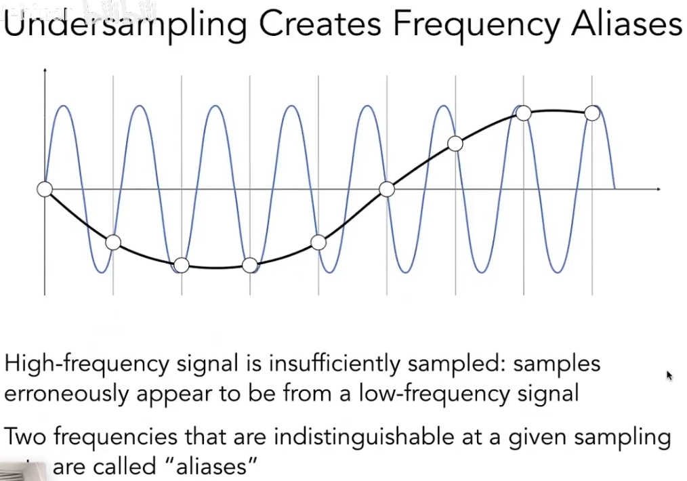
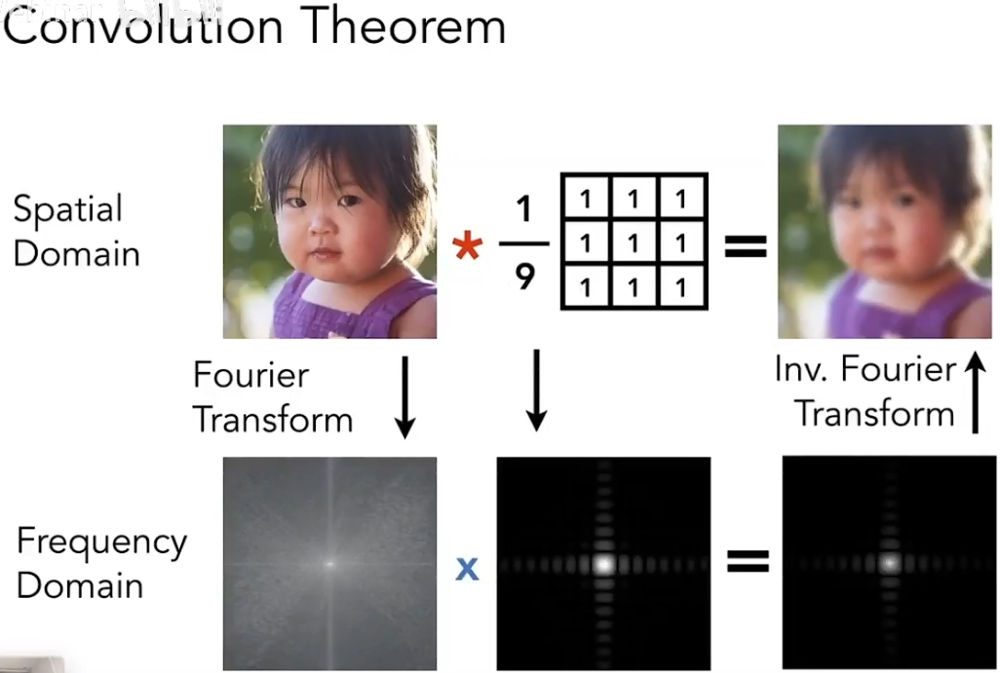
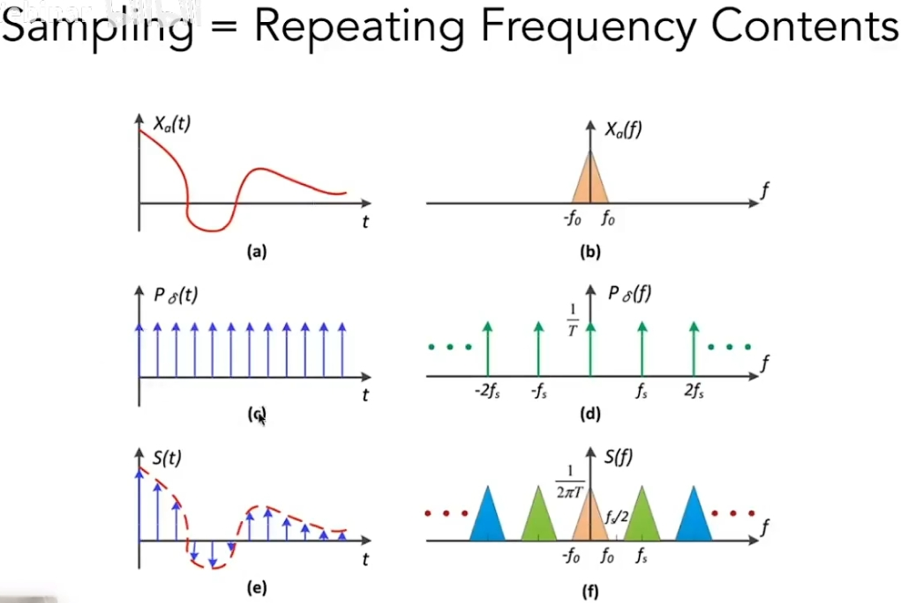
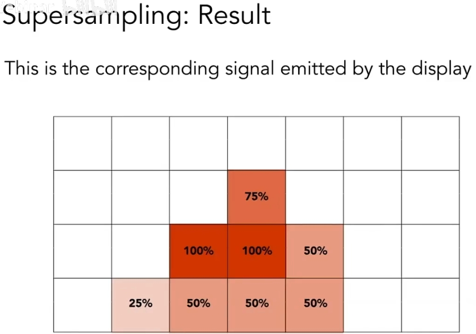

# 【GAMES101课程笔记】投影和光栅化

## 齐次坐标和齐次向量

所谓“齐次坐标”是一系列关于坐标和向量表示方法的规定。
通常，三维坐标和向量都可以表示为：

$$
\left[
\begin{matrix}
    x\\y\\z
\end{matrix}
\right]
$$

但齐次坐标表示这个点是：

$$
\left[
\begin{matrix}
    x\\y\\z\\1
\end{matrix}
\right]
$$

齐次坐标表示这个向量是：

$$
\left[
\begin{matrix}
    x\\y\\z\\0
\end{matrix}
\right]
$$

这样的表示可以方便很多东西，尤其是方便表示三维空间的线性变换。
比如我要对整个空间中的点进行一次线性变换，包含旋转和位移操作。
那么类似下图所示，一个旋转操作$\bm R$可以表示为矩阵相乘，位移操作$\bm t$可以表示为向量相加，于是对于空间中的任意点$[x,y,z]^T$，求变换后的坐标$[x',y',z']^T$就是：

$$
\left[
\begin{matrix}
    x'\\y'\\z'
\end{matrix}
\right]
=
\bm R
\cdot
\left[
\begin{matrix}
    x\\y\\z
\end{matrix}
\right]
+
\bm t
=
\left[
\begin{matrix}
    r_{11}&r_{12}&r_{13}\\r_{21}&r_{22}&r_{23}\\r_{31}&r_{32}&r_{33}
\end{matrix}
\right]
\cdot
\left[
\begin{matrix}
    x_w\\y_w\\z_w
\end{matrix}
\right]
+
\left[
\begin{matrix}
    t_1\\t_2\\t_3
\end{matrix}
\right]
=
\left[
\begin{matrix}
    r_{11}&r_{12}&r_{13}&t_1\\r_{21}&r_{22}&r_{23}&t_2\\r_{31}&r_{32}&r_{33}&t_3
\end{matrix}
\right]
\cdot
\left[
\begin{matrix}
    x_w\\y_w\\z_w\\1
\end{matrix}
\right]
=
[\bm R|\bm t]
\cdot
\left[
\begin{matrix}
    x_w\\y_w\\z_w\\1
\end{matrix}
\right]
$$

所以这样写成齐次坐标可以直接写成一个矩阵乘一个向量，看着更加清爽。

除此之外，齐次坐标还可以方便区分坐标和向量，并且方便计算。

比如“坐标-坐标=向量”就是直接能计算出来，因为最后一项1-1=0：

$$
\left[
\begin{matrix}
    x_1\\y_1\\z_1\\1
\end{matrix}
\right]
-
\left[
\begin{matrix}
    x_2\\y_2\\z_2\\1
\end{matrix}
\right]
=
\left[
\begin{matrix}
    x_1-x_2\\y_1-y_2\\z_1-z_2\\0
\end{matrix}
\right]
$$

再比如“坐标±向量=坐标”也直接能计算出来，因为最后一项1±0=1：

$$
\left[
\begin{matrix}
    x_1\\y_1\\z_1\\1
\end{matrix}
\right]
\pm
\left[
\begin{matrix}
    x_2\\y_2\\z_2\\0
\end{matrix}
\right]
=
\left[
\begin{matrix}
    x_1\pm x_2\\y_1\pm y_2\\z_1\pm z_2\\1
\end{matrix}
\right]
$$

又比如“向量±向量=向量”，因为最后一项0±0=0：

$$
\left[
\begin{matrix}
    x_1\\y_1\\z_1\\0
\end{matrix}
\right]
\pm
\left[
\begin{matrix}
    x_2\\y_2\\z_2\\0
\end{matrix}
\right]
=
\left[
\begin{matrix}
    x_1\pm x_2\\y_1\pm y_2\\z_1\pm z_2\\0
\end{matrix}
\right]
$$

### 其他性质

齐次坐标的四个项乘同一个值，所表示的点不变：

$$
\left[
\begin{matrix}
    x\\y\\z\\1
\end{matrix}
\right]
=
\left[
\begin{matrix}
    kx\\ky\\kz\\k
\end{matrix}
\right]
$$

“坐标-坐标=两坐标连线的中点”：

$$
\left[
\begin{matrix}
    x_1\\y_1\\z_1\\1
\end{matrix}
\right]
+
\left[
\begin{matrix}
    x_2\\y_2\\z_2\\1
\end{matrix}
\right]
=
\left[
\begin{matrix}
    x_1+x_2\\y_1+y_2\\z_1+z_2\\2
\end{matrix}
\right]
=
\left[
\begin{matrix}
    \frac{x_1+x_2}{2}\\\frac{y_1+y_2}{2}\\\frac{z_1+z_2}{2}\\1
\end{matrix}
\right]
$$

## 正交投影和透视投影

来两张图就看懂了：

正交投影是透视投影中相机无限远的特殊情况，没有了近大远小的效应。正交投影渲染方式也很简单，直接把z轴扔掉就行了：

### 透视投影

透视投影可以理解为将远处的平面挤压之后再做正交投影：

我们可以从直觉上规定这种挤压的规则：
* 近平面$z=n$上的点坐标不变
* 远平面$z=f$压缩后中心点坐标不变

这里注意，**我们无法再规定“各平面压缩后z轴坐标不变”**，虽然这样很符合直觉，但是**规定了这个的变换就不是线性变换了**，没法用一个矩阵表示。

设这个线性挤压的操作的变换矩阵为$M_{persp\rightarrow ortho}$，如何求？

如图所示，设近平面的z轴坐标为$n$，要将远处某平面上的坐标$[x,y,z]^T$进行挤压，仅从y轴坐标看，挤压操作会将$y$压缩到$y'=\frac{n}{z}y$：

同理，挤压操作会将$x$压缩到$x'=\frac{n}{z}x$，由于没有规定“各平面压缩后z轴坐标不变”，变换后的z轴坐标不知道会变成什么样，先用“?”代替一下，于是可写出变换的结果：

$$
\left[
\begin{matrix}
    x\\y\\z\\1
\end{matrix}
\right]
\Rightarrow
\left[
\begin{matrix}
    \frac{n}{z}x\\\frac{n}{z}y\\?\\1
\end{matrix}
\right]
\quad z\in[n,f]
$$

由于是齐次坐标，所以全部乘上$z$也表示同一个点：

$$
\left[
\begin{matrix}
    x\\y\\z\\1
\end{matrix}
\right]
\Rightarrow
\left[
\begin{matrix}
    \frac{n}{z}x\\\frac{n}{z}y\\?\\1
\end{matrix}
\right]
\Rightarrow
\left[
\begin{matrix}
    nx\\ny\\?\\z
\end{matrix}
\right]
\quad z\in[n,f]
$$

再看规则“近平面$z=n$上的点坐标不变”，很显然可以表示为$z=n$平面上的点映射关系：

$$
\left[
\begin{matrix}
    x\\y\\n\\1
\end{matrix}
\right]
\Rightarrow
\left[
\begin{matrix}
    x\\y\\n\\1
\end{matrix}
\right]
\Rightarrow
\left[
\begin{matrix}
    nx\\ny\\n^2\\n
\end{matrix}
\right]
$$

再看规则“远平面$z=f$压缩后中心点坐标不变”，很显然可以表示为$z=n$平面上的原点映射关系：

$$
\left[
\begin{matrix}
    0\\0\\f\\1
\end{matrix}
\right]
\Rightarrow
\left[
\begin{matrix}
    0\\0\\f\\1
\end{matrix}
\right]
\Rightarrow
\left[
\begin{matrix}
    0\\0\\f^2\\f
\end{matrix}
\right]
$$

所以上面三个坐标映射关系可以写成$M_{persp\rightarrow ortho}$的一个方程：

$$
\left[
\begin{matrix}
    nx&nx_n&0\\ny&ny_n&0\\?&n^2&f^2\\z&n&f
\end{matrix}
\right]
=
M_{persp\rightarrow ortho}
\left[
\begin{matrix}
    x&x_n&0\\y&y_n&0\\z&n&f\\1&1&1
\end{matrix}
\right]
$$

很容易推导出$M_{persp\rightarrow ortho}$，在近远两平面之间的点映射后的z轴坐标也知道了：

$$
\left[
\begin{matrix}
    nx&nx_n&0\\ny&ny_n&0\\z(n+f)-nf&n^2&f^2\\z&n&f
\end{matrix}
\right]
=
\left[
\begin{matrix}
    n&0&0&0\\0&n&0&0\\0&0&n+f&-nf\\0&0&1&0
\end{matrix}
\right]
\left[
\begin{matrix}
    x&x_n&0\\y&y_n&0\\z&n&f\\1&1&1
\end{matrix}
\right]
$$

### 正交投影

在开始光栅化之前，还需要把透视投影变换过的点全部缩放到$x,y,z\in[-1,1]$的正方体区域内，以方便光栅化计算。

## 相机内参

透视投影中的近平面距离$n$属于相机的参数，相关的相机参数还有水平和垂直可视角度$f_x,f_y$

## 从投影到光栅化

### 相关概念准备

如何定义“屏幕”？“Raster”的词源？

关于像素的一些约定和定义：

### 视口变换

屏幕左下角定义为原点，屏幕长宽分别为$height,width$，所以光栅化之前要把$x,y,z\in[-1,1]$的正方体区域再缩放到屏幕区域内，称为视口变换：

简单，变换矩阵直接写一下不用费时间解释了：

$$
M_{viewport}=
\left[
    \begin{matrix}
        \frac{width}{2}&0&0&\frac{width}{2}\\
        0&\frac{height}{2}&0&\frac{height}{2}\\
        0&0&1&0\\
        0&0&0&1\\
    \end{matrix}
\right]
$$

### 成像设备

CRT靠电子打像素发光

LCD靠液晶排布控制光偏振方向进而控制光是否可透过平面偏振片

LED自己发光

电子墨水控制像素的黑白

## 光栅化

* 何时开始光栅化：已经通过透视投影、正交投影和视口变换将场景中的所有对象都变换到$x\in[0,width],y\in[0,height],z\in[-1,1]$的视口区域内
* 光栅化的目标是：将上述正方体区域内的目标画在屏幕上
* 光栅化的基本思想：光栅扫描，逐像素上色
* 光栅化的基本元素：三角形

三角形的好处：
* 任何平面都可以拆成三角形
* 三个顶点组成的面必是平面
* 很容易定义三角形的“内”和“外”
* 定义了三个顶点的属性，再三角形内的任意点的属性很容易插值得到

### 采样

直接一个一个像素问过去是什么颜色

实践中，对屏幕空间中的像素的采样就是确定每个像素是否在三角形内

### 判断像素是否在三角形内

基本思想：判断点是否在三角形内=判断点在三角形三条边的左侧还是右侧=叉乘大于1还是小于1

比如，点$Q$在三角形内$\Rightarrow$

$$
\left\{
\begin{aligned}
\overrightarrow{P_0P_1}\times\overrightarrow{P_0Q}&>0\\
\overrightarrow{P_1P_2}\times\overrightarrow{P_1Q}&>0\\
\overrightarrow{P_2P_0}\times\overrightarrow{P_2Q}&>0\\
\end{aligned}
\right.
$$

### 优化采样效率：包围盒 (Axis Aligned Bounding Box, AABB)

包围盒就是三角形的外接四边形，三角形不可能覆盖到包围盒外面的像素，可以限制采样范围

### 优化采样效率：Incremental Triangle Traversal

适用于很窄的三角形，因为窄三角形会有很大的包围盒但是很少的像素

### 光栅化的缺点：走样(Aliasing)、锯齿(Jaggies)

## 反走样、抗锯齿(Antialiasing)

核心思想：Blurring (Pre-Filtering) Before Sampling 在采样前先模糊

效果不错：

思想很简单，但是背后的原因很深刻。
比如能不能先采样再模糊？答案是不能。

其原因可以从奈奎斯特采样(Nyquist Sampling)开始理解。

### 深入理解：奈奎斯特采样定理

奈奎斯特采样定理中的“走样”(aliasing)是指，用同样的采样方式采样两个完全不同的信号却得到完全相同的结果，以至于无法区分两个信号：

而奈奎斯特采样定理指出，为防止走样现象的产生，待采集信号的最高频率分量$\omega_m$必须小于采样频率$\omega_s$的一半，即$\omega_s\geq 2\omega_m$。

### 深入理解：卷积

时域上的卷积操作等于在频域上乘频域上的卷积核：

### 深入理解：采样的本质

采样的本质就是在时域上乘一串冲激函数，对应到频域上就是卷积：

可以发现其结果就是在频域在冲激函数的各频率处重复目标信号的频谱。

### 深入理解：走样的本质

而多画点图就知道，冲激函数在时域越稀疏，在频域上就越密集。
冲激函数在时域稀疏到一定程度，在频域上就会太密集，导致频谱发生混叠，从而在恢复到时域时高频部分不再与原始信号相等：

走样现象也是同样的原理，分辨率就对应着冲激函数在时域上的密度，所以分辨率越低频谱混叠越严重

### 深入理解：抗锯齿的本质

按上面的奈奎斯特采样定理，要防止走样，在时域上增加冲激函数的密度即可，也就对应着增大分辨率，屏幕分辨率通常是固定的所以这方法不可能。

而先模糊再采样的思想与增大分辨率这种从采样入手的思路相反，是从原始信号入手的思路。
其本质是**预先把高频信号拿掉**从而避免走样：

### 实操：MSAA (Antialiasing By Supersampling)

先模糊再采样本质上就是对每个像素都求这个三角形的面积占比然后取平均：

但是直接算面积不太好算，所以实际上用Supersampling方法进行近似计算，其实就是先用高分辨率采样再求平均：

MSAA是最基本的方法，多采样的四个点是均匀排布的，还有很多优化点排布的，有些点还会被临近像素复用

### 扩展

* FXAA(Fast Approximate AA): 先采样后处理，通过图像识别等方法找到边界的锯齿再给替换成没锯齿的边界
* TAA(Temporal AA): 复用上一帧的感知到的边界

* DLSS (Deep Learning Super Sampling): 深度学习超采样