# 【GAMES101课程笔记】反走样、抗锯齿(Antialiasing)

核心思想：Blurring (Pre-Filtering) Before Sampling 在采样前先模糊

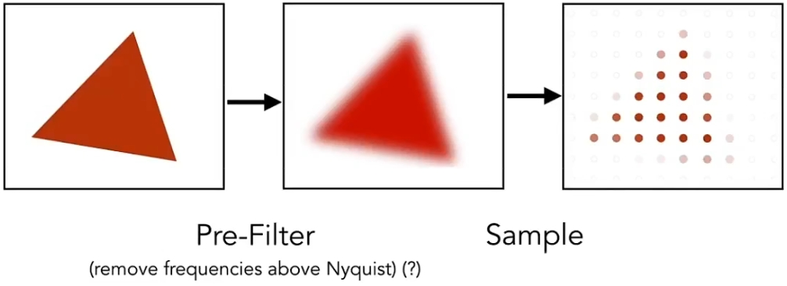

效果不错：

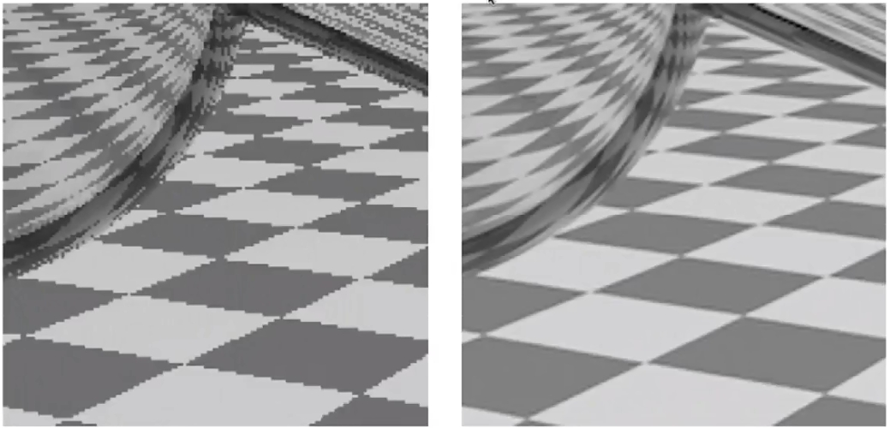

思想很简单，但是背后的原因很深刻。
比如能不能先采样再模糊？答案是不能。

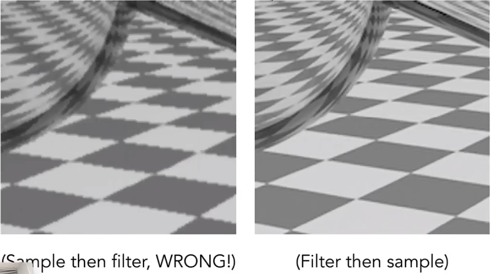

其原因可以从奈奎斯特采样(Nyquist Sampling)开始理解。

## 深入理解：奈奎斯特采样定理

奈奎斯特采样定理中的“走样”(aliasing)是指，用同样的采样方式采样两个完全不同的信号却得到完全相同的结果，以至于无法区分两个信号：

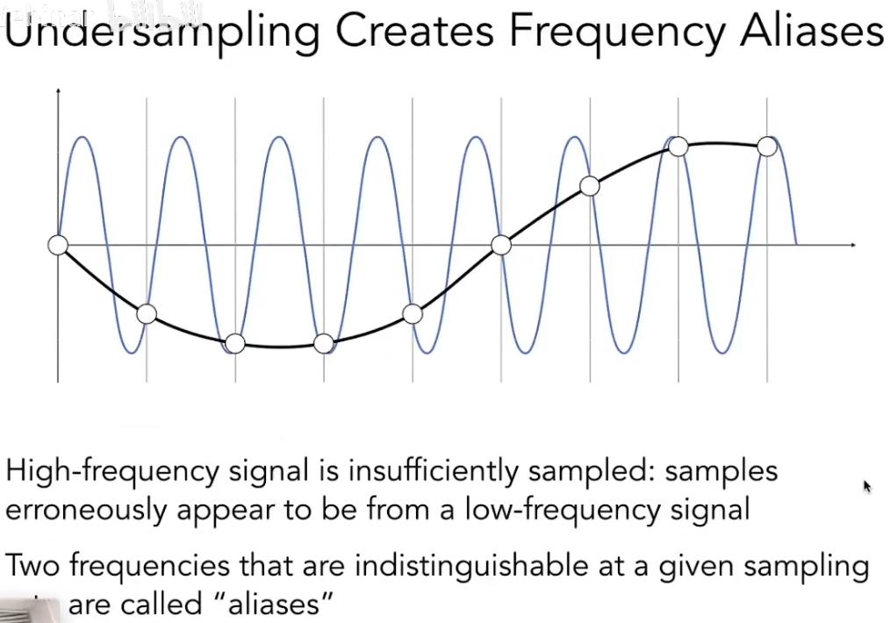

而奈奎斯特采样定理指出，为防止走样现象的产生，待采集信号的最高频率分量$\omega_m$必须小于采样频率$\omega_s$的一半，即$\omega_s\geq 2\omega_m$。

## 深入理解：卷积

时域上的卷积操作等于在频域上乘频域上的卷积核：

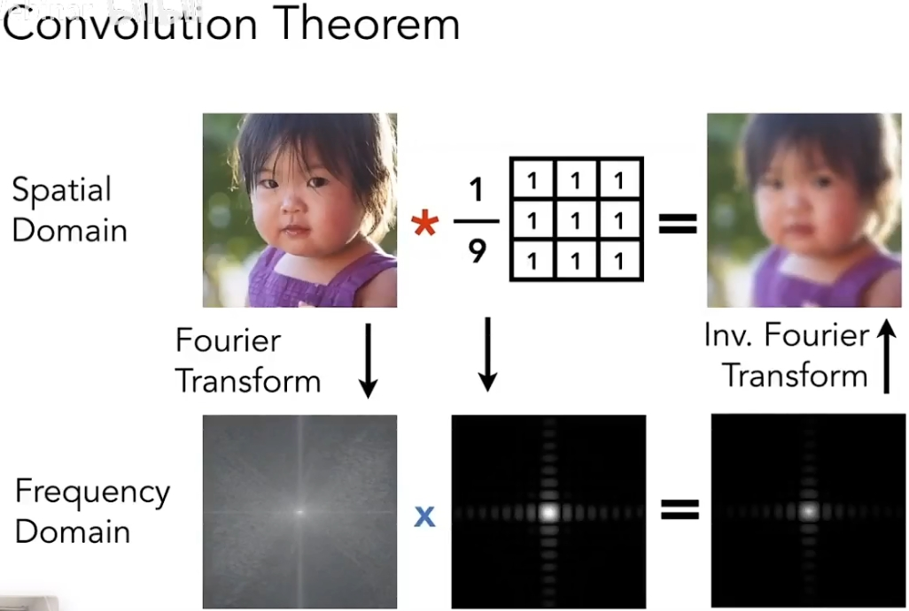

## 深入理解：采样的本质

采样的本质就是在时域上乘一串冲激函数，对应到频域上就是卷积：

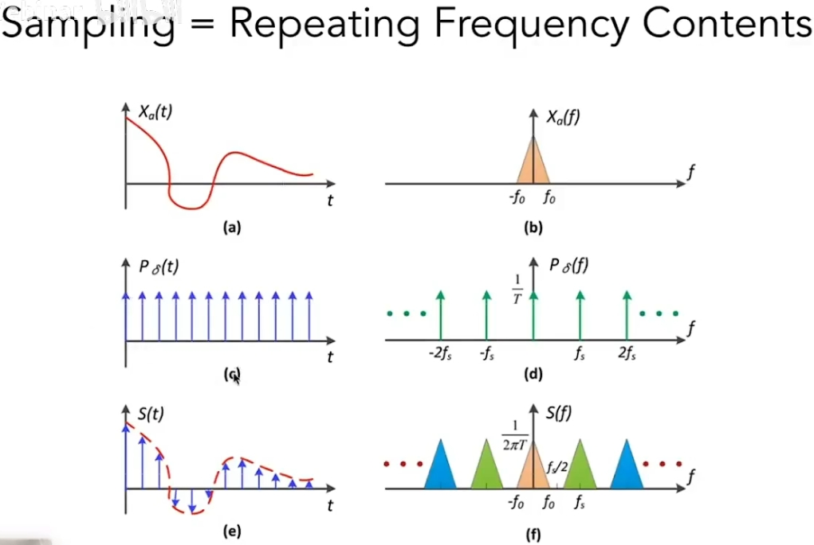

可以发现其结果就是在频域在冲激函数的各频率处重复目标信号的频谱。

## 深入理解：走样的本质

而多画点图就知道，冲激函数在时域越稀疏，在频域上就越密集。
冲激函数在时域稀疏到一定程度，在频域上就会太密集，导致频谱发生混叠，从而在恢复到时域时高频部分不再与原始信号相等：

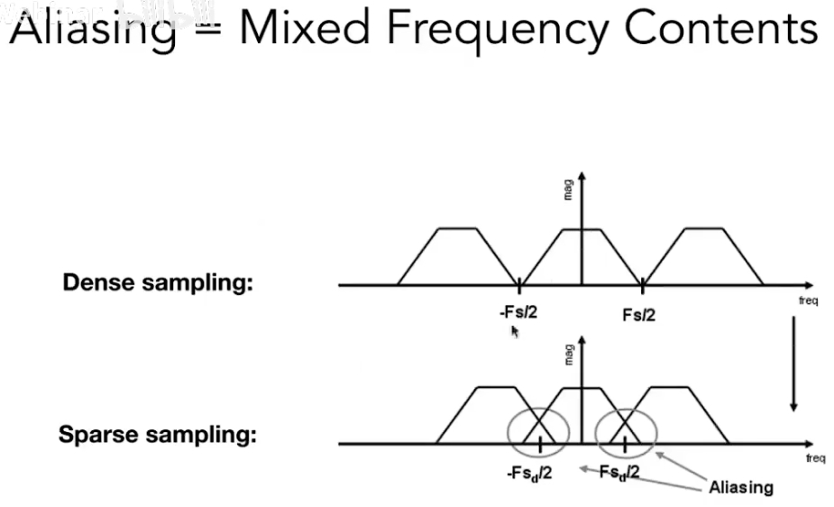

走样现象也是同样的原理，分辨率就对应着冲激函数在时域上的密度，所以分辨率越低频谱混叠越严重

## 深入理解：抗锯齿的本质

按上面的奈奎斯特采样定理，要防止走样，在时域上增加冲激函数的密度即可，也就对应着增大分辨率，屏幕分辨率通常是固定的所以这方法不可能。

而先模糊再采样的思想与增大分辨率这种从采样入手的思路相反，是从原始信号入手的思路。
其本质是**预先把高频信号拿掉**从而避免走样：

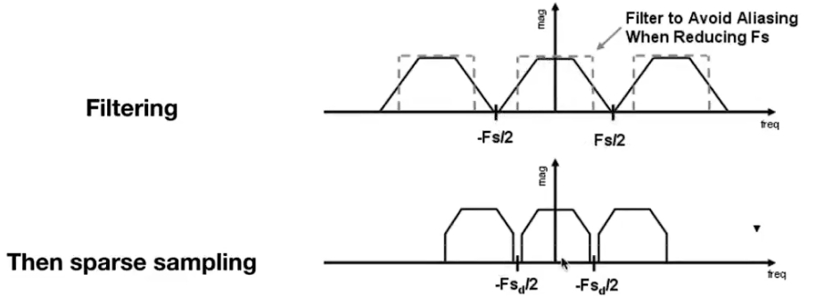

## 实操：MSAA (Antialiasing By Supersampling)

先模糊再采样本质上就是对每个像素都求这个三角形的面积占比然后取平均：

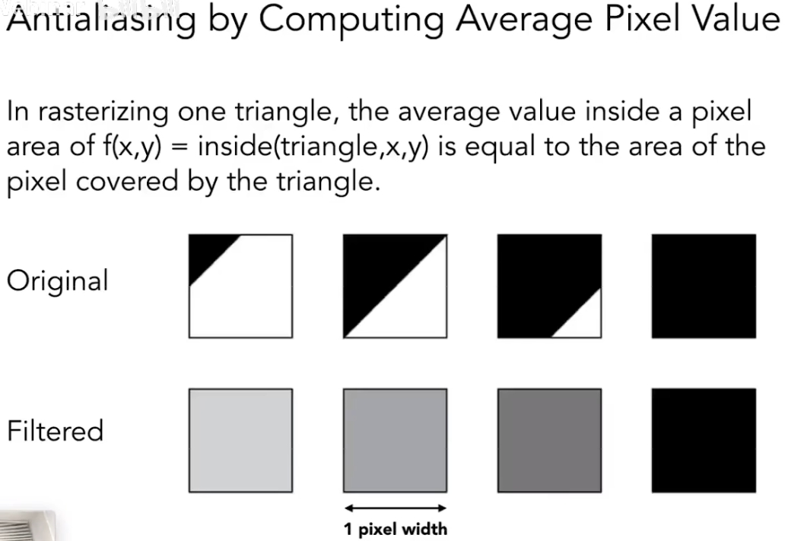

但是直接算面积不太好算，所以实际上用Supersampling方法进行近似计算，其实就是先用高分辨率采样再求平均：

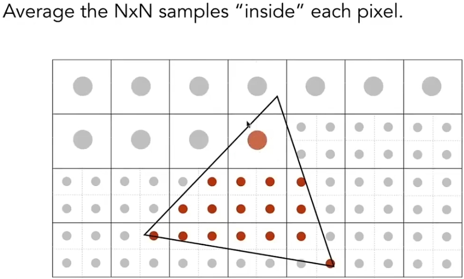
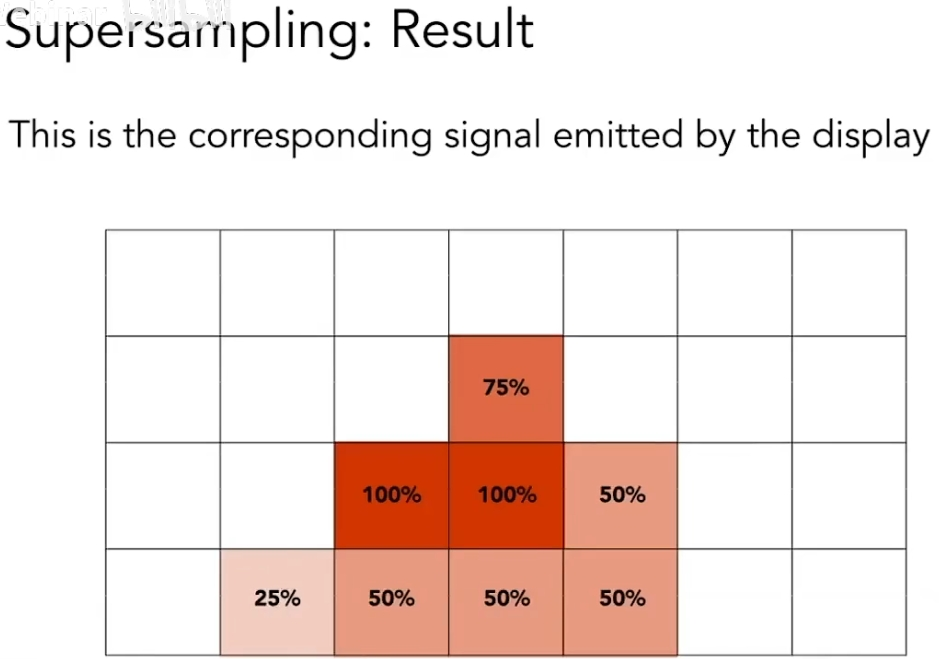

MSAA是最基本的方法，多采样的四个点是均匀排布的，还有很多优化点排布的，有些点还会被临近像素复用

## 扩展

* FXAA(Fast Approximate AA): 先采样后处理，通过图像识别等方法找到边界的锯齿再给替换成没锯齿的边界
* TAA(Temporal AA): 复用上一帧的感知到的边界

* DLSS (Deep Learning Super Sampling): 深度学习超采样
