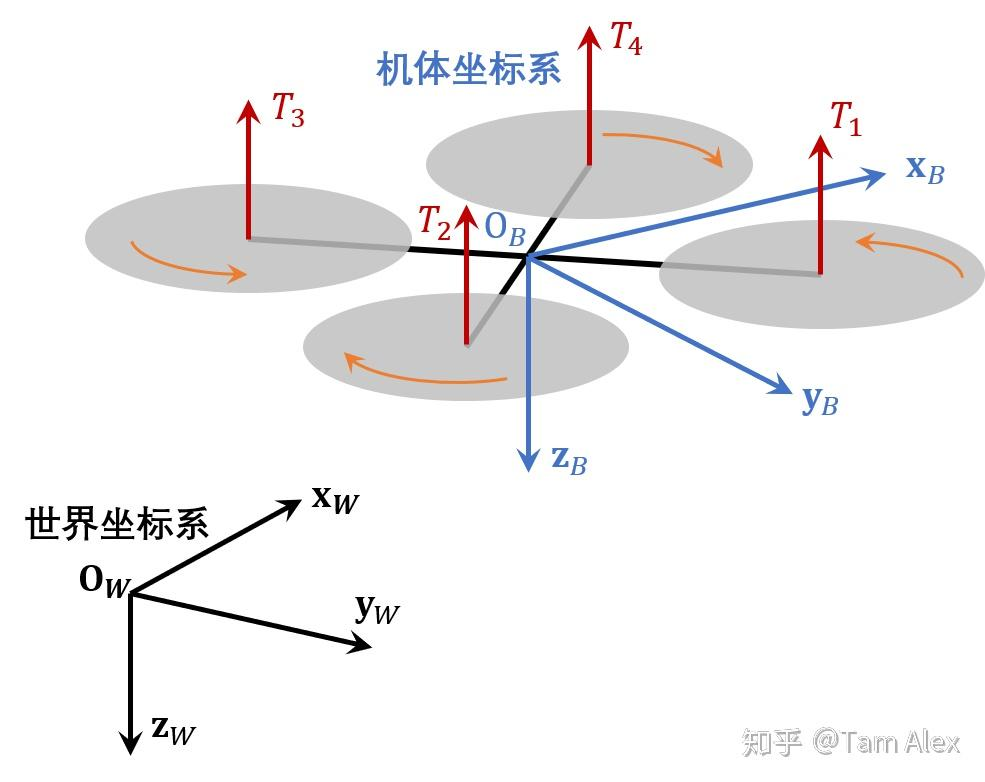
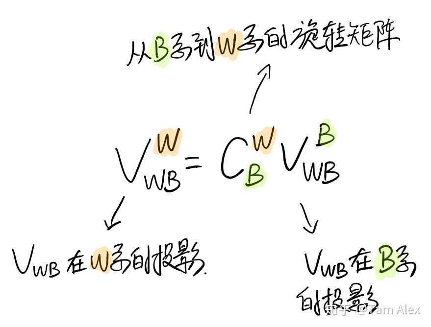
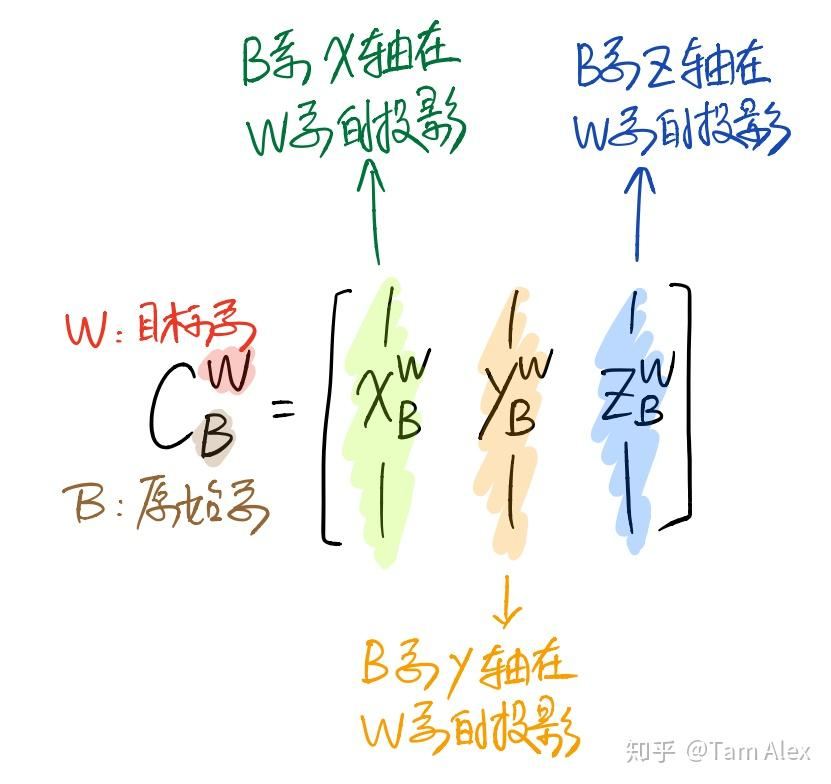
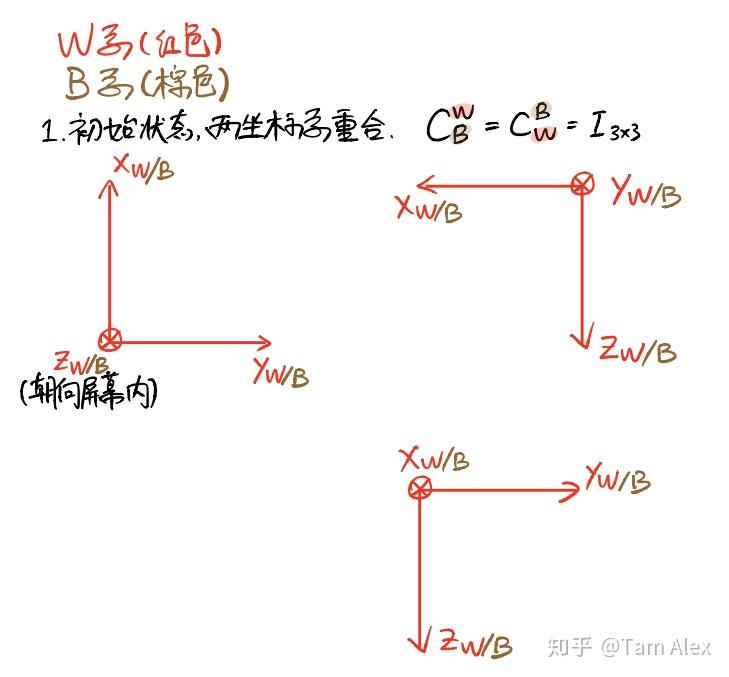
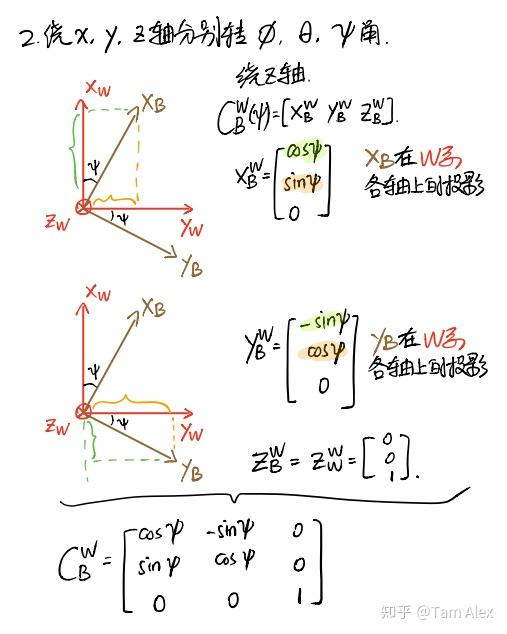
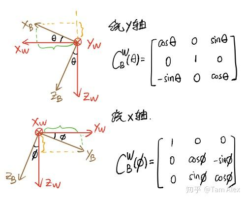

# 【转载】姿态与旋转矩阵

[原文](https://zhuanlan.zhihu.com/p/86464027)

最近在好多地方和人聊了很多关于姿态和旋转矩阵的问题，发现很多小伙伴上来就接触了SO(3)群，反而对传统姿态和旋转矩阵里的一些基本的概念不太理解，觉得这方面还是有很多坑的，就把一些我自己的想法写下来，一方面希望和大家交流一下，另一方面也算备忘吧。

## 1. 向量是什么

大家都知道，向量（vector, 或称矢量）是指具有大小（magnitude）和方向（direction）的几何对象。在这里我想说的一点是： **向量这个几何对象是不依赖于坐标系客观存在的** 。

我们在设计飞控里用到的无人机位置啊，速度啊，加速度啊，角速度啊，统统都是一个个不依赖坐标系客观存在的向量，记住这一点有时能让我们从繁杂的数学表达中解脱出来，站在物质的层面去看问题，而不会把基本的物理概念搞错。

##  **2. 如何表示向量** 

向量是客观存在的，而我们要使用向量就需要用数学的语言去描述它们，这就需要定义坐标系，或者更广义的说，定义向量空间的基。我们生活和做飞控的空间都是三维空间，因此我们只需要找到三组线性无关的三维向量就能够当做向量空间的基，也就是坐标轴了。当然，定义坐标系是为了方便我们计算和使用，所以一般都会选择三个相互正交的三维向量来构成直角坐标系。

这里我们讨论飞的没那么远的小型无人机，所以一般定义两个坐标系就够了，一个世界坐标系（World frame，W系），一个机体坐标系（Body frame，B系）。其中，我们认为W系是静止的参考坐标系，而B系是动坐标系。下面为了更形象说明，我们定义W系原点在地面站，为北-东-地坐标系；B系原点在无人机质心，x轴指向机头、y轴指向右侧，z轴指向下方。

这样一来，我们飞控里需要用到的无人机位置向量，速度向量，加速度向量，角速度向量就都有了可以表示的坐标系。因此，我们用下面的方式来表示矢量

 $\bold{x}_{\alpha\beta}^\gamma$  

其中  $\alpha$  、  $\beta$  、  $\gamma$  分别表示三个坐标系，那么这个向量的含义就是 $\beta$ 系相对于 $\alpha$ 系的某个物理量，分解（表示）在 $\gamma$ 系中。

比如，  $\bold{r}_{WB}^W$  就表示了无人机（机体坐标系）相对于地面站（世界坐标系）的位置向量在W系的投影，用人话说就是无人机现在在地面站的偏北多少米、偏东多少米、偏下多少米（负多少米）。

 $\bold{v}_{WB}^W$  则表示了无人机相对于地面站的速度向量在W系的投影，也就是无人机在北东地方向的速度。

 $\bold{v}_{WB}^B$  表示了无人机相对于地面站的速度向量在B系的投影，也就是无人机向前、向右和向下的速度。

显然，有  $\bold{x}_{\alpha\beta}^\gamma=-\bold{x}_{\beta\alpha}^\gamma$  。

对于旋转，要比平移抽象一些。比如无人机正在花式旋转，那么它的角速度矢量可以分别写在B系和W系：  $\bold{\Omega}_{WB}^B$  和  $\bold{\Omega}_{WB}^W$  。那么，我们陀螺测量的就是  $\bold{\Omega}_{WB}^B$  （捷联式安装的陀螺）。

##  **3. 什么是姿态，什么是旋转矩阵** 

首先要明确，姿态是用来描述 **两个坐标系之间** 相对关系的。一个点相对于一个坐标系没办法定义姿态，相反，一个坐标系相对一个点也没法定义姿态，所以，姿态必须是两个坐标系之间的事情。目前有四种流行的姿态表示法，它们是 **欧拉角** 、 **旋转矩阵** 、 **四元数** 和 **旋转矢量** 。四元数和旋转矩阵具有一定的相似性，旋转矢量的运算很难使用，因此我们聚焦到欧拉角和旋转矩阵上面来。

欧拉角表示为三个角度（容易被人们直观接受，因此很有欺骗性），意义是：如果我们要表示两个坐标系之间的关系，那么就将一个坐标系分别沿某些坐标系旋转相应的角度，就能和另一坐标系重合。因此欧拉角就具有了两个属性：旋转轴顺序，和旋转角度。

拿我们最常见的滚转  $\phi$  、俯仰  $\theta$  、偏航  $\psi$  来说，它们的含义是：从W系出发，首先绕Z轴旋转  $\psi$  ，然后绕Y轴旋转  $\theta$  ，最后沿X轴旋转  $\phi$  ，就和B系重合了；将这样的旋转顺序称为（从静止坐标系到动坐标系的）Z-Y-X。因此，我们在文献里看到滚转、俯仰、偏航的时候，还要注意旋转顺序，比如UPenn著名的V. Kumar教授团队，就比较喜欢使用Z-X-Y顺序。

对两个坐标系而言，不同的旋转顺序会导致大小不同的欧拉角，但也不用太费解，因为它们虽然有不同的旋转顺序、不同的欧拉角大小，不同的旋转矩阵计算公式等等，但两个坐标系之间的关系就在那里，就像我们前面说的那样，不论我们怎么描述，它们的相对关系本身是不会变的。而且，不论使用什么欧拉角旋转顺序，最终得到的 **旋转矩阵** 在数值上一定是相同的——因为描述的是同一个关系嘛！所以，这就是使用旋转矩阵的巨大优点：明确。（然而，还是有许多小伙伴被B转W，W转B搞得头晕脑胀，这个稍后再聊）

下面简单介绍下旋转矩阵，旋转矩阵（rotation matrix），又称方向余弦矩阵（Direction Cosine Matrix，DCM），同时也是SO(3)群的元素。作用就是把某个向量在一个坐标系的投影转换到另一个坐标系去，这里用  $C_B^W$  表示旋转矩阵（还有很多用  $^WR_B$  的，也挺直观，但写大片公式容易看错），下标是原始坐标系，上标是目标坐标系，这里放一张图吧。

注意，还是那句话，向量是客观存在的！旋转矩阵变换的只是表示向量的坐标系。

##  **4. 对旋转矩阵的理解** 

这里介绍一下个人对旋转矩阵的理解，也是我比较推荐大家的理解方式，还是用手写图比较方便。

也就是说，旋转矩阵的第1、2、3列，实际上是原始坐标系的x、y、z轴，在目标坐标系里的投影。比如原始坐标系和目标坐标系重合时，x轴是  $[1,0,0]^T$  ，y轴是  $[0,1,0]^T$  ，z轴是  $[0,0,1]^T$  ，用它们组成旋转矩阵的1、2、3列，就是单位矩阵，也就是说向量在原始坐标系和在目标坐标系的投影是一样的。反过来，  $C_W^B$  的各列就是W系各坐标轴在B系中的投影，按照这种理解方式，会得到许多有趣的视角，下面就来看看怎么用这种理解方式来推导绕单轴的旋转矩阵。

##  **5. 绕单轴的旋转矩阵** 

对于绕单轴的旋转矩阵，很多小伙伴分不清楚到底是B转W还是W转B的，下面就先用上面对旋转矩阵的理解来推导一下绕单轴的旋转矩阵，然后介绍下怎么记忆。注意对旋转正负号的定义，惯用的定义是，从原点沿着坐标轴看，顺时针为正。下面看图。

这样就通过计算B系各坐标轴在W系的投影得到了绕各轴旋转的  $C_B^W$  ，反之计算W系在B系的投影就可得到绕各轴旋转的  $C_W^B$  ，不过因为它们互为转置，所以得到了一个，就知道另一个了。

注意这里的W系和B系可以换成任意两个坐标系，只要把握哪个坐标系是动坐标系，以及我们要找哪个坐标系到哪个坐标系的旋转矩阵就不容易出错了。

绕单轴的旋转矩阵对角线都是余弦或1，其他的0元素也很容易确定，讨厌的就是正弦函数前面的正负号了。那么我的记忆方法就是。。。还是把旋转的两个轴画出来，然后只要确定一个正弦的符号，另一个位置的正弦取相反的符号就行了。确实还是挺麻烦，不过按照这个理解是不会搞错B转W和W转B的，大家可以试一试。我们把绕x、y、z的从B系到W系的单轴旋转矩阵分别  $C^W_B(\phi)$  、  $C^W_B(\theta)$  、  $C^W_B(\psi)$  ，那么就有  $C_B^W=C^W_B(\psi)C^W_B(\theta)C^W_B(\phi)$  ，正好对应了从B系到W系的旋转顺序。这也叫链式法则，相信大家看过相关书都明白，以及旋转矩阵的逆就是它的转置，表示相反的坐标转换，也都不再赘述。
