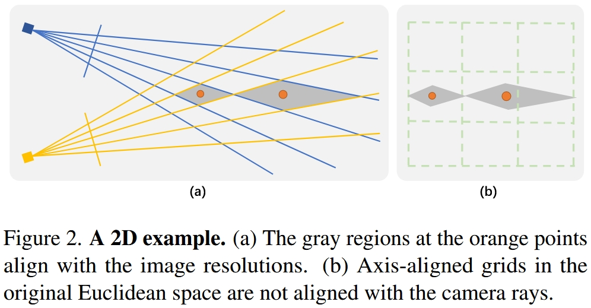

# 无界场景和NeRF中的资源分配问题学习

关键论文：[F2-NeRF: Fast Neural Radiance Field Training with Free Camera Trajectories](https://openaccess.thecvf.com/content/CVPR2023/html/Wang_F2-NeRF_Fast_Neural_Radiance_Field_Training_With_Free_Camera_Trajectories_CVPR_2023_paper.html)

F2-NeRF 探讨了 NeRF 中一个非常本质的问题，我如何**分配资源**给需要重建（在这里我把新视角生成理解为一种重建）的目标场景。 给定三维空间中的某块区域，这个空间的分配资源会涉及到**每个区域要用多大的采样率**（光线经过该区域时样本点的采样密度）；如果采用 hybrid 表现形式，比如网格 + MLP，还需要考虑给**每个区域的特征网格的分辨率有多高**（细粒度）。

实际上，关于 NeRF 的资源分配的问题在之前的工作中常常被忽视，这是因为目前绝大多数的数据集基本可以分成文中所说的 Forward-facing 以及 Object-centric 两种情况，分别采用 NDC warp 和 Inverse sphere warp 解决。
这两种情况分别是相机位姿集中和分散的两个极端，而F2-NeRF所针对的则介于他们之间，作者称之为Free trajectory。

在F2-NeRF之前，Free trajectory要么采用每个区域一个NeRF的Block-nerf分块处理，要么就是Instant-NGP的无差别对待，纯靠网格+MLP自己处理细粒度的分配。这两种情况都极其会导致 NeRF 变得巨大无比，浪费资源，且需要在数据预处理阶段就要进行大量的人工干预处理。

F2-NeRF 针对这一问题给出了自己的理解，他认为**三维空间中的资源分配是由拍摄的相机视角决定的**。当相机视角能够很好地覆盖某个区域则应当多分配资源，反之亦然。F2-NeRF 通篇都是在贯彻他的这个思想。

F2-NeRF 主要关注网格+MLP的实现方式，其实就是Instant-NGP了，并分析为什么Instant-NGP不能很好的处理Free trajectory的问题，然后在该分析的基础上给出自己的解决思路。

## Forward-facing场景下的资源分配：NDC (Normalized Device Coordinate) warp

出处：原版NeRF [NeRF: representing scenes as neural radiance fields for view synthesis](https://dl.acm.org/doi/10.1145/3503250)

**越接近近平面的区域会有更密集的样本点采样**

其实就是把[透视投影转正交投影](./投影和光栅化.md)，靠近像平面区域的样本点很显然更密集。

## Object-centric场景下的资源分配：Inverse sphere warp

出处：无界场景开山作NeRF++ [NeRF++: Analyzing and Improving Neural Radiance Fields](http://arxiv.org/abs/2010.07492)

**单位球内的空间有着高的均匀采样，而单位球外的空间则越远采样越稀疏**

NeRF++将世界分为前景和背景，前景部分就是中心物体，包在一个球面内，背景部分在球面外。
球内的前景和球外的背景分别有两个MLP，训练时两个MLP共同优化。

对于球内前景，采样和渲染过程和传统NeRF完全一样。

对于球外背景，采用逆球面重参数化。

### 逆球面重参数化 inverted sphere parameterization

>在本技术报告中，我们首先对NeRF中的潜在故障模式进行了分析，并分析了NeRF在实践中避免这些故障模式的原因。第二，我们提出了一种新的空间参数化方案novel spatial parameterization scheme，我们称之为**反向球面参数化inverted sphere parameterization**，它允许NeRF处理一类新的无界场景捕获captures of unbounded scenes。

>当真实场景深度的动态范围很小时，可以用有限数量的样本在数值上很好地近似积分。然而，对于室外，360◦ captures 以附近物体为中心，同时观察周围环境，动态深度范围可以非常大，作为背景(建筑物、山脉、云等。)可以任意远。如此**高的动态深度范围在NeRF的体积场景表示中导致了严重的分辨率问题**，因为为了合成照片般逼真的图像，等式2在前景和背景区域都需要足够的分辨率，这很难通过根据3D空间的欧几里德参数化简单地采样点来实现。

逆球面重参数化用坐标变换将世界坐标系或相机坐标系下的坐标$(x, y, z)$映射为$(x', y', z', 1/r)$，其中$r$为球体中心到采样点的直线距离，$(x', y', z')$是单位球面上的点，即$x'^2+y'^2+z'^2=1$。球外背景MLP的输入不是三维坐标而是上述四维坐标$(x', y', z', 1/r)$。

球外背景的物理含义作者的解释是：球外是一个360相机拍出来一个球面2D图像，图像上的每个像素的颜色都是一个随深度$r$变化的函数。

>The inverted sphere parameterization for the outer volume has an intuitive physical explanation. It can be viewed in terms of a virtual camera whose image plane is the unit sphere at the scene origin.
>Hence, the 3D point $(x, y, z)$ is projected to the pixel $(x', y', z')$ on the image plane, while the term $1/r\in(0,1)$ serves as the (inverse) depth, or disparity, of the point.

### 形状歧义 Shape-radiance ambiguity

## Free trajectory场景下的资源分配：Perspective Warping

[F2-NeRF 个人笔记](https://zhuanlan.zhihu.com/p/618362291)

作者认为图中所示的相机视角的交叉菱形区域 (rhombuses) 应当分配一样的资源，从网格的角度出发，我应该给他们分配一样的分辨率的特征网格。换句话说，就是 **warping 后，每个交叉菱形区域应该对应一样的大小**，而 Definition1 中的意思就是利用多视角的上的距离来描述交叉菱形内任意两点间的距离满足这一假设。

## Mip-NeRF 360中的资源分配：Piecewise-projective Contraction

