# 球谐系数与球面高斯

尽量不用各种术语来讲清楚球谐(Spherical Harmonics)系数，以及的一些应用。

SH意指球谐函数，归根到底只是一组“基函数”，球谐系数就是这组基函数的系数。 

## 基函数

所谓“基函数”就是一组可以组成任意函数的分量。比如

比如泰勒展开以多项式函数系$\{1,x-x_0,(x-x_0)^2,(x-x_0)^3,\dots,y_{n}=(x-x_0)^n,\dots\}$为基函数，
在对函数$f(x)$的泰勒展开中：

$$
\begin{aligned}
f(x)&=\frac{f(x_0)}{0!}+\frac{f'(x_0)}{1!}(x-x_0)+\frac{f''(x_0)}{2!}(x-x_0)^2+\cdots+\frac{f^{(n)}(x_0)}{n!}(x-x_0)^n+\cdots\\
&=\sum_{n=0}^\infty\frac{f^{(n)}(x_0)}{n!}(x-x_0)^n
\end{aligned}
$$

$\{\frac{f(x_0)}{0!},\frac{f'(x_0)}{1!},\frac{f''(x_0)}{2!},\dots,\frac{f^{(n)}(x_0)}{n!},\dots\}$就是这组基函数的系数。

又比如傅里叶变换以三角函数系$\{1,\sin(\omega x),\cos(\omega x),\sin(2\omega x),\cos(2\omega x),\sin(3\omega x),\cos(3\omega x),\dots,\sin(n\omega x),\cos(n\omega x),\dots\}$作为基函数，在对函数$f(x)$的傅里叶展开中：

$$
\begin{aligned}
f(x)&=\frac{a_0}{2}+\sum_{n=1}^\infty\left(a_n\cos(n\omega x)+b_n\sin(n\omega x)\right)\\
&=\frac{a_0}{2}+a_1\cos(1\omega x)+b_1\sin(1\omega x)+a_2\cos(2\omega x)+b_2\sin(2\omega x)+\cdots+a_n\cos(n\omega x)+b_n\sin(n\omega x)+\cdots\\
a_n&=\frac{2}{T}\int_0^Tf(x)\cos(n\omega x)dt\\
b_n&=\frac{2}{T}\int_0^Tf(x)\sin(n\omega x)dt\\
\end{aligned}
$$

$\{\frac{a_0}{2},a_1,b_1,a_2,b_2,a_3,b_3,\dots,a_n,b_n,\dots\}$就是这组基函数的系数。

有了基函数，就可以把任意一个函数，描述成几个基函数的加权和了。 
当基函数用的个数越多，和原始函数本身也就越接近。 

这里用的是二维直角坐标系下的函数$y=f(x)$举例，而拓展到极坐标系函数$r=f(\theta)$也有多种基函数。
再扩展到三维坐标系下，函数函数$z=f(x,y)$表示一个平面，同样有二维傅里叶级数等二维基函数；而三维极坐标系即球面坐标系函数$r=f(\theta,\phi)$对应的则通常是一个凹凸不平的球面（半径$r$随方向角$(\theta,\phi)$变化且方向角范围为$[-\pi,\pi]$），也同理可以用一系列基函数近似表示，这些基函数称为“球面基函数”。

而球谐函数(Spherical Harmonics)就是最有名的球面基函数。球谐函数有很多很好的性质，比如正交性，旋转不变性，就和傅里叶级数里的基函数一样完美。

## 球谐系数

一般我们把球谐函数记为$Y_l^m$：

$$
Y_l^m(\theta,\phi)=
\left\{
\begin{aligned}
    &\sqrt2K_l^m\cos(m\phi)P_l^m(\cos\theta)&(m>0)\\
    &\sqrt2K_l^m\cos(-m\phi)P_l^{-m}(\cos\theta)&(m<0)\\
    &K_l^0P_l^0(\cos\theta)&(m=0)
\end{aligned}
\right.
$$

其中，$l\in\mathbb N$称为球谐函数的“次数”、$m\in\mathbb Z,m\in[-l,l]$称为球谐函数的“阶数”、
$K_l^m$是一个缩放系数，和归一化有关：

$$
K_l^m=\sqrt{\frac{2l+2}{4\pi}\cdot\frac{(l-|m|)!}{(l+|m|)!}}
$$

$P_l^m(\cdot)$为[勒让德多项式](https://zh.wikipedia.org/wiki/%E5%8B%92%E8%AE%A9%E5%BE%B7%E5%A4%9A%E9%A1%B9%E5%BC%8F)，是勒让德微分方程的解：

$$(1-x^{2}){\frac {\mathrm {d} ^{2}P(x)}{\mathrm {d} x^{2}}}-2x{\frac {\mathrm {d} P(x)}{\mathrm {d} x}}+n(n+1)P(x)=0$$

上述方程及其解函数因法国数学家阿德里安-马里·勒让德而得名。勒让德方程是物理学和其他技术领域常常遇到的一类常微分方程。当试图在球坐标中求解三维拉普拉斯方程（或相关的其他偏微分方程）时，问题便会归结为勒让德方程的求解。

此处出现勒让德多项式的主要原因是因为勒让德多项式的正交性，它的正交性给球谐函数带来了正交性，使其成为和三角函数系一样完美的基函数系。

第一次看完表达式之后的心情一般如下 

球谐函数的各基函数化成图长这样：

其中蓝色表示$Y_l^m(\theta,\phi)$值为正数，黄色表示$Y_l^m(\theta,\phi)$值为负数，从上到下次数增大，从左到右阶数增大：

其实退化到二维来看，还是很简单的，二维的SH差不多长这样，蓝色表示$Y_l^m(\theta,\phi)$值为正数，黄色表示$Y_l^m(\theta,\phi)$值为负数： 

（具体系数不太准确仅用于示意...） 

像这样是不是就特别简单了，em，看这个波瓣长得似乎有点三维SH的意思了嘛。 

（可以思考一个小问题：为啥二维情况下第三排的基函数只有cos平方，没有sin平方呢？） 

假如有一个极坐标的函数长这样： 

他可以表示为 

$$r = 0.5 + 0.1 \cos\theta + 0.07 \sin\theta + 0.05 \cos\theta \sin\theta + 0.3(2\cos^2\theta - 1)$$

只记球谐系数，这个函数就表示为$0.5,0.1,0.07,0.05,0.3$。

回到三维的情况这几个数字其实就是SH系数啦。 

当SH的系数用的越多，那么表达能力就越强，跟原始的函数就越接近：

## 球谐系数的图形学应用

在图形学中，球谐函数通常用来记录某个值在球面上的分布，比如光照情况或颜色分布等。

例如，用平面来表示的一球坐标系函数$r=f(\theta,\phi)$可能长这样：

用$r$表示亮度的话就是一个球体上的高光：

同理，三个球坐标系函数也可以用来表示球面上不同位置有不同的颜色。
而理论上任意的球坐标系函数都可以分解成球谐函数之和，所以只要记下了球谐系数等于记下了球面上的光照情况。

此外，球谐函数还可用于记录空间中某个点从不同方向看过去的不同颜色，这在点云渲染中非常有用，[3D Gaussian Splatting](./3DGaussianSplatting.md)就是用球谐函数记录空间中的Gaussian点在不同方向的颜色。

实际应用中的球谐函数基函数一般只用到二阶或三阶。
二阶是4个系数，拓展到rgb，每个颜色通道一个系数，就是4 * 3 = 12个系数。
三阶是9个系数，拓展到rgb就是9 * 3 = 27个系数。

为啥不用更高阶的SH？一方面是因为更多的系数会带来更大的存储压力、计算压力，而一般描述变化比较平滑的环境漫反射部分，用3阶SH就足够了；另一方面则是因为SH的物理含义不是特别好理解，高阶SH容易出现各种花式Artifact，美术同学一般都会认为这种表现属于bug。 

那有没有更直观物理含义更好理解的基函数的？也有的，比如SG

## 球面高斯（Spherical Gaussian）

球面高斯是不同于球谐函数的另一种球面基函数。大家小学三年级学过概率和统计的话，对正态分布或者高斯分布一定非常了解 

$$g(x) = \frac{1}{\sigma\sqrt{2\pi}} e^{(\frac{-(x-\mu)^2}{2\sigma^2})}$$

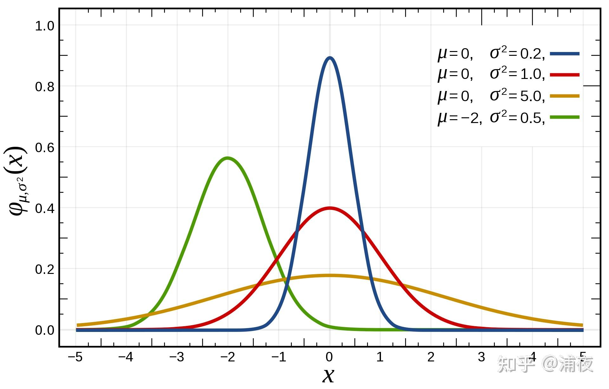

  拓展到球面也很简单。相比SH的公式，Spherical Gaussian的公式就简单的多了，形如 

$$G(v;	\mu,\lambda,a) = ae^{\lambda(\mu\cdot v - 1)}$$

二维图像长得像这样 

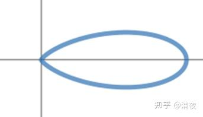

  参数的物理含义也很好理解，a表示波瓣的大小，μ表示波瓣的中心方向，λ表示波瓣的胖瘦  和SH定死的基函数相比，SG的特点就是自由度极高：基函数用几个、怎么分布、胖瘦如何，都随意。当然这也对设计基函数的人提出了更高的要求，否则可能花费很多效果又不好。和别的基函数一样，用的基函数个数越多，表达能力就越强。一般一套SG基函数包含多个不同方向的基函数，例如这样： 

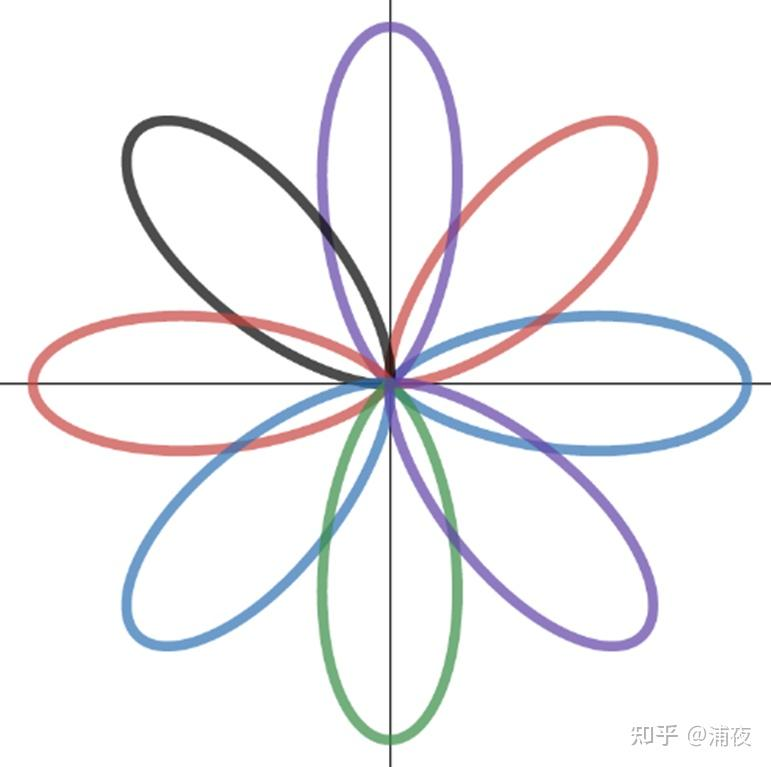

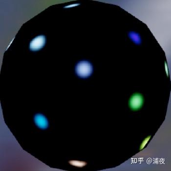

  SG基函数和镜面反射计算的结果又比较接近，因此可以用来描述高光。 

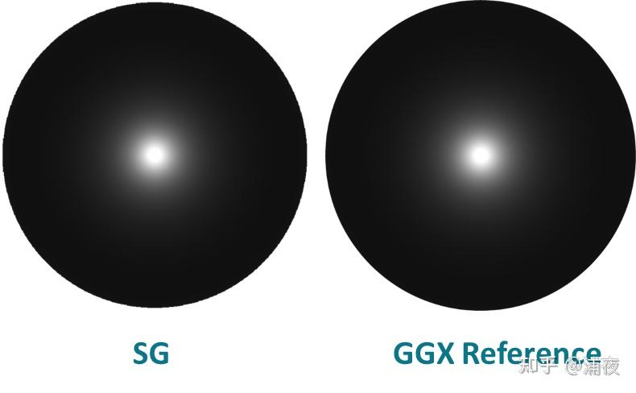

  SG有这么多好处，又简单又好理解的，还没有高阶SH那些乱七八糟的Artifact，那谁还用SH啊。  然而SH也有很多长处是SG没有的，比如SH除了正交性还有旋转不变性。还是举个例子来说明：  假如有两个SH基函数（蓝色和红色），我想要用这两个基函数描述另一个和基函数形状一样的函数（紫色） 

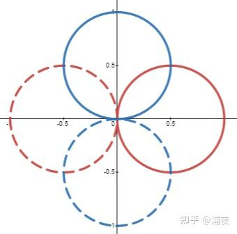

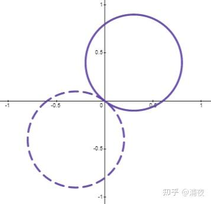

 很方便的可以用两个基函数的加权得到（系数是0.8和0.6）  那假如是SG的两个基函数（红色和蓝色）想描述黑色的这个函数结果呢 

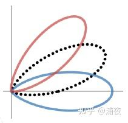

 却发现怎么调整系数，都接近不了这个目标性状。最接近的系数的重建结果是下图紫色爱心形。 

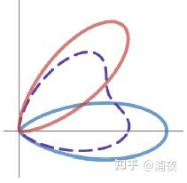

 反馈到实际高光计算上，就会发现SG不能很好地保持高光形状。基函数定义方向上的高光形状能保持的比较好，但如果位置在几个基函数的角度之间，高光形状就会比较散了。  教团的文章就是使用SG来描述高光，每个基函数都用一套Lightmap。看起来高光变形的问题应该也不明显。 

 虽然我觉得这个思路过分奢侈，不过还是很有启发性的。  其实真正描述光照漫反射，SG倒不多见，比较受美术欢迎的是Ambient Cube（也叫HL2），每个方向一个强度描述： 

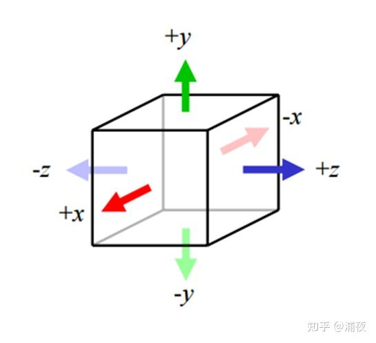

 退化到二维大概长这样 

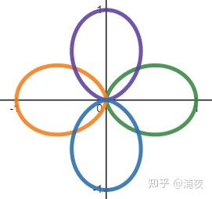

函数形状和性质与SG非常相像（表达式其实不一样）  为什么受美术欢迎呢？因为它的物理含义非常好理解，哪里想改调哪里。用SH的基函数描述漫反射的同学多多少少碰到过这样的抱怨：y方向怎么就黑不下来呢！底下应该是全黑的啊！但ambient cube就不会了，想要把某个方向改成纯黑，只要把对应方向的系数改成0就行了。  从系数个数上来对比，一般常用的是这几种：二阶SH是4个系数，AmbientCube是6个系数，三阶SH是9个系数。     **参考链接：**  [https://blog.selfshadow.com/publications/s2015-shading-course/rad/s2015_pbs_rad_slides.pdf](https://blog.selfshadow.com/publications/s2015-shading-course/rad/s2015_pbs_rad_slides.pdf) [https://mynameismjp.wordpress.com/2016/10/09/sg-series-part-2-spherical-gaussians-101/](https://mynameismjp.wordpress.com/2016/10/09/sg-series-part-2-spherical-gaussians-101/)